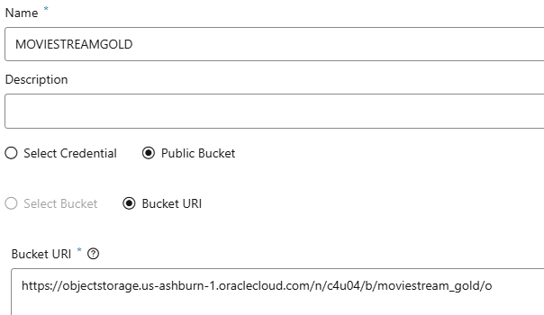
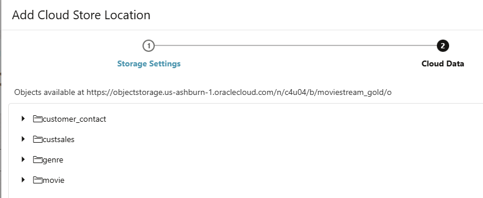
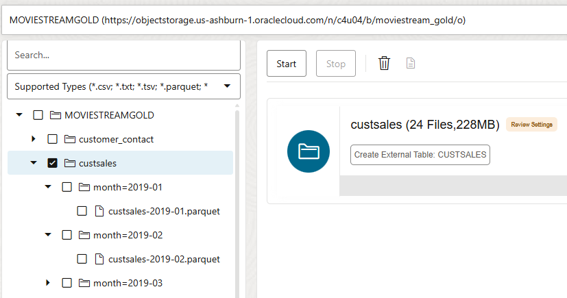
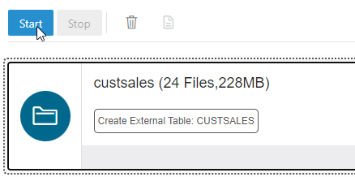
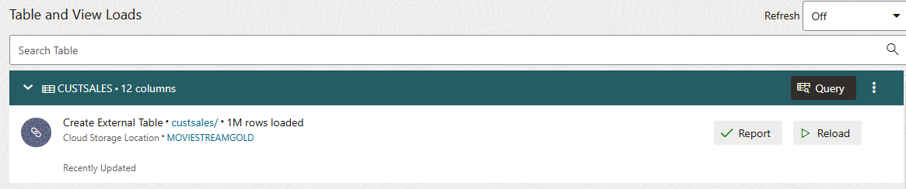
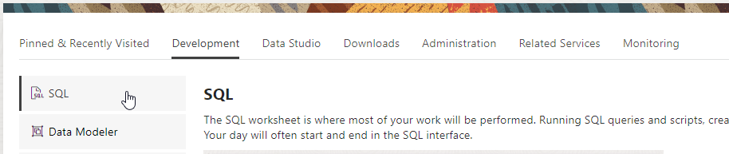

# Link to data in cloud storage

## Introduction

This lab shows how you can link your Autonomous AI Database to data in a cloud storage system, without loading it, so that you can query data which may be updated frequently in cloud storage.

Estimated Time: 15 minutes

### Objectives

In this lab, you will:

- Connect your Autonomous AI Database to a cloud storage system
- Create external tables in the database that link to files in cloud storage

### Prerequisites

To complete this lab, you need to have completed Labs 1 and 2 in this workshop, so that you have:

- Created an Autonomous AI Lakehouse instance
- Created a new QTEAM user

You do not need to have completed Labs 3 or 4.

## Task 1: Connect to Cloud Storage

There are two parts to this process, and the first part only needs to be performed once. The two parts are:

1. Set up a connection to the cloud storage system
2. Link to the files that we want to be able to access from the Autonomous AI Database.

Note that in this example, we will be using files on Oracle Cloud Infrastructure Object Storage. However, the process is the same for loading files from other cloud storage systems, such as Amazon Web Services S3, Azure Storage, and Google Cloud Platform Storage.

### Set Up a Cloud Location

1. To begin this process, you need to navigate to the **Data Load** page in Data Studio. 
  
2. On the **Data Load** main page, click the **Connections** card so you can define a new connection to your cloud storage system.
  
3. Click the **Create** button on the upper left and select **New Cloud Store Location**. Set the Name to **MOVIESTREAMGOLD**, select the **Public Bucket** radio option, and copy and paste the following Bucket URI:

 ```
  $ <copy>https://objectstorage.us-ashburn-1.oraclecloud.com/n/c4u04/b/moviestream_gold/o</copy>
 
 ```

4. Your completed form should look as below. When you have completed these details, click **Next**.

  

5. The **Cloud Data** page allows you to verify your cloud storage connection by showing a preview of the available objects contained in it. This is useful to ensure the location is set up correctly. In this case, this should look as below:

   

6. Click the **Create** button to complete the registration of this cloud location.

## Task 2: Link to data files in a Cloud Location

1. Navigate back to the main Data Load page again using the breadcrumb link. Click the **Link Data** card and make sure **Cloud Store** is selected at the top. 

2. Select the **MOVIESTREAMGOLD** cloud location in the dropdown box. If it does not appear, click the **Refresh** button on the far right of the toolbar, then select it.

  

  Now you see a file browser-like view of your Object Store. Expand the **custsales** folder in the browser. We can see that there is a subfolder for each month of data, and the folder for each month contains a Parquet file. What we want to do here is to link all this data into a single external table, so that as the data for additional months are added, the external table will always be up-to-date. To do this, we can simply drag across the **custsales** folder to the right hand side, and click **Yes** on the prompt to confirm that we want to load a single table.

  

3. Click on the pencil icon for the link task to review its settings.

4. Click the **SQL** option on the left hand side, so that we can see exactly how the external table will be created. 

  

  Here, we can see that the external table will be created linking to a URI ending in *\*.parquet*, so it will encompass all parquet files that exist, or may exist in future, in the custsales folder.

5. Click **Close** to close the settings window.

6. Click the **Start** button to start the data linking job.

  

  The job should take less than a minute to complete. You can see the number of rows (1m) linked into the table.

  

## Task 3: Query the new external table

Now that we have linked to the directory of parquet files, we are set up to query and use the data in the Autonomous AI Database, even though the data is still resident on cloud storage. Let's run a simple query on the data.

1. Go back to the **Database Actions** launchpad by clicking Database Actions in the top left of your screen.

  

2. Click the **SQL** option in the **Development** section to open SQL Developer Web.

  

  >**Note:** If the **Data Loading** prompt appears, close it by clicking the x on the message box.

3. Copy and paste the following SQL excerpt into the worksheet and click the green button to run the statement. This will add up all the values in all the records for the **ACTUAL_PRICE** column:

```
    $ <copy>select sum(actual_price) as total_sales from custsales;</copy>
```

  The query will likely take a little bit of time to return, depending on how many CPUs your database has been provisioned with.

4. The result should be as below:

  

## RECAP

In this lab, you used Data Studio to link to data in cloud storage. Linking to data is a good option where you have large volumes of data being updated regularly on cloud storage, you need your queries always to reflect the latest data, and you do not necessarily need to load the data into database storage as well. 

You may now **proceed to the next lab**.

## Acknowledgements

- Created By/Date - Mike Matthews Product Management, Autonomous AI Database, January 2023
- Contributors - Patrick Wheeler, Keith Laker, Ashish Jain, Rick Green, Nilay Panchal, Hermann Baer
- Last Updated By - Mike Matthews, August 2025
