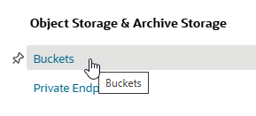
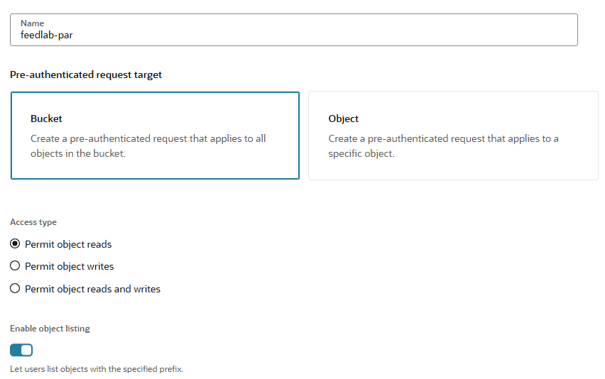

# Using Data Studio to set up a notification-based feed of data from Cloud Storage

## Introduction

This lab shows how you can use Data Studio to set up a live feed of data from cloud storage into the Autonomous Database. Feeding data into the database is a useful capability when you have large-scale, regularly updated data in cloud storage which is central to your data warehouse, and which will therefore benefit from the performance optimizations of being loaded into the database rather than simply linked from it.

There are two types of live feed:

1. Scheduled, where a feed job runs on a schedule and loads any new or changed data from cloud storage
2. Notification-based, where the addition or update of data in cloud storage triggers a notification to the database to run the feed job

In this lab, we will set up a notification-based live feed. In the lab, we will use Oracle Cloud Infrastructure Object Storage as the cloud object storage system, but the same approach can be used with any other cloud storage system that supports URI-based notifications, including Amazon Web Services S3, Azure Storage, and Google Cloud Platform Storage.

Estimated Time: 30 minutes

Watch the video below for a quick walk through of the lab.

### Objectives

In this lab, you will:

- Set up a new bucket in your cloud storage system, and configure it for send events when objects are changed
- Use the Autonomous Database's built-in Data Studio application to set up a Data Feed job
- Configure notification rules in your cloud storage system to trigger the Data Feed job when data in the bucket is added or updated

### Prerequisites

To complete this lab, you need to have completed Labs 1 and 2 in this workshop, so that you have:

- Created an Autonomous Data Warehouse instance
- Created a new QTEAM user

You do not need to have completed Labs 3, 4 or 5.

You will also need login information for Oracle Cloud Infrastructure so that you can set up a new cloud storage bucket and notification rules.

## Task 1: Create a new Cloud Storage bucket and configure it to send events

1. Log in to Oracle Cloud Infrastructure (OCI) at https://cloud.oracle.com 

**Note**: See the **Get Started** lab at the beginning of this workshop for instructions to log in to OCI if you are using an Oracle Live Labs account. Otherwise, use your normal OCI credentials to log in to your tenancy.

2. Click the menu in the top left of your screen, and select **Storage**

  

3. Under **Object Storage & Archive Storage**, click **Buckets**

  

4. Under **Compartment**, select a suitable compartment for the new storage bucket. 

**Note**: If you are using an Oracle Live Labs account, select the compartment created with your account. If you are working in your own tenancy, select any suitable compartment where you can create a new storage bucket. This example uses a compartment named 'sandbox'.

5. With a suitable compartment selected, click the **Create Bucket** button to set up a new bucket

  

6. On the **Create Bucket** screen, set up a bucket with the name 'feedlab' and be sure to tick the option to **Emit Object Events**. Keep the other options to the default values. Click on the **Create** button.

  

7. We will need a URI to access the bucket. Click the menu to the right of the bucket, and select **Create Pre-Authenticated Request**

  

8. Name the pre-authenticated request **feedlab-par** and tick the option to **Enable Object Listing**, leaving the other options to their default values.

  

Click the **Create Pre-Authenticated Request** button.

9. Copy the generated URL of the pre-authenticated request. You will need this later in the lab.

  

**Note**: It is a good idea to paste this URL into a note or similar, and save it, as you will need it later and may copy other things before you need to paste it in later steps!

## RECAP

In this lab, you used Data Studio to link to data in cloud storage. Linking to data is a good option where you have large volumes of data being updated regularly on cloud storage, you need your queries always to reflect the latest data, and you do not necessarily need to load the data into database storage as well. 

## Acknowledgements

- Created By/Date - Mike Matthews Product Management, Autonomous Database, January 2023
- Contributors - Jayant Mahto, Rick Green
- Last Updated By - Mike Matthews, January 2023
