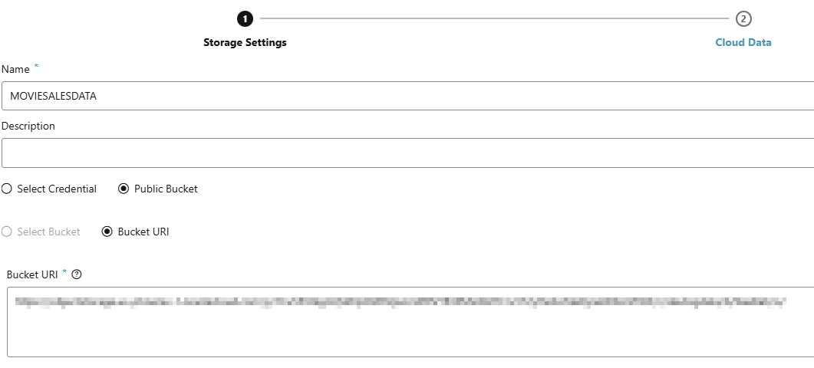
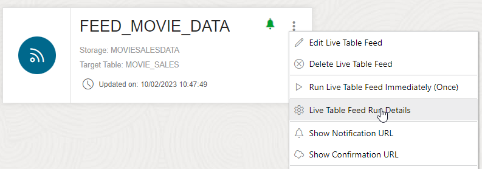
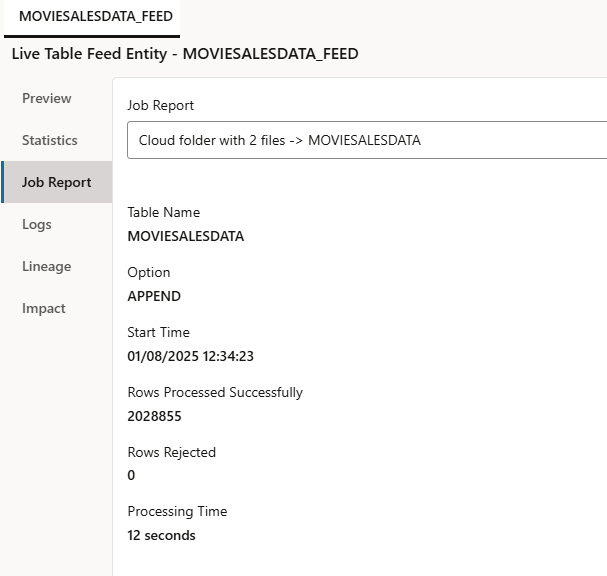
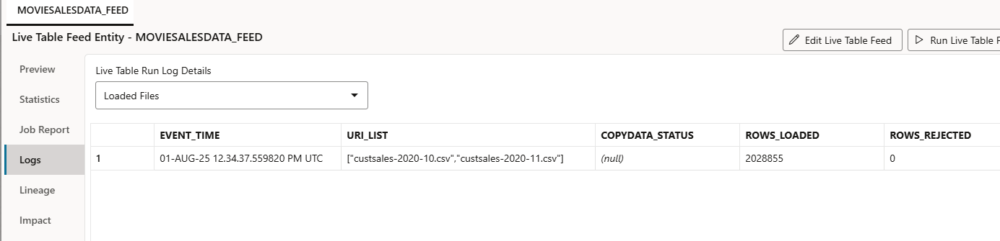

# Using Data Studio to set up a notification-based feed of data from Cloud Storage

## Introduction

This lab shows how you can use Data Studio to set up a live feed of data from cloud storage into the Autonomous Database. Feeding data into the database is a useful capability when you have large-scale, regularly updated data in cloud storage which is central to your data warehouse, and which will therefore benefit from the performance optimizations of being loaded into the database rather than simply linked from it.

There are two types of live feed:

1. Scheduled, where a feed job runs on a schedule and loads any new or changed data from cloud storage
2. Notification-based, where the addition or update of data in cloud storage triggers a notification to the database to run the feed job

In this lab, we will set up a notification-based live feed. In the lab, we will use Oracle Cloud Infrastructure Object Storage as the cloud object storage system, but the same approach can be used with any other cloud storage system that supports URI-based notifications, including Amazon Web Services S3, Azure Storage, and Google Cloud Platform Storage.

The diagram below shows how a notification-based feed works:

  

Estimated Time: 30 minutes

Watch the video below for a quick walk through of the lab.

### Objectives

In this lab, you will:

- Set up a new bucket in your cloud storage system, and configure it for send events when objects are changed
- Use the Autonomous Database's built-in Data Studio application to set up a Data Feed job
- Configure notification rules in your cloud storage system to trigger the Data Feed job when data in the bucket is added or updated

### Prerequisites

To complete this lab, you need to have completed Labs 1 and 2 in this workshop, so that you have:

- Created an Autonomous Data Warehouse instance
- Created a new QTEAM user

You do not need to have completed Labs 3, 4 or 5.

You will also need login information for Oracle Cloud Infrastructure so that you can set up a new cloud storage bucket and notification rules.

## Task 1: Create a new Cloud Storage bucket and configure it to send events

1. Log in to Oracle Cloud Infrastructure (OCI) at https://cloud.oracle.com 

**Note**: See the **Get Started** lab at the beginning of this workshop for instructions to log in to OCI if you are using an Oracle Live Labs account. Otherwise, use your normal OCI credentials to log in to your tenancy.

2. Click the menu in the top left of your screen, and select **Storage**

  

3. Under **Object Storage & Archive Storage**, click **Buckets**

  

4. Under **Compartment**, select a suitable compartment for the new storage bucket. 

**Note**: If you are using an Oracle Live Labs account, select the compartment created with your account. If you are working in your own tenancy, select any suitable compartment where you can create a new storage bucket. This example uses a compartment named 'sandbox'.

5. With a suitable compartment selected, click the **Create Bucket** button to set up a new bucket

  

6. On the **Create Bucket** screen, set up a bucket with the name 'feedlab' and be sure to tick the option to **Emit Object Events**. Keep the other options to the default values. Click on the **Create** button.

  

7. We will need a URI to access the bucket. Click the menu to the right of the bucket, and select **Create Pre-Authenticated Request**

  

8. Name the pre-authenticated request **feedlab-par** and tick the option to **Enable Object Listing**, leaving the other options to their default values.

  

Click the **Create Pre-Authenticated Request** button.

9. Copy the generated URL of the pre-authenticated request, and paste it into a note or other file, and save it. You will need this later in the lab.

  

## Task 2: Use Data Studio to set up a live data feed

1. From the **Database Actions** launchpad, click the Data Studio's **Data Load** card.

  

2. Click **Cloud Locations** to set up access to your new storage bucket.

  

3. In the top right, click **Add Cloud Store Location**

4. Set up a new cloud location named 'MovieSalesData'. Select the **Public Bucket** option, and paste in the URL of the pre-authenticated request you created in Task 1.

  

Click **Create** to save the location.

5. Click **Data Load** from the menu on the left, or from the breadcrumbs at the top of the screen.

6. Select **Feed Data** from the top list of cards. Note that the **Where is your data?** option automatically switches to **Cloud Store**. Click **Next**.

  

7. Click the **Create Live Table Feed** button in the top right.

  

8. Set up the Live Table Feed as shown below, with the **Live Table Feed Name** set to 'FEED\_MOVIE\_DATA', the **Target Table Name** set to 'MOVIE\_SALES', and the **Object Filter** set to '*.csv'. Then tick the **Enable for Notifications** box, and untick the **Enable for Scheduling** box.

  

Click the **Create** button to complete the initial setup of the live table feed. 

9. With the live table feed now set up, a URL is generated which we can use to link up to the OCI event generation mechanism. To see and copy the URL, click the menu of the newly created Live Table Feed, and select **Show Notification URL**. 

  

10. Copy the URL and paste it into a note or other file, and save it. Click OK to close the window.

## Task 3: Set up the event generation mechanism in OCI to trigger the live table feed

1. If you are not already logged in, log in to the OCI Console at https://cloud.oracle.com

2. Search for 'notif' in the menu and click the result for **Notifications - Application Integration**

  

3. Select the same **Compartment** you selected when setting up the cloud storage bucket in Task 1. Then click **Create Topic**

4. Name the topic 'Movie\_sales\_events' as below, and click **Create**

  

5. Click the newly created topic, and then on the **Create Subscription** button.

6. Change the **Protocol** to **HTTPS (Custom URL)** and paste in the URL of the Live Table Feed you created in Task 2. Click the **Create** button.

  

The subscription is now created. It will show as **Pending** for a couple of minutes, then **Active** once it is live.

7. Next we need to set up event rules that will trigger notifications. In the search box in the top left, search for 'events', and click the 'Rules - Event Service' link:

  

8. Click the **Create Rule** button.

9. Set the **Display Name** to 'New\_moviesales\_object'. Then in the **Rule Conditions** section, under **Service Name**, select 'Object Storage', and under **Event Type** select 'Object - Create'.

10. In the **Actions** section, under **Action Type** select 'Notifications'. The Notifications Compartment should be set to the same compartment you have been using throughout the lab. Select the **Topic** as 'Movie\_sales\_events'. The final screen should look as below. Click the **Create Rule** button to confirm the rule addition.

  

This has now created a rule that will send a notification message to the OCI Topic when an object is created in the bucket, for example a new file arrives. As the Live Table Feed we set up early is subscribed to that topic, it will run when this message is sent.

If required, we can set up another rule for object update. This should be specified in exactly the same way, but with 'Object - Update' selected as the Event Type, and with a display name such as 'Updated\_moviesales\_object'.

This completes the configuration steps needed to trigger the live table feed job to update the Autonomous Database when an object is added or updated in our cloud storage bucket. All we need to do now is test it!

## Task 4: Test the live feed

To trigger the live table feed, all we need to do is upload a new csv file into the **feedlab** bucket that we created at the very beginning of the lab. 

1. To do this, first download the following example file to your local machine:

https://objectstorage.us-ashburn-1.oraclecloud.com/p/YtpqXpUpPx1pPXFQa4Githwxx4bxp12q2yZJsCyzN0Y9-kpYr5nAOvLvwZfLHxXF/n/c4u04/b/moviestream_landing/o/custsales/custsales-2020-10.csv

2. Then navigate back to **Object Storage - Buckets** in the OCI Console as you did in the first few steps in the lab:

  

3. Select your compartment, if not selected already, and click the 'feedlab' bucket

  

4. Under **Objects**, click the **Upload** button.

5. Select the 'custsales-2020-10.csv' file you just downloaded, and click the **Upload** button to upload it.

6. Now go back to the Database Actions launchpad, click the **Data Load** card, select **Feed Data** and **Next** to view the details of your live feed.

7. Click the menu of the live feed, and select **Live Table Feed Run Details** to view information about the live feed.

  

8. You should now see a preview of the data that has been loaded from the uploaded csv file. Switch to the **Data Load Jobs** view from the list on the left. 

  

Here we can see that a job has just run to load the MOVIE\_SALES table with the 1,019,901 rows that were present in the uploaded csv file.

9. Now click the **Logs** view on the left to see a summary of this job run.

  

This view summarizes all runs of the live feed to show the files that have been loaded, and if there were any errors or rejected rows. In this case, there were none!

This completes the setup of the live table feed. As new csv files with the same structure as the file just uploaded arrive in cloud object storage, they will automatically be loaded into the Autonomous Database, to facilitate fast data analysis. 

## RECAP

In this lab, you used Data Studio to set up a continuous feed of data into the Autonomous Database from cloud storage. This is a very useful option where you have large volumes of data arriving into cloud object storage as files but which you need to participate in performance-critical analysis in the database.

## Acknowledgements

- Created By/Date - Mike Matthews Product Management, Autonomous Database, January 2023
- Contributors - Jayant Mahto, Rick Green
- Last Updated By - Mike Matthews, January 2023
