# Feed data from cloud storage

## Introduction

This lab shows how you can use Data Studio to set up a live feed of data from cloud storage into the Autonomous AI Database. Feeding data into the database is a useful capability when you have large-scale, regularly added or updated data in cloud storage which is central to your data warehouse, and which will therefore benefit from the performance optimizations of being loaded into the database rather than simply linked from it.

There are two types of live feed:

1. Scheduled, where a feed job runs on a schedule and loads any new or changed data from cloud storage
2. Notification-based, where the addition or update of data in cloud storage triggers a notification to the database to run the feed job

In this lab, we will set up a notification-based live feed. In the lab, we will use Oracle Cloud Infrastructure Object Storage as the cloud object storage system, but the same approach can be used with any other cloud storage system that supports URL-based notifications, including Amazon Web Services S3, Azure Storage, and Google Cloud Platform Storage.

The diagram below shows how a notification-based feed works:

  

Estimated Time: 30 minutes

### Objectives

In this lab, you will:

- Set up a new bucket in your cloud storage system, and configure it to send events when objects are changed
- Use the Autonomous AI Database's built-in Data Studio application to set up a Data Feed job
- Configure notification rules in your cloud storage system to trigger the Data Feed job to check for and load data whenever data in the bucket is added

### Prerequisites

To complete this lab, you need to have completed Labs 1 and 2 in this workshop, so that you have:

- Created an Autonomous AI Lakehouse instance
- Created a new QTEAM user

You do not need to have completed Labs 3, 4 or 5.

You will also need login information for Oracle Cloud Infrastructure so that you can set up a new cloud storage bucket and notification rules.

## Task 1: Create a new cloud storage bucket and configure it to send events

1. Log in to Oracle Cloud Infrastructure (OCI) at https://cloud.oracle.com 

>**Note:** See the **Get Started** lab at the beginning of this workshop for instructions to log in to OCI if you are using an Oracle Live Labs account. Otherwise, use your normal OCI credentials to log in to your tenancy.

2. Click the menu in the top left of your screen, and select **Storage**

  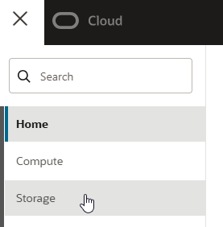

3. Under **Object Storage & Archive Storage**, click **Buckets**

  

4. Under **Compartment**, select a suitable compartment for the new storage bucket. 

>**Note:** If you are using an Oracle Live Labs account, select the compartment created with your account. If you are working in your own tenancy, select any suitable compartment where you can create a new storage bucket. The compartment can be, but does not have to be, the same compartment where your Autonomous AI Database has been created. This example uses a compartment named 'sandbox'.

5. With a suitable compartment selected, click the **Create Bucket** button to set up a new bucket

  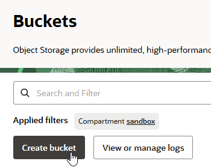

6. On the **Create Bucket** screen, set up a bucket with the name **feedlab** and be sure to tick the option to **Emit Object Events**. Keep the other options to the default values. Click on the **Create** button.

  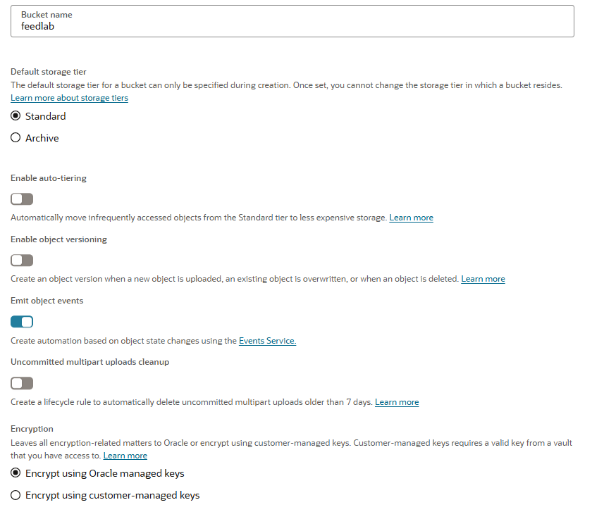

7. We will need a URL so that Data Studio can read the contents of the bucket. Click the menu to the right of the bucket, and select **Create Pre-Authenticated Request**

  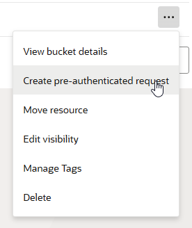

8. Name the pre-authenticated request **feedlab-par** and tick the option to **Enable Object Listing**, leaving the other options to their default values.

  

  Click the **Create Pre-Authenticated Request** button.

>**Note:** Pre-authenticated Requests have a default expiry date set a week after creation. For the purposes of this lab, this is fine. However, when you set up a real live feed, you may want to set this well into the future so that the feed continues to work for a while. Alternatively, you can set up the live feed with credentials to the bucket (or use a public bucket) rather than use a pre-authenticated request. If a pre-authenticted request does expire, you can simply create a new one and update the live feed URL in Data Studio.

9. Copy the generated URL of the pre-authenticated request, and paste it into a note or other file, and save it. You will need this later in the lab.

10. Now we can upload a file into the bucket to use as the basis for the live feed configuration. Any future files that land in the bucket will need to be in the same structure. To do this, first download the following example file to your local machine:

  https://objectstorage.us-ashburn-1.oraclecloud.com/p/YtpqXpUpPx1pPXFQa4Githwxx4bxp12q2yZJsCyzN0Y9-kpYr5nAOvLvwZfLHxXF/n/c4u04/b/moviestream_landing/o/custsales/custsales-2020-10.csv

>**Important:** Your computer may not support downloading files to your local disk. If you are in this situation, you may be able to use another structured csv file with a header row, as this is just an example. 

11. Click the **feedlab** bucket to view its details. Under **Objects**, click the **Upload objects** button.

12. Find the **custsales-2020-10.csv** file you just downloaded to your local machine, and click the **Upload objects** button to upload it.

## Task 2: Use Data Studio to set up a live data feed

1. From the **Database Actions** launchpad, click the Data Studio's **Data Load** card.

  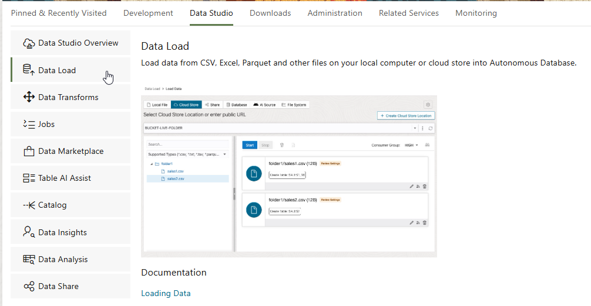

2. Click **Connections** to set up access to your new storage bucket.

  

3. In the top left, click **Create** then select **New Cloud Store Location**

4. Set up a new cloud location named **MOVIESALESDATA**. Select the **Public Bucket** option, and paste in the URL of the pre-authenticated request you created in Task 1.

  

  Click **Create** to save the location.

5. Click **Data Load** from the menu on the left, or from the breadcrumbs at the top of the screen.

6. Select **Feed Data** from the top list of cards.

  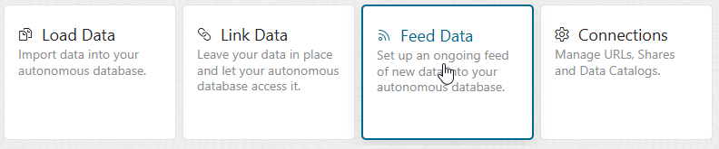

7. Click the **Create Live Table Feed** button.

  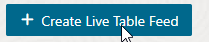

8. In the first section, **Data Source**, select the **MOVIESALESDATA** cloud store location that you just created.

  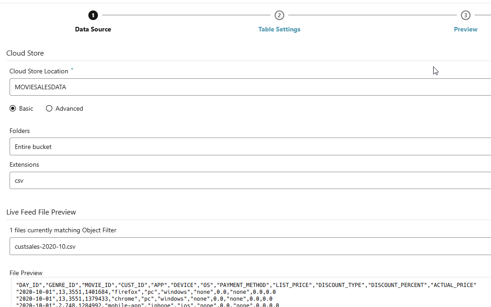

We can see a preview of the file that we uploaded to the bucket. Click **Next** to continue.

9. Under **Table Settings**, we can see that the format of the file has been determined, and the format of the target table to be created from it has been created for us. Click **Next** to continue.

10. Under **Preview**, we can see a preview of the target table with the data as it will be fed in. Click **Next** to continue.

11. Under **Live Feed Settings**, click the option to **Enable for Notification** and ensure the option to enable for scheduling is unticked. This means that the live feed is configured to run when a notification is received from the cloud storage system that new or updated data is available, rather than scheduled to look for new or updated data on a regular basis, though both types of live feed are supported. Click **Create** to create the live feed. A dialog will be displayed asking if you want to run the live feed now. Click **No**.

>**Note:** It is not important to click **No** here. If you clicked **Yes**, the feed will run and load the file into the table. We will then prompt the live feed to run again in the next task, by uploading another file.

12. With the live table feed now set up, a URL is generated which we can use to link up to the OCI event generation mechanism. To see and copy the URL, click the menu of the newly created Live Table Feed, and select **Show Notification URL**. 

  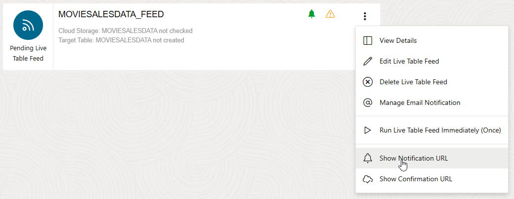

10. Copy the URL and paste it into a note or other file, and save it. Click OK to close the window.

## Task 3: Set up the event generation mechanism in OCI to trigger the live table feed

1. If you are not already logged in, log in to the OCI Console at https://cloud.oracle.com

2. Search for **notif** in the menu and click the result for **Notifications - Application Integration** under **Services**.

  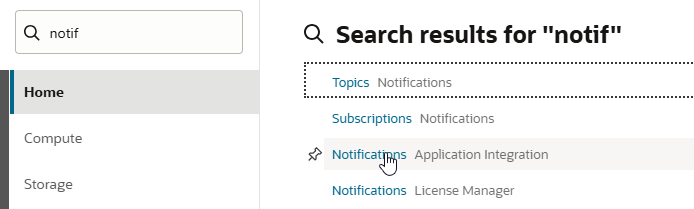

3. Select the same **Compartment** you selected when setting up the cloud storage bucket in Task 1. Then click **Create Topic**.

4. Name the topic **Movie\_sales\_events** as below, and click **Create**.

  

5. Click the newly created topic, and then on the **Create Subscription** button.

6. Change the **Protocol** to **HTTPS (Custom URL)** and paste in the URL of the Live Table Feed you created in Task 2. Click the **Create** button.

  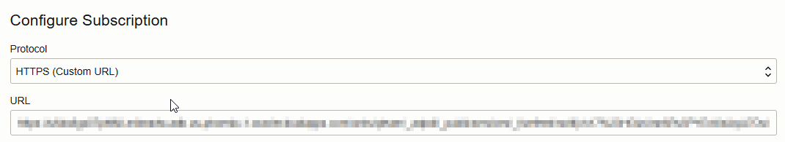

The subscription is now created. It will show as **Pending** for a couple of minutes, then **Active** once it is live.

> **Note:** There is no need to wait for the subscription to become active before continuing the lab. It will become active while we do the next steps.

7. Next we need to set up event rules that will trigger notifications. In the search box at the top of the screen, search for **events**, and click the **Rules - Events Service** link under **Services**:

  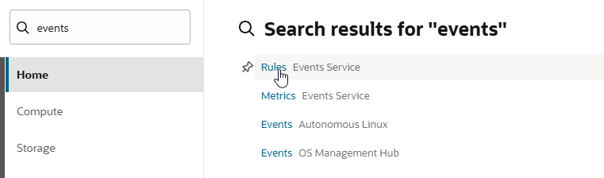

8. Click the **Create Rule** button.

9. Set the **Display Name** to 'New\_moviesales\_object'. Then in the **Rule Conditions** section, under **Service Name**, select 'Object Storage', and under **Event Type** select **Object - Create**.

10. In the **Actions** section, under **Action Type** select **Notifications**. The Notifications Compartment should be set to the same compartment you have been using throughout the lab. Select the **Topic** as **Movie\_sales\_events**. The final screen should look as below. Click the **Create Rule** button to confirm the rule addition.

  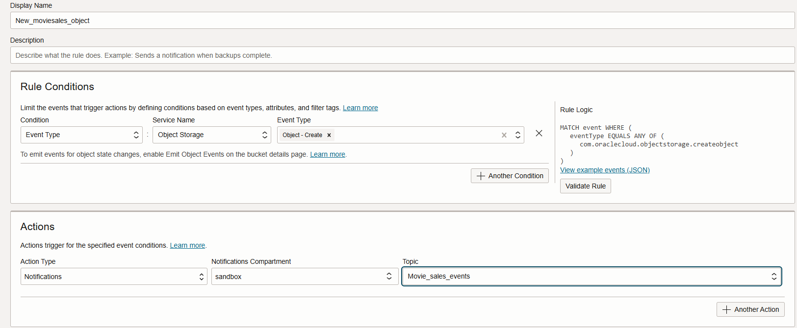

  This has now created a rule that will send a notification message to the OCI Topic when an object is created in the bucket, for example when a new file arrives. As the Live Table Feed we set up earlier is subscribed to that topic, it will run when this message is sent, check for any files named *.csv, and load them into the MOVIE\_SALES table.

  If required, we can set up another rule for object update. This should be specified in exactly the same way, but with **Object - Update** selected as the Event Type, and with a display name such as **Updated\_moviesales\_object**.

  This completes the configuration steps needed to trigger the live table feed job to update the Autonomous AI Database when an object is added or updated in our cloud storage bucket. All we need to do now is test it!

## Task 4: Test the live feed

To trigger the live table feed, we simply need to upload another csv file into the **feedlab** bucket that we created at the very beginning of the lab, in the same format as the previous file. 

1. To do this, first download the following example file to your local machine:

  https://objectstorage.us-ashburn-1.oraclecloud.com/p/YtpqXpUpPx1pPXFQa4Githwxx4bxp12q2yZJsCyzN0Y9-kpYr5nAOvLvwZfLHxXF/n/c4u04/b/moviestream_landing/o/custsales/custsales-2020-11.csv

>**Important:** Your computer may not support downloading files to your local disk. If you are in this situation, you may be able to use another structured csv file with a header row, as this is just an example. 

2. Then navigate back to **Object Storage - Buckets** in the OCI Console as you did in the first few steps in the lab.

3. Select your compartment, if not selected already, and click the **feedlab** bucket

  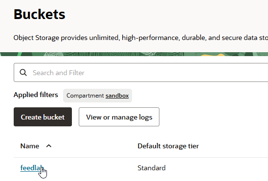

4. Under **Objects**, click the **Upload** button.

5. Find the **custsales-2020-11.csv** file you just downloaded to your local machine, and click the **Upload objects** button to upload it.

6. Now go back to the Database Actions launchpad, click the **Data Load** card, and select **Feed Data** to view the details of your live feed. The live feed should now show as active. If it does not, click on the Refresh button in the top right, or wait 30 seconds.

  

>**Note:** If the Live Feed shows a warning icon that it has not been confirmed yet, click the menu option and **Show Confirmation URL**, then click the confirmation URL to confirm the subscription. This will ensure the Live Feed subscription is confirmed.

7. We can now see that over 2m rows have been loaded into the **MOVIESALESDATA** table. Click the live feed to see details.

8. You should now see a preview of the data that has been loaded from the uploaded csv file. Switch to the **Job Report** view from the list on the left. 

  

  Here we can see details of the load jobs that have run to populate the table. If you selected **No** when asked to run the live feed immediately after it was created, you should see a report that loaded 2 files from cloud storage as above, with a total of 2028855 rows. If you selected **Yes** you should see two jobs - the most recent will have run when a new file was detected, and loaded the **custsales-2020-11.csv** file, and the previous one will have loaded the **custsales-2020-10.csv** file.  

9. Now click the **Logs** view on the left to see a summary of the job run.

  

  Note that the default **Loaded Files** view summarizes all runs of the live feed to show the files that have been loaded, and if there were any errors or rejected rows. In this case, there were none, so we know the data has been loaded completely.

10. To see detailed information about all actions related to the Data Feed, change the selection under **Live Table Run Log Details** from **Loaded Files** to **Log**

  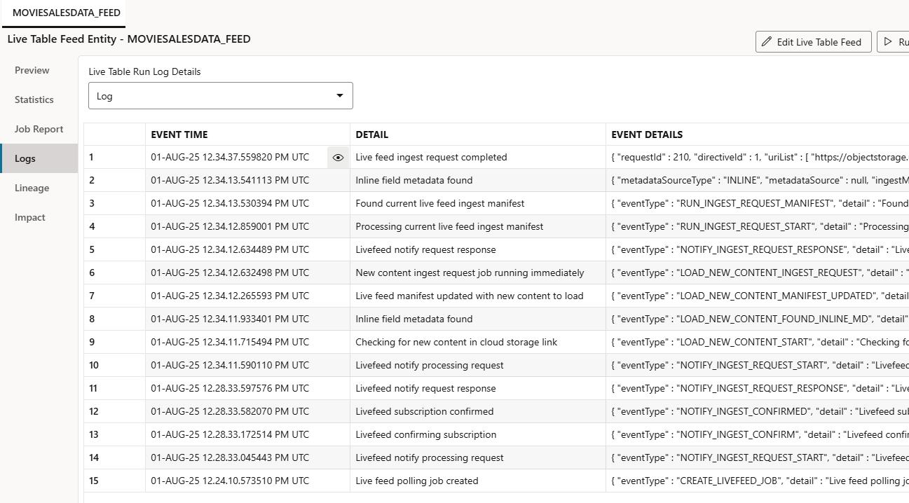

  This view shows details of all the actions taken for this live feed, including when the OCI subscription was confirmed, when the new file was detected in the bucket, and when the ingest job was triggered. This is also a very useful view to use if something has gone wrong in any of the steps!
  
  This completes the setup of the live table feed. As new csv files with the same structure as the file just uploaded arrive in the cloud object storage bucket, they will automatically be loaded into the MOVIE\_SALES table in the Autonomous AI Database, to facilitate fast data analysis. 

## RECAP

In this lab, you used Data Studio to set up a notification-based feed of data into the Autonomous AI Database from cloud storage. This is a very useful option where you have large volumes of data arriving into cloud object storage as files but which you need to participate in performance-critical analysis in the database.

You may now **proceed to the next lab**.

## Acknowledgements

- Created By/Date - Mike Matthews Product Management, Autonomous AI Database, January 2023
- Contributors - Jayant Mahto, Rick Green
- Last Updated By - Mike Matthews, August 2025
