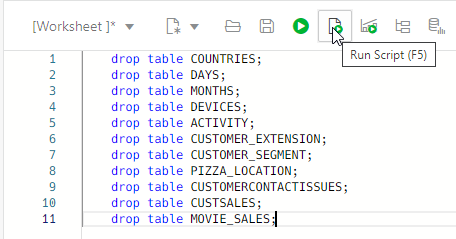

# Clean up loaded data

## Introduction

This optional lab provides a simple script you can use to clean up your database if you no longer want the data sets that were loaded by the previous labs.

Only use this lab if you want to remove the loaded data from your database. You may prefer to keep some or all of it, for example in order to try out the **Data Transforms** or **Data Analysis** capabilities of Data Studio on some of the loaded data.

### Objectives

In this lab, you will drop the tables created during the previous labs in the workshop from your Autonomous AI Database.

### Prerequisites

To complete this lab, you need to have completed any or all of labs 3-6 in this workshop, so that you have created new tables in your Autonomous AI Database and either loaded them with data or linked them to cloud storage.

## Task 1: Run a SQL script to clean up your database

1. From the Database Actions home page, click the **SQL** card to open a SQL Worksheet.

2. Copy and paste the below script, which drops the tables created during this workshop. 

  >**Note:** Check what the script does carefully, and remove any lines for tables that you want to keep after this workshop, before running it.

  

```
<copy>
drop table COUNTRIES;
drop table DAYS;
drop table MONTHS;
drop table DEVICES;
drop table ACTIVITY;
drop table CUSTOMER_EXTENSION;
drop table CUSTOMER_SEGMENT;
drop table PIZZA_LOCATION;
drop table CUSTOMERCONTACTISSUES;
drop table CUSTSALES;
drop table MOVIE_SALES;
</copy>
```

3. Click the **Run Script** button to run the script.

  >**Note:** You may encounter "ORA-00942 table or view does not exist" errors during the DROP command for any tables that you did not create, or dropped already, but you should not see any other errors.

  This completes the clean-up of data loaded during this workshop.

## Acknowledgements

- Created By/Date - Mike Matthews Product Management, Autonomous AI Database, January 2023
- Contributors - Jayant Mahto
- Last Updated By - Mike Matthews, August 2025