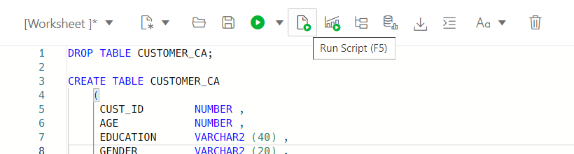
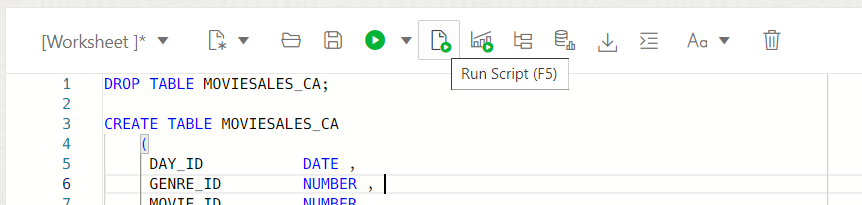

# Import demo data for the Data Transforms workshop


## Introduction

This lab will guide you through the steps to import the demo data used in the remainder of the workshop. 

Estimated Time: 10 minutes

### Prerequisites
To complete this lab, you must have already:

- Created an Autonomous AI Database instance

## Task 1: Create users for the workshop

Connect to your Autonomous AI Database as the Admin user and create two users as follows:

DT\_DEMO\_SOURCE will be used to store some source data and DT\_DEMO\_DW is the data warehouse user. In the workshop we will load the data warehouse from the source data. For convenience we are using the same Autonomous AI Database for both source and target. If you have more than one Autonomous AI Database then you can create the source user in one database and the data warehouse user in another.

- Username: DT\_DEMO\_SOURCE
- Quota: Unlimited
- Roles: DWROLE, DATA\_TRANSFORM\_USER (Granted and Default both checked in UI)
- Web Access: ON

You can either use the user management UI on the Database Actions page, or use the following SQL, to create the source user. Log in as the Admin user and execute the script by copy/paste into SQL worksheet.

```
<copy>
CREATE USER DT_DEMO_SOURCE IDENTIFIED BY Welcome#1234
  QUOTA 100M ON data;
GRANT DWROLE TO DT_DEMO_SOURCE;
GRANT DATA_TRANSFORM_USER TO DT_DEMO_SOURCE;
BEGIN
  ords.enable_schema(p_schema => 'DT_DEMO_SOURCE');
END;
/
</copy>
```


- Username: DT\_DEMO\_DW
- Quota: Unlimited
- Roles: DWROLE, DATA\_TRANSFORM\_USER (Granted and Default both checked in UI)
- Web Access: ON

In tne same way, you can either use the user management UI, or use the following SQL, to create the data warehouse user. Log in as the Admin user and execute the script by copy/paste into SQL worksheet.

```
<copy>
CREATE USER DT_DEMO_DW IDENTIFIED BY Welcome#1234
  QUOTA 100M ON data;
GRANT DWROLE TO DT_DEMO_DW;
GRANT DATA_TRANSFORM_USER TO DT_DEMO_DW;
BEGIN
  ords.enable_schema(p_schema => 'DT_DEMO_DW');
END;
/
</copy>
```


In the rest of the workshop you will connect as individual users as per the instructions. Please note down the user URLs so that you can quickly connect as the appropriate user.

## Task 2: Download the wallet file for your Autonomous AI Database

Connect to your Autonomous AI Database console in OCI and download the wallet file. This file will be used later to create connection to the database.


## Task 3: Connect as the source user and import source data

Connect as the DT\_DEMO\_SOURCE user and navigate to the SQL worksheet. It is under the **Development** section of the **Database Actions** home page.

1. Below is the script you need to execute to load source data. Simply copy and paste this code into your SQL Worksheet.

    *For copy/pasting, be sure to click the convenient __Copy__ button in the upper right corner of the following code snippet.*: 

```
<copy>
DROP TABLE MOVIESALES_CA;

CREATE TABLE MOVIESALES_CA 
    ( 
     DAY_ID           DATE , 
     GENRE_ID         NUMBER , 
     MOVIE_ID         NUMBER , 
     CUST_ID          NUMBER , 
     APP              VARCHAR2 (100) , 
     DEVICE           VARCHAR2 (100) , 
     OS               VARCHAR2 (100) , 
     PAYMENT_METHOD   VARCHAR2 (100) , 
     LIST_PRICE       NUMBER , 
     DISCOUNT_TYPE    VARCHAR2 (100) , 
     DISCOUNT_PERCENT NUMBER , 
     TOTAL_SALES      NUMBER 
    ) 
;

DROP TABLE GENRE;

CREATE TABLE GENRE 
    ( 
     GENRE_ID NUMBER , 
     GENRE    VARCHAR2 (30) 
    ) 
;


CREATE UNIQUE INDEX PK_GENRE_ID ON GENRE 
    ( 
     GENRE_ID ASC 
    ) 
;

ALTER TABLE GENRE 
    ADD CONSTRAINT PK_GENRE_ID PRIMARY KEY ( GENRE_ID ) 
    USING INDEX PK_GENRE_ID 
;

DROP TABLE MOVIE;

CREATE TABLE MOVIE 
    ( 
     MOVIE_ID     NUMBER , 
     TITLE        VARCHAR2 (200) , 
     BUDGET       NUMBER , 
     GROSS        NUMBER , 
     LIST_PRICE   NUMBER , 
     GENRES       VARCHAR2 (4000) , 
     SKU          VARCHAR2 (30) , 
     YEAR         NUMBER , 
     OPENING_DATE DATE , 
     VIEWS        NUMBER , 
     CAST         VARCHAR2 (4000) , 
     CREW         VARCHAR2 (4000) , 
     STUDIO       VARCHAR2 (4000) , 
     MAIN_SUBJECT VARCHAR2 (4000) , 
     AWARDS       VARCHAR2 (4000) , 
     NOMINATIONS  VARCHAR2 (4000) , 
     RUNTIME      NUMBER , 
     SUMMARY      VARCHAR2 (16000) 
    ) 
;

DROP TABLE TIME;

CREATE TABLE TIME 
    ( 
     DAY_ID           DATE , 
     DAY_NAME         VARCHAR2 (36) , 
     DAY_OF_WEEK      NUMBER , 
     DAY_OF_MONTH     NUMBER , 
     DAY_OF_YEAR      NUMBER , 
     WEEK_OF_MONTH    NUMBER , 
     WEEK_OF_YEAR     NUMBER , 
     MONTH_OF_YEAR    NUMBER , 
     MONTH_NAME       VARCHAR2 (36) , 
     MONTH_SHORT_NAME VARCHAR2 (12) , 
     QUARTER_NAME     VARCHAR2 (7) , 
     QUARTER_OF_YEAR  NUMBER , 
     YEAR_NAME        NUMBER 
    ) 
;


set define on
define file_uri_base = 'https://objectstorage.us-ashburn-1.oraclecloud.com/p/zL6bsboZrSxJP-0ilfUpROTwwyhzvkUrZu9OEwcU5_B_NAGzHKBG_WqW2OnNYxKk/n/c4u04/b/datastudio/o/prepareandanalyze'

begin
dbms_cloud.copy_data(
    table_name =>'MOVIESALES_CA',
    file_uri_list =>'&file_uri_base/MOVIESALES_CA.csv',
    format =>'{"type" : "csv", "skipheaders" : 1}'
 );
 dbms_cloud.copy_data(
    table_name =>'GENRE',
    file_uri_list =>'&file_uri_base/GENRE.csv',
    format =>'{"type" : "csv", "skipheaders" : 1}'
 );
 dbms_cloud.copy_data(
    table_name =>'MOVIE',
    file_uri_list =>'&file_uri_base/MOVIE.csv',
    format =>'{"type" : "csv", "skipheaders" : 1}'
 );
 dbms_cloud.copy_data(
    table_name =>'TIME',
    file_uri_list =>'&file_uri_base/TIME.csv',
    format =>'{"type" : "csv", "skipheaders" : 1}'
 );

 FOR TNAME IN (SELECT table_name FROM user_tables  where table_name like 'COPY$%') LOOP
 EXECUTE IMMEDIATE ('DROP TABLE ' || TNAME.table_name || ' CASCADE CONSTRAINTS PURGE');
 END LOOP;
end;
/
</copy>
```
2. Click the **Run Script** icon.

    >**Note:** Expect to receive "ORA-00942 table or view does not exist" errors during the DROP TABLE command for the first execution of the script, but you should not see any other errors.

    

## Task 4: Connect as the data warehouse user and import demo data

Connect to DT\_DEMO\_DW user and navigate to the SQL worksheet. It is under **Development** sections in the **Database Actions**.

1. Below is the script you need to execute to load source data. Simply copy and paste this code into your SQL Worksheet.

    *For copy/pasting, be sure to click the convenient __Copy__ button in the upper right corner of the following code snippet.*: 

```
<copy>
DROP TABLE CUSTOMER_CA;

CREATE TABLE CUSTOMER_CA 
    ( 
     CUST_ID        NUMBER , 
     AGE            NUMBER , 
     EDUCATION      VARCHAR2 (40) , 
     GENDER         VARCHAR2 (20) , 
     INCOME_LEVEL   VARCHAR2 (20) , 
     MARITAL_STATUS VARCHAR2 (8) , 
     PET            VARCHAR2 (40) 
    ) 
;

CREATE TABLE AGE_GROUP 
    ( 
     MIN_AGE   NUMBER , 
     MAX_AGE   NUMBER , 
     AGE_GROUP VARCHAR2 (4000) 
    ) 
;

DROP TABLE CUSTOMER_SALES_ANALYSIS;

CREATE TABLE CUSTOMER_SALES_ANALYSIS
(
GENRE VARCHAR2(30 CHAR),
AGE_GROUP VARCHAR2(4000 CHAR),
GENDER VARCHAR2(20 CHAR),
APP VARCHAR2(100 CHAR),
DEVICE VARCHAR2(100 CHAR),
OS VARCHAR2(100 CHAR),
PAYMENT_METHOD VARCHAR2(100 CHAR),
LIST_PRICE NUMBER(38),
DISCOUNT_TYPE VARCHAR2(100 CHAR),
DISCOUNT_PERCENT NUMBER(38),
TOTAL_SALES NUMBER(38),
EDUCATION VARCHAR2(40 CHAR),
INCOME_LEVEL VARCHAR2(20 CHAR),
MARITAL_STATUS VARCHAR2(8 CHAR),
PET VARCHAR2(40 CHAR),
CUST_VALUE NUMBER
);

DROP TABLE CUSTOMER_VALUE;

CREATE TABLE CUSTOMER_VALUE 
    ( 
     CUST_ID        NUMBER , 
     CUST_VALUE NUMBER
    ) 
;

set define on
define file_uri_base = 'https://objectstorage.us-ashburn-1.oraclecloud.com/p/zL6bsboZrSxJP-0ilfUpROTwwyhzvkUrZu9OEwcU5_B_NAGzHKBG_WqW2OnNYxKk/n/c4u04/b/datastudio/o/prepareandanalyze'

begin
 dbms_cloud.copy_data(
    table_name =>'CUSTOMER_CA',
    file_uri_list =>'&file_uri_base/CUSTOMER_CA.csv',
    format =>'{"type" : "csv", "skipheaders" : 1}'
 );
 dbms_cloud.copy_data(
    table_name =>'AGE_GROUP',
    file_uri_list =>'&file_uri_base/AGE_GROUP.csv',
    format =>'{"type" : "csv", "skipheaders" : 1}'
 );
 FOR TNAME IN (SELECT table_name FROM user_tables  where table_name like 'COPY$%') LOOP
 EXECUTE IMMEDIATE ('DROP TABLE ' || TNAME.table_name || ' CASCADE CONSTRAINTS PURGE');
 END LOOP;
end;
/
</copy>
```
2. Paste the SQL statements in the worksheet. Click on the **Run Script** icon.

    >**Note:** Expect to receive "ORA-00942 table or view does not exist" errors during the DROP TABLE command for the first execution of the script, but you should not see any other errors.

    

You may now **proceed to the next lab**.

## Acknowledgements

- Created By/Date - Jayant Mahto, Product Manager, Autonomous AI Database, January 2023
- Contributors - Mike Matthews
- Last Updated By - Jayant Mahto, June 2024

Copyright (C)  Oracle Corporation.