# Basic setup for the Data Transforms workshop

## Introduction

This lab will guide you to launch Data Transforms and to do some basic setup steps before we start creating data pipelines.

Estimated Time: 15 minutes

### Objectives

In this workshop, you will learn how to:
-   Create a connection
-	Import your data entity definitions
-   Create a project

### Prerequisites

To complete this lab, you need to have completed the previous labs, so that you have:

- Created an Autonomous AI Lakehouse instance
- Downloaded the database wallet
- Created users DT\_DEMO\_SOURCE and DT\_DEMO\_DW with appropriate roles

## Task 1: Launch Data Transforms

1. Connect as the DT\_DEMO\_DW user and navigate to the **Database Actions** page. Click the **Data Transforms** tool under the **Data Studio** section.

    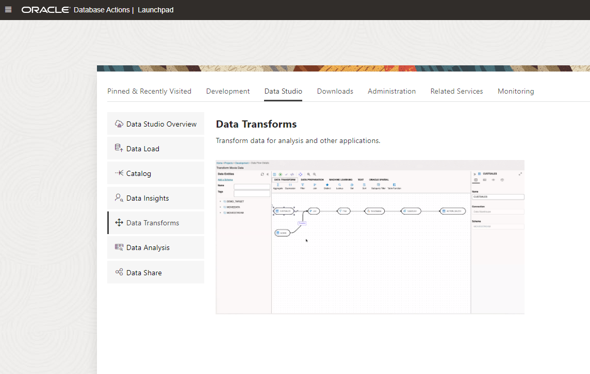

2. Enter the user name and password for DT\_DEMO\_DW in the login screen and click **Connect**. 

    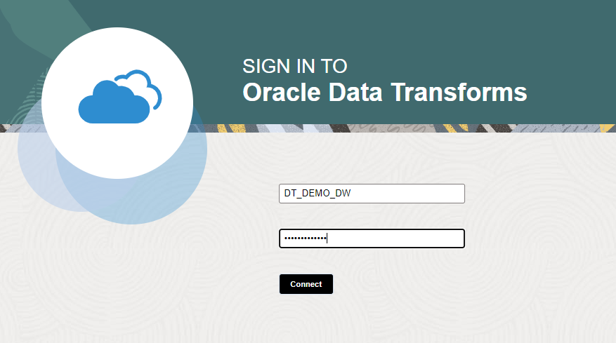

    This will launch the Data Transforms service. The service startup time is approximately two minutes. 
    
    > **Note:** The service is active when you are using Data Transforms, and when it is executing a scheduled job. To save on unnecessary compute costs, after a number of minutes of being idle (by default 10 minutes), the service goes to sleep and starts up again when you want to use it, or when a background scheduled job executes. You can control the maximum idle time for Data Transforms in the configuration settings for your Autonomous AI Database from the OCI console.

    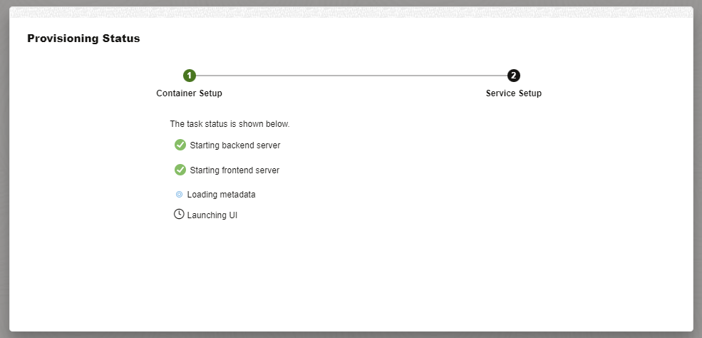

    This will take you to the home screen of Data Transforms.

    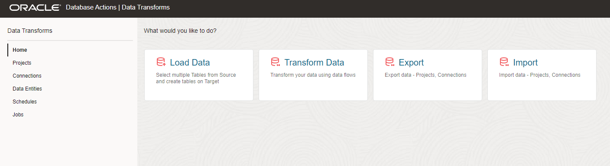

## Task 2: Create connections

1. From the home screen, click on connections from the left side menu. This shows all the connections to your data sources. By default some connection may already have been created but we will create our own connections for this workshop.

    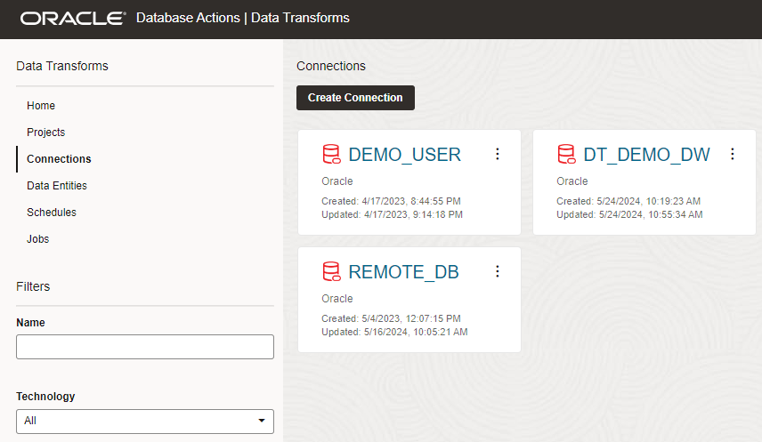

2. Click **Create connection**. You will see all the supported data sources, arranged in sections. Data Transforms supports out of the box connections to more than 100 data sources. Many of these connections can also be used as a target. You can refer to the Data Transforms documentation for the full list and details on how to connect.

    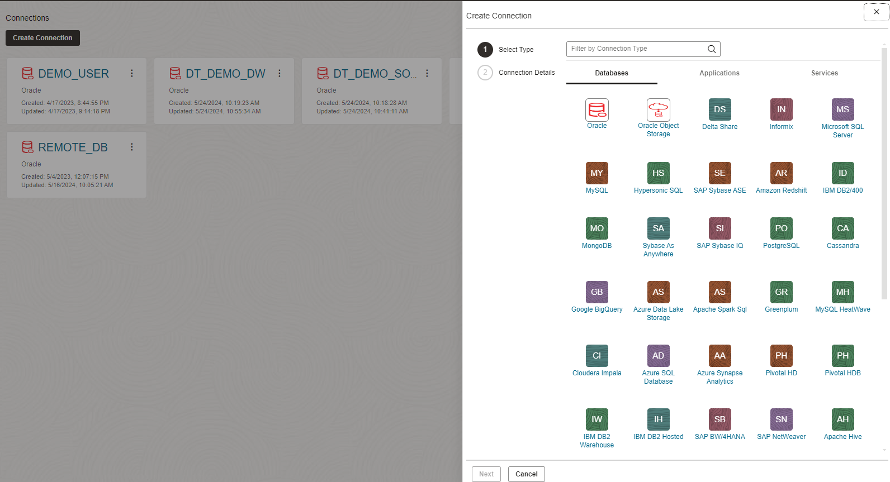

3. For this workshop we will use the Oracle database connection type, as this supports connections to all types of Oracle database. Click on the Oracle database icon in the list and click **Next**.

    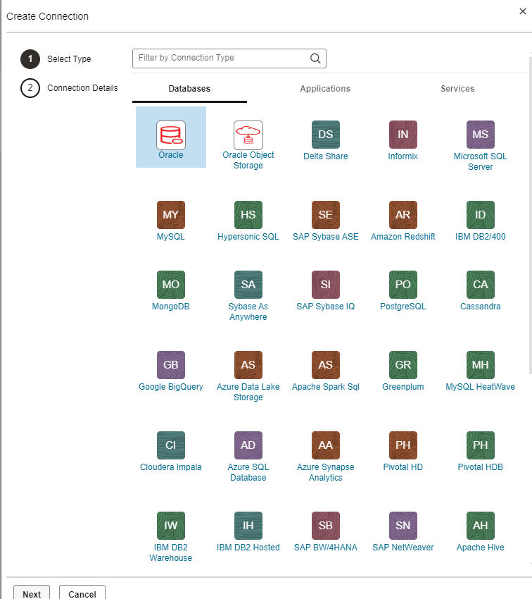

4. Upload the wallet for your Autonomous AI Database and provide connection authentication information as follows:

    - Connection Name: SOURCE_DATA
    - Use Credential File: Toggle ON (drag and drop the DB wallet file)
    - Service: Select High service from the drop down list
    - Username: DT\_DEMO\_SOURCE
    - Password: your password

    Test the connection and click **Create**.

    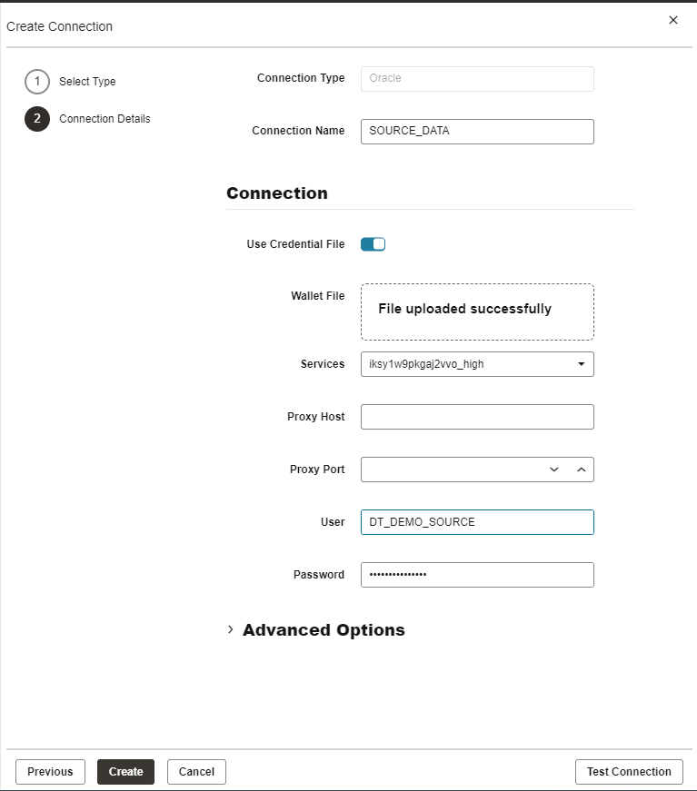

5. Create another connection similar to above for your data warehouse user DT\_DEMO\_DW

    - Connection Name: DATAWAREHOUSE
    - Use Credential File: Toggle ON (drag and drop the DB wallet file)
    - Service: Select High service from the drop down list
    - Username: DT\_DEMO\_DW
    - Password:

    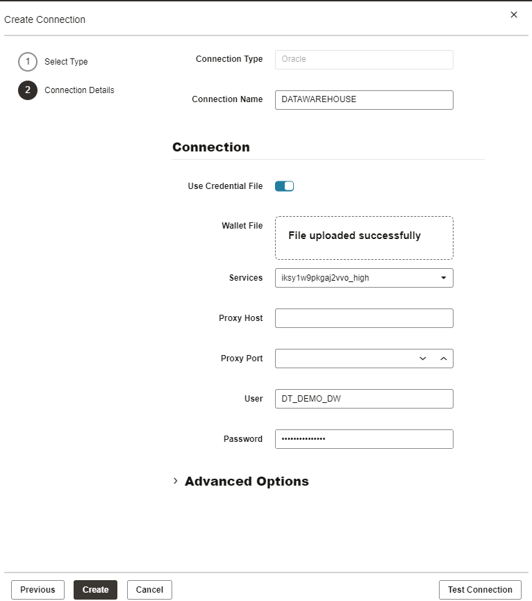

    Test the connection and make sure both the connections test successfully.

## Task 3: Import data entity definitions

Now we have all the connectivity we need for the workshop. In order to create data pipelines, Data Transforms stores a local copy of the definitions of entities such as tables and views. You can initially import these entity definitions from your connections and later keep them in sync periodically. 

Note that once imported, the entity definitions in Data Transforms are isolated from the DDL changes in the respective sources. This provides some flexibility in the design of data pipeline processes. The Data Transforms user is in control of assessing any DDL changes in the source and evaluating their impact on the existing processes, and making appropriate updates, before syncing the entity definitions. You can also create new entities in Data Transforms, and execute data flows to create these as tables in a connected database, or simply create inline SQL as a view stored only in Data Transforms. Inline SQL will be described in the customizations lab.

1. Navigate to the **Data Entities** menu

    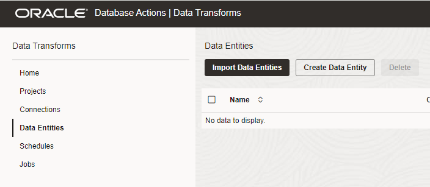

2. Click on **Import Data Entities** and provide the following information:

    - Connection: SOURCE\_DATA
    - Schema: DT\_DEMO\_SOURCE

    Click **Start**. This will launch a background process which should take around two minutes to complete. 

    Note that you can also provide a mask or decide between tables/views for selectively importing the definitions.

    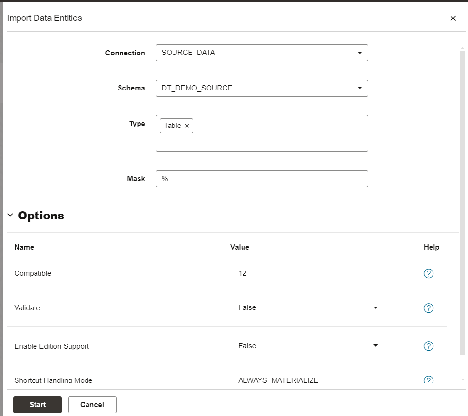

    Click **OK** on the job notification dialog.

    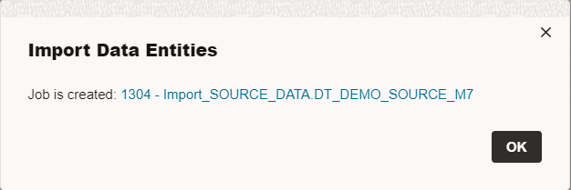

3. Navigate to the Jobs menu to monitor the entity import job. Refresh the list by clicking on the refresh icon on the right side as needed.

    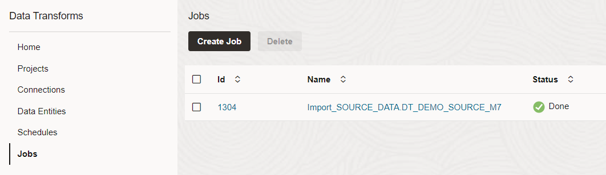

4. After successful job completion, go back to **Data Entities** menu and you should be able to see the following table entries:

    - GENRE
    - MOVIE
    - MOVIESALES\_CA
    - TIME

    You can use the left side filter to get the list based on a connection or partial name filter. Note that you may see some more tables in the list depending on the table list in the source database. Some may be internal tables created by database processes.

    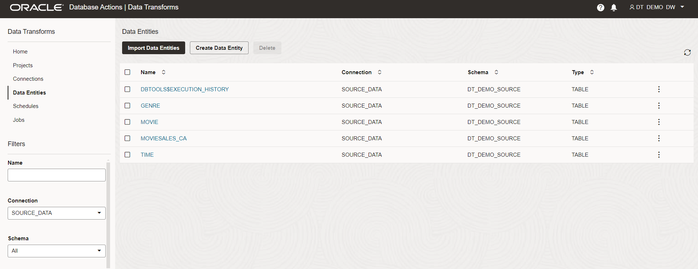

    You can safely delete these internal table definitions by using the right side menu. Deleting these definitions does not impact your source database. You are only deleting them from the Data Transforms repository. We will delete any table with "$" in the name, if any exist. If you accidentally delete any other table, you can simply import the definitions again.

    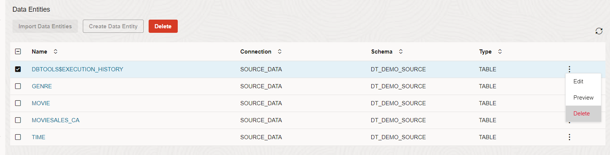

5. You can also use the Actions menu (three dots at the end) to look at the entity definitions and preview the data from the right side menu. Select MOVIESALES\_CA and click on the **Preview** from the Actions menu.

    This the data preview for the MOVIESALES\_CA table.

    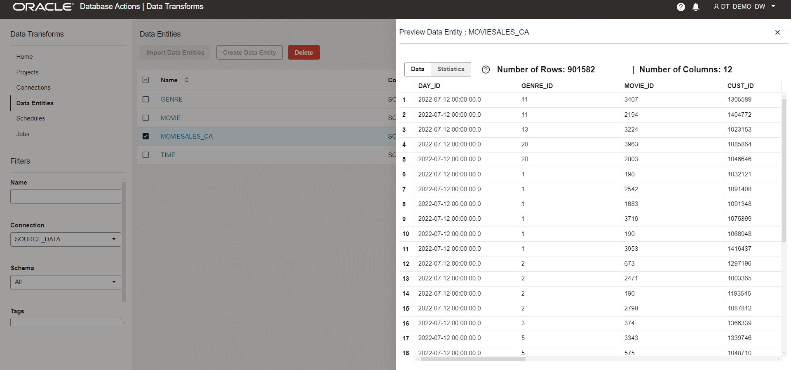

6. Go through the similar process to import the entity definitions from your data warehouse connection.

    - Connection: DATAWAREHOUSE
    - Schema: DT\_DEMO\_DW

    After the successful import you should see the following tables in the list for DATAWAREHOUSE connection:
    - AGE\_GROUP
    - CUSTOMER\_CA
    - CUSTOMER\_SALES\_ANALYSIS
    - CUSTOMER\_VALUE

## Task 4: Create project

Projects in Data Transforms help you to keep related data pipeline processes together.

1. Create a new project. We will use this for our workshop.

    Click on Project menu.

    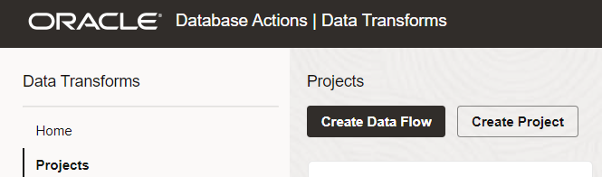

    Click on **Create Project**. Type in MY\_WORKSHOP and click **Create**.

    Note that you can directly create a data flow from this menu as well by clicking on **Create Data Flow** button. For this workshop we will set up a project first and then start creating data pipeline components.

    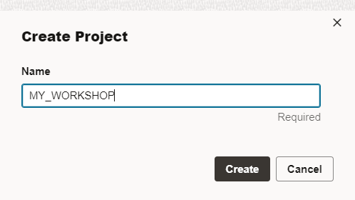

## RECAP

In this lab, we launched the Data Transforms service and completed the basic setup of creating connections, importing entity definitions and creating a project.

You may now **proceed to the next lab**.

## Acknowledgements

- Created By/Date - Jayant Mahto, Product Manager, Autonomous AI Database, January 2023
- Contributors - Mike Matthews
- Last Updated By - Jayant Mahto, June 2024

Copyright (C)  Oracle Corporation.
