# Extract multiple tables from from any source and load to your target without any transformations

## Introduction

This lab introduces you to how Data Transforms can help you set up a data load job from a source to a target without any transformations. The data load job is defined for multiple tables in a schema and both full and incremental modes are supported.

Estimated Time: 30 minutes

### Objectives

In this workshop, you will learn how to:
- Extract data from multiple tables in a source and load them to corresponding tables in the target without any transformation.
- Use various extract and load options.

### Prerequisites

To complete this lab, you need to have completed the previous labs, so that you have:

- Created an Autonomous AI Lakehouse instance
- Created the users DT\_DEMO\_SOURCE and DT\_DEMO\_DW with appropriate roles
- Imported the demo data
- Started the Data Transforms tool and performed the following:
    - Created SOURCE and DATAWAREHOUSE connections
    - Imported the entity definitions
    - Created a project called MY\_WORKSHOP

## Task 1: Create a data load job

In this task we will create a data load job to extract MOVIESALES\_CA, MOVIE and TIME tables from our source database, and load into our data warehouse target database. The MOVIE and TIME tables are small and will be loaded in full by truncating the target. However, the MOVIESALES\_CA data can be big since it contains transactional data. We will extract incremental data from this table and merge the data into the target table.

1. Navigate to your project and click on **Create Data Load**.

    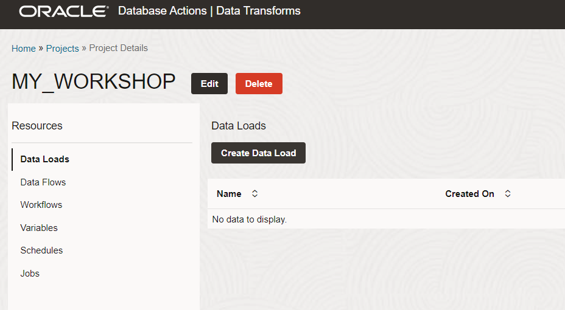

    Enter the data load name as DataLoad\_SOURCE\_TO\_DW.

    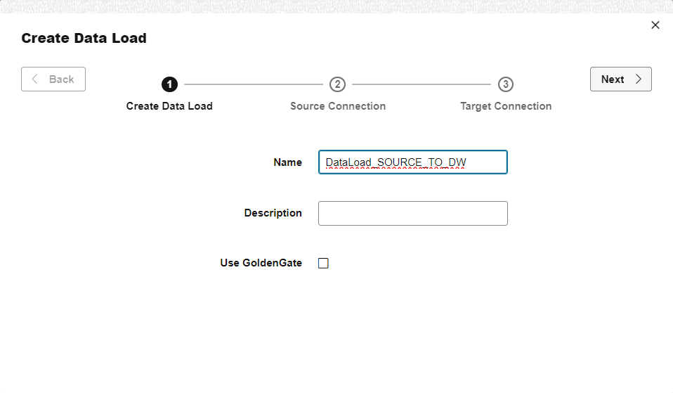

    Note that there is an option to use GoldenGate. This is an advanced option that allows continuous data replication using an integration with Oracle GoldenGate. In this workshop we will be running bulk data load operations, scheduled to run at regular intervals. This mode of operation is simpler but still suitable for many use cases.

    Leave the GoldenGate option unchecked and click **Next**.

    Enter the following information for your source and click **Next**.
    - Connect Type: Oracle
    - Connection: SOURCE\_DATA
    - Schema: DT\_DEMO\_SOURCE

    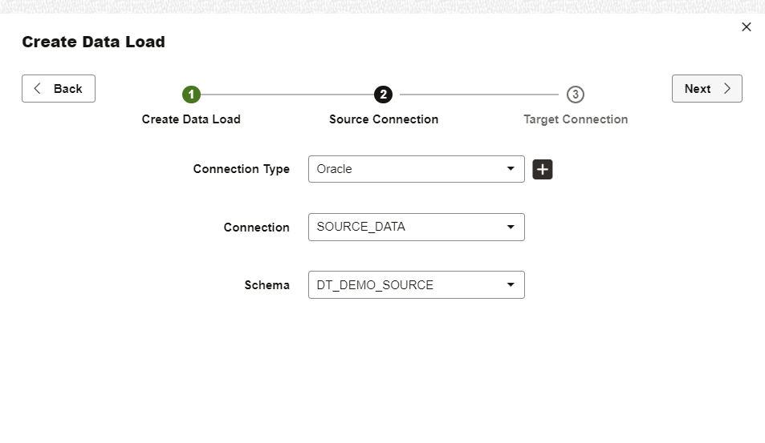

    Enter the following information for your target and click **Save**.
    - Connect Type: Oracle
    - Connection: DATAWAREHOUSE
    - Schema: DT\_DEMO\_DW

    Note that in our workshop we are using the same Autonomous AI Database for the source and target connections to keep the setup simple. However, the source and target connections can be entirely different. For example, the source might be a SQL Server database, and the target might be an Autonomous AI Database.

    *Note*: Saving takes a few minutes while the tool connects to the data source to collect the table listing and associated metadata.

    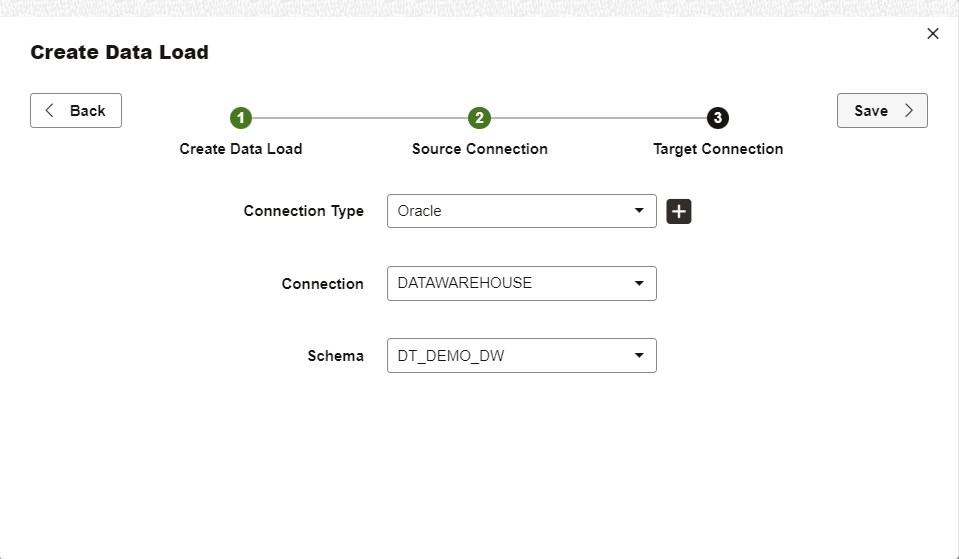

2. Now we need to select tables and configure the data load options.

    Look at the screenshot below and set the appropriate options:

    Select tables MOVIE, MOVIESALES\_CA, TIME with options as below:

    - MOVIE: Target Action: Truncate
    - MOVIESALES\_CA: Target Action: Incremental Merge, Incremental Column: DAY\_ID, Merge Key: DAY\_ID, CUST\_ID, MOVIE\_ID
    - TIME:  Target Action: Truncate

    Note that whenever you want to load data incrementally, you need to specify a date column in the source table which will be used to filter incremental rows and also you need to specify the key column or columns which will be used to merge the records in the target. For the full load option you can simply use non-incremental target actions, as we are doing with the MOVIE and TIME tables. These tables are small and loading them in full every time is acceptable.

    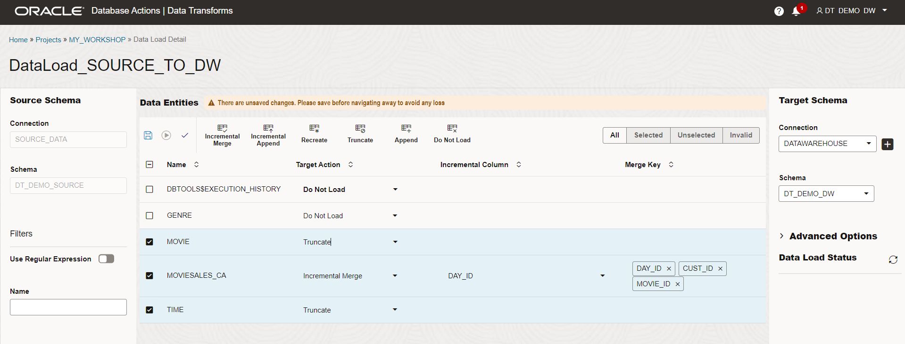

3. Click on Save button to save the data load job definition.

    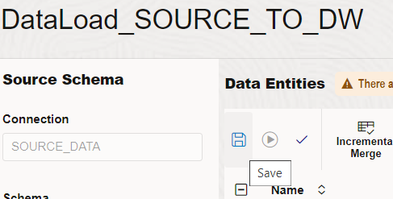

4. Click on the execute button to start execution of the data load job.

    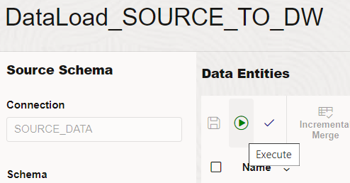

    You will see the run status on the bottom right part of your UI. It is going to take approximately 5 minutes to complete the job.

    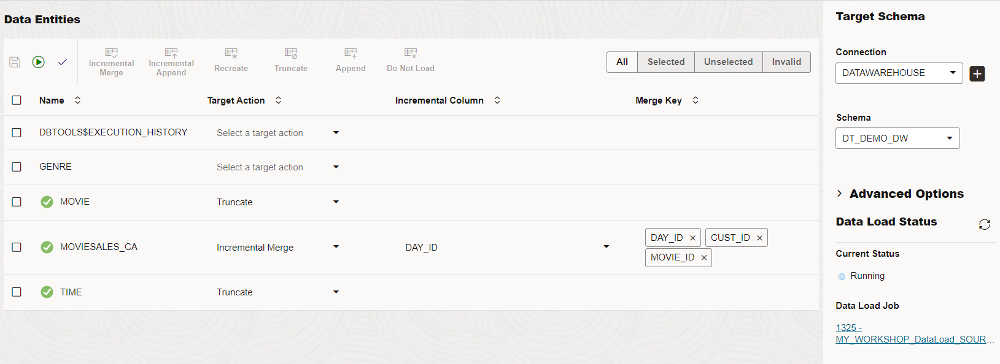

    The data load process is creating the corresponding tables in the target, scanning the source tables for incremental data (full for the first time) and performing the data movement process. It is also tracking the extracted rows for incremental load so that in the subsequent execution only the new or modified rows are loaded.

    Target tables are created with the same name as in the source database. There are advanced options to deal with potential issues with the table names that may not be accepted in the target. You can optionally use name prefix or quotations to deal with such issues. In our lab we left them as default.

5. Look at the Data Load Status for job completion. If there is an error then you can click on the job definition and try to debug. For this lab you should expect to see successful completion.

    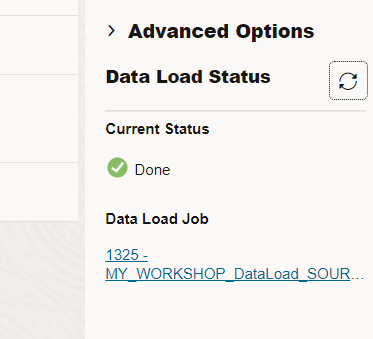

## Task 2: View the loaded data

1. Navigate to the Home screen by clicking on the top left link and click on **Data Entities**.

    

2. Filter for the connection DATAWAREHOUSE and you can see the tables MOVIE, MOVIESALES\_CA and TIME listed.

    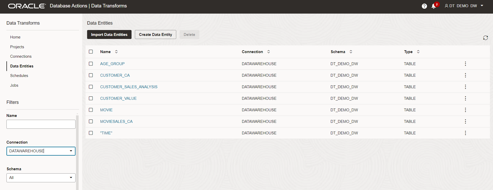

3. Select MOVIESALES\_CA table and from the right side menu, select the data preview to look at the data.

    *Note*: It takes few minutes for the table statistics to be collected by the target database and it may show no statistics in the beginning. However, you can see the data in the preview screen.

    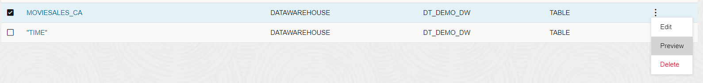

    After the statistics have loaded, note that the number of rows in the this table is the same as the number of rows observed in the source database as observed in the previous lab.

    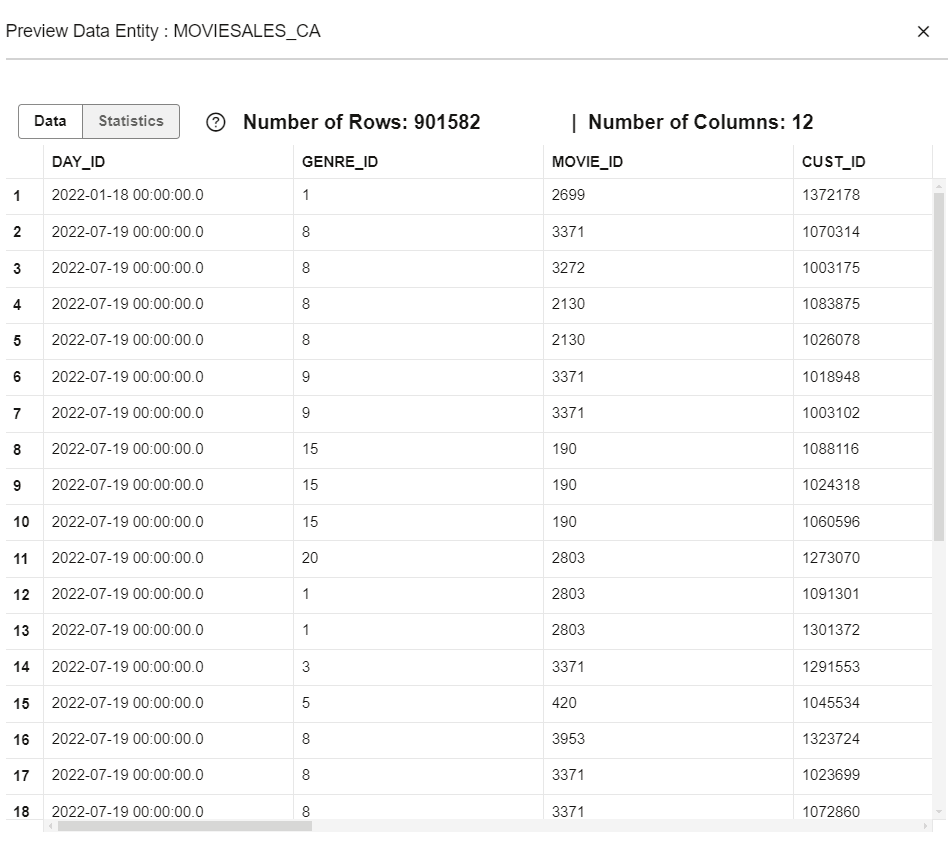

## RECAP

In this lab, we used Data Transforms to extract multiple tables from a source database and load them to the target in full and incremental modes. We executed this data load job as an ad-hoc process. In practice, these jobs are scheduled to run at regular frequency, and subsequent runs will extract and load only incremental rows (those added or modified since the last run) wherever defined. The scheduler will be covered in later labs in this workshop.

You may now **proceed to the next lab**.

## Acknowledgements

- Created By/Date - Jayant Mahto, Product Manager, Autonomous AI Database, January 2023
- Contributors - Mike Matthews
- Last Updated By - Jayant Mahto, June 2024

Copyright (C)  Oracle Corporation.
