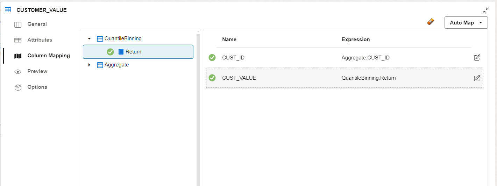
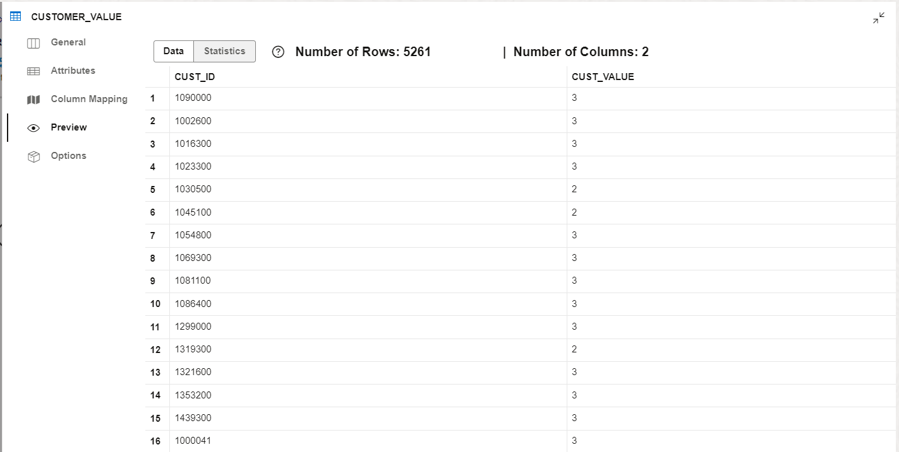

# Transform and prepare data for analysis. Simple introduction.

## Introduction

This lab introduces you to the basic concepts of building a data flow process to transform the data and load it to a target.

Estimated Time: 35 minutes

### Objectives

In this workshop, you will learn how to:
- Create a data flow process to transform the data and load it to a target
- Execute and debug data flow process

### Prerequisites

To complete this lab, you need to have completed the previous labs, so that you have:

- Created an Autonomous Data Warehouse instance
- Created users DT\_DEMO\_SOURCE and DT\_DEMO\_DW with appropriate roles
- Imported the demo data
- Started Data Transforms tool and performed the following:
    - Created SOURCE and DATAWAREHOUSE connections
    - Imported the entity definitions
    - Created a project called MY\_WORKSHOP

## Task 1: Create a simple data transforms process

In this task we will get familiar with the Data Flow UI and will be able to create a simple data flow to understand the concept. 

In order to keep it simple, we will use the source table in the same DB schema. This way entire data transformation process takes place in the same DB schema and there will be no external data movement. In later part of this lab, we will create more complex data flows involving data movement between different DBs and transforming the data in the same flow.

1. Navigate to your project MY\_WORKSHOP and select **Data Flow** from the left side. After that click on **Create Data Flow** button.

    - Name: Load\_customer\_value

    Click **Create**

    

2. First time you create a data flow in a project, it will ask you to add a schema from your connections that will be used to get source or target tables. Transforms keep a list of connections used in a project and for subsequent data flow creation, it will automatically add these schemas on the left side of the UI. At any time more schemas can be added to the data flow as needed.

    In our use case, this is our first data flow and we will add DT_DEMO_DW schema from DATAWAREHOUSE connection. Click **OK**.

    

3. Now lets take a look at the different sections of the data flow UI. Refer to the numbered sections in the screenshot below.

    1- Data Entities: You will see all the entity definitions available to you, to be used as a source or a target in the data flow. You can add more schemas and filter entities to quickly find what you are looking for. In the previous labs we had imported the entity definitions and that is what we are seeing it on the left side. If you need to reimport the definitions, maybe because more tables got added to the databases or some DDL changed, you can import the data entities any time by right clicking on the schema name.

    2- Save, Execute, Validate, Code Simulation and Auto Layout with zoom in and out.

    3- data transformation steps organized in different buckets.

    4- Main canvas to build the data flow by dragging entities and transformation steps and linking them in a flow.

    5- Object properties. You can click on any step in the flow to define the properties. You can expand and collapse the property section by clicking on the top right button.

    6- Execution status of the data flow.

    

4. Now we are ready to build our first data flow.

    Specification of our simple data flow is as follows:
    - Name: Load\_customer\_value
    - Source table (Columns used): MOVIESALES\_CA (CUST\_ID, TOTAL\_SALES)
    - Target table (Columns used): CUSTOMER\_VALUE (CUST\_ID, CUST\_VALUE)
    - Transformation specification: We want to categorize customer list into five buckets of importance (VALUES) to our fictitious movie business. Customers who have given us more business are in the highest bucket. The column CUST\_VALUE in the target table CUSTOMER\_VALUE contains values 1 to 5 depending on the value categorization. In order to categorize, we will first aggregate the sales data by customer and then use the Quantile Binning transform to create five buckets.

    We will create the entire flow step by step in a simple drag and drop interface.

5. Drag MOVIESALES\_CA table and **Aggregate** transform in the canvas.

    MOVIESALES\_CA table contains transactions of users watching individual movies. It has information on how much a user paid to watch a particular movie for each viewing.

6. Now click on MOVIESALES\_CA and use the little arrow on the right side to drag it to the Aggregate step to link both the steps.

    

7. Click on the **Aggregate** step and expand the properties section. Look at the top right button in the following screenshot.

    

8. In the **Attributes** section, click on all the attributes except CUST\_ID and TOTAL\_SALES. 

    

9. Click on the trash icon on the top right to delete the unwanted attributes. Now you have only two attributes that we care about.

10. click on **Column Mapping** and fill in the attribute's expression as follows. You can drag the columns from the tree view to the expression and edit as needed. There is also full expression editor but we don't need it for such simple task.

    - CUST\_ID: MOVIESALES\_CA.CUST\_ID
    - CUST\_VALUE: SUM(MOVIESALES\_CA.TOTAL\_SALES)

    

    This completes our aggregate step. Transforms automatically figures out group by columns (CUST\_ID in our case).

11. Now collapse the aggregate property area and drag **Quantile Binning** transform from **DATA PREPARATION** bucket of transforms. Link **Aggregate** and **Quantile Binning** steps.

    

12. Click on **Quantile Binning** and expand it's properties section. You can see that there is help text available explaining how to use the transform. 

    

13. Click on the **Column Mapping** on the left side and enter the following in the expression.

    - number of buckets: 5
    - \[partition\]: leave blank
    - order: Aggregate.TOTAL\_SALES (you can also drag it from the tree view on the left side)

    It means the incoming data will be divided into 5 buckets based on aggregate sales by customer.

    

14. Collapse the properties section and drag CUSTOMER_VALUE table from the left side entities section. Link it to the previous flow as follows. This is our target table.

    We are now done! You can see how simply we created the flow to populate customer values table. 

    

15. Well, not quiet. We need to specify how we are going to populate the target. Lets review the target properties. Click on the CUSTOMER\_VALUE and expand the properties section. Click on **Column Mapping** and you will see that the expression for CUST\_VALUE is empty. Expand the tree view on the left for QuantileBining and drag **Return** into the expression for CUST\_VALUE.

    Note that for any step (including final target), attributes from the previous steps are available in the tree view for populating column mapping. You also have auto mapping functionality to map by name or by position. You can type in mapping texts in the expression as well or use the expression editor for more complex expressions.

    

16. Now click on the **Options** and review the loading options. On the top right you have loading modes of append vs incremental. For our flow we are simply truncating the target and appending data for every execution.

    Make sure **Truncate target table** option is set to **True**

    

    Incremental mode is similar where you will additionally need to specify the columns list which will be used as primary key for data merge. Click on the **Attributes** section. Since this is simple append load, no keys are defined.

    

    Now collapse the properties section.

17. Save the data flow by clocking on the floppy disk icon on the top. You will get a successful save message. In a complex data flow it is advisable to keep saving once in a while so that you don't lose the work. Unfinished data flow can also be saved.

    

18. Click on the check mark on the top to validate the data flow. Since there are no errors, we get a success message. If you do not get a success message then you cna go back and correct your data flow.

    

19. Now click on the green arrow to execute the data flow. Click on **Start** for the dialog box and then **OK** for the notification dialog for the job start. Note that we are doing on demand execution. Transforms tool also has a built in scheduler that we will cover later.

    Notice the execution status on the bottom right side of the UI. Job is successful. If there is any error then we will need to look at the job log and do debugging. For now, all is good.

    

20. Click on the target table in the data flow and expand the properties section for data preview. Click on the "Preview" icon to see/preview the data loaded in the table. You can see that customers are assigned values 1 to 5 in our table.

    

## Task 2: Advanced user: Code simulation and debugging

In this task we will use the data transforms defined in the previous task and look at the generated code.

1. Click on the code simulation button on the top.

    

2. Look at the generated code. Transforms is an **Extract-Load-Transforms (ELT)** data integration tool and it pushes entire execution to the target database, leveraging database resources. It also uses set based execution for high performance as opposed to row by row execution of the data flow.

    

3. Now close the simulation window and let's explore how to debug the job execution. You can click on the execution job link in the status section to jump to jobs details.

    

4. This is the jobs detail. You can expand the execution steps and get more details on the following:

    - Start/End overall time
    - Start/End time of each step
    - Rows processed in the step
    - Success/failure messages
    - Code executed in each step in source or target connection

    

5. Close the jobs and go back to the Transforms home screen. You can access jobs details from the jobs menu as well. Click on the **Jobs** on the left side. You can filter the jobs you are interested in by partial name, status and the start date.

    

## RECAP

In this lab, we used the Data Transforms tool to calculate customer value from sales data and loaded the results into a target table. This was just a simple example but it introduced you to basic concepts of creating a data flow.

In the next lab we will create a slightly more complex data flow.

You may now **proceed to the next lab**.

## Acknowledgements

- Created By/Date - Jayant Mahto, Product Manager, Autonomous Database, January 2023
- Contributors - Mike Matthews
- Last Updated By - Jayant Mahto, June 2024

Copyright (C)  Oracle Corporation.
