# Transform and prepare data for analysis. 


## Introduction

This lab introduces you to a more complex data flow process. In this lab, you will transform data from multiple source tables, and load the prepared data to a target.

Estimated Time: 35 minutes

### Objectives

In this workshop, you will learn how to:
- Use custom SQL in a data flow
- Create a variable and use it in a data flow
- Load data from multiple sources and transform it in the same data flow

### Prerequisites

To complete this lab, you need to have completed the previous labs, so that you have:

- Created an Autonomous AI Lakehouse instance
- Created the users DT\_DEMO\_SOURCE and DT\_DEMO\_DW with appropriate roles
- Imported the demo data
- Started Data Transforms and performed the following:
    - Created SOURCE and DATAWAREHOUSE connections
    - Imported the entity definitions
    - Created a project called MY\_WORKSHOP
- Completed the previous lab and created a simple data flow

## Task 1: Create a data entity with custom SQL

In the earlier lab you learned how to import entity definitions from a database. In addition to the imported entity definitions, you can create your own entities with custom SQL. This acts like a view, and you can then use it as a source in a data flow.

1. Navigate to **Data Entities** from the home screen and click the **Create data entity** button. Fill in the details as follows:

    - Name: CUSTOMER\_ATTRIBUTE
    - Connection: DATAWAREHOUSE
    - Schema: DT\_DEMO\_DW
    - Type: Inline View
    - Query: < Copy/paste the SQL below >

```
<copy>
SELECT 
  CUSTOMER_CA.CUST_ID ,
  CUSTOMER_CA.EDUCATION ,
  CUSTOMER_CA.GENDER ,
  CUSTOMER_CA.INCOME_LEVEL ,
  CUSTOMER_CA.MARITAL_STATUS ,
  CUSTOMER_CA.PET ,
  AGE_GROUP.AGE_GROUP  
FROM 
  DT_DEMO_DW.CUSTOMER_CA CUSTOMER_CA  LEFT OUTER JOIN  DT_DEMO_DW.AGE_GROUP AGE_GROUP  
    ON  CUSTOMER_CA.AGE between AGE_GROUP.MIN_AGE and AGE_GROUP.MAX_AGE
</copy>
```

You can optionally validate it before saving in case there are syntax errors. Click **Save**

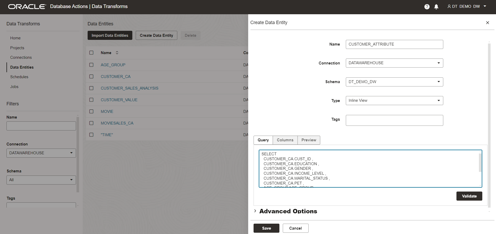

2. This entity with inline view SQL is stored in Data Transforms, and can be used as a source. Use the menu on the right side for the CUSTOMER\_ATTRIBUTE entity to preview the data.

    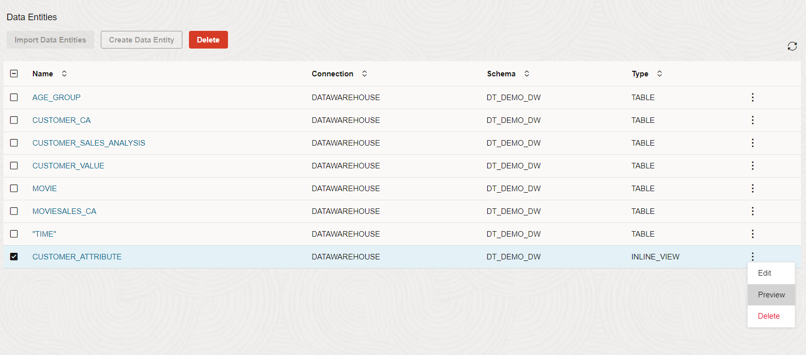

    You can see the results of inline view SQL.

    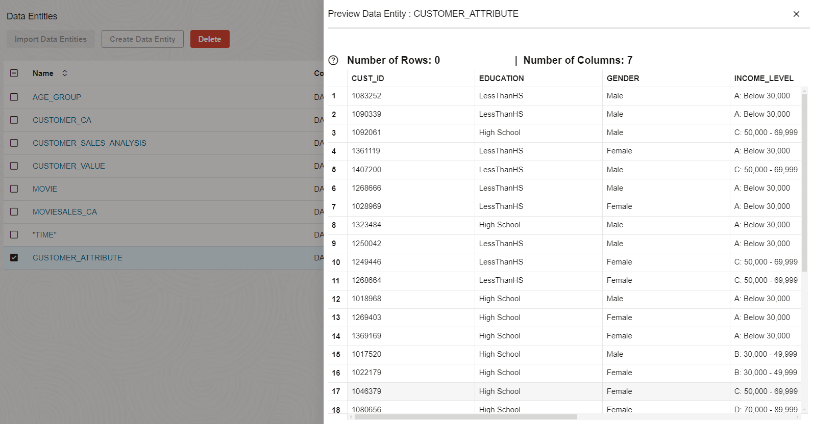

    Close the results screen by clicking on **X** on the top right.

## Task 2: Create a complex data flow using custom SQL

Now we will create a new data flow and use the new inline view. In the previous lab you learned how to use the data flow UI. Navigate to the **Data Flows** menu in your project **MY\_WORKSHOP**

1. Click **Create Data Flow** and name it Load\_customer\_analysis. Click **Create**.

    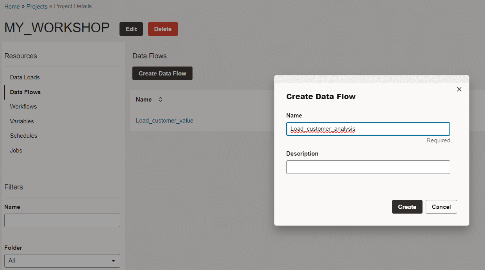

2. Now we are in the data flow UI. In this data flow, we will combine data from tables in different databases and load a table called CUSTOMER\_SALES\_ANALYSIS. The specification for this data flow is as follows:

    - Source tables:
        From DT_DEMO_DW Schema: MOVIESALES\_CA, CUSTOMER\_VALUE and CUSTOMER\_ATTRIBUTE (inline SQL)
        From DT\_DEMO\_SOURCE schema: GENRE 
    - Target table: CUSTOMER\_SALES\_ANALYSIS in DT\_DEMO\_DW Schema
    - Data flow details:
        Join all the source tables. Clean the GENRE table by removing leading and trailing spaces and converting to title case. Load the resulting data to the target table.

    Note that only the DT\_DEMO\_DW schema is available in the left side entity list. This is because we had added this schema in the previous lab. For convenience all the schemas used in the project are displayed as a starting list and users can add more schemas as needed. Since we need to join data from the GENRE table which is in the DT\_DEMO\_SOURCE schema in the SOURCE\_DATA database, we will add it to the list.

    Click on **Add a Schema** in the data entities section and select the DT\_DEMO\_SOURCE schema in the SOURCE\_DATA connection.

    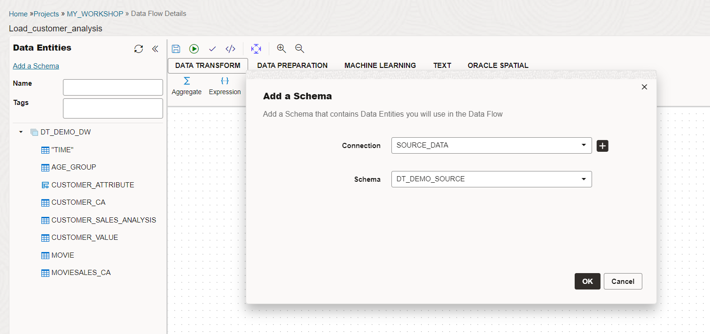

    Click **OK**. Now you can see both the schemas in the left side entity list. You can expand the tree to see the tables.

3. Now we are ready to build the data flow. Drag the source tables from the left side and the **Join** tool at the top to build the flow as shown in the screenshot below. 

    *Note*: Join tables from the left side first. Start with the join between MOVIESALES\_CA and CUSTOMER\_ATTRIBUTES. As you link tables to the join tool, it will automatically build the join condition based on the matching column names. You can navigate to the join properties to inspect and edit if needed. For now, there is no need to check. We will move to the next step and fix any errors later.

    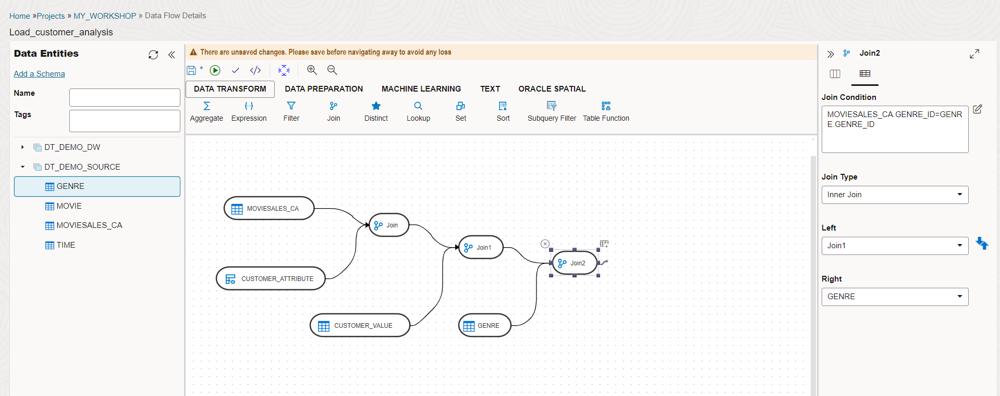

4. Our data flow is not complete but it is a good idea to save it. Click on the save icon at the top to save.

    Notice that some of the data flow links are now marked as **Transfer**. This is because the source data is in more than one connection, and data needs to be **transferred** to the target database in order to complete the data flow. Data Transforms does the data movement as part of the execution. You are therefore free to create a data flow with any source data without worrying about how the data is loaded. It is all handled by Data Transforms.

    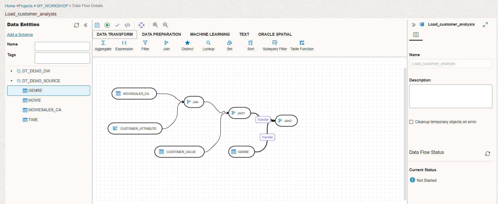

5. Now we need to clean the GENRE data. Drag the **Data Cleanse** tool from the **DATA PREPARATION** section and link it to the data flow at the end.

    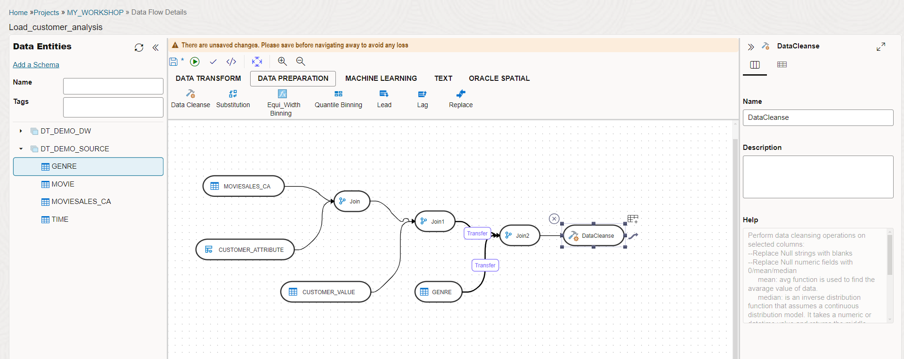

6. Click on the **Data Cleanse** step and expand the properties area.

    Click on the **Attributes** on the left side and fill in the details as follows:

    - Check GENRE column in the GENRE table.
    - Check **Leading and Trailing Whitespace** under **Remove Unwanted Characters**.
    - Select **Title Case** under **Modify Case**

    This means you want to clean the GENRE column by removing leading or trailing spaces and converting the text to title case, making it suitable for analysis.

    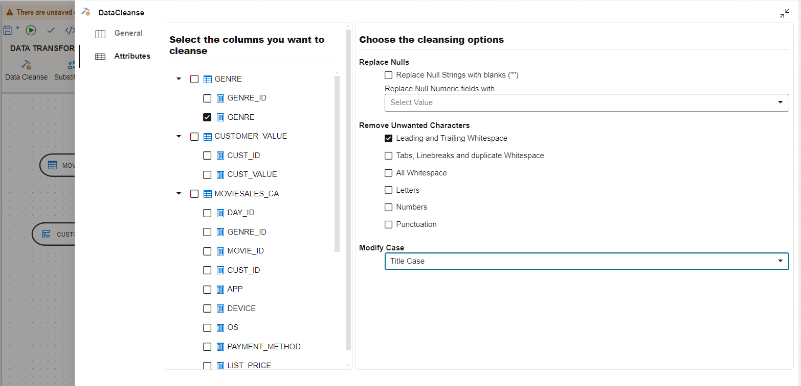

    Collapse the properties section.

7. Now we simply need to load our prepared data into our target table. Drag the CUSTOMER\_SALES\_ANALYSIS table from the DT\_DEMO\_DW Schema on the left navigation pane and link it to the data flow, making it complete.

    You can arrange the layout however you like, or use the auto layout option from the top menu.

    Save the data flow so that you don't lose your work.

    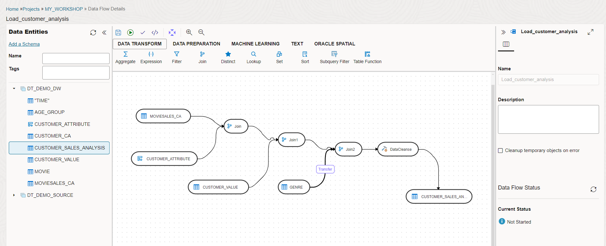


8. Click the target table and expand the properties area. Click **Column Mapping** on the left side to check mapping expressions. You can see that all the target columns are mapping to the output attributes of the data cleansing step. Most of the attributes were simply passed through the flow, but the GENRE column has gone through the data cleansing process in the previous step. Mapping expressions are automatically populated by name, and this looks correct for our lab.

    Note that you can write a complex mapping expression using the mapping editor. This offers powerful capability to transform data as needed. 

    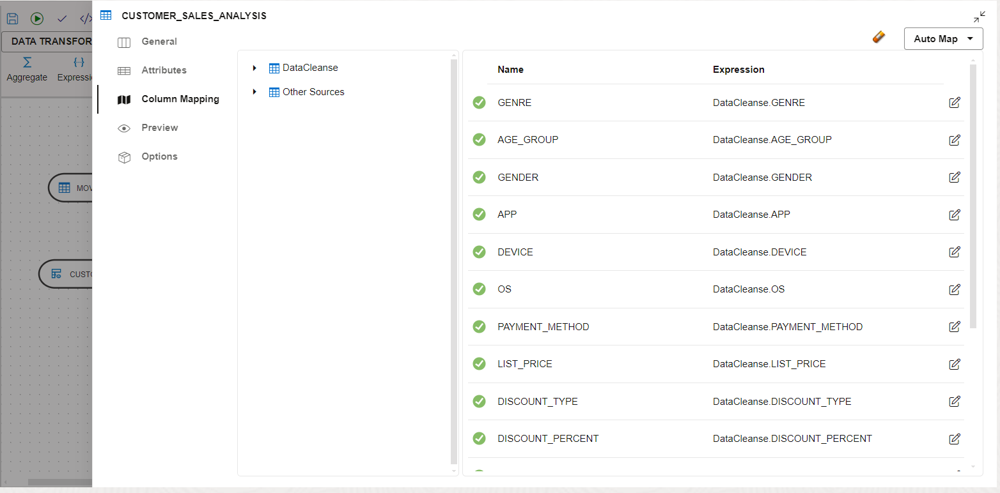

9. Now check the **Options** and make sure the mode is **Append** and **Truncate target table** is **True**.

    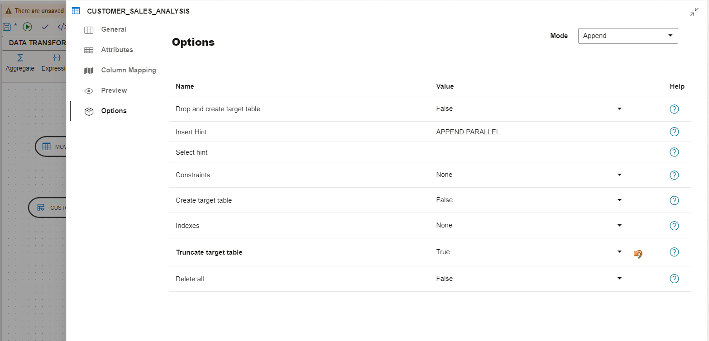

    Collapse the properties area and save the data flow.

10. This is a more complex flow than our previous data flow. You can validate the data flow before executing. Click on the validate button on the top. 

    Oh! It looks like we have an error!

    That's ok. This is how we learn how to use the tool. The error dialog complains about a join step.

    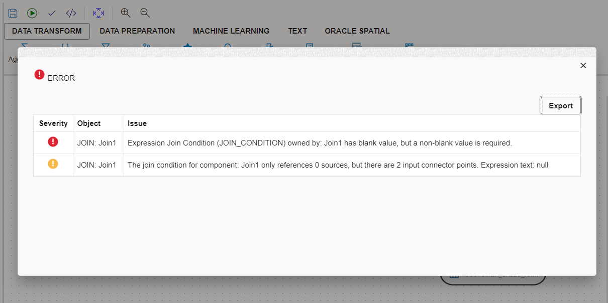

11. Close the error dialog and click on the join step mentioned in the error dialog. Expand the properties area.

    Note that the join condition is empty.

    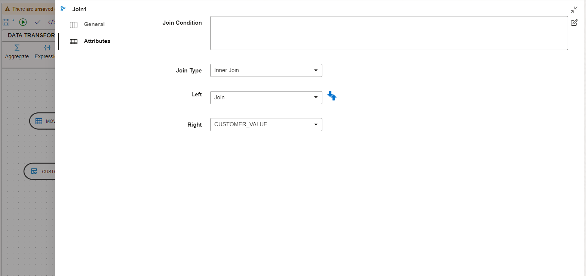

12. Populate the join condition as follows:

     CUSTOMER\_VALUE.CUST\_ID =  MOVIESALES\_CA.CUST\_ID

     Collapse the properties area. 

    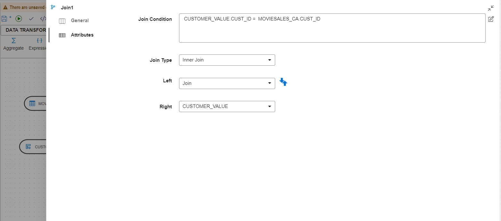

13. Save and validate again. This time it validates correctly.

    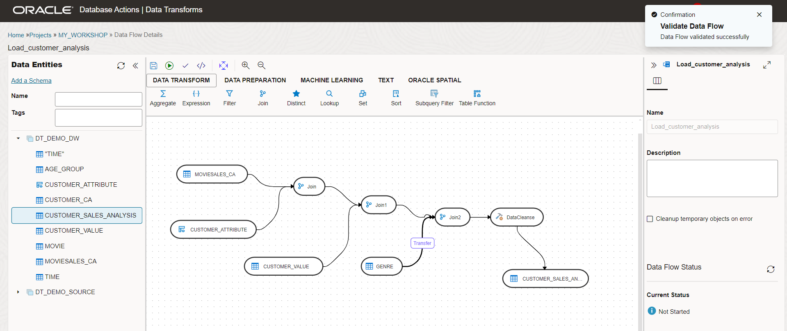

14. Now execute the data flow by clicking on the green triangle on the top.

    The data flow will complete successfully and you will see the status **Done** on the bottom right side of the UI. If you are curious, you can view a data preview of the target table to see the loaded data. 

    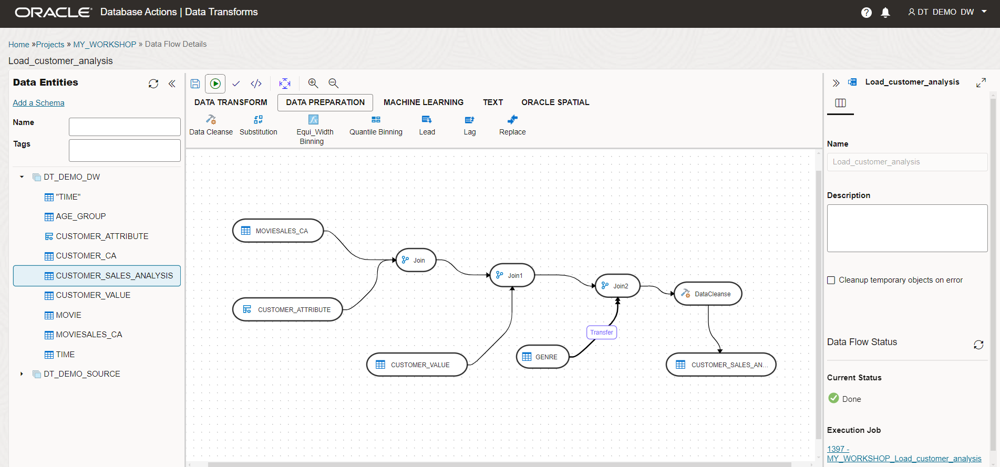

15. Click the job link to see the step details. You will notice that there are a lot more steps involved in the execution since the GENRE table needed to be loaded from another database into a temporary staging table and then joined with the rest of the tables.

    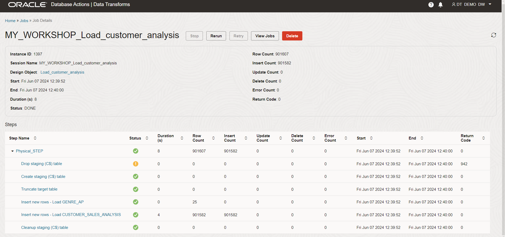

16. Click on the **Insert new rows - Load CUSTOMER_SALES_ANALYSIS** step and look at the SQL in the target connection.

    You will notice the generated SQL which has joins and data cleansing using functions like TRIM and INITCAP. 
    
    Imagine trying to write all this by hand. It is quite difficult to get it right. A graphical UI simplifies building a data pipeline and makes it easy to understand and maintain.

    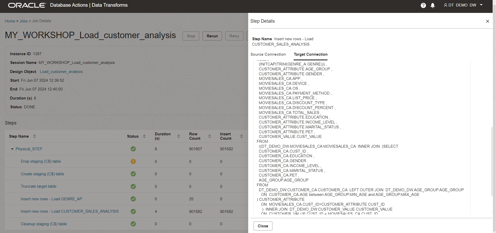

17. Close the step details and go back to the project. 

## Task 3: Create a Variable

Now let's learn how to use variables. Variables are persisted objects within the scope of a Data Transforms project that can be assigned a value, or can be refreshed with a value returned by SQL.

1. In order to read the value from the database, lets create a parameter table and populate it with some data. Log in to the Database Actions page as the user DT\_DEMO\_DW, and execute the following script in a SQL worksheet.

    Note: You will perform this step outside Data Transforms. After you run this script from a SQL worksheet, come back to Data Transforms.

```
<copy>
DROP TABLE MY_PARAMETERS;

CREATE TABLE MY_PARAMETERS
(
PARAM_NAME VARCHAR2(20),
PARAM_VALUE NUMBER
);

INSERT INTO MY_PARAMETERS VALUES ('NUM_BUCKETS', 4);
INSERT INTO MY_PARAMETERS VALUES ('LOAD_ANALYSIS', 1);
</copy>
```
2. Now log in to Data Transforms and navigate to your project MY\_WORKSHOP, **Variables** menu.

    Click on **Create Variable** and fill in the following:
    - Name: NUM_BUCKETS
    - Data Type: Numeric
    - Default value: 6
    - Keep History: Latest Value

    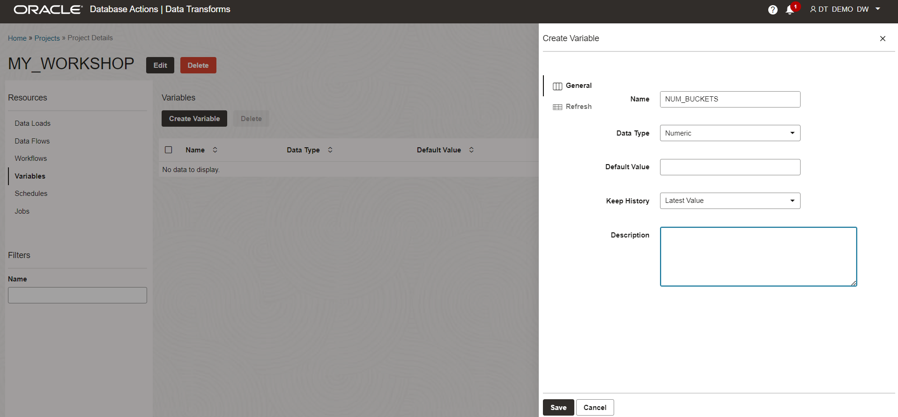
    
3. Now we have to add the refresh SQL. Click on **Refresh** button on the left side and fill in the following:

    - Connection: DATAWAREHOUSE
    - Schema: DT\_DEMO\_DW
    - Query: < copy/paste from below >

    Click **SAVE** 

```
<copy>
SELECT PARAM_VALUE
FROM MY_PARAMETERS
WHERE PARAM_NAME = 'NUM_BUCKETS'
</copy>
```
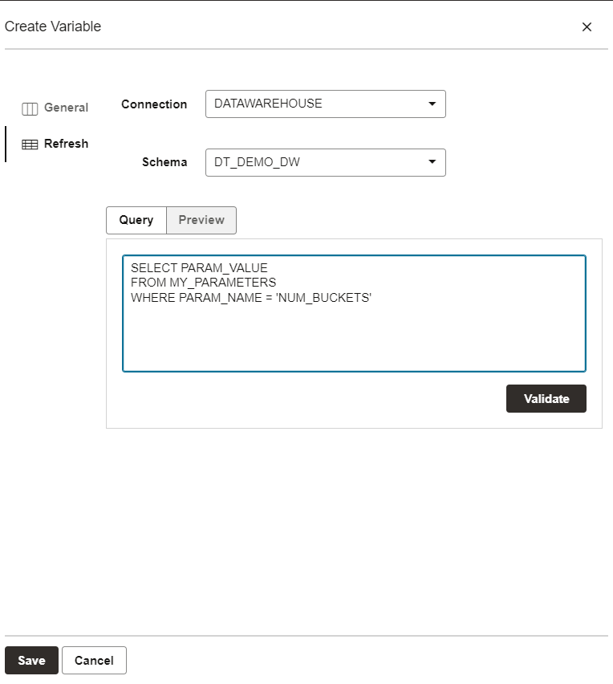


## Task 4: Use the variable in the data flow

1. Now we are ready to use this new variable in a data flow. We will modify the data flow **Load\_customer\_value** created in the earlier lab and use this variable to create customer value buckets. Earlier, you may recall that we set the number of buckets to 5. Now we will use the variable instead to set the number.

    Navigate to **Data Flows** and open the data flow **Load\_customer\_value** for editing.

    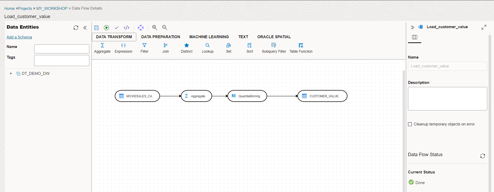

2. Click the **QuantileBinning** step, expand its properties, and navigate to **Column Mapping**.

    Notice the hardcoded value for **number of buckets**.

    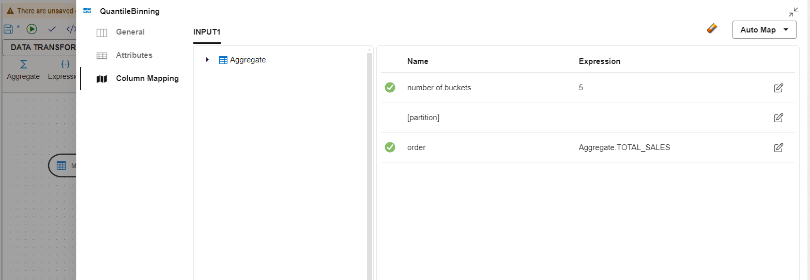

3. Let's update the **number of buckets** option to reference the variable instead. Remove 5 and enter **#NUM_BUCKETS** in its place.

    Variables are referenced anywhere in a data flow using the **#** prefix. During execution, the value is substituted by the current value of the named variable. The current value of the variable will either be its last refreshed value, or the default value. 

    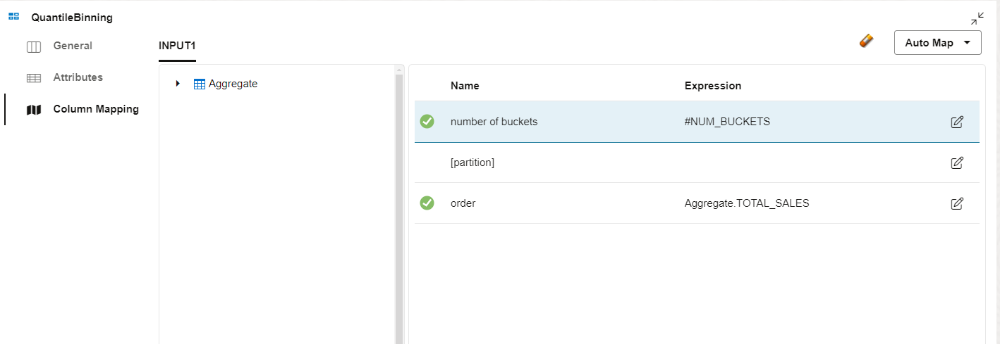

4. Save the data flow and execute it.

    Note that the variable values can be refreshed by the variable step in the workflow. Since we are yet to create a workflow, we will simply execute it now and it will use the default value defined in the variable definition.

    After successful completion, check the data preview of the target table CUSTOMER\_VALUE. Click the target table, expand its properties, and click the eye icon to preview the data.

    Click **Statistics** to see different values for the column CUST\_VALUE. You should see 6 values now. This is because the default value for the variable was 6.

    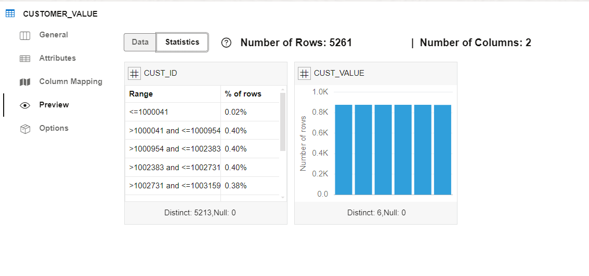

## RECAP

In this lab, we used Data Transforms to load a customer sales analysis table which combines data from various source tables from different connections. We also learned how to create and use variables in the data flow.

In the next lab we will create a workflow as an execution unit for the data pipeline.

You may now **proceed to the next lab**.

## Acknowledgements

- Created By/Date - Jayant Mahto, Product Manager, Autonomous AI Database, January 2023
- Contributors - Mike Matthews
- Last Updated By - Jayant Mahto, June 2024

Copyright (C)  Oracle Corporation.
