# Create a workflow for the entire process


## Introduction

This lab introduces you to workflow using which you can orchestrate all the data integration steps.

Estimated Time: 15 minutes

### Objectives

In this workshop, you will learn how to:
- Use previously defined data flows in a workflow
- Create custom SQL steps
- Create a variable and use it in the workflow
- Create a simple decision nodes to control the flow

### Prerequisites

To complete this lab, you need to have completed the previous labs, so that you have:

- Created an Autonomous Data Warehouse instance
- Created users DT\_DEMO\_SOURCE and DT\_DEMO\_DW with appropriate roles
- Imported the demo data
- Started Data Transforms tool and performed the following:
    - Created SOURCE and DATAWAREHOUSE connections
    - Imported the entity definitions
    - Created a project called MY\_WORKSHOP
- Completed the following in the previous Transforms labs: 
    - Learned how to create a variable
    - Created both the data flows


## Task 1: Create a workflow 

1. Navigate to **Workflows** from the left side menu and create a new workflow.

    Name: Nightly\_Load

    Click **Create** 

    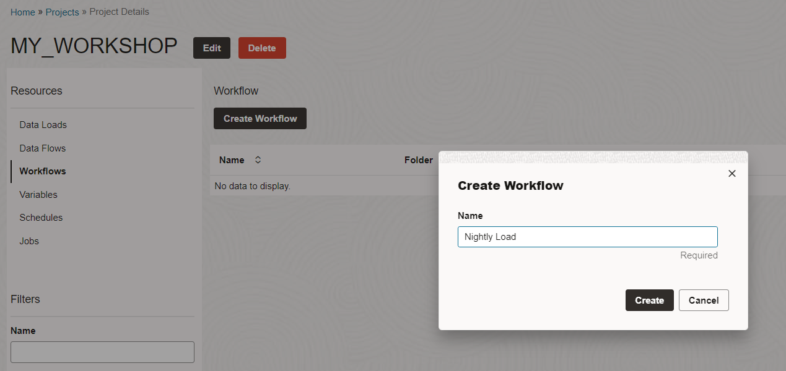

2. Now we are in workflow editing user interface. 

    - On the left side you have all the available objects that can be dragged into the workflow as steps in the overall process.
    - On the top: 
        - ok/nok buttons to control success or failure path
        - Sleep for adding a sleep step 
        - SQL for adding a SQL or PL/SQL step
    - Step properties section on the right that can be expanded or collapsed

    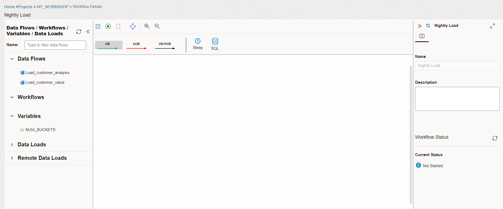

3. Drag the following from the left side to the central area in the following order:
    - Data Loads: DataLoad\_SOURCE\_TO\_DW
    - Data Flows: Load\_customer\_value

    Click on the data load step and in the properties area, make sure **First step** box is checked.

    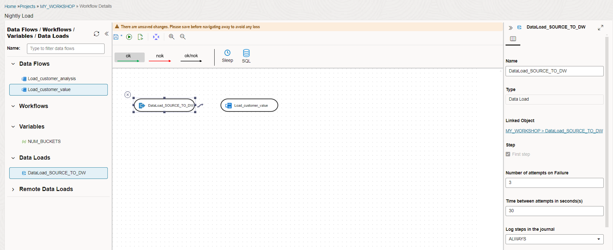


4. After that make sure **ok** is highlighted on the top and join both these steps. This means that in this workflow, data Load is the first steps and after it's successful execution, the next data flow will execute.

    Click on the floppy icon to save the workflow and execute it by clicking on the green triangle next to it.

    Acknowledge the start workflow dialog by clicking **OK**. You will see the process execution status on the bottom right side of the screen. In our previous labs we have executed these steps individually. Now we are executing these steps in a single workflow.

    It should take couple of minutes for all the steps to complete.

    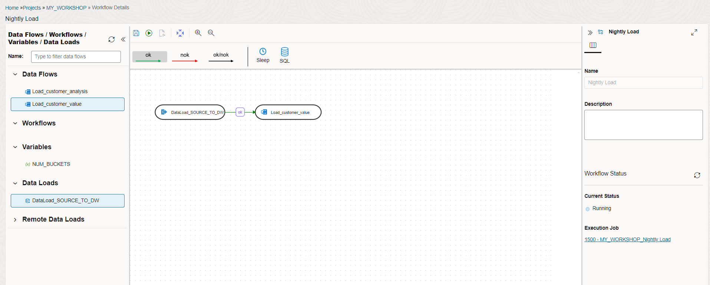

5. If there are any errors or you want to look into the execution details then you can go to jobs detail page (either by clicking on the execution job link in the status area or by accessing jobs menu from home screen).

    After you are done exploring the job details page, click on the **Design Object** link on the top left to go back to the workflow.

    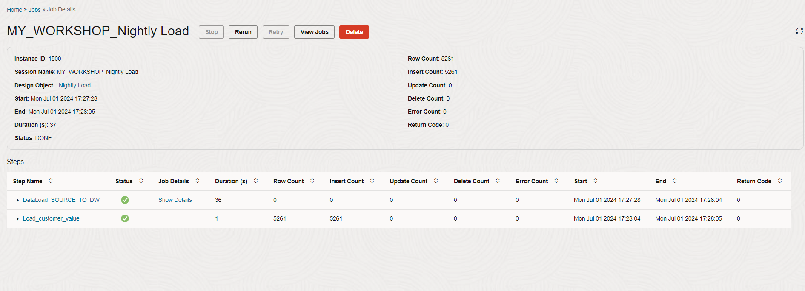

6. You can include a workflow in another workflow as well. Sometimes it is helpful in creating a modular structure in the data pipeline.


## Task 2: Create a variable to be used as a decision step

Now we are going to create a variable which will be used to decide whether to execute a certain workflow step or not. MY\_PARAMETERS table has already been created in the previous lab. We will make use of the values in this table to refresh the variable value.

1. Navigate to your project MY\_WORKSHOP, **Variables** menu.

    Click on **Create Variable** and fill in the following:
    - Name: LOAD_ANALYSIS
    - Data Type: Numeric
    - Default value: 0
    - Keep History: Latest Value
    
    Now we have to add the refresh SQL. Click on **Refresh** button on the left side and fill in the following:

    - Connection: DATAWAREHOUSE
    - Schema: DT\_DEMO\_DW
    - Query: < copy/paste from below >

    Click **SAVE** 

```
<copy>
SELECT PARAM_VALUE
FROM MY_PARAMETERS
WHERE PARAM_NAME = 'LOAD_ANALYSIS'
</copy>
```

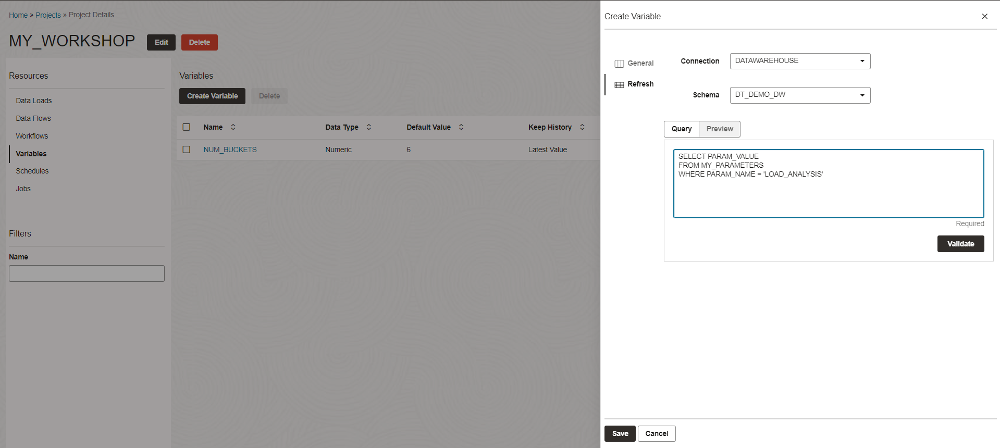


2. In the previous task we had created a simple workflow. Now let's add variable and SQL steps.

    Navigate to Workflows menu and click on Nightly\_Load workflow to edit. Drag the variable LOAD\_ANALYSIS into the canvas, link it to the last step and select the properties as follows:

    - Name: REFRESH\_LOAD\_ANALYSIS
    - Operation: Refresh Variable (from the drop down list)

    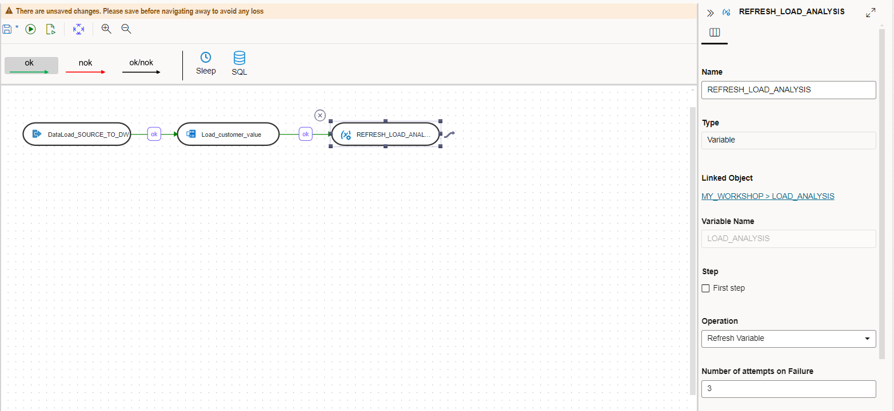

3. Drag the same LOAD\_ANALYSIS 2nd time and join the previous step to it. Configure the properties as follows:

    - Name: LOAD\_ANALYSIS
    - Operation: Evaluate Variable
    - Operator: =
    - Value: 1

    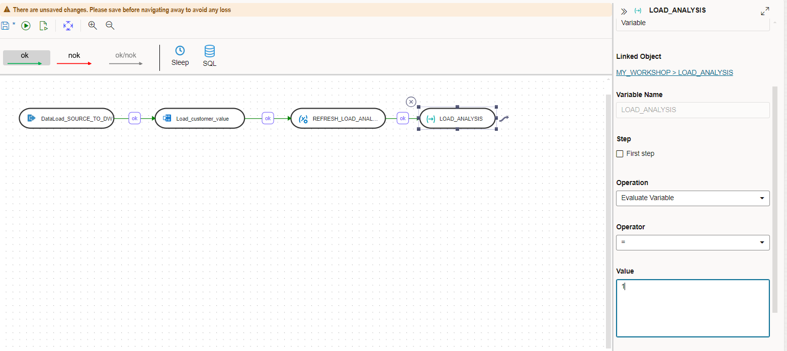

4. Drag the data flow Load\_customer\_analysis from the left and join the previous step to it. 

    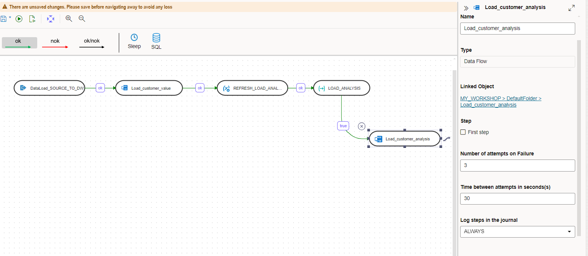


5. Save and execute the workflow.

    Now the workflow will execute the first two steps and then refresh and evaluate the variable LOAD\_ANALYSIS. If the value is equal to 1 then it will execute the Load_customer\_analysis\ data flow. 

    In our exercise we had only one output to the variable evaluate step (TRUE), but you can have another output for (FALSE) to execute steps incase variable evaluation fails. This is optional. 
    
    As you can see you can optionally execute a step based on a variable value. In our exercise it was a SQL step, but it could be any data load or data flow step.

    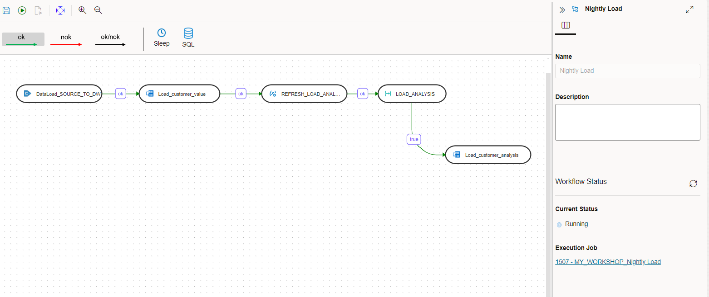

6. Optionally you can update the parameter value from the SQL Worksheet to 0 and try to execute this workflow again. You will notice that the Load\_customer\_analysis data flow will be skipped.

## Task 3: Introducing exception handling and SQL step

In this task we will learn how to execute a certain step if a step fails. We will also introduce SQL step that can be used to run any arbitrary SQL or PL/SQL code.

1. Edit the previous workflow again and drag the SQL step from the top to the canvas. Configure it as follows:

    - Name: Clean\_sales\_analysis\_table
    - Attributes section:
        - Connection: DATAWAREHOUSE
        - SQL: Copy and paste from below.

```
<copy>
TRUNCATE CUSTOMER_SALES_ANALYSIS
</copy>
```
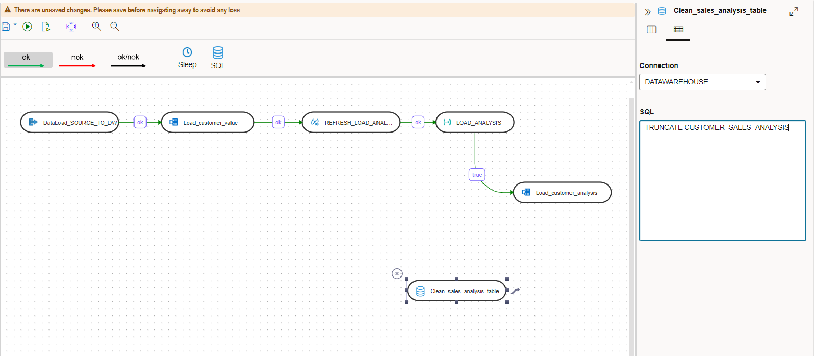

2. Click on **nok** button on the top and join the SQL step with the previous steps as shown in this screenshot.

    Note that now the color of the flow lines are red. It indicates the failure path.

    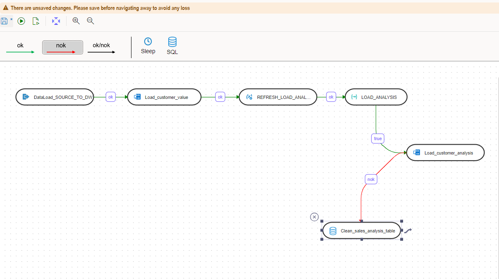

3. Save and execute the workflow. You can check whether the exception step got executed or not from the job details page. As of now it would not execute since there are no failures. Optionally, you can introduce an error in the Load\_customer\_analysis data flow, save it and try to execute this workflow. You will notice that the exception steps gets executed.

    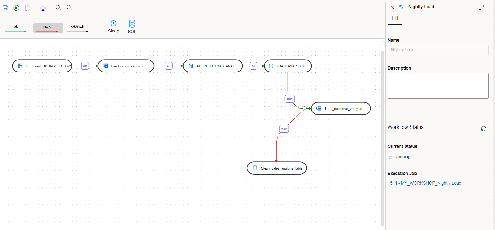

    Note that the exception step can be of any type. You can use a data load step or data flow step in the failure path as well. There can be more that one inflows to any step. It means you can use a single exception step connected to multiple steps and it will be executed if any one of the connected steps fail.
    
4. We used a very simple SQL statement in the SQL step. In practice you can use a complex SQL or a PL/SQL as a step in the overall workflow. Sky is the limit for what you can do. PL/SQL is very versatile and it can take advantage of built in database packages. Below are few examples:

    - Load files of complex data types using DBMS\_CLOUD.COPY\_DATA package
    - Email notification using UTL\_SMTP package
    - Call web service using UTL\_HTTP package.

    These are complex use cases and not covered in this workshop. 

You may now **proceed to the next lab**.

## RECAP

In this lab, we used the Data Transforms tool to create a complex workflow using data load, data flow, variables and SQL step. A data engineer will use all these features creatively to create a data integration workflow for a wide range of requirements. 

In the next lab we will learn how to schedule any execution unit for the data pipeline.

You may now **proceed to the next lab**.

## Acknowledgements

- Created By/Date - Jayant Mahto, Product Manager, Autonomous Database, January 2023
- Contributors - Mike Matthews
- Last Updated By - Jayant Mahto, June 2024

Copyright (C)  Oracle Corporation.
