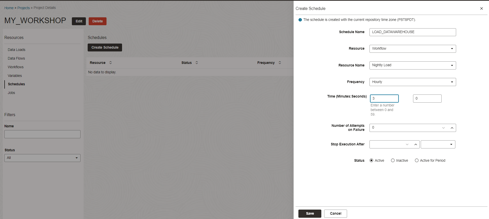
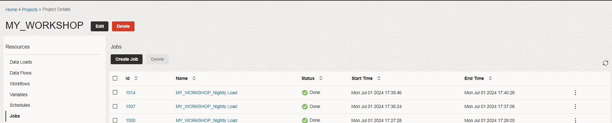

# Scheduling the data pipeline process

## Introduction

This lab introduces you to the in-built scheduler that allows you to schedule your data pipeline process.

Estimated Time: 10 minutes

### Objectives

In this workshop, you will learn:
-	How to schedule a process

### Prerequisites

To complete this lab, you need to have completed the previous labs, so that you have:

- Created an Autonomous AI Lakehouse instance
- Created the users DT\_DEMO\_SOURCE and DT\_DEMO\_DW with appropriate roles
- Imported the demo data
- Used Data Transforms to create data flows and a workflow

## Task 1: Create a schedule

So far we have been executing processes (such as data flows and workflows) directly from the editor window. THis is useful when designing, debugging and testing processes. However, in a data integration implementation you will have normally need to execute processes on a periodic basis. This will be accomplished by creating a schedule.

1. Navigate to your project and click on **Schedules** from left side menu. Then click **Create Schedule**. Configure it as follows.

    - Name: LOAD\_DATAWAREHOUSE
    - Resource: Workflow
    - Resource Name: Nightly\_Load
    - Frequency: Hourly
    - Time: 3 Minutes, 0 seconds
    - Status: Active

    Click on **Save** to create the schedule. This schedule will run in 3 minutes and then after every hour. 

    Note that you can schedule the workflow to run on any other frequency, for example daily or weekly at a certain time. For our exercise we did it hourly starting in 3 minutes so that we can check the progress quickly.

    

2. Now the schedule is created and the workflow will be executed at the assigned time. Note that you can activate/de-activate any schedule by editing it. After testing your schedule, you should de-activate it so that it doesn't keep running in the background. Let's go to the jobs menu in three minutes and check. You should be able to see your job running.

    

## RECAP

In this lab, we used Data Transforms to create a schedule for a data pipeline process. One can have multiple schedules for different processes.

Now you have gone through the basic features of Data Transforms and should be ready to design and implement a data integration process based on your real world requirements.

This concludes the Data Transforms workshop.

## Acknowledgements

- Created By/Date - Jayant Mahto, Product Manager, Autonomous AI Database, January 2023
- Contributors - Mike Matthews
- Last Updated By - Jayant Mahto, June 2024

Copyright (C)  Oracle Corporation.
