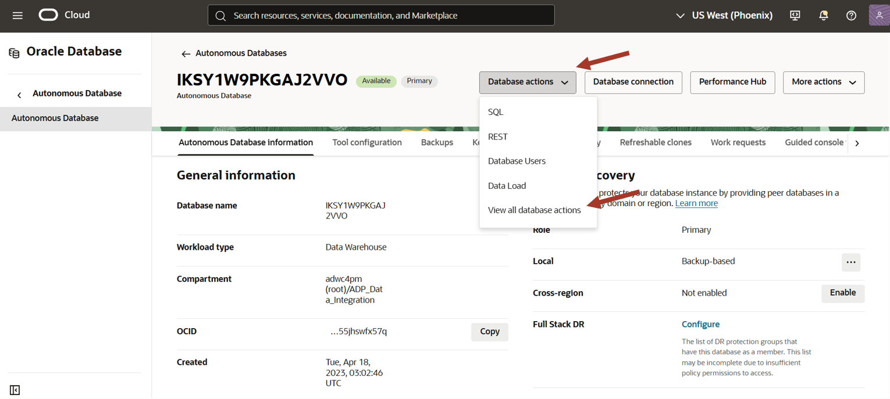
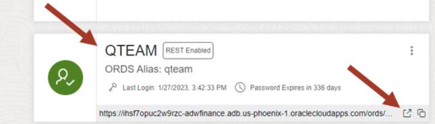

# Loading demo data for Data Studio overview workshop


## Introduction

This lab will guide you through the steps to load demo data. 

### Prerequisites

- Created an Autonomous Data Warehouse instance
- Created a new QTEAM user with appropriate roles

## Task 1: Access SQL Worksheet

### Access SQL Worksheet

SQL worksheet is linked from the **Database Actions** home page.

In the previous lab, you created the database user **QTEAM**, and you should still be connected as user QTEAM. If you are already logged in as QTEAM, and on the Database Actions home page, you may go directly to Step 3. 

1. There are two ways to reach the Database Actions home page, where you can find Data Studio and other useful tools for your database.

    - Via the Autonomous Database console page
    - Directly via URI

    ### Access Database Actions via the Console

    On the Autonomous Database Details page, click the **Database Actions** button:

    

    ### Access Database Actions directly via URI

    When user QTEAM was created (in a previous step), a card appeared on the Database Users screen, similar to what is shown below. Notice the URI at the bottom of the card.

    Click the **Open in new tab** icon to open a new tab. This URL may be used to access the Database Actions page of Autonomous Database Tools directly, without needing to use the OCI Console. You may want to bookmark this link so that you can easily launch the page at any time.

    

2. Once you have launched the Database Actions page, sign in as user QTEAM, with the password assigned previously, and click **Sign In**.



3. This will take you to the Autonomous Database **Database Actions** page (shown below), with links to the SQL worksheet on the top left. 

  


## Task 2: Execute script in SQL Worksheet to load demo data

1. Below is the script you need to execute to load demo data. Simply copy and paste this code into your SQL Worksheet.

*For copy/pasting, be sure to click the convenient __Copy__ button in the upper right corner of the following code snippet, and all subsequent code snippets*: 


```
DROP TABLE CUSTOMER_CA
;
 
CREATE TABLE CUSTOMER_CA 
    ( 
     CUST_ID        NUMBER , 
     AGE            NUMBER , 
     EDUCATION      VARCHAR2 (40) , 
     GENDER         VARCHAR2 (20) , 
     INCOME_LEVEL   VARCHAR2 (20) , 
     MARITAL_STATUS VARCHAR2 (8) , 
     PET            VARCHAR2 (40) 
    ) 
;

DROP TABLE MOVIESALES_CA
;
 
CREATE TABLE MOVIESALES_CA 
    ( 
     DAY_ID           DATE , 
     GENRE_ID         NUMBER , 
     MOVIE_ID         NUMBER , 
     CUST_ID          NUMBER , 
     APP              VARCHAR2 (100) , 
     DEVICE           VARCHAR2 (100) , 
     OS               VARCHAR2 (100) , 
     PAYMENT_METHOD   VARCHAR2 (100) , 
     LIST_PRICE       NUMBER , 
     DISCOUNT_TYPE    VARCHAR2 (100) , 
     DISCOUNT_PERCENT NUMBER , 
     TOTAL_SALES      NUMBER 
    ) 
;

DROP TABLE GENRE
;

CREATE TABLE GENRE 
    ( 
     GENRE_ID NUMBER , 
     GENRE    VARCHAR2 (30) 
    ) 
;


CREATE UNIQUE INDEX PK_GENRE_ID ON GENRE 
    ( 
     GENRE_ID ASC 
    ) 
;

ALTER TABLE GENRE 
    ADD CONSTRAINT PK_GENRE_ID PRIMARY KEY ( GENRE_ID ) 
    USING INDEX PK_GENRE_ID 
;

DROP TABLE MOVIE
;

CREATE TABLE MOVIE 
    ( 
     MOVIE_ID     NUMBER , 
     TITLE        VARCHAR2 (200) , 
     BUDGET       NUMBER , 
     GROSS        NUMBER , 
     LIST_PRICE   NUMBER , 
     GENRES       VARCHAR2 (4000) , 
     SKU          VARCHAR2 (30) , 
     YEAR         NUMBER , 
     OPENING_DATE DATE , 
     VIEWS        NUMBER , 
     CAST         VARCHAR2 (4000) , 
     CREW         VARCHAR2 (4000) , 
     STUDIO       VARCHAR2 (4000) , 
     MAIN_SUBJECT VARCHAR2 (4000) , 
     AWARDS       VARCHAR2 (4000) , 
     NOMINATIONS  VARCHAR2 (4000) , 
     RUNTIME      NUMBER , 
     SUMMARY      VARCHAR2 (16000) 
    ) 
;

DROP TABLE TIME
;

CREATE TABLE TIME 
    ( 
     DAY_ID           DATE , 
     DAY_NAME         VARCHAR2 (36) , 
     DAY_OF_WEEK      NUMBER , 
     DAY_OF_MONTH     NUMBER , 
     DAY_OF_YEAR      NUMBER , 
     WEEK_OF_MONTH    NUMBER , 
     WEEK_OF_YEAR     NUMBER , 
     MONTH_OF_YEAR    NUMBER , 
     MONTH_NAME       VARCHAR2 (36) , 
     MONTH_SHORT_NAME VARCHAR2 (12) , 
     QUARTER_NAME     VARCHAR2 (7) , 
     QUARTER_OF_YEAR  NUMBER , 
     YEAR_NAME        NUMBER 
    ) 
;

set define on
define file_uri_base = 'https://objectstorage.us-phoenix-1.oraclecloud.com/p/lJD1-iabPDW-vrGBhPFf3JJJtYi67BhcBD-2iykgWjy6oir05QuBSIe7Ffva9i4a/n/adwc4pm/b/bucket-data-studio-overview-demo-data/o'

begin
 dbms_cloud.copy_data(
    table_name =>'CUSTOMER_CA',
    file_uri_list =>'&file_uri_base/CUSTOMER_CA.csv',
    format =>'{"type" : "csv", "skipheaders" : 1}'
 );
 dbms_cloud.copy_data(
    table_name =>'MOVIESALES_CA',
    file_uri_list =>'&file_uri_base/MOVIESALES_CA.csv',
    format =>'{"type" : "csv", "skipheaders" : 1}'
 );
 dbms_cloud.copy_data(
    table_name =>'GENRE',
    file_uri_list =>'&file_uri_base/GENRE.csv',
    format =>'{"type" : "csv", "skipheaders" : 1}'
 );
 dbms_cloud.copy_data(
    table_name =>'MOVIE',
    file_uri_list =>'&file_uri_base/MOVIE.csv',
    format =>'{"type" : "csv", "skipheaders" : 1}'
 );
 dbms_cloud.copy_data(
    table_name =>'TIME',
    file_uri_list =>'&file_uri_base/TIME.csv',
    format =>'{"type" : "csv", "skipheaders" : 1}'
 );
end;
/

```
2. Paste the sql statements in worksheet. Click on **Run Script** icon.

**Note**: Expect to receive "ORA-00942 table or view does not exist" errors during the DROP TABLE command for the first execution of the script, but you should not see any other errors.


Now you are ready to go through rest of the labs in this workshop.

