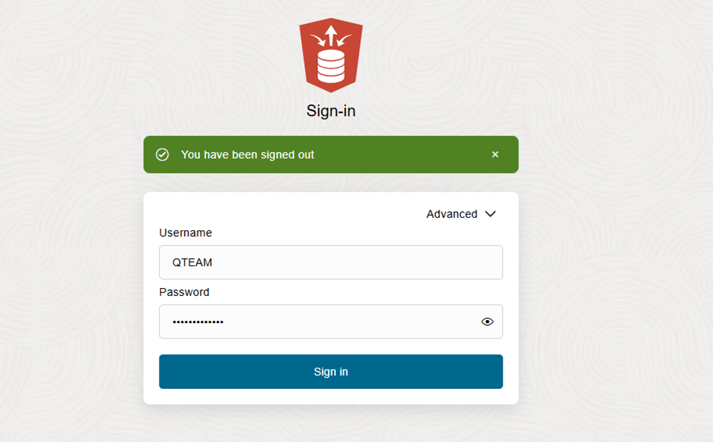

# Loading demo data for Data Studio overview workshop


## Introduction

This lab will guide you through the steps to load demo data. 

### Prerequisites

- Created an Autonomous Data Warehouse instance
- Created a new QTEAM user with appropriate roles

## Task 1: Access SQL Worksheet

### Access SQL Worksheet

SQL worksheet is linked from the **Database Actions** home page.

In the previous lab, you created the database user **QTEAM**, and you should still be connected as user QTEAM. If you are already logged in as QTEAM, and on the Database Actions home page, you may go directly to Step 3. 

1. There are two ways to reach the Database Actions home page, where you can find Data Studio and other useful tools for your database.

    - Via the Autonomous Database console page
    - Directly via URI

    ### Access Database Actions via the Console

    On the Autonomous Database Details page, click the **Database Actions** button:

    

    ### Access Database Actions directly via URI

    When user QTEAM was created (in a previous step), a card appeared on the Database Users screen, similar to what is shown below. Notice the URI at the bottom of the card.

    Click the **Open in new tab** icon to open a new tab. This URL may be used to access the Database Actions page of Autonomous Database Tools directly, without needing to use the OCI Console. You may want to bookmark this link so that you can easily launch the page at any time.

    

2. Once you have launched the Database Actions page, sign in as user QTEAM, with the password assigned previously, and click **Sign In**.


3. This will take you to the Autonomous Database **Database Actions** page (shown below), with links to the SQL worksheet on the top left. 

  


## Task 2: Execute script in SQL Worksheet to load demo data

1. Below is the script you need to execute to load demo data. Simply copy and paste this code into your SQL Worksheet.

*For copy/pasting, be sure to click the convenient __Copy__ button in the upper right corner of the following code snippet, and all subsequent code snippets*: 

```
My SQL line 1;
SQL line 2;
```
2. Paste the sql statements in worksheet. Click on **Run Statement** icon. It is a triangle inside a green circle.


Now you are ready to go through rest of the labs in this workshop.

