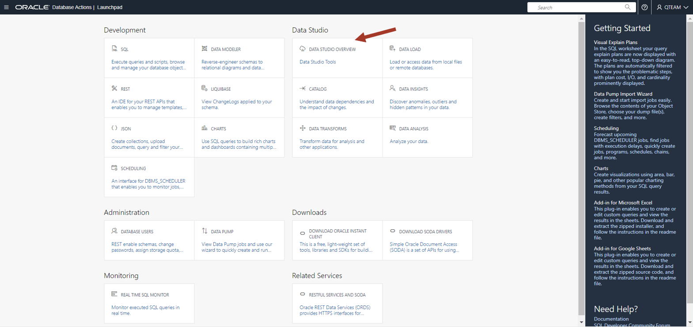

# Overview of Data Studio in the Autonomous Database

## Introduction

Data Studio has a collection of tools for various needs. We will start
with **DATA CATALOG** to look for the data we need.

### Prerequisites

To complete this lab, you need to have completed the two previous labs, so that you have:

- Created an Autonomous Data Warehouse instance
- Created a new QTEAM user with appropriate roles

### Preparation

You will need to load the demo data for this lab.

**follow these instructions - place holder**

## Task 1:  Launch Database Action

1.  Access Database Actions via the Console on OCI or access Database Actions directly via URI. 
    Login to the Autonomous Database created earlier with your user and
    password. You can see various tools under Data Studio.

>> Note: Bookmark the Database Actions page so that it is easier to come
>> back to this later in the workshop.
>>
>> Click on **DATA STUDIO OVERVIEW** card.

2.  It shows the list of recent objects in the middle. On the left, it
    has links to individual tools and on the right, link to
    documentation.

{width="6.444933289588802in"
height="3.0479166666666666in"}

Since it is a workshop, there are limited objects in the list. There
will be many objects and only the recent objects are shown here. We will
use the Catalog tool to browse the objects and find what we need.

## Task 2:  Explore Catalog

1.  Click on the Catalog link on the left panel.

>> In a typical database there will be many objects and you need various
>> ways to search and display objects. Various ways to navigate a catalog
>> is shown by marked numbers in the above screenshot. These are:
>>
>> 1: Saved searches. You can filter objects easily with one click and
>> then refine the search further as per need.
>>
>> 2: Filters to narrow down your search.
>>
>> 3: Various display modes. Card/Grid/List view.
>>
>> 4: Search bar where you can type in advanced search query

{width="6.455540244969379in"
height="3.057638888888889in"}

2.  Note that catalog shows all types of objects. We are interested in
    only the tables for now. Click on "Tables, views and analytic views
    owned by..." on the right zone 1.

>> You can see the MOVIESALES_CA in this list. We are interested in this
>> table since we were told that this table contains movie sales
>> transaction data. (Referring to the meeting notes in introductory
>> section of this workshop).
>>
>> You could explicitly search for MOVIESALES_CA by typing the name of
>> the table in the search bar but in our case, it is clearly visible in
>> the grid view in the middle.

{width="6.466951006124234in"
height="3.027083333333333in"}

3.  Click on the MOVIESALES_CA table.

>> You can see the data preview. You can scroll right to see more columns
>> and scroll down to see more rows. You can also sort the columns by
>> right clicking on the columns. Using the data view, you can be sure
>> that this is the data you want.
>>
>> Note that you also have other information such as
>> lineage/impact/statistics/data definitions etc. This workshop is not
>> going into the details. In-depth catalog will be explored in other
>> workshops.
>>
>> Now close this view by clicking on the bottom right **Close** button.

{width="6.3258027121609794in"
height="3.060416666666667in"}

4.  Look for the other tables of our interest in the main catalog page.
    If you remember the meeting notes in introductory section of this
    workshop, we are also interested in CUSTOMER_CA and GENRE tables.
    Find and click on these tables to do a data preview.

{width="6.457644356955381in"
height="3.021725721784777in"}

5.  We also need to find out whether age group information is present.

>> Clear search bar and enter the following search string:
>>
>> **(type: COLUMN) AGE**
>>
>> This will search for all the columns with "AGE" in the column name.
>>
>> We can explicitly search for GROUP as well but we don't see any.
>>
>> Looks like we need to load a new table for age group.

{width="6.448788276465442in"
height="3.040277777777778in"}