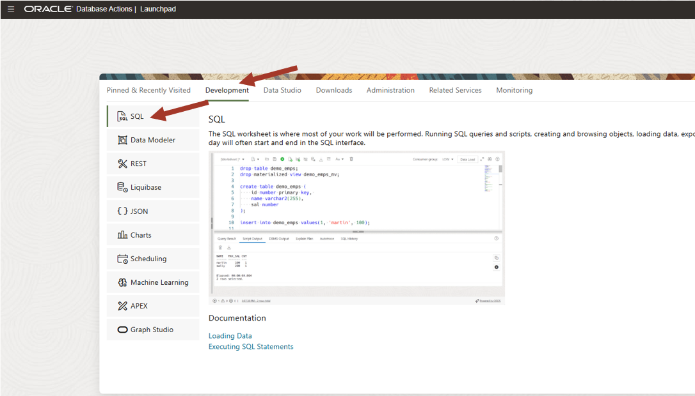

# Load demo data for the Data Studio overview workshop


## Introduction

This lab will guide you through the steps to load demo data. 

Estimated Time: 5 minutes

<!---
Watch the video below for a quick walk-through of the lab.
[Create a database user](videohub:1_3tt5hsic)
-->
### Prerequisites

- Created an Autonomous AI Lakehouse instance
- Created a new QTEAM user with appropriate roles

## Task 1: Access the SQL worksheet

SQL worksheet is linked from the **Database Actions** home page.

In the previous lab, you created the database user **QTEAM**, and you should still be connected as user QTEAM. If you are already logged in as QTEAM, and on the Database Actions home page, you may go directly to Step 3. 

1. There are two ways to reach the Database Actions home page, where you can find Data Studio and other useful tools for your database.

    - Via the Autonomous AI Database console page
    - Directly via URI

    ### Access Database Actions via the Console

    On the Autonomous AI Database Details page, click the **Database Actions** button:

    

    ### Access Database Actions directly via URI

    When user QTEAM was created (in a previous step), a card appeared on the Database Users screen, similar to what is shown below. Notice the URI at the bottom of the card.

    Click the **Open in new tab** icon to open a new tab. This URL may be used to access the Database Actions page of Autonomous AI Database Tools directly, without needing to use the OCI Console. You may want to bookmark this link so that you can easily launch the page at any time.

    

2. Once you have launched the Database Actions page, sign in as user QTEAM, with the password assigned previously, and click **Sign In**.

    

3. This will take you to the Autonomous AI Database **Database Actions** page (shown below), with links to the SQL worksheet on the top left. 
    
    Click on the **SQL** card.

    


## Task 2: Execute the script

1. Below is the script you need to execute to load demo data. Simply copy and paste this code into your SQL Worksheet.

    *For copy/pasting, be sure to click the convenient __Copy__ button in the upper right corner of the following code snippet.*: 

```
<copy>
DROP TABLE AGE_GROUP;

CREATE TABLE AGE_GROUP 
    ( 
     MIN_AGE   NUMBER , 
     MAX_AGE   NUMBER , 
     AGE_GROUP VARCHAR2 (4000) 
    ) 
;

insert into AGE_GROUP (MIN_AGE, MAX_AGE, AGE_GROUP) values (0,24,'Gen Z');
insert into AGE_GROUP (MIN_AGE, MAX_AGE, AGE_GROUP) values (25,40,'Millennials');
insert into AGE_GROUP (MIN_AGE, MAX_AGE, AGE_GROUP) values (41,56,'Gen X');
insert into AGE_GROUP (MIN_AGE, MAX_AGE, AGE_GROUP) values (57,75,'Boomer');
insert into AGE_GROUP (MIN_AGE, MAX_AGE, AGE_GROUP) values (76,200,'Silent Generation');

DROP TABLE CUSTOMER_SALES_ANALYSIS;

CREATE TABLE CUSTOMER_SALES_ANALYSIS
(
  MIN_AGE NUMBER(38),
GENRE VARCHAR2(30 CHAR),
AGE_GROUP VARCHAR2(4000 CHAR),
GENDER VARCHAR2(20 CHAR),
APP VARCHAR2(100 CHAR),
DEVICE VARCHAR2(100 CHAR),
OS VARCHAR2(100 CHAR),
PAYMENT_METHOD VARCHAR2(100 CHAR),
LIST_PRICE NUMBER(38),
DISCOUNT_TYPE VARCHAR2(100 CHAR),
DISCOUNT_PERCENT NUMBER(38),
TOTAL_SALES NUMBER(38),
MAX_AGE NUMBER(38),
AGE NUMBER(38),
EDUCATION VARCHAR2(40 CHAR),
INCOME_LEVEL VARCHAR2(20 CHAR),
MARITAL_STATUS VARCHAR2(8 CHAR),
PET VARCHAR2(40 CHAR),
CUST_VALUE NUMBER,
CUST_SALES NUMBER(38)
);
</copy>
```

2. Paste the SQL statements in the worksheet. Click on the **Run Script** icon.

    While the script is running, you will see the message "Executing code" at the bottom of the window. 
    The message will change to "SQL executed by QTEAM" when in finishes. There should not be any errors.

    

You may now **proceed to the next lab**.


## Acknowledgements

- Created By/Date - Jayant Mahto, Product Manager, Autonomous AI Database, Aug 2023
- Contributors - Mike Matthews, Bud Endress, Ashish Jain, Marty Gubar, Rick Green
- Last Updated By - Jayant Mahto, August 2023


Copyright (C)  Oracle Corporation.