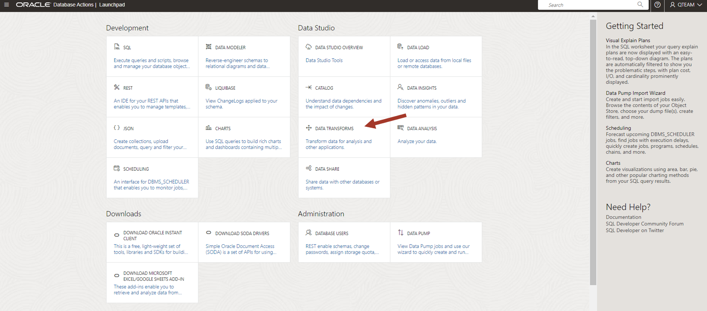
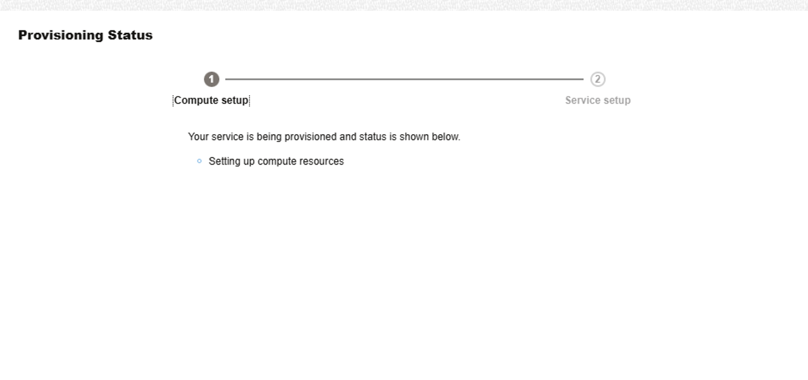
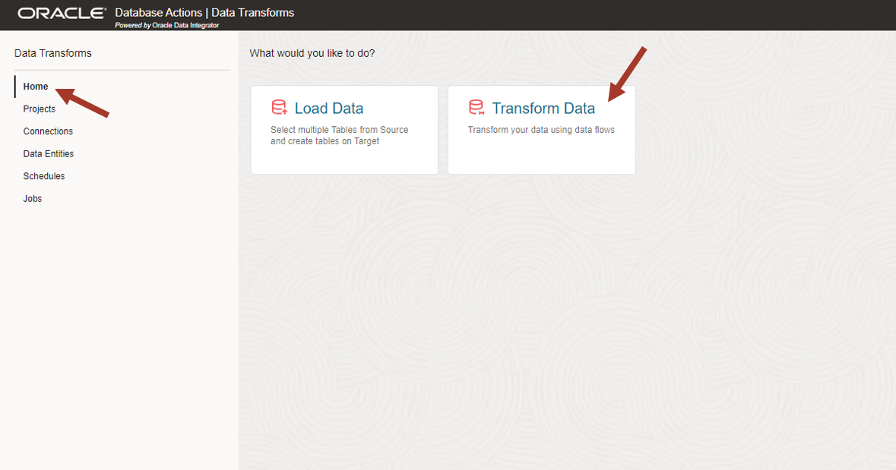
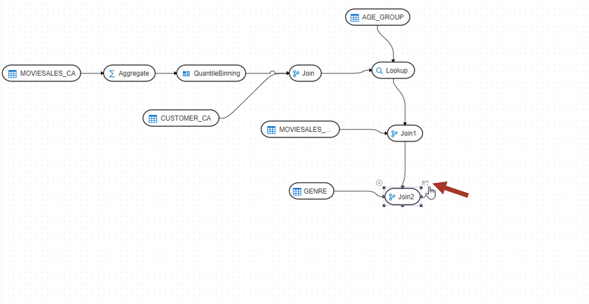
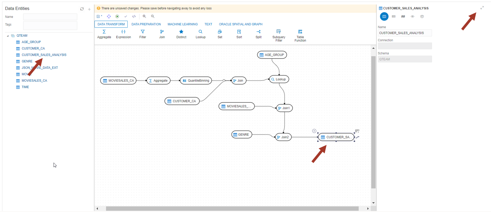
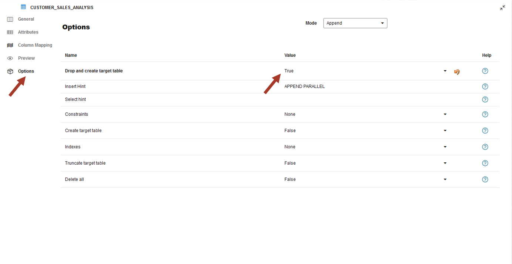
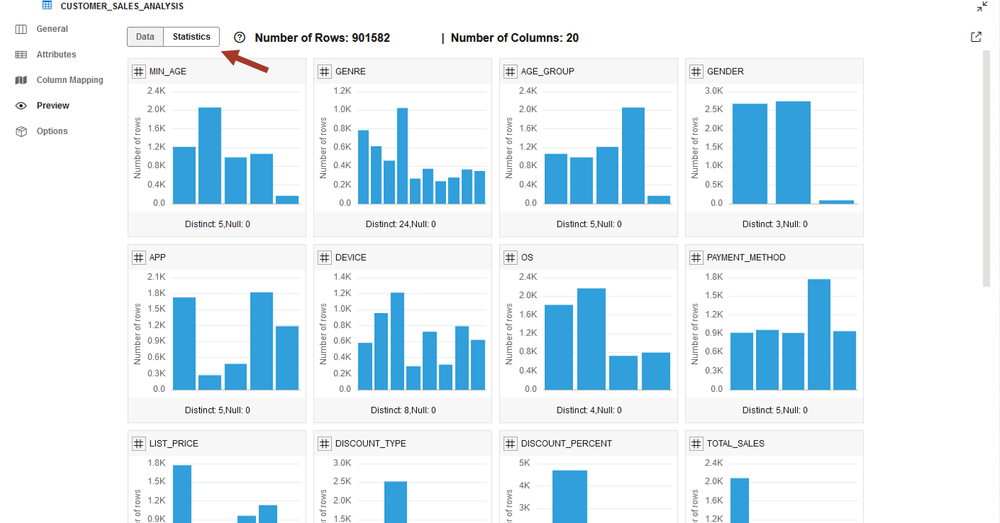
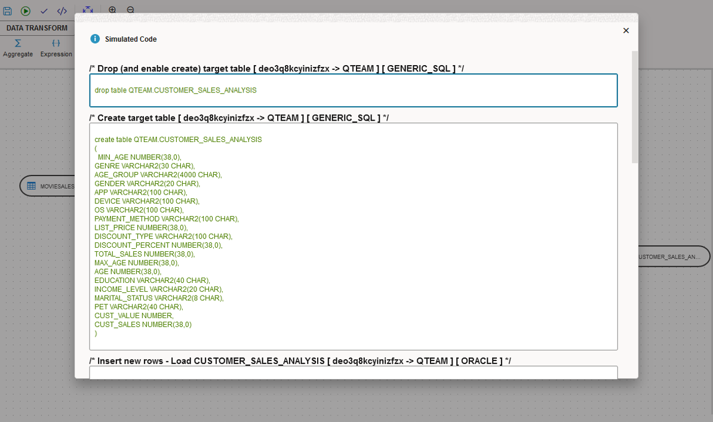

# Using Data Transforms to prepare data for analysis


## Introduction

This lab introduces the Data Transforms application built into the Oracle Autonomous Database and shows the various ways you can prepare data for analysis.

### Prerequisites

To complete this lab, you need to have completed the previous labs, so that you have:

- Created an Autonomous Data Warehouse instance
- Created a new QTEAM user with appropriate roles
- demo data loaded
- Age group data loaded

### Demo data for this lab
**NOTE**: Skip this section if you have demo data loaded and completed previous labs.

If you have not completed previous labs then make sure you have loaded the demo data
in the first lab and then create remaining objets by running the following script in SQL Worksheet.

*For copy/pasting, be sure to click the convenient __Copy__ button in the upper right corner of the following code snippet*: 

```
My SQL line 1;
SQL line 2;
```

Paste the sql statements in SQL worksheet and run the scripts

Now you are ready to go through rest of the labs in this workshop.

## Task 1: Launch Data Transforms

For this lab we will try to find high value customers. We can use sales data to assign
customer value. We can rank the customers into five quintiles based on
how much they have paid for movies and load into a new
**CUSTOMER_SALES_ANALYSIS** table.

We will also denormalized this table with interesting customer
attributes for analysis from **CUSTOMER_CA, AGE_GROUP** and **GENRE**
table.

This is an example of preparing data for an intended purpose. Our
purpose is to find high value customers and find any patterns in the
sales data by analyzing it.

Transform Data tool makes such data preparation tasks easy.

1.  Click on DATA TRANSFORMS card to launch the tool.

    NOTE: If you don't see the DATA TRANSFORMS card then it means you are
    missing DATA_TRANSFORM_USER role for your user. Login as ADMIN and
    grant the role (make sure this role is marked "Default" as well).



2.  Provide username and password for the database user QTEAM.


3.  You will see a provisioning screen like below.



4.  It will take up to 3 minutes for the service to be provisioned. Once
    provisioned you will see the following home screen.

    Note: Data Transforms tool is provisioned based on demand. If there is
    inactivity for 15 minutes, then it goes into sleep mode and needs to
    be provisioned again. Clicking on any part of the UI will provision it
    again if it has gone into sleep mode. If you get any error, then
    refresh your browser.


## Task 1: Setup Connection

1.  Click on **Connections** on the left side to look at available
    connections.


2.  You will notice that there is one connection already defined. Click
    on the connection to establish the connection. This is one time
    activity.


3.  Enter username and password and click on Test Connection. After
    successful connection (notification message will appear on top
    right).


4.  If the notification message disappears then you can get it back by
    clicking on the bell icon on the top right. Throughout this tool you
    will have notification messages available by clicking on the bell
    icon.


Note: In this workshop we are working with only the data available in
our Autonomous Database, but you can create connections to other
databases, object stores and applications as well and load and transform
data from those sources to your Autonomous Database. Data Transforms is
a complete tool for complex data integration projects.

Note: Any database user who has DATA_TRANSFORM_USER role, can access the
connection setup in this step (and any other connections or data flows
created later). All the objects created in the Transforms are also
shared with other users with this role. Because of this you need to be
very selective on giving out this role.

Now we are ready to prepare the data.

## Task 1: Create data flow to load customer sales analysis table

1.  Click on the **Home** button on the left side to go back to the home
    screen. You have wizards to load data from other sources (as defined
    in connections) and to transform data. Since our data is already
    loaded in our Autonomous Database in the previous lab, we will click
    on the **Transform Data** wizard.



2.  Enter name and description of data flow.

    Name: **load_customer_sales_analysis**
    
    Description: **Load customer sales table with quintiles and other
    attributes**
    
    A good description helps you understand the objective of the data
    flow.
    
    Since we are working on this tool for the first time, we don't have a
    project. Click on + to create a project. Accept the default name for
    project name.
    
    Click **Next**.


3.  Select the only connection from the dropdown list and pick **QTEAM**
    from the schema drop down list.\
    \
    Click on **Save**.


4.  This will bring up data flow editing screen. On the left side you
    will see message as "Importing Data Entities" next to **QTEAM**
    user. It will take approximately 2-3 minute to import all data
    entity definitions and then message will disappear.

You can also refresh the data entities any time with the refresh icon.


5.  Now let us learn how to navigate in the data flow editing screen.
    Refer to the numbered zones in the screenshot.

    1: Main editing canvas to create data flow by combining various
    transforms
    
    2: Data Entity browser. Data Entities can be used as a source or
    target for the data flow. You can add more connections by clicking on
    the + icon (we don't need to) and filter entities by name or tag if
    the list is big. Entities are dragged into the main canvas to build a
    data flow.
    
    3: List of transformations grouped under various buckets. Click on
    different buckets to see what kind of transforms are available. Basic
    transforms are under **DATA TRANSFORM** and **DATA PREPARATION**
    bucket. These transforms are dragged into the main canvas to build a
    data flow.
    
    4: Properties: By clicking on any source/target entity or on a
    transform step, you can view and edit various properties.
    
    5: Save, validate, and execute. We can also schedule the execution
    from in built scheduler.
    
    6: When you click on the empty part of the main canvas then it gives
    you execution status of the data flow.


6.  Now we are ready to build the data flow. We want to aggregate the
    sales per customer to create 5 quintile buckets to determine
    customer value.

    First, we will drag **MOVIESALES_CA** into the canvas and drag
    **Aggregate** transform from above under **DATA TRANSFORM** bucket.
    Also drag **QuintileBinning** transform into the canvas. This
    transform is in **DATA PREPARATION** bucket above.
    
    There are many transforms available under different buckets to build
    the desired data flow. For this workshop, we will use few of them.
    
    This should like below.


7.  Click on **MOVIESALES_CA,** and Link it to the **Aggregate**
    transform by dragging the little arrow on top of the **Aggregate**
    transforms. Follow this process to link transform steps in the rest
    of the workshop.


8.  Now let's edit the properties of the aggregate transform. Click on
    the aggregate transform and then click on the attribute icon on the
    right-side properties panel. You should also expand the properties
    panel by clicking on the extreme right corner icon.

Use this process to edit properties for the transforms for the remaining
of the workshop.


9.  Click on Attributes on the left side. You can edit this attribute
    list. We will remove everything except **CUST_ID** and
    **TOTAL_SALES**. Click on the checkbox and click delete icon on the
    right side.


10. Now change the name of **TOTAL_SALES** to **CUST_SALES** to make it
    more meaningful. This will be aggregated sales for the customer. It
    should look like below.


11. Now click on Column mapping on the left side to define aggregate
    expression. You can populate these expressions by **Auto Map** and
    edit it as needed. Click on **Auto Map** to populate it by name.


12. Auto Map populated only the CUST_ID and could not find a match for
    CUST_SALES since we had changed the attribute name. We can either
    type in the aggregate expression directly in the blank space or use
    the expression editor on the right side. Click on the expression
    edition icon.


13. This will open the expression editor. You can drag source attributes
    from the left side in the editor and write a suitable expression.

Enter the following expression: **SUM ( MOVIESALES_CA.TOTAL_SALES )**

Click **OK**


14. Review the screenshot below. **CUST_SALES** attribute is mapped to
    the sum of **TOTAL_SALES** grouped by **CUST_ID**.

Now collapse the properties panel by clicking on icon on the right
corner.

You will follow similar process for editing the properties in the rest
of the workshop.


15. Now link the aggregate transform to the QuintileBinning transform,
    click on the QuintileBinning transform and open the properties
    panel.


16. In the Attribute section, click on the **OUTPUT1**.

Change the name **Return** to **CUST_VALUE**. QuintileBinning output
will go into **CUST_VALUE** attribute.

Confirm that you have changed the name.


17. Click on the Column Mapping and enter 5 for the **number of
    buckets** expression. Drag **CUST_SALES** from aggregate into the
    **order** expression.

    **It means that aggregate customer sales will be used to divide
    customers into 5 buckets. This will be used as customer value.**


18. Close the property panel by clicking on the right corner and come to
    the main canvas.

    Now you have the basic skills to add data sources, add transforms, and
    edit its properties. Now bring **Join** transform into the canvas,
    drag **CUSTOMER_CA** table and join it with previous flow as below.
    
    Click on the Attribute property of the Join and notice that it has
    populated the join automatically. You can also edit it manually if it
    is not what you expect.
    
    Make sure the join is: **Aggregate.CUST_ID=CUSTOMER_CA.CUST_ID**


19. Now bring in **AGE_GROUP** table and use Lookup transform. Link it as
    below.

    First link the end of the data flow to Lookup and then link **AGE_GROUP** to lookup.

    Make sure lookup expression is: **CUSTOMER_CA.AGE between
    AGE_GROUP.MIN_AGE and AGE_GROUP.MAX_AGE**
    
    Note that you can also optionally use the expression editor.
    
    **Take a moment to notice that we are building the data flow step by
    step and this way it is easy to understand. This is an advantage of
    using UI to define a complete data preparation task which could be
    quite complex.**


20. Now we need to bring in the transaction data again which will be
    used for analysis later. Drag **MOVIESALES_CA** into the canvas and
    join it.

    Make sure the join is: **Aggregate.CUST_ID=MOVIESALES_CA1.CUST_ID**
    
    **NOTE: Notice that the display name for this is MOVIESALES_CA1
    (suffixed by 1). This is because this table is used twice in the data
    flow. First for calculating the quintile and the second time to bring
    individual sales transaction data.**
    
    Also bring in movie GENRE table and join it.
    
    Make sure the join is: **MOVIESALES_CA1.GENRE_ID=GENRE.GENRE_ID**
    
    The above join expression should be populated automatically.
    
    It should look like below.
    
    It is good practice to keep saving it by clicking on the **Save** icon
    on the top left.


21. We have completed the data flow. It may look complex, but one can
    visualize it step by step transformations. Now we need to write it
    to a new **CUSTOMER_SALES_ANALYSIS** table.

    Click on the tiny grid at the corner to the end of the data flow (last
    Join transform) to open the target table property dialog. Note that if
    we already had a target table then we could simply drag that table in
    to complete the flow. But in our case, the target table doesn't exist
    yet.



22. Enter the name and connection properties.

    Name: **CUSTOMER_SALES_ANALYSIS**
    
    Alias: **CUSTOMER_SALES_ANALYSIS**
    
    Connection:your connection name    
    
    Schema:**QTEAM**
    
    Click **Next** for **Add Data Entity** dialog


23. Now you can edit the target column names. The initial list is
    populated by the columns in all the tables in the data flow.

    Remove the columns ending with \_ID. They don't help in any meaningful
    analysis. The attributes are always denormalized by the joins. Click
    on the checkbox and then click on the delete icon on top right.
    
    Click **Next**


24. Review the columns. You can go back to make any changes. If you
    accidently removed a column and want it back then you can add it
    manually if you know the name and data type, or you can cancel it
    and redo the process again.

Click **Save**


25. You can see that the target table is added to the end of the data
    flow.

    Also note that the target table definition has been stored in
    transforms and if you want to recreate/edit the data flow then it will
    be available on the left side for drag and drop, instead of going
    through **Add Data Entity** dialog.
    
    Now we need to make sure target load properties are correct. Click on
    the target table in the canvas and expand the property panel by
    clicking on the top right corner.



26. Click on Attributes mapping and verify the expressions. Notice that
    all have been populated properly. You can also edit them manually if
    you want to make changes. Make sure all the columns are mapped. You
    can also use auto mapping functionality if you have create new
    attributes.


27. Now to the final step. Click of **Options**.

    Make sure you have the **Drop and create target table** is **true**.
    
    This makes sure that you always have the correct definition.
    
    You can also choose to load data into existing table with or without
    truncating. Data can also be loaded incrementally. These are advanced
    modes. For now we will simply drop and create the table in every
    execution.



28. Collapse the property panel and go back to the main canvas. Save it
    and validate it by clicking on the validate icon (looks like small
    check mark).


29. Now execute it by clicking on the small triangle in the circle.
    Confirm **Start**.


30. Data flow execution status is on the bottom right-side panel. Click
    anywhere on the empty canvas to make it visible. Now we need to look
    at the data.


31. Click on the target table and do the data preview by clicking on
    small eye icon. Expand the panel to see more.


32. Check that all columns are populated. If some columns are blank,
    then it means some mapping expression in the data flow was blank or
    incorrect. Go back and fix it and re-execute it.


33. Also check the **Statistics** tab for quick data profile.



For now, it is just a cursory data glance. Next, we will use **DATA
ANYSIS** tool to analyze this data and find many interesting patterns.

**Important note on this lab:**

We have scratched only the surface of possibilities in Data Transforms.
Other features are:

-   Verity of data sources: Databases, Object Store, REST API and Fusion
    Application

-   Load Data: Loading multiple tables in a schema from another data
    source. It integrates with Golden Gate data service for advanced
    replication. This completes the Data Load tool explored in earlier
    lab.

-   Work flow: Combining various data flows in sequential or parallel
    execution flow.

-   Schedule: In built scheduler for periodic execution.

## Task 4: For Advanced users: How to debug

**Note: skip if you don't have any errors and you want to straight go to
the next task.**

1.  Go back to data flow canvas and click on the empty space in the
    canvas. On the top there is Code Simulation icon. Click on it. This
    will show you the code to be generated.


2.  Look at the generated SQL. Imagine writing this SQL without the
    graphical interface. Still some advanced users might find this
    useful for debugging purposes.



3.  Now look at the **Data flow Status** on the right side. If there are
    any errors, then you can click on the **Execution Job** in the
    **Data Flow Status** panel to debug. It will take you to the jobs
    screen where you can look at the executed steps, processed row
    counts and corresponding SQL.


4.  Notice different steps in the execution. You can also get the
    executed SQL (as opposed to simulated SQL seen earlier) by clicking
    on the step.
    
    To go back to your data flow, click on the **Design Object** link.
    
    From anywhere in the UI, you can go back to Home screen by clicking on
    the top left link.


There are many more features to explore for the advanced users. In this
workshop we are limiting to creating a data flow and executing it on
demand.

