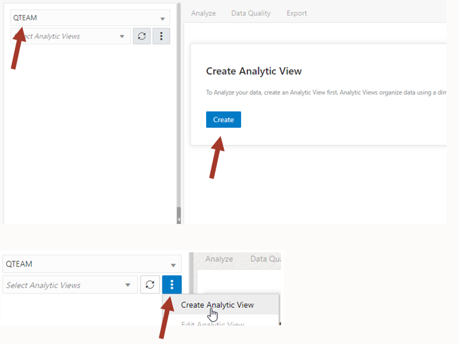
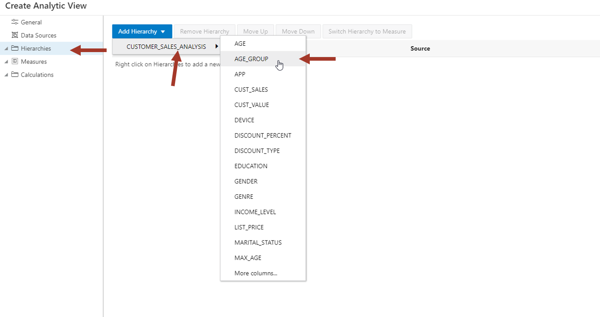
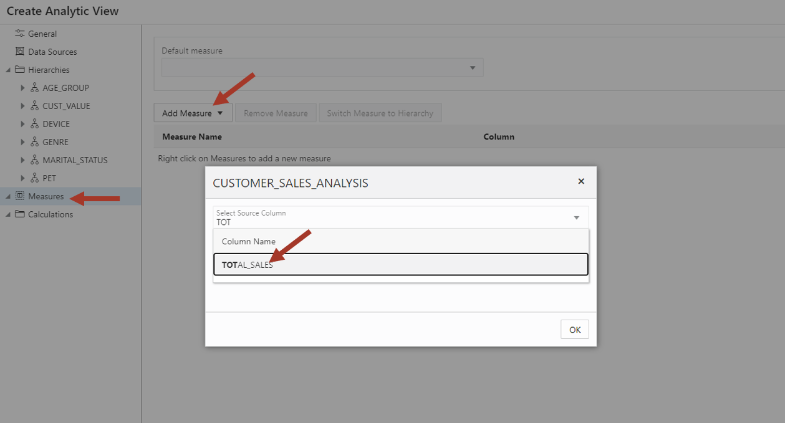
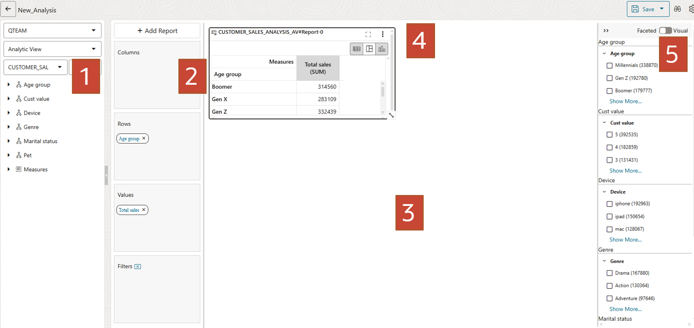
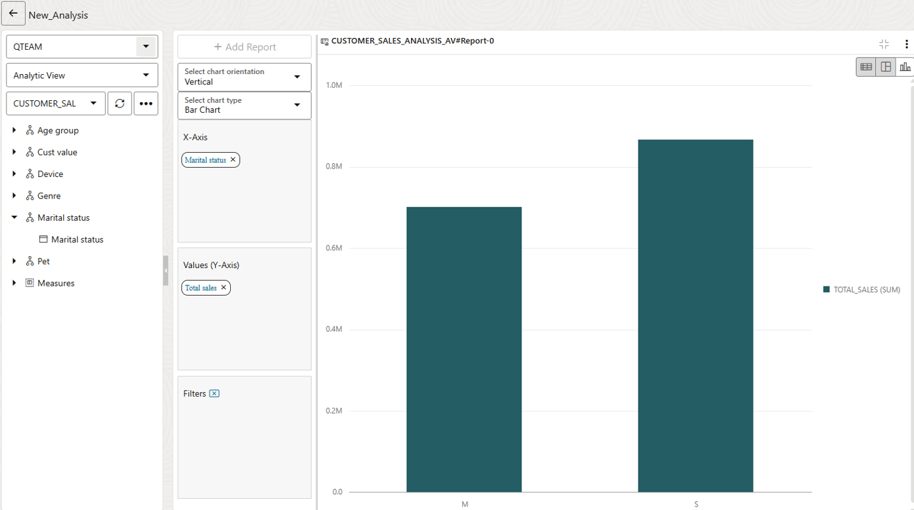
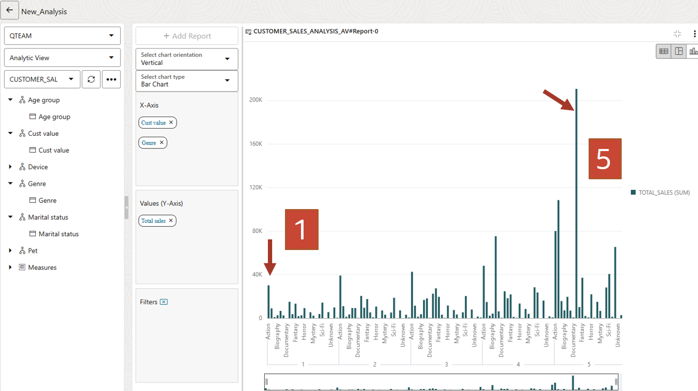

# Using Data Analysis to analyze your data


## Introduction

This lab introduces the Data Analysis application built into the Oracle Autonomous Database and shows the various ways you can analyze your data.

### Prerequisites

To complete this lab, you need to have completed the previous labs, so that you have:

- Created an Autonomous Data Warehouse instance
- Created a new QTEAM user with appropriate roles
- demo data loaded
- Age group data loaded
- Prepared data load into CUSTOMER_SALES_ANALYSIS

### Demo data for this lab
**NOTE**: Skip this section if you have demo data loaded and completed previous labs.

If you have not completed previous labs then make sure you have loaded the demo data
in the first lab and then create remaining objets by running the following script in SQL Worksheet.

*For copy/pasting, be sure to click the convenient __Copy__ button in the upper right corner of the following code snippet*: 

```
drop table CUSTOMER_SALES_ANALYSIS;

create table CUSTOMER_SALES_ANALYSIS
(
  MIN_AGE NUMBER(38),
GENRE VARCHAR2(30 CHAR),
AGE_GROUP VARCHAR2(4000 CHAR),
GENDER VARCHAR2(20 CHAR),
APP VARCHAR2(100 CHAR),
DEVICE VARCHAR2(100 CHAR),
OS VARCHAR2(100 CHAR),
PAYMENT_METHOD VARCHAR2(100 CHAR),
LIST_PRICE NUMBER(38),
DISCOUNT_TYPE VARCHAR2(100 CHAR),
DISCOUNT_PERCENT NUMBER(38),
TOTAL_SALES NUMBER(38),
MAX_AGE NUMBER(38),
AGE NUMBER(38),
EDUCATION VARCHAR2(40 CHAR),
INCOME_LEVEL VARCHAR2(20 CHAR),
MARITAL_STATUS VARCHAR2(8 CHAR),
PET VARCHAR2(40 CHAR),
CUST_VALUE NUMBER,
CUST_SALES NUMBER(38)
);

INSERT 
  /*+  APPEND PARALLEL  */ 
  INTO CUSTOMER_SALES_ANALYSIS
  (
    MIN_AGE ,
    GENRE ,
    AGE_GROUP ,
    GENDER ,
    APP ,
    DEVICE ,
    OS ,
    PAYMENT_METHOD ,
    LIST_PRICE ,
    DISCOUNT_TYPE ,
    DISCOUNT_PERCENT ,
    TOTAL_SALES ,
    MAX_AGE ,
    AGE ,
    EDUCATION ,
    INCOME_LEVEL ,
    MARITAL_STATUS ,
    PET ,
    CUST_VALUE ,
    CUST_SALES 
  ) 
SELECT 
  AGE_GROUP.MIN_AGE ,
  GENRE_1.GENRE ,
  AGE_GROUP.AGE_GROUP ,
  CUSTOMER_CA.GENDER ,
  MOVIESALES_CA1.APP ,
  MOVIESALES_CA1.DEVICE ,
  MOVIESALES_CA1.OS ,
  MOVIESALES_CA1.PAYMENT_METHOD ,
  MOVIESALES_CA1.LIST_PRICE ,
  MOVIESALES_CA1.DISCOUNT_TYPE ,
  MOVIESALES_CA1.DISCOUNT_PERCENT ,
  MOVIESALES_CA1.TOTAL_SALES ,
  AGE_GROUP.MAX_AGE ,
  CUSTOMER_CA.AGE ,
  CUSTOMER_CA.EDUCATION ,
  CUSTOMER_CA.INCOME_LEVEL ,
  CUSTOMER_CA.MARITAL_STATUS ,
  CUSTOMER_CA.PET ,
  MOVIESALES_CA_1.COL ,
  MOVIESALES_CA_1.CUST_SALES  
FROM 
  ((((
SELECT 
  MOVIESALES_CA.CUST_ID AS CUST_ID ,
  SUM ( MOVIESALES_CA.TOTAL_SALES ) AS CUST_SALES ,
  NTILE(5) OVER ( ORDER BY (SUM ( MOVIESALES_CA.TOTAL_SALES ))) AS COL   
FROM 
  MOVIESALES_CA MOVIESALES_CA  
GROUP BY
  MOVIESALES_CA.CUST_ID 
  ) MOVIESALES_CA_1  INNER JOIN  CUSTOMER_CA CUSTOMER_CA  
    ON  MOVIESALES_CA_1.CUST_ID=CUSTOMER_CA.CUST_ID
     )  LEFT OUTER JOIN  AGE_GROUP AGE_GROUP  
    ON  CUSTOMER_CA.AGE between  AGE_GROUP.MIN_AGE and  AGE_GROUP.MAX_AGE
     )  INNER JOIN  MOVIESALES_CA MOVIESALES_CA1  
    ON  MOVIESALES_CA_1.CUST_ID=MOVIESALES_CA1.CUST_ID
     )  INNER JOIN  GENRE GENRE_1  
    ON  MOVIESALES_CA1.GENRE_ID=GENRE_1.GENRE_ID
;

```

Paste the sql statements in SQL worksheet and run the scripts

Now you are ready to go through rest of the labs in this workshop.

## Task 1: Create AV for data analysis

We have movie sales, movie genre and age group data. We also have customer value 
information. We will analyze this data set. 

We will go through few examples such as movie genre 
preference based on age groups and marital status and whether these
preferences are different across high value and low value customers.

1.  Navigate to Database Actions page and launch DATA ANALYSIS tool.


2.  First time when you access data analysis tool, you will see a
    guiding wizard that will describe various parts of the UI. Since you
    are doing this lab anyways, click on X to cancel it and start using
    the tool right away.


3.  To Analyze your data, create an Analytic View (AV) first. Analytic
    Views organize data using a dimensional model, allowing you to
    easily add aggregations and calculations to data sets and present
    data in views that can be queried with relatively simple SQL.

    We don't have any AV yet, therefore we are going to create one.
    
    Select your schema QTEAM and click on **Create** button.



4.  Default AV name is derived by the fact table. Enter various fields
    as follows:

    Name: **CUSTOMER_SALES_ANALYSIS_AV**
    
    Caption: **Customer sales analysis av**
    
    Description: **Customer sales analysis av**
    
    Schema: **QTEAM**
    
    Fact Table: Pick **CUSTOMER_SALES_ANALYSIS** from the list
    
    You can find related tables and hierarchies by clicking on **Generate
    Hierarchy and Measures** button. This will scan your schema and find
    all the tables related to CUSTOMER_SALES_ANALYSIS and give you a
    starting point.
    
    However, in our case, we have prepared the data in such a way that all
    analysis attributes are in one table. We don't need to run this
    automated process.


5.  Now click on Data Sources on left side to verify that
    CUSTOMER_SALES_ANALYSIS is the data source.


6.  Now click on the Hierarchies on the left side and add the attributes
    we want in our analysis. We want to add **AGE_GROUP, CUST_VALUE,
    DEVICE, MARITAL_STATUS, GENRE,** and **PET**. It will be interesting
    to do movie preference analysis with pets.
    
    NOTE: These are all single level hierarchies. Adding multiple level
    hierarchies is advanced topic and will not be covered. However, we will
    see that even with single level hierarchies, we can do interesting
    analysis.



7.  If you don't see your column, then click on More columns at the end
    at search for your columns. Then add it by clicking on it.


8.  After you add all, it should look like below.


9.  Now click on Measures and add a measure with TOTAL_SALES column



10. We have completed our AV. Click on **Create** it and confirm OK.


11. Our AV is ready now and we can start analyzing data. You can see
    that there are no errors. By clicking on the Data Quality tab.

    You can also go back and edit the AV by clicking on three vertical
    dots.


## Task 1: Analyze data

Now the fun part starts. All this time we were preparing the data and
creating dimensional model in AV. We will start creating reports, charts
and start finding hidden patterns in the data.

First let's learn how to navigate in the analysis tool.

1.  Select your AV and click on **Analyze**.

    These zones are:
    
    1: Hierarchies and measures
    
    2: Columns, Rows, Values and Filters where you can drag components
    from the zone 1 to slice and dice the data.
    
    3: Main area for displaying reports and charts.
    
    4: Table/Pivot/Chart view. For remainder of the lab we will use chart
    view.
    
    5: Insights. Automated algorithm to search for hidden patterns. This
    is the topic of our last lab. For now, we will click on the right side
    bar to collapse it.



2.  Now we can start doing our first analysis.

    **Analysis: show me \"SALES_AMOUNT\" by \"AGE_GROUP\"**
    
    Select chart mode. Clear all hierarchies from X-Axis and drag **Age
    group** to X-Axis and **Total Sales** to Y-Axis.
    
    This chart is showing you total sales across age group. We can
    conclude that seniors (71-80) are not watching many movies whereas age
    group 21-30 and 31-40 are watching most.


3.  Next let us analyze sales by marital status.

    Clear X-Axis and drag **Marital status**.
    
    You will have to expand the left side tree node to drag the level.
    Level is under hierarchy node (with the same name for convenience).
    
    We can see that singles are watching more movies than married people.



4.  Now we can mix two hierarchies. Drag **Age group** above **Marital
    status** in X-Axis. 

    Make sure **Age group** is on top of **Marital status**.

    We notice that although singles watch overall more movies, married
    people watch more than singles in young age group (21-30, 31-40).
    
    This was not obvious before.


5.  Now we are curious to know which genre sells most.

    Clear X-Axis and drag **Genre**.
    
    Drama Sells! Followed by Action.


6.  We had earlier ranked our customers in high and low value buckets.
    It will be interesting to find out whether there is a movie genre
    preference of high value customers.

    Clear X-Axis and drag **Genre** and **Cust value**. Make sure **Cust value** is 
    on the top.
    
    The chart is very wide, and you can't see all the way to the right. To
    fit the entire width you can drag the right edge of lower window
    towards right till all customer values are visible in one page. If 
    you don't see the lower window then zoom out on the browser with CTRL -.


7.  Let's look at this chart. We can see that Drama is very popular with
    high value (Cust value=5) customers, whereas Action is more popular
    with low value customers (Cust value=1).

    Of course, most of the bars are taller for high value customers
    because overall they spend more.



Go ahead and see if you can find any other interesting pattern. What
movie genre are popular in different age groups?

We can spend lots of time in the analysis tool visualizing the data with
different combinations of attributes.

So far, we are looking at only the charts, but this data can be
displayed in tabular format and in a pivot table as well. Switch the
display mode to see how it works. Advanced uses can access the data in
this AV from Excel or from Googlesheet. This is out of scope for this
lab.

