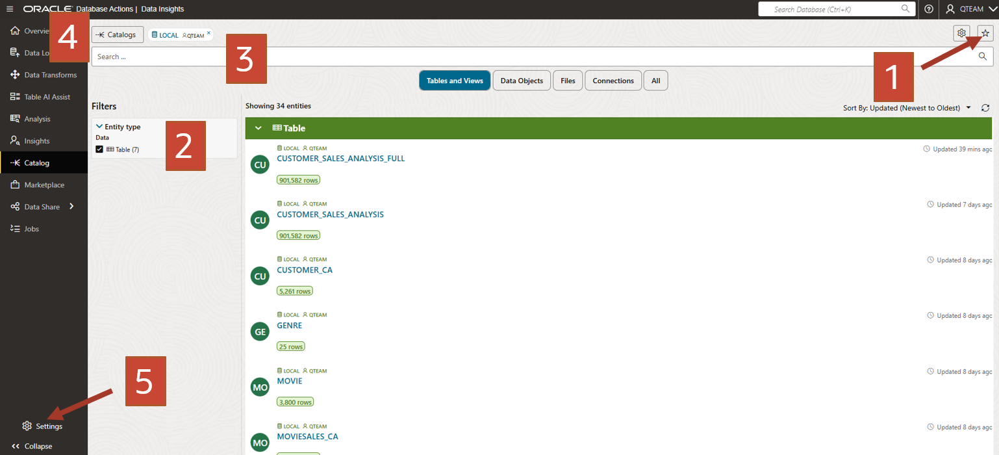
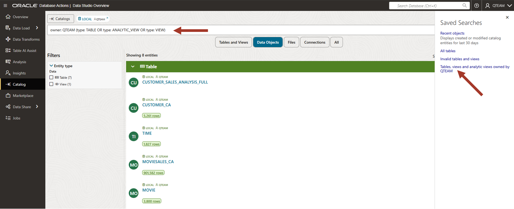
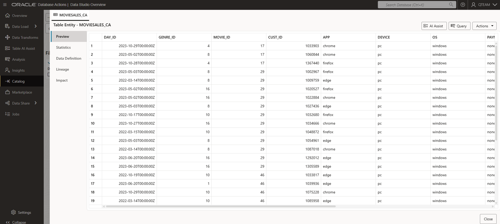
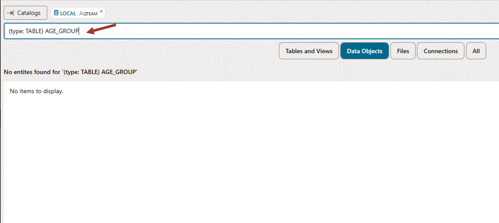

# Browse for your objects

## Introduction

This lab introduces the Catalog application built into the Oracle Autonomous Database and shows the various ways you can browse and search for your objects.

Estimated Time: 5 minutes

Watch the video below for a quick walk-through of the lab.
[Browse Catalog](videohub:1_s2t3xdyj)

### Objectives

In this workshop, you will learn:
-	How to browse the catalog and find the data you need

### Prerequisites

To complete this lab, you need to have completed the previous labs, so that you have:

- Created an Autonomous Data Warehouse instance
- Created a new QTEAM user with appropriate roles
- Loaded the demo data

## Task 1: Data Studio overview

1.  If you are already logged in then click on the **Database Actions** link on the top left. If not, then log in to the
    Autonomous Database created earlier with your user and password. You can see various tools under Data Studio.

    >**Note:** Bookmark the Database Actions page so that it is easier to come
    back to this later in the workshop.
    
    Look at the various tools under Data Studio section. We will go through some of these tools in this overview workshop and learn how to use them in our day today job.

    Click on the **Data Studio Overview** card.

    

2.  It shows the list of recent objects. On the left and on top, it
    has links to individual tools and on the right, links to
    the documentation.

    

Since it is a workshop, there are limited objects on the list. We will
use the Catalog tool to browse the objects and find what we need.

## Task 2: Explore the catalog

1.  Click on the Catalog link on the left panel.

    A typical database will have many objects and you need various
    ways to search and display objects. Various ways to navigate a catalog
    are shown by marked numbers in the screenshot. These are:
    
    1: Saved searches. You can filter objects easily with one click and
    then refine the search further as per need.
    
    2: Filters to narrow down your search.
    
    3: Various display modes. Card/Grid/List view.
    
    4: Search bar where you can type in the advanced search query

    

2.  Note that the catalog shows all types of objects. We are interested in
    only the tables for now. Click on "Tables, views and analytic views
    owned by..." on the right zone 1.

    You can see the MOVIESALES\_CA in this list. We are interested in this
    table since we were told that this table contains movie sales
    transaction data. (Referring to the meeting notes in the introductory
    section of this workshop).
    
    You could explicitly search for MOVIESALES\_CA by typing the name of
    the table in the search bar but in our case, it is visible in
    the grid view in the middle.

    

3.  Click on the MOVIESALES\_CA table.

    You can see the data preview. You can scroll right to see more columns
    and scroll down to see more rows. You can also sort the columns by
    right-clicking on the columns. Using the data view, you can be sure
    that this is the data you want.
    
    Note that you also have other information such as
    lineage/impact/statistics/data definitions etc. This workshop is not
    going into the details. Detailed features will be explored in other
    workshops.
    
    Now close this view by clicking on the bottom right **Close** button.

    

4.  Look for the other tables of interest on the main catalog page.
    Recall from the meeting notes in the workshop's introduction that we are also interested in CUSTOMER\_CA and GENRE tables.

    You will also see CUSTOMER\_SALES\_ANALYSIS table which is empty. This table will be populated by the transforms tool later in this workshop.
    
    Find and click on these tables to do a data preview.

    

5.  We also need to find out whether age group information is present.

    Clear the search bar and enter the following search string:
    
    **(type: TABLE) AGE\_GROUP**
    
    This will search for all the tables with "AGE\_GROUP" in the name. We find no such table. For our workshop, we needed a table about various age groups. Since we could not find it in the catalog, we will have to load it into the database in the next lab.

    

## RECAP

In this lab, we used Catalog to search for the desired objects in the database. There are different 
ways to search for an object and display the search results. We learned how to see a preview of the data in a table. There are many more features in the Catalog tool, which are not covered here. These details will be covered in another in-depth workshop.

You may now **proceed to the next lab**.

## Acknowledgements

- Created By/Date - Jayant Mahto, Product Manager, Autonomous Database, January 2023
- Contributors - Mike Matthews, Bud Endress, Ashish Jain, Marty Gubar, Rick Green
- Last Updated By - Jayant Mahto, August 2023

Copyright (C)  Oracle Corporation.