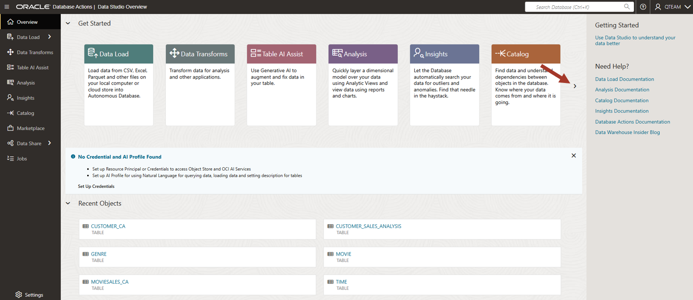
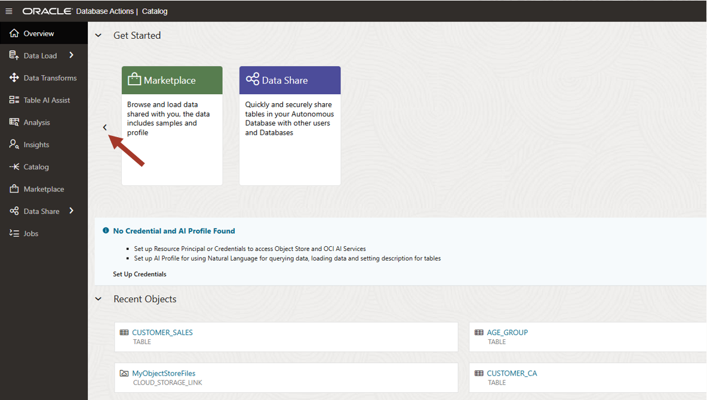
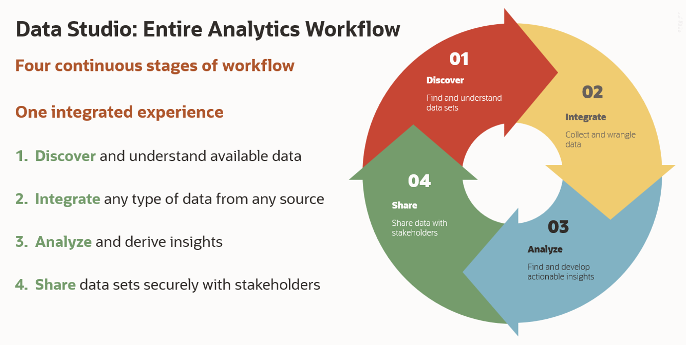

# Browse for your objects

## Introduction

This lab introduces Data Studio tools built into the Oracle Autonomous Database.

Estimated Time: 5 minutes

<!--
Watch the video below for a quick walk-through of the lab.
[Browse Catalog](videohub:1_s2t3xdyj)
-->

### Objectives

In this workshop, you will learn:
-	Various Data Studio tools built into Oracle Autonomous Database.

### Prerequisites

To complete this lab, you need to have completed the previous labs, so that you have:

- Created an Autonomous Data Warehouse instance
- Created a new QTEAM user with appropriate roles
- Loaded the demo data

## Task 1: Data Studio overview

1.  If you are already logged in then go to **Database Actions** page. If not, then log in to the Autonomous Database created earlier with your user and password. You can see various tools under Data Studio.

    >**Note:** Bookmark the Database Actions page so that it is easier to come
    back to this later in the workshop.
    
    Look at the various tools under Data Studio section. We will go through some of these tools in this overview workshop and learn how to use them in our day today job. 

    Click on **Data Studio Overview** under Data studio tools. 

    
    
    On the left and on top, it has links to individual tools and on the right, links to the documentation. 
    
    These are the tools available in Data studio:

    **Data Load**: Load data from CSV, Excel, Parquet and other files on your local computer or cloud store into Autonomous Database.

    **Data Transforms**: Transform data for analysis and other applications. You will also use this tool to load data from Oracle and 3rd party databases and applications.

    **Table AI Assist**: Use Generative AI to augment and fix data in your table.

    **Analysis**: Quickly layer a dimensional model over your data using Analytic Views and view data using reports and charts.

    **Insights**: Let the Database automatically search your data for outliers and anomalies. Find that needle in the haystack.

    **Catalog**: Find data and understand dependencies between objects in the database. Know where your data comes from and where it is going.

    **Marketplace**: Browse and load data shared with you, the data includes samples and profile.

    **Data Share**: Quickly and securely share tables in your Autonomous Database with other users and Databases

    Click on the right arrow to see more tools.

    
    
    Click on left arrow to go back.

    

    Data Studio provides tools for the entire analytics and AI/ML applications building workflow. 

    Data Studio can also save you time and reduce your costs. It can save you time, because it takes time to set up, integrate and learn how to use separate data integration, transformation, and analysis tools. Those tools are directly available in the Autonomous Database, ready to use.

    In this workshop we will focus on a subset of these tools. We will use **Catalog** tool to browse data sets and **Data Load** tool to load additional data. Then we will use **Data Transforms** tool to transform the data into our desired shape for analysis. Finally, we will use **Analysis** and **Insights** tools to analyzing the data.
    
    

## RECAP

Data Studio is a set of integrated, no-code data tools built into the Oracle Autonomous Database that enable users to easily load, transform, and analyze data, as well as build models and share them securely across an organization. It uses AI and natural language capabilities to simplify data management and analysis, eliminating the need for separate investments in data integration and analytics tools.

You may now **proceed to the next lab**.

## Acknowledgements

- Created By/Date - Jayant Mahto, Product Manager, Autonomous Database, January 2023
- Contributors - Mike Matthews, Bud Endress, Ashish Jain
- Last Updated By - Jayant Mahto, August 2025

Copyright (C)  Oracle Corporation.