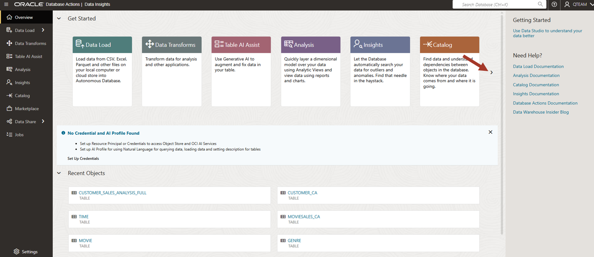

# Browse for your objects

## Introduction

This lab introduces Data Studio tools built into the Oracle Autonomous AI Database.

Estimated Time: 5 minutes

<!--
Watch the video below for a quick walk-through of the lab.
[Browse Catalog](videohub:1_s2t3xdyj)
-->

### Objectives

In this workshop, you will learn:
-	Various Data Studio tools built into Oracle Autonomous AI Database.

### Prerequisites

To complete this lab, you need to have completed the previous labs, so that you have:

- Created an Autonomous AI Database instance
- Created a new QTEAM user with appropriate roles
- Loaded the demo data

## Task 1: Data Studio overview

1.  If you are already logged in then go to **Database Actions** page. If not, then log in to the Autonomous AI Database created earlier with your user and password. You can see various tools under Data Studio.

    >**Note:** Bookmark the Database Actions page so that it is easier to come
    back to this later in the workshop.
    
    Look at the various tools under the Data Studio section. We will go through some of these tools in this overview workshop and learn how to use them in our day today job. 

    Click on **Data Studio Overview** under Data Studio. 

    
    
    On the left and on top, it has links to individual tools and on the right, links to the documentation. 
    
    These are the tools available in Data Studio:

    **Data Load**: Load data from CSV, Excel, Parquet and other files on your local computer or cloud store into Autonomous AI Database.

    **Data Transforms**: Transform data for analysis and other applications, and integrate data from Oracle and 3rd party databases and applications.

    **Jobs**: Create and schedule jobs to load and prepare data. 

    **Data Marketplace**: Browse and load curated data sets that have been shared with you, or share new data sets to the Marketplace.

    **Table AI Assist**: Use Generative AI to augment and fix data in your tables.

    **Catalog**: Find data and understand dependencies between objects in the database. Know where your data comes from and where it is going.

    **Data Insights**: Let the database automatically search your data for outliers and anomalies.

    **Data Analysis**: Quickly layer a dimensional model over your data using Analytic Views and view data using reports and charts.

    **Data Share**: Quickly and securely share tables in your Autonomous AI Database with other users and databases.

    Click on the right arrow to see more tools.

    
    
    Click on left arrow to go back.

    

    Data Studio provides tools for the entire analytics and AI/ML applications building workflow. 

    Data Studio can save you time and reduce your costs. Rather than having to pay for, set up, integrate and learn how to use separate data integration, transformation, and analysis tools, these tools are directly available in the Autonomous AI Database, ready to use.

    In this workshop we will focus on a subset of these tools. We will use **Catalog** tool to browse data sets and the **Data Load** tool to load data. Then we will use **Data Transforms** to transform the data into our desired shape for analysis. Finally, we will use **Data Analysis** and **Data Insights** to analyze the data.
    
    

## RECAP

Data Studio is a set of integrated, no-code data tools built into the Oracle Autonomous AI Database that enable users to load, transform, and analyze data, as well as build models and share them securely across an organization. It uses AI and natural language capabilities to simplify data management and analysis, eliminating the need for separate investments in data integration and analytics tools.

You may now **proceed to the next lab**.

## Acknowledgements

- Created By/Date - Jayant Mahto, Product Manager, Autonomous AI Database, January 2023
- Contributors - Mike Matthews, Bud Endress, Ashish Jain
- Last Updated By - Jayant Mahto, August 2025

Copyright (C)  Oracle Corporation.