# Browse and load the additional data set

## Introduction

This lab introduces the Catalog and Data Load tools of Data Studio, and shows how to discover and load a new data set from connected cloud storage.

Estimated Time: 10 minutes

<!--
Watch the video below for a quick walk-through of the lab.
[Create a database user](videohub:1_xnrr084w)
-->

### Objectives

In this workshop, you will learn:
- How to browse and search for the data set you need
- How to load data from an object store

### Prerequisites

To complete this lab, you need to have completed the previous labs, so that you have:

- Created an Autonomous AI Database instance
- Created a new QTEAM user with appropriate roles
- Loaded the demo data

## Task 1: Where is your data?

Data and its management is the foundation of any data analysis project. To enable analytics, data sets can either be loaded into the Autonomous AI Database or linked to it.

Data Studio provides tools to help you connect and discover data that may be useful for analysis, and to load or link the data.

Use the **Catalog** to connect to cloud storage systems, other databases, shares, and external data catalogs, so that you can browse, discover and in many cases immediately use any of the data available in them.

Use the **Data Load** tool to load or link data from the catalog, or from local files.
   
Use the **Data Transforms** tool to integrate data from other databases and applications. 

In this workshop, we will show you how to discover and load data from connected cloud storage using the Catalog and Data Load tools.

## Task 2: Explore the catalog

1.  Click on the Catalog card from Data Studio overview.

    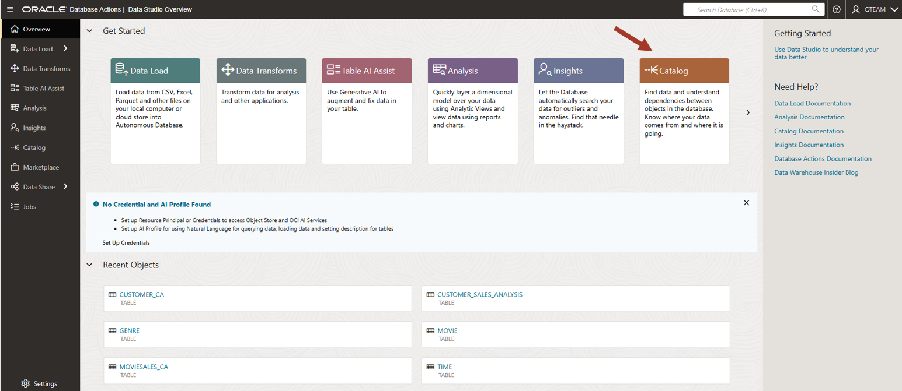

    The catalog provides a way to search for and discover data both in your Autonomous AI Database and in a wide range of other connected systems, including other Autonomous Databases, connected on-premises databases, cloud storage data, shared data, and external data catalogs. 

    The catalog UI allows you to add catalogs to connect to additional systems, and then browse and search for data either in a catalog, or across many catalogs.
    
    Various ways to navigate a catalog are shown by marked numbers in the screenshot. These are:
    
    1. Saved searches. You can filter objects easily with one click and
    then refine the search further as per need.
    
    2. Filters to narrow down your search.
    
    3. Search bar.
    
    4. Quick access to Data Studio overview and other tools.

    5. In Settings you can configure an AI Profile. Data studio can make use of AI Profiles to help identify Personally Identifiable data, add table descriptions, create new columns with natural language prompts, and much more. 

    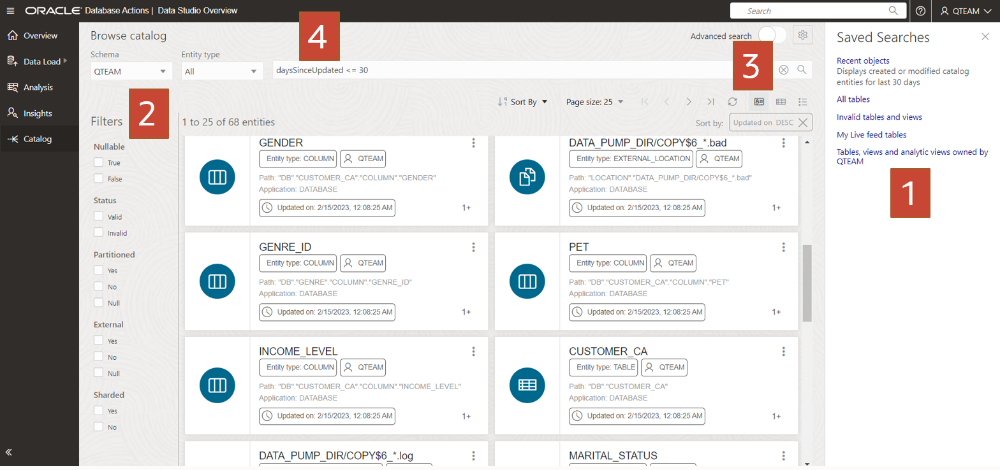

2.  Note that the catalog can search and list many types of object, including tables, views, cloud storage files, other Autonomous Databases, and more. We first want to understand the tables that exist in our connected Autonomous AI Database, so check that **Tables and Views** is selected in the middle of the screen. 

    You can see the MOVIESALES\_CA in this list of tables. We are interested in this
    table since we were told that this table contains movie sales
    transaction data. (Referring to the meeting notes in the introductory
    section of this workshop).
    
    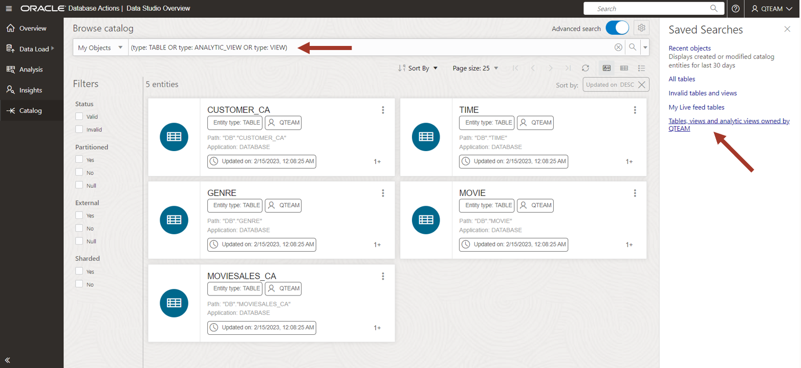

3.  Click on the MOVIESALES\_CA table.

    You can see the data preview. You can scroll right to see more columns
    and scroll down to see more rows. You can also sort the columns by
    right-clicking on the columns. Using the data view, you can be sure
    that this is the data you want.
    
    Note that you also have other information such as
    lineage/impact/statistics/data definitions etc. This workshop is not
    going into the details. Detailed features will be explored in other
    workshops.
    
    Now close this view by clicking on the bottom right **Close** button.

    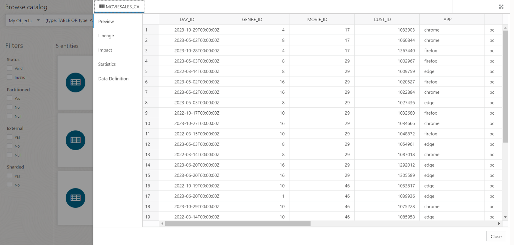

4.  Look for the other tables of interest on the main catalog page.
    Recall from the meeting notes in the workshop's introduction that we are also interested in CUSTOMER\_CA and GENRE tables.

    You will also see CUSTOMER\_SALES\_ANALYSIS\_FULL table which is empty. This table will be populated by the Data Transforms tool later in this workshop.
    
    Find and click on these tables to look at a data preview and understand the data.

    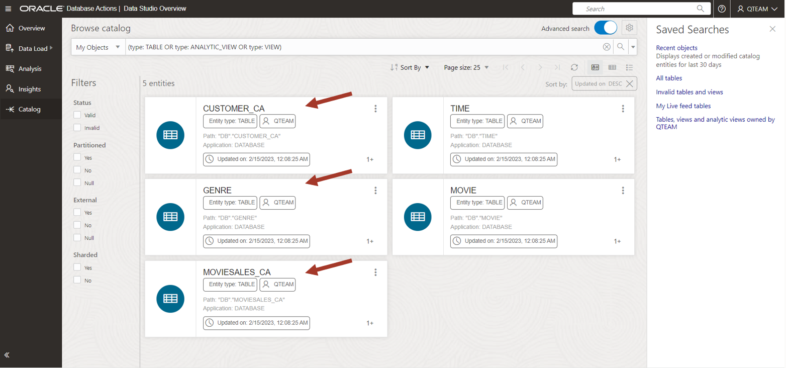

5.  We also need to find out whether age group information is present.

    Clear the search bar and enter the following search string:
    
    **age**
    
    This will search for all the tables with "AGE" in the name. We find no such table. For our workshop, we needed a table about various age groups. Since we could not find it in the catalog, we will have to load it into the database in the next lab.

    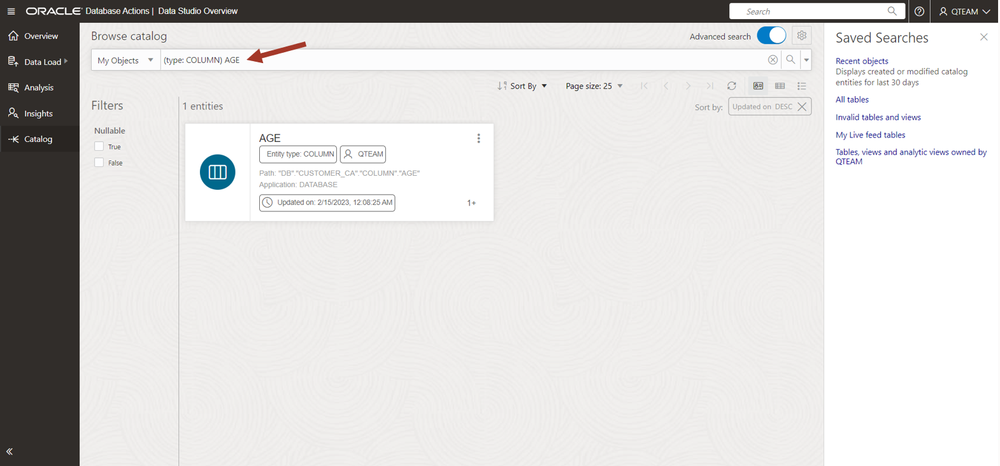

## Task 3: Create a connection to Cloud Object Storage

We need to analyze the movie sales data by age group. While browsing the catalog,
we noticed that there is no age group information, so we need to load a
new table for the age groups.

We are told that this data set is available in a file on OCI Cloud Object Storage. First we need to create a connection to this cloud storage system so that we can browse the files.

1.  Click on the **Data Load** card in the Data Studio overview section. You can also navigate between tools using the links on the left side panel.

    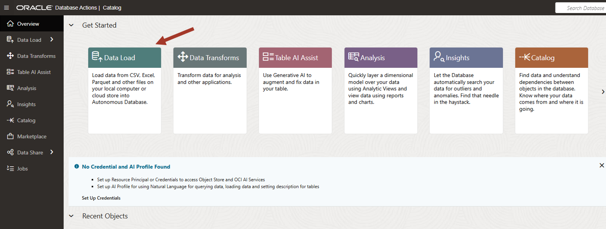

2. Click on **Connections**.

    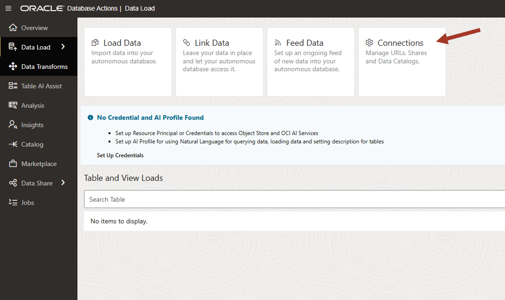

3. Look at the options in **Create** drop down menu. You can either create a connection to cloud storage system or subscribe to any share provider. You can also connect to another catalog so that you can browse and load data from it.

   For our purpose, we will create a connection to a cloud storage location. Click on the **New Cloud Store Location**.

   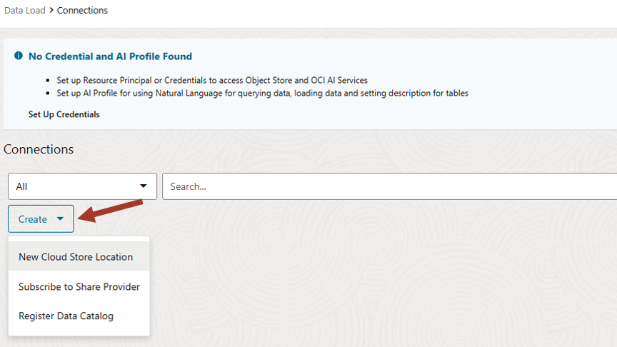

4. Configure the connection properties as follows:

    Name: MyObjectStoreFiles
    
    Description: My Object Store Files on OCI
    
    Public Bucket: Check
    
    Bucket URI: https://objectstorage.us-ashburn-1.oraclecloud.com/n/c4u04/b/datastudio/o/

    Click **Create**

   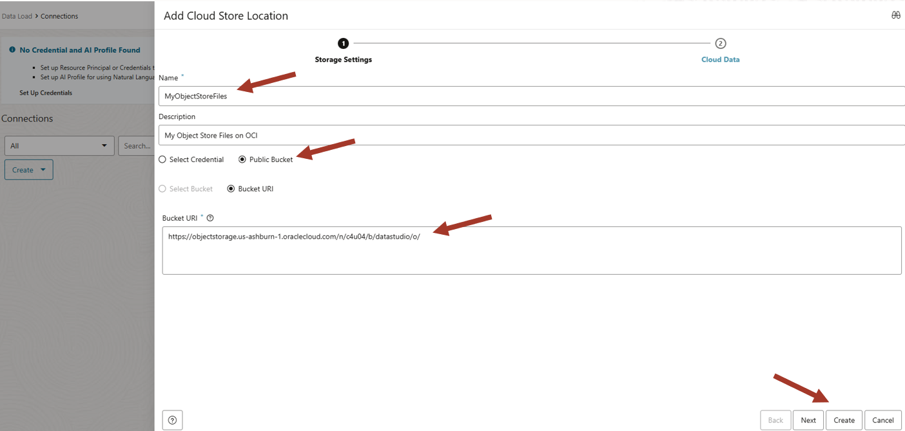

5. Switch to Catalog to browse the files. Click on **Catalog** tool on the left panel.

   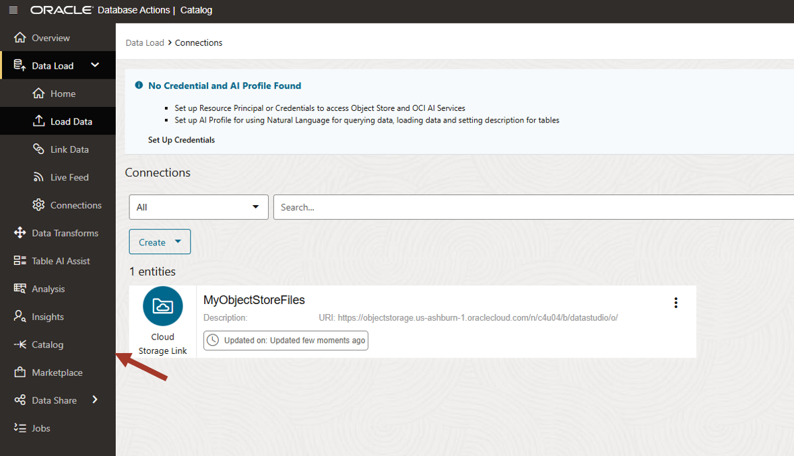

## Task 4: Browse files and Load age groups

1.  Click on the **Files** to see all the accessible files. These files are in the cloud storage location linked to the catalog in previous section.

   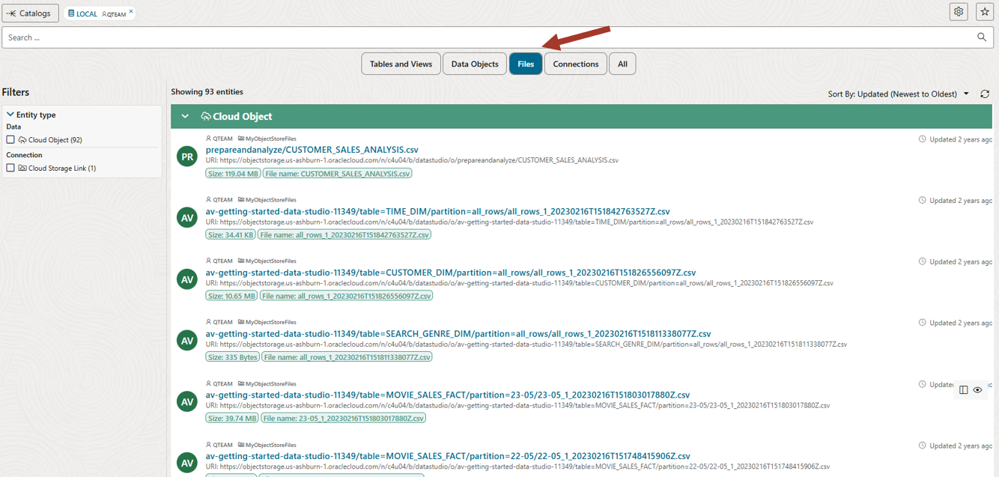

2. Since we are interested in age groups, filter the list by entering **age** in the search bar. Now you can see the AGE\_GROUP.csv file.

   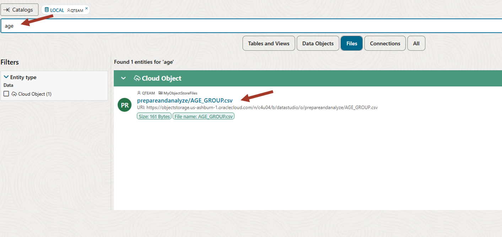

3. Click on the file and look at the options. You can either load the file to the Autonomous AI Database, or link to the file. Linking a file simply creates an external table and gives you the data access without moving the data. In our case, we want to move the data to the Autonomous AI Database by loading the file since we have a need to join it with other tables already in the Autonomous AI Database and it will be more optimized if all tables are in the database.

   Click on **Load to table**

   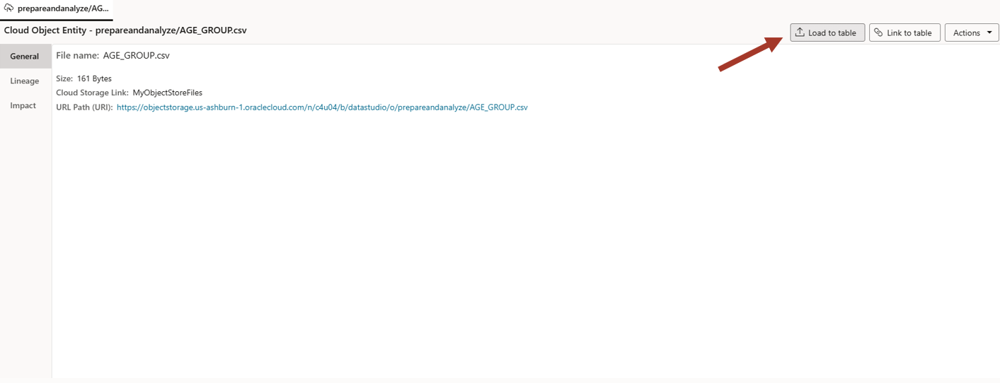

4. Data Load tool parses the file and works out the columns and data types to create automatically. Review load properties and click on **Load Data**. 

   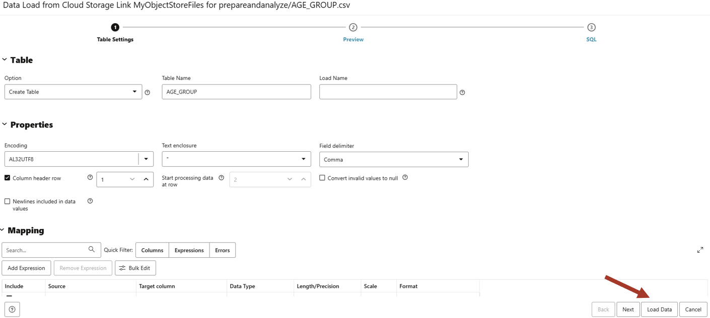

5. Click on **Go to Data Load**

   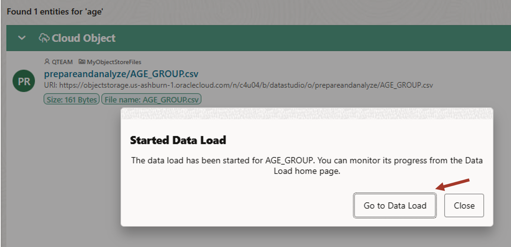

6. Now switch to the Catalog tool and look for the AGE\_GROUPS table in the **Tables and Views** section by searching for **age** in the search bar. We can see the loaded table now. 

   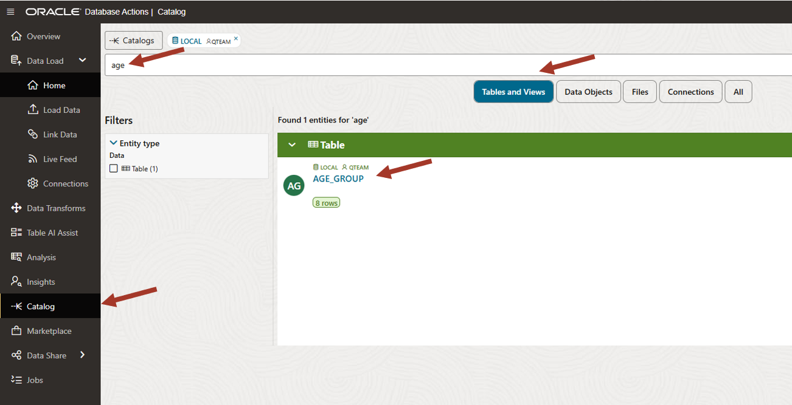

7. Click on the table to view the data

   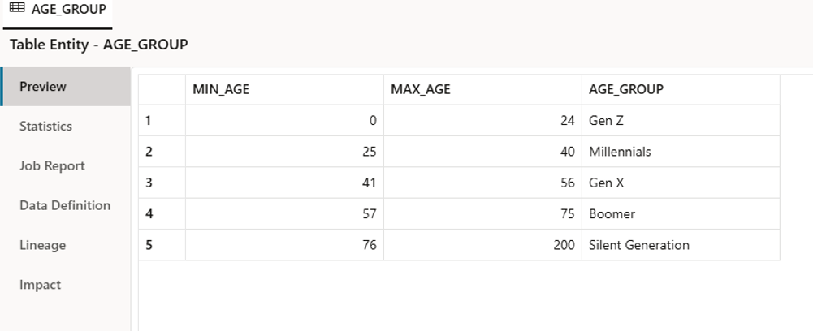

## Task 5: What's more?

Note that we scratched only the surface. Some of the other features available in Data Studio include:

-   **Linking data**: Query data without moving from the original location
-   **Live Feed**: Load data continuously as files are dropped in object store
-   **External Catalog**: Link to other catalogs to browse and access external data sets
-   **Data Share**: Load data from other share providers
-   **AI Source**: Get generated data from Open AI or Cohere AI source. This is an experimental feature.

Data Load is a very capable tool for loading wide variety of data. To explore more of its functionality, see the dedicated workshop in Oracle Livelabs: https://livelabs.oracle.com/pls/apex/r/dbpm/livelabs/view-workshop?wid=3590 

## RECAP

In this lab, we used the catalog to browse and search for the desired objects in the database. There are different 
ways to search for an object and display the search results. We learned how to see a preview of the data in a table. 

We then used the Data Load tool to load additional data from cloud object storage. 
You may now **proceed to the next lab**.

## Acknowledgements

- Created By/Date - Jayant Mahto, Product Manager, Autonomous AI Database, January 2023
- Contributors - Mike Matthews, Bud Endress, Ashish Jain, Marty Gubar, Rick Green
- Last Updated By - Jayant Mahto, August 2025

Copyright (C)  Oracle Corporation.