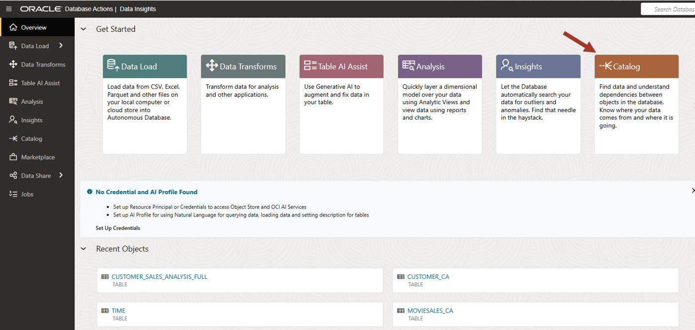
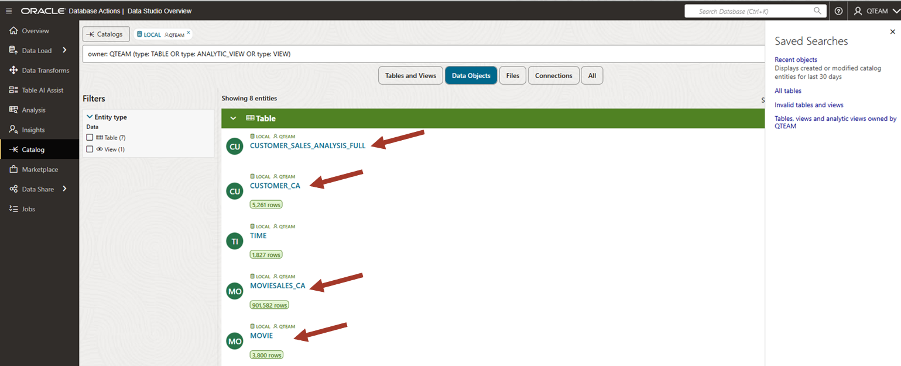

# Browse and Load the additional data set

## Introduction

This lab introduces the Catalog and Data Load tool of Data Studio built into the Oracle Autonomous Database and shows how to browse and load a new data set.

Estimated Time: 10 minutes

<!--
Watch the video below for a quick walk-through of the lab.
[Create a database user](videohub:1_xnrr084w)
-->

### Objectives

In this workshop, you will learn:
- How to browse and search for the data set you need
- How to load data from an object store

### Prerequisites

To complete this lab, you need to have completed the previous labs, so that you have:

- Created an Autonomous Data Warehouse instance
- Created a new QTEAM user with appropriate roles
- Loaded the demo data

## Task 1: Where is your data?

Data and its management is the foundation of any data analysis project. It is distributed in and out of organization. This data should either be loaded to the Autonomous Database or linked to the autonomous database so that it can be combined with other data sets for meaningful analysis.

The data can be available in various formats/locations and the following tools can be used to load data.

Use **Data Load** tool for:

   - Data is in local files or cloud Object Stores in various file formats.

   - Data from data providers as data share.

   - Data is accessible via other catalogs. We can browse and load/link data in other catalogs by simply linking the catalogs to Autonomous Database.

   
Use **Data Transforms** tool for:

   - Data in other databases and applications. These require special connectors for each data source. These connectors are available in the Data Transforms tool of Data Studio since data transformation is most often needed after loading the data. This usage is typical in an enterprise data integration requirement.

Data Studio tools can be used to load data from all the above. Since this is an overview workshop, we will show you how to quickly load data from object store using Data Load tool.

## Task 2: Explore the catalog

1.  Click on the Catalog card from Data Studio overview.

    

    The catalog is a metadata management service for the contents of your autonomous database and its connected assets, providing an easily searchable inventory of all the objects in, or accessible from, your database, including schemas, tables, views, columns, analytic views, packages and procedures, files on cloud object storage, and much more. it can also connect to other catalogs in OCI and from 3rd party vendors to give a centralized access to all accessible objects.

    A typical catalog will have many objects and you need various ways to search and display objects. Various ways to navigate a catalog are shown by marked numbers in the screenshot. These are:
    
    1. Saved searches. You can filter objects easily with one click and
    then refine the search further as per need.
    
    2. Filters to narrow down your search.
    
    3. Search bar.
    
    4. Quick access to Data Studio overview and other tools.

    5. In Settings you can configure for AI services. Data studio can make use of AI services to help for identifying personal information, creating descriptions, creating new columns with natural language prompts and more. This is an advanced usage and will not be covered in this overview workshop.

    

2.  Note that the catalog shows all types of objects. We are interested in
    only the tables for now. Click on "Tables, views and analytic views
    owned by..." on the right zone 1.

    You can see the MOVIESALES\_CA in this list. We are interested in this
    table since we were told that this table contains movie sales
    transaction data. (Referring to the meeting notes in the introductory
    section of this workshop).
    
    

3.  Click on the MOVIESALES\_CA table.

    You can see the data preview. You can scroll right to see more columns
    and scroll down to see more rows. You can also sort the columns by
    right-clicking on the columns. Using the data view, you can be sure
    that this is the data you want.
    
    Note that you also have other information such as
    lineage/impact/statistics/data definitions etc. This workshop is not
    going into the details. Detailed features will be explored in other
    workshops.
    
    Now close this view by clicking on the bottom right **Close** button.

    

4.  Look for the other tables of interest on the main catalog page.
    Recall from the meeting notes in the workshop's introduction that we are also interested in CUSTOMER\_CA and GENRE tables.

    You will also see CUSTOMER\_SALES\_ANALYSIS table which is empty. This table will be populated by the transforms tool later in this workshop.
    
    Find and click on these tables to do a data preview.

    

5.  We also need to find out whether age group information is present.

    Clear the search bar and enter the following search string:
    
    **(type: TABLE) AGE\_GROUP**
    
    This will search for all the tables with "AGE\_GROUP" in the name. We find no such table. For our workshop, we needed a table about various age groups. Since we could not find it in the catalog, we will have to load it into the database in the next lab.

    

## Task 3: Create a connection to Object Store

We need to analyze the movie sales data by age group. While browsing the catalog,
we noticed that there is no age group information, so we need to load a
new table for the age groups.

We are told that this data set is available in an Object Store file. First we need to create a connection to this Object Store so that we can browse the files.

1.  Click on the **Data Load** card in the Data Studio overview section. You can also navigate between tools using the links on the left side panel.

    

2. Click on **Connections**.

    

3. Look at the options in **Create** drop down menu. You can either create a connection to Cloud Store or subscribe to any share provider. You can also connect to other catalog so that you can browse and load data from sources in the catalog.

   For our purpose, we will create a connection to the Cloud Store. Click on the **New Cloud Store Location**.

   

4. Configure the connection properties as follows:

    Name: MyObjectStoreFiles
    
    Description: My Object Store Files on OCI
    
    Public Bucket: Check
    
    Bucket URI: https://objectstorage.us-ashburn-1.oraclecloud.com/n/c4u04/b/datastudio/o/

    Click **Create**

   

5. Switch to Catalog to browse the files. Click on **Catalog** tool on the left panel.

   

## Task 4: Browse files and Load age groups

1.  Click on the **Files** to see all the accessible files. These files are on the Object Store linked to the catalog in previous section.

   

2. Since we are interested in age groups, filter the list by entering **age** in the search bar. Now you can see the AGE\_GROUP.csv file.

   

3. Click on the file and look at the options. You can either load the file to the Autonomous Database, or simply link to the file. Linking a file simply creates an external table and gives you the data access without moving the data. In our use, we physically want to move the data to the Autonomous Database by loading the file since we have a need to join it with other tables already in the Autonomous Database and it will be more optimized if all tables are in the database.

   Click on **Load to table**

   

4. Data Load tool parses the file and figures out columns and data types. Review load properties and click on **Load Data**. 

   

5. Click on **Go to Data Load**

   

6. Now switch to Catalog tool and look for the AGE\_GROUPS table in the **Tables and Views** section by searching for **age** in the search bar. We can see the loaded table now. 

   

7. Click on the table to view the data

   

## RECAP

In this lab, we used Catalog to browse and search for the desired objects in the database. There are different 
ways to search for an object and display the search results. We learned how to see a preview of the data in a table. 

We used Data Load tool to load additional data from an Object Store. Note that there are other ways to access data, such as linking files, live feed etc., which are not covered here. These details will be covered in another in-depth workshop on Data Load.

You may now **proceed to the next lab**.

## Acknowledgements

- Created By/Date - Jayant Mahto, Product Manager, Autonomous Database, January 2023
- Contributors - Mike Matthews, Bud Endress, Ashish Jain, Marty Gubar, Rick Green
- Last Updated By - Jayant Mahto, August 2025

Copyright (C)  Oracle Corporation.