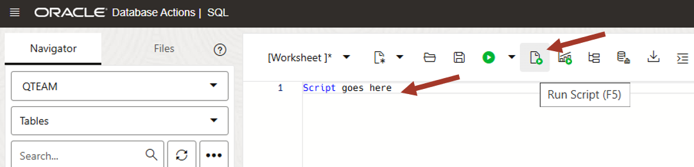
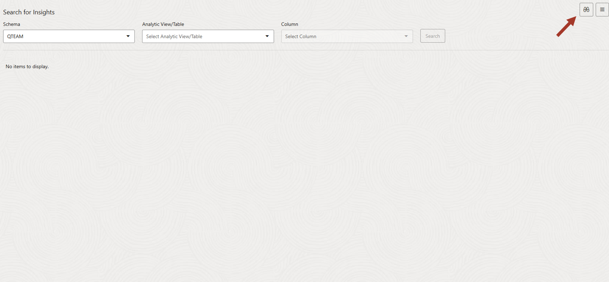
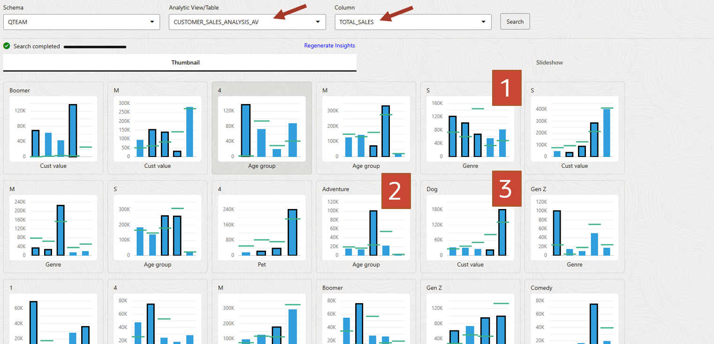
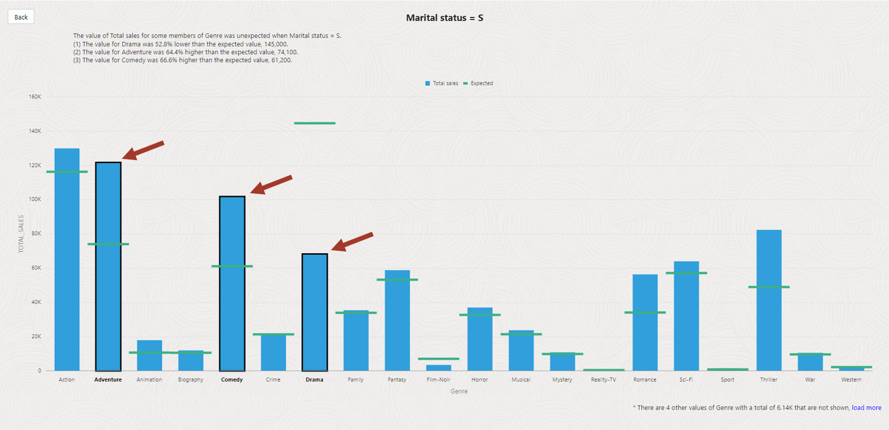
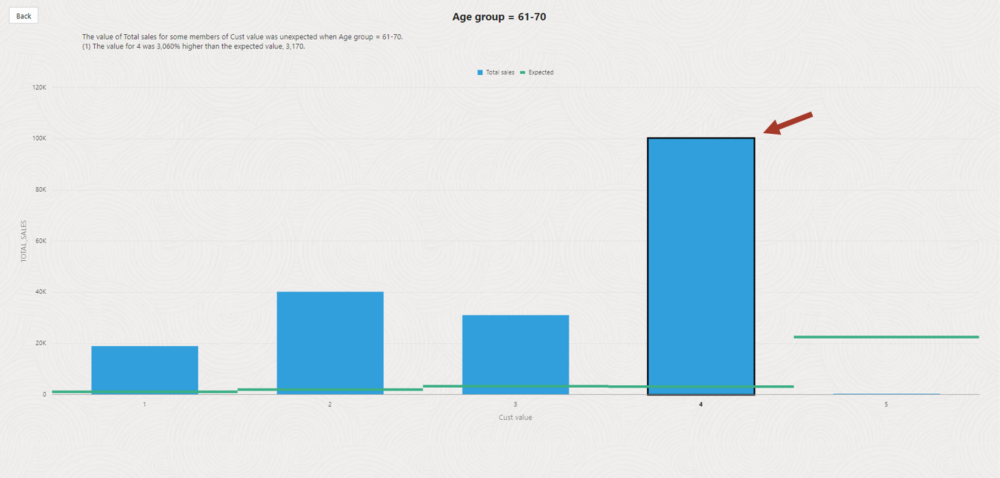
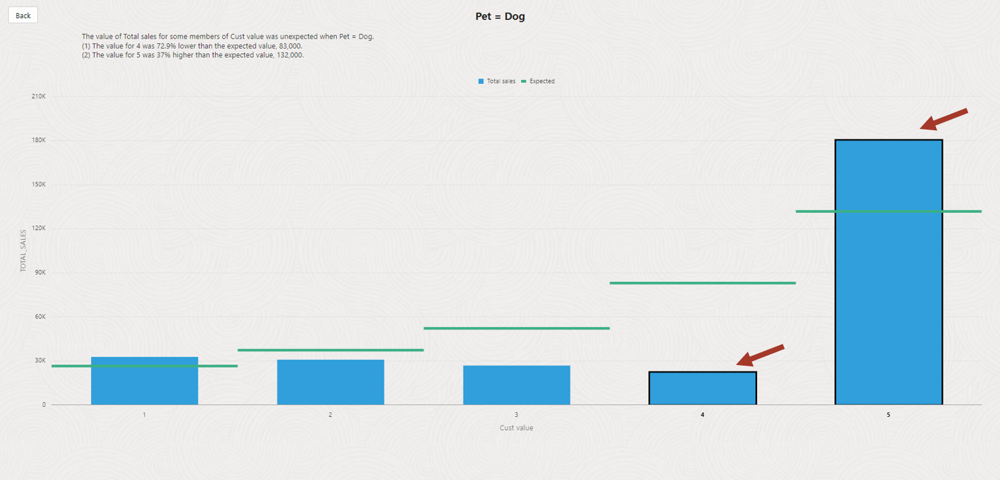

# Using Data Insights to explore hidden patterns


## Introduction

This lab introduces the Data Insights application built into the Oracle Autonomous Database and shows how to search for and interpret data insights.

### Prerequisites

To complete this lab, you need to have completed the previous labs, so that you have:

- Created an Autonomous Data Warehouse instance
- Created a new QTEAM user with appropriate roles
- demo data loaded
- Age group data loaded
- Prepared data load into CUSTOMER_SALES_ANALYSIS
- Analytic view CUSTOMER_SALES_ANALYSIS_AV created

### Demo data for this lab
**NOTE**: Skip this section if you have demo data loaded and completed previous labs.

If you have not completed previous labs then run the following script in SQL Worksheet to load all necessary objects.

*For copy/pasting, be sure to click the convenient __Copy__ button in the upper right corner of the following code snippet*: 

```
drop table CUSTOMER_SALES_ANALYSIS;

create table CUSTOMER_SALES_ANALYSIS
(
  MIN_AGE NUMBER(38),
GENRE VARCHAR2(30 CHAR),
AGE_GROUP VARCHAR2(4000 CHAR),
GENDER VARCHAR2(20 CHAR),
APP VARCHAR2(100 CHAR),
DEVICE VARCHAR2(100 CHAR),
OS VARCHAR2(100 CHAR),
PAYMENT_METHOD VARCHAR2(100 CHAR),
LIST_PRICE NUMBER(38),
DISCOUNT_TYPE VARCHAR2(100 CHAR),
DISCOUNT_PERCENT NUMBER(38),
TOTAL_SALES NUMBER(38),
MAX_AGE NUMBER(38),
AGE NUMBER(38),
EDUCATION VARCHAR2(40 CHAR),
INCOME_LEVEL VARCHAR2(20 CHAR),
MARITAL_STATUS VARCHAR2(8 CHAR),
PET VARCHAR2(40 CHAR),
CUST_VALUE NUMBER,
CUST_SALES NUMBER(38)
);

INSERT 
  /*+  APPEND PARALLEL  */ 
  INTO CUSTOMER_SALES_ANALYSIS
  (
    MIN_AGE ,
    GENRE ,
    AGE_GROUP ,
    GENDER ,
    APP ,
    DEVICE ,
    OS ,
    PAYMENT_METHOD ,
    LIST_PRICE ,
    DISCOUNT_TYPE ,
    DISCOUNT_PERCENT ,
    TOTAL_SALES ,
    MAX_AGE ,
    AGE ,
    EDUCATION ,
    INCOME_LEVEL ,
    MARITAL_STATUS ,
    PET ,
    CUST_VALUE ,
    CUST_SALES 
  ) 
SELECT 
  AGE_GROUP.MIN_AGE ,
  GENRE_1.GENRE ,
  AGE_GROUP.AGE_GROUP ,
  CUSTOMER_CA.GENDER ,
  MOVIESALES_CA1.APP ,
  MOVIESALES_CA1.DEVICE ,
  MOVIESALES_CA1.OS ,
  MOVIESALES_CA1.PAYMENT_METHOD ,
  MOVIESALES_CA1.LIST_PRICE ,
  MOVIESALES_CA1.DISCOUNT_TYPE ,
  MOVIESALES_CA1.DISCOUNT_PERCENT ,
  MOVIESALES_CA1.TOTAL_SALES ,
  AGE_GROUP.MAX_AGE ,
  CUSTOMER_CA.AGE ,
  CUSTOMER_CA.EDUCATION ,
  CUSTOMER_CA.INCOME_LEVEL ,
  CUSTOMER_CA.MARITAL_STATUS ,
  CUSTOMER_CA.PET ,
  MOVIESALES_CA_1.COL ,
  MOVIESALES_CA_1.CUST_SALES  
FROM 
  ((((
SELECT 
  MOVIESALES_CA.CUST_ID AS CUST_ID ,
  SUM ( MOVIESALES_CA.TOTAL_SALES ) AS CUST_SALES ,
  NTILE(5) OVER ( ORDER BY (SUM ( MOVIESALES_CA.TOTAL_SALES ))) AS COL   
FROM 
  MOVIESALES_CA MOVIESALES_CA  
GROUP BY
  MOVIESALES_CA.CUST_ID 
  ) MOVIESALES_CA_1  INNER JOIN  CUSTOMER_CA CUSTOMER_CA  
    ON  MOVIESALES_CA_1.CUST_ID=CUSTOMER_CA.CUST_ID
     )  LEFT OUTER JOIN  AGE_GROUP AGE_GROUP  
    ON  CUSTOMER_CA.AGE between  AGE_GROUP.MIN_AGE and  AGE_GROUP.MAX_AGE
     )  INNER JOIN  MOVIESALES_CA MOVIESALES_CA1  
    ON  MOVIESALES_CA_1.CUST_ID=MOVIESALES_CA1.CUST_ID
     )  INNER JOIN  GENRE GENRE_1  
    ON  MOVIESALES_CA1.GENRE_ID=GENRE_1.GENRE_ID
;

CREATE OR REPLACE FORCE EDITIONABLE ATTRIBUTE DIMENSION
    "QTEAM"."CUSTOMER_SALES_ANALYSIS_AV_AGE_GROUP_AD"
    DIMENSION TYPE STANDARD
    CLASSIFICATION "CAPTION" VALUE 'Age group'
    CLASSIFICATION "DESCRIPTION" VALUE 'Age group'
    CLASSIFICATION "MODEL" VALUE 'CUSTOMER_SALES_ANALYSIS_AV'
    USING "QTEAM"."CUSTOMER_SALES_ANALYSIS" AS "CUSTOMER_SALES_ANALYSIS"
    ATTRIBUTES (
      "CUSTOMER_SALES_ANALYSIS"."AGE_GROUP" AS "AGE_GROUP_ATTR"
        CLASSIFICATION "CAPTION" VALUE 'AGE_GROUP_ATTR'
        CLASSIFICATION "DESCRIPTION" VALUE 'AGE_GROUP_ATTR')
    LEVEL "AGE_GROUP"
      LEVEL TYPE STANDARD
      CLASSIFICATION "CAPTION" VALUE 'Age group'
      CLASSIFICATION "DESCRIPTION" VALUE 'Age group'
      KEY ("AGE_GROUP_ATTR")
      MEMBER NAME to_char("AGE_GROUP_ATTR")
      MEMBER CAPTION to_char("AGE_GROUP_ATTR")
      MEMBER DESCRIPTION to_char("AGE_GROUP_ATTR")
      ORDER BY MIN "AGE_GROUP_ATTR" ASC NULLS FIRST
    ALL
      MEMBER NAME 'ALL'
      MEMBER CAPTION 'ALL'
      MEMBER DESCRIPTION 'ALL'
    CACHE STAR MATERIALIZED USING "QTEAM"."_AVTUNE_71368_STAR$"
  CREATE OR REPLACE FORCE EDITIONABLE ATTRIBUTE DIMENSION
    "QTEAM"."CUSTOMER_SALES_ANALYSIS_AV_CUST_VALUE_AD"
    DIMENSION TYPE STANDARD
    CLASSIFICATION "CAPTION" VALUE 'Cust value'
    CLASSIFICATION "DESCRIPTION" VALUE 'Cust value'
    CLASSIFICATION "MODEL" VALUE 'CUSTOMER_SALES_ANALYSIS_AV'
    USING "QTEAM"."CUSTOMER_SALES_ANALYSIS" AS "CUSTOMER_SALES_ANALYSIS"
    ATTRIBUTES (
      "CUSTOMER_SALES_ANALYSIS"."CUST_VALUE" AS "CUST_VALUE_ATTR"
        CLASSIFICATION "CAPTION" VALUE 'CUST_VALUE_ATTR'
        CLASSIFICATION "DESCRIPTION" VALUE 'CUST_VALUE_ATTR')
    LEVEL "CUST_VALUE"
      LEVEL TYPE STANDARD
      CLASSIFICATION "CAPTION" VALUE 'Cust value'
      CLASSIFICATION "DESCRIPTION" VALUE 'Cust value'
      KEY ("CUST_VALUE_ATTR")
      MEMBER NAME to_char("CUST_VALUE_ATTR")
      MEMBER CAPTION to_char("CUST_VALUE_ATTR")
      MEMBER DESCRIPTION to_char("CUST_VALUE_ATTR")
      ORDER BY MIN "CUST_VALUE_ATTR" ASC NULLS FIRST
    ALL
      MEMBER NAME 'ALL'
      MEMBER CAPTION 'ALL'
      MEMBER DESCRIPTION 'ALL'
    CACHE STAR MATERIALIZED USING "QTEAM"."_AVTUNE_71369_STAR$"
  CREATE OR REPLACE FORCE EDITIONABLE ATTRIBUTE DIMENSION
    "QTEAM"."CUSTOMER_SALES_ANALYSIS_AV_DEVICE_AD"
    DIMENSION TYPE STANDARD
    CLASSIFICATION "CAPTION" VALUE 'Device'
    CLASSIFICATION "DESCRIPTION" VALUE 'Device'
    CLASSIFICATION "MODEL" VALUE 'CUSTOMER_SALES_ANALYSIS_AV'
    USING "QTEAM"."CUSTOMER_SALES_ANALYSIS" AS "CUSTOMER_SALES_ANALYSIS"
    ATTRIBUTES (
      "CUSTOMER_SALES_ANALYSIS"."DEVICE" AS "DEVICE_ATTR"
        CLASSIFICATION "CAPTION" VALUE 'DEVICE_ATTR'
        CLASSIFICATION "DESCRIPTION" VALUE 'DEVICE_ATTR')
    LEVEL "DEVICE"
      LEVEL TYPE STANDARD
      CLASSIFICATION "CAPTION" VALUE 'Device'
      CLASSIFICATION "DESCRIPTION" VALUE 'Device'
      KEY ("DEVICE_ATTR")
      MEMBER NAME to_char("DEVICE_ATTR")
      MEMBER CAPTION to_char("DEVICE_ATTR")
      MEMBER DESCRIPTION to_char("DEVICE_ATTR")
      ORDER BY MIN "DEVICE_ATTR" ASC NULLS FIRST
    ALL
      MEMBER NAME 'ALL'
      MEMBER CAPTION 'ALL'
      MEMBER DESCRIPTION 'ALL'
    CACHE STAR MATERIALIZED USING "QTEAM"."_AVTUNE_71367_STAR$"
  CREATE OR REPLACE FORCE EDITIONABLE ATTRIBUTE DIMENSION
    "QTEAM"."CUSTOMER_SALES_ANALYSIS_AV_GENRE_AD"
    DIMENSION TYPE STANDARD
    CLASSIFICATION "CAPTION" VALUE 'Genre'
    CLASSIFICATION "DESCRIPTION" VALUE 'Genre'
    CLASSIFICATION "MODEL" VALUE 'CUSTOMER_SALES_ANALYSIS_AV'
    USING "QTEAM"."CUSTOMER_SALES_ANALYSIS" AS "CUSTOMER_SALES_ANALYSIS"
    ATTRIBUTES (
      "CUSTOMER_SALES_ANALYSIS"."GENRE" AS "GENRE_ATTR"
        CLASSIFICATION "CAPTION" VALUE 'GENRE_ATTR'
        CLASSIFICATION "DESCRIPTION" VALUE 'GENRE_ATTR')
    LEVEL "GENRE"
      LEVEL TYPE STANDARD
      CLASSIFICATION "CAPTION" VALUE 'Genre'
      CLASSIFICATION "DESCRIPTION" VALUE 'Genre'
      KEY ("GENRE_ATTR")
      MEMBER NAME to_char("GENRE_ATTR")
      MEMBER CAPTION to_char("GENRE_ATTR")
      MEMBER DESCRIPTION to_char("GENRE_ATTR")
      ORDER BY MIN "GENRE_ATTR" ASC NULLS FIRST
    ALL
      MEMBER NAME 'ALL'
      MEMBER CAPTION 'ALL'
      MEMBER DESCRIPTION 'ALL'
    CACHE STAR MATERIALIZED USING "QTEAM"."_AVTUNE_71366_STAR$"
  CREATE OR REPLACE FORCE EDITIONABLE ATTRIBUTE DIMENSION
    "QTEAM"."CUSTOMER_SALES_ANALYSIS_AV_MARITAL_STATUS_AD"
    DIMENSION TYPE STANDARD
    CLASSIFICATION "CAPTION" VALUE 'Marital status'
    CLASSIFICATION "DESCRIPTION" VALUE 'Marital status'
    CLASSIFICATION "MODEL" VALUE 'CUSTOMER_SALES_ANALYSIS_AV'
    USING "QTEAM"."CUSTOMER_SALES_ANALYSIS" AS "CUSTOMER_SALES_ANALYSIS"
    ATTRIBUTES (
      "CUSTOMER_SALES_ANALYSIS"."MARITAL_STATUS" AS "MARITAL_STATUS_ATTR"
        CLASSIFICATION "CAPTION" VALUE 'MARITAL_STATUS_ATTR'
        CLASSIFICATION "DESCRIPTION" VALUE 'MARITAL_STATUS_ATTR')
    LEVEL "MARITAL_STATUS"
      LEVEL TYPE STANDARD
      CLASSIFICATION "CAPTION" VALUE 'Marital status'
      CLASSIFICATION "DESCRIPTION" VALUE 'Marital status'
      KEY ("MARITAL_STATUS_ATTR")
      MEMBER NAME to_char("MARITAL_STATUS_ATTR")
      MEMBER CAPTION to_char("MARITAL_STATUS_ATTR")
      MEMBER DESCRIPTION to_char("MARITAL_STATUS_ATTR")
      ORDER BY MIN "MARITAL_STATUS_ATTR" ASC NULLS FIRST
    ALL
      MEMBER NAME 'ALL'
      MEMBER CAPTION 'ALL'
      MEMBER DESCRIPTION 'ALL'
    CACHE STAR MATERIALIZED USING "QTEAM"."_AVTUNE_71370_STAR$"
  CREATE OR REPLACE FORCE EDITIONABLE ATTRIBUTE DIMENSION
    "QTEAM"."CUSTOMER_SALES_ANALYSIS_AV_PET_AD"
    DIMENSION TYPE STANDARD
    CLASSIFICATION "CAPTION" VALUE 'Pet'
    CLASSIFICATION "DESCRIPTION" VALUE 'Pet'
    CLASSIFICATION "MODEL" VALUE 'CUSTOMER_SALES_ANALYSIS_AV'
    USING "QTEAM"."CUSTOMER_SALES_ANALYSIS" AS "CUSTOMER_SALES_ANALYSIS"
    ATTRIBUTES (
      "CUSTOMER_SALES_ANALYSIS"."PET" AS "PET_ATTR"
        CLASSIFICATION "CAPTION" VALUE 'PET_ATTR'
        CLASSIFICATION "DESCRIPTION" VALUE 'PET_ATTR')
    LEVEL "PET"
      LEVEL TYPE STANDARD
      CLASSIFICATION "CAPTION" VALUE 'Pet'
      CLASSIFICATION "DESCRIPTION" VALUE 'Pet'
      KEY ("PET_ATTR")
      MEMBER NAME to_char("PET_ATTR")
      MEMBER CAPTION to_char("PET_ATTR")
      MEMBER DESCRIPTION to_char("PET_ATTR")
      ORDER BY MIN "PET_ATTR" ASC NULLS FIRST
    ALL
      MEMBER NAME 'ALL'
      MEMBER CAPTION 'ALL'
      MEMBER DESCRIPTION 'ALL'
    CACHE STAR MATERIALIZED USING "QTEAM"."_AVTUNE_71365_STAR$"
  CREATE OR REPLACE FORCE EDITIONABLE HIERARCHY
    "QTEAM"."CUSTOMER_SALES_ANALYSIS_AV_AGE_GROUP_HIER"
    CLASSIFICATION "CAPTION" VALUE 'Age group'
    CLASSIFICATION "DESCRIPTION" VALUE 'Age group'
    CLASSIFICATION "MODEL" VALUE 'CUSTOMER_SALES_ANALYSIS_AV'
    USING "CUSTOMER_SALES_ANALYSIS_AV_AGE_GROUP_AD"
    ("AGE_GROUP")
  CREATE OR REPLACE FORCE EDITIONABLE HIERARCHY
    "QTEAM"."CUSTOMER_SALES_ANALYSIS_AV_CUST_VALUE_HIER"
    CLASSIFICATION "CAPTION" VALUE 'Cust value'
    CLASSIFICATION "DESCRIPTION" VALUE 'Cust value'
    CLASSIFICATION "MODEL" VALUE 'CUSTOMER_SALES_ANALYSIS_AV'
    USING "CUSTOMER_SALES_ANALYSIS_AV_CUST_VALUE_AD"
    ("CUST_VALUE")
  CREATE OR REPLACE FORCE EDITIONABLE HIERARCHY
    "QTEAM"."CUSTOMER_SALES_ANALYSIS_AV_DEVICE_HIER"
    CLASSIFICATION "CAPTION" VALUE 'Device'
    CLASSIFICATION "DESCRIPTION" VALUE 'Device'
    CLASSIFICATION "MODEL" VALUE 'CUSTOMER_SALES_ANALYSIS_AV'
    USING "CUSTOMER_SALES_ANALYSIS_AV_DEVICE_AD"
    ("DEVICE")
  CREATE OR REPLACE FORCE EDITIONABLE HIERARCHY
    "QTEAM"."CUSTOMER_SALES_ANALYSIS_AV_GENRE_HIER"
    CLASSIFICATION "CAPTION" VALUE 'Genre'
    CLASSIFICATION "DESCRIPTION" VALUE 'Genre'
    CLASSIFICATION "MODEL" VALUE 'CUSTOMER_SALES_ANALYSIS_AV'
    USING "CUSTOMER_SALES_ANALYSIS_AV_GENRE_AD"
    ("GENRE")
  CREATE OR REPLACE FORCE EDITIONABLE HIERARCHY
    "QTEAM"."CUSTOMER_SALES_ANALYSIS_AV_MARITAL_STATUS_HIER"
    CLASSIFICATION "CAPTION" VALUE 'Marital status'
    CLASSIFICATION "DESCRIPTION" VALUE 'Marital status'
    CLASSIFICATION "MODEL" VALUE 'CUSTOMER_SALES_ANALYSIS_AV'
    USING "CUSTOMER_SALES_ANALYSIS_AV_MARITAL_STATUS_AD"
    ("MARITAL_STATUS")
  CREATE OR REPLACE FORCE EDITIONABLE HIERARCHY
    "QTEAM"."CUSTOMER_SALES_ANALYSIS_AV_PET_HIER"
    CLASSIFICATION "CAPTION" VALUE 'Pet'
    CLASSIFICATION "DESCRIPTION" VALUE 'Pet'
    CLASSIFICATION "MODEL" VALUE 'CUSTOMER_SALES_ANALYSIS_AV'
    USING "CUSTOMER_SALES_ANALYSIS_AV_PET_AD"
    ("PET")
  CREATE OR REPLACE FORCE EDITIONABLE ANALYTIC VIEW
    "QTEAM"."CUSTOMER_SALES_ANALYSIS_AV"
    CLASSIFICATION "CAPTION" VALUE 'Customer sales analysis av'
    CLASSIFICATION "DESCRIPTION" VALUE 'Customer sales analysis av'
    CLASSIFICATION "MODEL" VALUE 'CUSTOMER_SALES_ANALYSIS_AV'
    CLASSIFICATION "AVX_PROJECT_CODE" VALUE 'CUSTOMER_SALES_ANALYSIS_AV'
    USING "QTEAM"."CUSTOMER_SALES_ANALYSIS" AS "CUSTOMER_SALES_ANALYSIS"
    DIMENSION BY (
      "CUSTOMER_SALES_ANALYSIS_AV_AGE_GROUP_AD" AS "AGE_GROUP"
        KEY ("AGE_GROUP") REFERENCES DISTINCT ("AGE_GROUP_ATTR") SPARSE 
        HIERARCHIES (
          "CUSTOMER_SALES_ANALYSIS_AV_AGE_GROUP_HIER" AS "AGE_GROUP" DEFAULT),
      "CUSTOMER_SALES_ANALYSIS_AV_CUST_VALUE_AD" AS "CUST_VALUE"
        KEY ("CUST_VALUE") REFERENCES DISTINCT ("CUST_VALUE_ATTR") SPARSE 
        HIERARCHIES (
          "CUSTOMER_SALES_ANALYSIS_AV_CUST_VALUE_HIER" AS "CUST_VALUE" DEFAULT),
      "CUSTOMER_SALES_ANALYSIS_AV_DEVICE_AD" AS "DEVICE"
        KEY ("DEVICE") REFERENCES DISTINCT ("DEVICE_ATTR") SPARSE 
        HIERARCHIES (
          "CUSTOMER_SALES_ANALYSIS_AV_DEVICE_HIER" AS "DEVICE" DEFAULT),
      "CUSTOMER_SALES_ANALYSIS_AV_GENRE_AD" AS "GENRE"
        KEY ("GENRE") REFERENCES DISTINCT ("GENRE_ATTR") SPARSE 
        HIERARCHIES ("CUSTOMER_SALES_ANALYSIS_AV_GENRE_HIER" AS "GENRE" DEFAULT),
      "CUSTOMER_SALES_ANALYSIS_AV_MARITAL_STATUS_AD" AS "MARITAL_STATUS"
        KEY ("MARITAL_STATUS")
          REFERENCES DISTINCT ("MARITAL_STATUS_ATTR") SPARSE 
        HIERARCHIES (
          "CUSTOMER_SALES_ANALYSIS_AV_MARITAL_STATUS_HIER" AS "MARITAL_STATUS" DEFAULT),
      "CUSTOMER_SALES_ANALYSIS_AV_PET_AD" AS "PET"
        KEY ("PET") REFERENCES DISTINCT ("PET_ATTR") SPARSE 
        HIERARCHIES ("CUSTOMER_SALES_ANALYSIS_AV_PET_HIER" AS "PET" DEFAULT))
    MEASURES (
      "TOTAL_SALES" FACT (
        "TOTAL_SALES")
        AGGREGATE BY SUM
        CLASSIFICATION "AVX_DATA_TYPE" VALUE 'NUMBER'
        CLASSIFICATION "CAPTION" VALUE 'Total sales'
        CLASSIFICATION "DESCRIPTION" VALUE 'Total sales'
        CLASSIFICATION "FORMAT_STRING")
    DEFAULT MEASURE "TOTAL_SALES"
    DEFAULT AGGREGATE BY SUM
;
  
```

Paste the sql statements in worksheet. Click on **Run Script** icon.



Now you are ready to go through rest of the labs in this workshop.

## Task 1: Use Data Insights

Data Studio's insights procecss runs in the background
finding interesting patterns in the data. This is a hands off approach to
finding insights that are lurking out of sight in the data.

Data insights process starts automatically when you use Data Analysis application, 
therefore you may already have insights captured if you have completed 
previous labs. Data insights can be started manually as you wil learn in this lab.

In this lab we will investigate few sample insights produced by the tool.
We will learn how to interpret it and will cross-check with manual
analysis.

Note that insight process can run for some time depending on the
complexity of the data set and available compute resources. Our data set
is small enough that it will complete in reasonable time. But you might
see the insight list being refreshed while it is executing.


1.  Launch Data Insights by clicking on the Database Actions link on the
    top and then click on the **DATA INSIGHTS** card.


2.  On the insight page click on the top right icon to get a tour of the
    tool.



3.  Click Next to go through each area and learn about it.


4.  you can pick AV or any table to run insights on. In case of AV, you
    can pick any measure to run insight against whereas if you want to
    run insights against a single table then you can pick any column
    which you think is a measure.

    In our case, AV built in the previous lab had only one measure
    (TOTAL_SALES). Insight tool has gone through the data and discovered
    many interesting behavioral patterns (of movie buying).
    
    NOTE: These insights are stored in the database and can be queried any
    time for a review. You can also regenerate the analysis if the data in
    underlying AV/table has changed.
    
    Let's look at few of such patterns. For this lab, we will look at 3
    examples:
    
    1: Purchasing pattern of singles across Genre
    
    2: Representation of seniors (61-70) across customer value
    
    3: Purchasing behavior of dog owners across age groups
    
    You can find them in the screenshot below. **Note that the order of
    insights may vary if data is different or the insight is still
    running, therefore refer to the labels on each tile to identify it.**



5.  Click on the tile marked **S** on the top and **Genre** at the
    bottom. It shows

    1: TOTAL_SALES (our measure driving the insight) in **blue** bars for
    **Marital Status=S** across **Genre**
    
    2: Each bar has a **green** horizontal line depicting average
    **without Marital Status=S filter**. It is called **expected** value.
    It can differ form the blue level if the data is skewed for the filter
    on the top (**Marital Status=S**).
    
    3: Few bars are surrounded by black border (pointed by arrows). These
    are highlighted exceptions.
    
    Another way to read this is as:
    
    **Singles** are purchasing **Adventure** and **Comedy** more than
    average and not much interested in **Drama**.
    
    WOW! That is quite an insight.



6.  Now to the next insight.

    Click on the tile marked **61-70** on the top and **Cust value** at
    the bottom. It shows
    
    It shows that seniors 61-70 overrepresented in 4th customer value
    bucket. Probably they have lots of disposable income!



7.  Now, just for fun lets look at pet ownership and movie purchase
    relationship.

    Click on the tile marked **Dog** on the top and **Cust Value**.
    
    It shows that highest value (5) dog owners are purchasing more movies
    than average compared to non-dog owners.
    
    It is just a correlation but you could use this data to offer dog
    grooming products to high value customers!!
    
    Interesting. Isn't it! Insight tool has discovered all these hidden
    patterns just by crawling through the data.



**Concluding thought**: If we are doing manual analysis in **DATA
ANALYSIS** tool, then we must actively look at and compare the data for
certain hierarchies. There are many combinations, but people use their
experience to guide their analysis steps. In comparison, **DATA
INSIGHTS** is hands off approach and it finds patterns without
understanding what hierarchies mean.

We think that both are complimentary to each other and provide valuable
tools to use in "a day in the life of a data analyst". That is how we
started this workshop!

Now all the assigned tasks from our Monday meeting have been completed
successfully. Ready for the next meeting.

## Task 2: Advanced users: Peeling the layers for Data Insights

This section is an attempt to explain the insights by manually running
queries and correlating them with what we can see in insights.

1.  Let's go back and look at the first insight again.

Click on the tile marked **S** on the top and **Genre** at the bottom


2.  We can go back to DATA ANALYSIS tool in another tab to confirm this
    insight. Go back to the data analysis and analyze by Genre and
    filter for Marital status=M and S alternately.

    Drag Genre on X-Axis (you will have to expand the tree on the left)
    and Marital Status on Filters. Pick M in the filter box.


3.  Married people are watching **Drama** a lot and not much
    **Adventure** and **Comedy**.


4.  Now let's compare it by changing the filter to S (singles).

    This is what you get. Notice high purchases in **Adventure** and
    **Comedy** genre by singles and not much **Drama** (compared to
    married people).


**Isn't that what our insight told us!!**

This completes Data Insights overview lab.