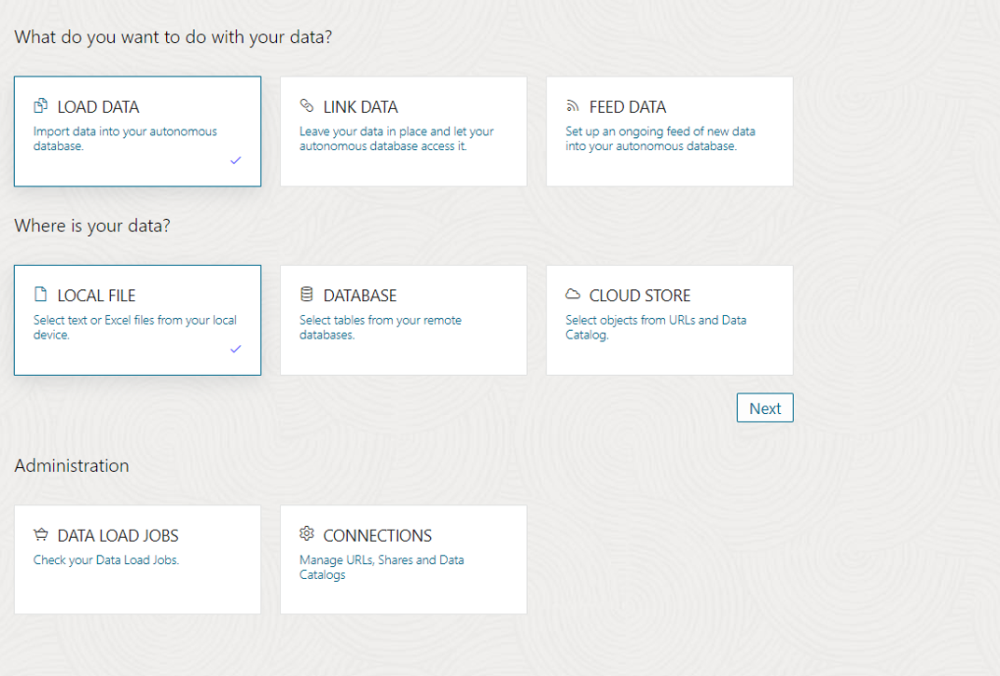

# Load the additional data set


## Introduction

This lab introduces the Data Load tool of Data Studio built into the Oracle Autonomous Database and shows how to load a new data set.

Estimated Time: 5 minutes

Watch the video below for a quick walk-through of the lab.
[Create a database user](videohub:1_xnrr084w)


### Objectives

In this workshop, you will learn:
-	How to load data from a local file

### Prerequisites

To complete this lab, you need to have completed the previous labs, so that you have:

- Created an Autonomous Data Warehouse instance
- Created a new QTEAM user with appropriate roles
- Loaded the demo data

## Task 1: Create a local data file for the age groups

We need to analyze the movie sales data by age group. While browsing the catalog,
we noticed that there is no age group information, so we need to load a
new table for the age groups.

1.  We need to create a local data file for AGE\_GROUP. Launch Excel on
    your desktop to create this dataset. You can either copy from the following table
    and paste it into a blank Excel sheet or manually type it in.

    | MIN\_AGE      | MAX\_AGE | AGE\_GROUP |
| ----------- | ----------- | ----------- |
| 0 | 24 |  Gen Z  | 
| 25 | 40 |  Millennials  | 
| 41 | 56 |  Gen X  | 
| 57 | 75 |  Boomer  | 
| 76 | 200 |  Silent Generation  | 

    Your Excel sheet should look like this.

    

    Rename the sheet AGE\_GROUP and save the Excel workbook as AGE\_GROUP.xlsx.

    If you don't have Excel then create a CSV file with the data below
    and save it as AGE\_GROUP.csv.

    *For copy/pasting, be sure to click the convenient __Copy__ button in the upper right corner of the following data text*: 
    
    ```
    <copy>
MIN_AGE,MAX_AGE,AGE_GROUP
0,24,Gen Z
25,40,Millennials
41,56,Gen X
57,75,Boomer
76,200,Silent Generation
    </copy>
    ```

## Task 2: Load age groups from the local file

1.  Go back to the Data Studio tools page by clicking on **Database Actions** 
    in the title bar in the top left, then click on **Data Load**

    

2.  Launch Data Load by clicking on the **Data Load** card.
    
    >**Note:** You can load data from local files, other databases, or from cloud storage.
    You can also create an ongoing feed to load data to Autonomous Database.
    
    >You can also load data from either your local file or database or
    cloud storage.
    
    In this lab, we are loading data from the local file created in the earlier
    task. Select **Local File** and press **Next**.

    

3.  Drag your local file AGE\_GROUP.xlsx or AGE\_GROUP.csv to the load window.

    

4.  Click the **Start** button to start the load. Make sure that the target table name is AGE_GROUP. This name is picked up from the name of Excel sheet or the name of the csv data file.

    
    
    After the load is complete, click on the Database Actions link at the top
    of the page to go back to the main menu.
    
    Now we have all the data sets that we need to complete our assignment.

    

## RECAP

In this lab, we used Data Load to load a local file. Note that there are many ways to load data, such as loading from the object store, linking files, live feed etc., which are not covered here. These details will be covered in another in-depth workshop.

You may now **proceed to the next lab**.

## Acknowledgements

- Created By/Date - Jayant Mahto, Product Manager, Autonomous Database, January 2023
- Contributors - Mike Matthews, Bud Endress, Ashish Jain, Marty Gubar, Rick Green
- Last Updated By - Jayant Mahto, August 2023


Copyright (C)  Oracle Corporation.