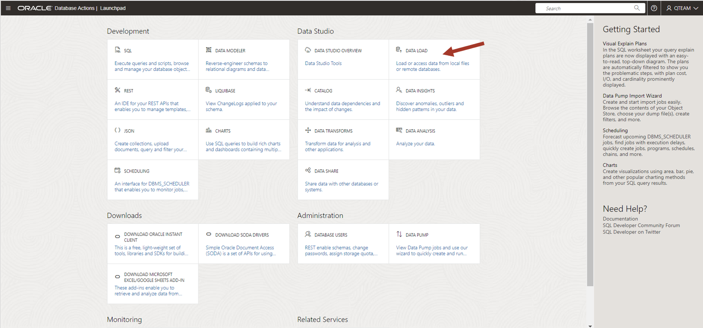

# Using Load Data to load the additional data set


## Introduction

This lab introduces the Load Data application built into the Oracle Autonomous Database and shows how to load a new data set.

Estimated Time: 5 minutes

Watch the video below for a quick walkthrough of the lab.
[](youtube:youtubeid)

### Objectives

In this workshop, you will learn:
-	How to load data from your local file

### Prerequisites

To complete this lab, you need to have completed the previous labs, so that you have:

- Created an Autonomous Data Warehouse instance
- Created a new QTEAM user with appropriate roles
- demo data loaded

## Task 1: Create a local data file for the age groups

We need to analyze the movie sales data by age group as well. While browsing the catalog,
we noticed that there is no age group information, and we need to load a
new table for the age groups.

1.  Go back to our database actions page by clicking on the
    top left button and using the Load Data tool.

    

2.  We need to create a local data file for AGE_GROUP. Launch Excel on
    your desktop to create this dataset. Note that you can also use a
    text editor to create this data set since it is small.

    

    Save this as an Excel workbook and name it AGE_GROUP.

    If you don't have Excel then create a CSV file with the data below
    and save it as AGE_GROUP.csv.

    *For copy/pasting, be sure to click the convenient __Copy__ button in the upper right corner of the following data text*: 
    
```
<copy>
"MIN_AGE","MAX_AGE","AGE_GROUP",

0,20,"00-20",

21,30,"21-30",

31,40,"31-40",

41,50,"41-50",

51,60,"51-60",

61,70,"61-70",

71,80,"71-80",

81,200,"Older than 81",
</copy>
```

## Task 2: Load age group from local file

1.  Launch Data Load from the Database Actions page by clicking on the **DATA LOAD** card.
    
    >**Note:** that you have various modes for loading data. You can either
    directly load data or leave it in place by linking it. You can
    also create an ongoing feed to load data to Autonomous Database.
    
    >You can also load data from either your local file or database or
    cloud storage.
    
    In this lab, we are loading data from the local file created in the earlier
    task. Select **LOCAL FILE** and press **Next**.

    

2.  Drag your local file AGE_GROUP.xlsx to the load window.

    

3.  Click the green triangle button to start the load.

    After the load is complete, click on the Database Actions link at the top
    of the page to go back to the main menu.
    
    Now we have all the data sets that we need to complete our assignment.

    

## RECAP

In this lab, we used Data Load to load a local file. Note that there are many ways to load data, such as loading from the object store, linking files, live feed etc., which are not covered here. These details will be covered in another in-depth workshop.

You may now **proceed to the next lab**.

## Acknowledgements

- Created By/Date - Jayant Mahto, Product Manager, Autonomous Database, January 2023
- Contributors - Mike Matthews, Bud Endress, Ashish Jain, Marty Gubar, Rick Green
- Last Updated By - Jayant Mahto, January 2023


Copyright (C)  Oracle Corporation.