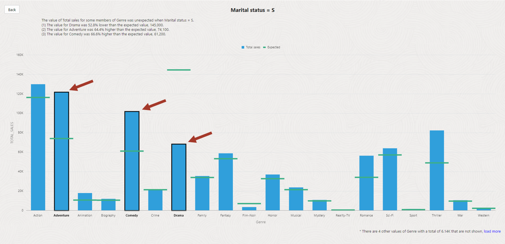
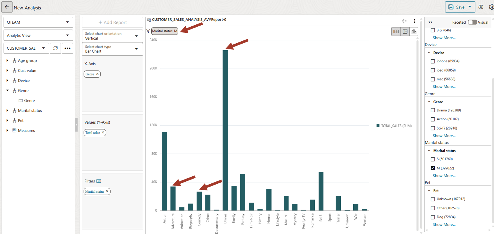

# Using Data Insights to explore hidden patterns

## Introduction

This lab introduces the Data Insights application built into the Oracle Autonomous Database and shows how to search for and interpret data insights.

Estimated Time: 15 minutes

Watch the video below for a quick walkthrough of the lab.

### Objectives

In this workshop, you will learn:
-	How to find hidden insights in your data

### Prerequisites

To complete this lab, you need to have completed the previous labs, so that you have:

- Created an Autonomous Data Warehouse instance
- Created a new QTEAM user with appropriate roles
- demo data loaded
- Age group data loaded into AGE_GROUP
- Prepared data and loaded it into CUSTOMER_SALES_ANALYSIS
- Analytic view CUSTOMER_SALES_ANALYSIS_AV created

## Task 1: Use Data Insights

Data Studio's insights process runs in the background
finding interesting patterns in the data. This is a hands-off approach to
finding insights that are lurking out of sight in the data.

The data insights process starts automatically when you use the Data Analysis application, 
therefore you may already have insights captured if you have completed 
previous labs. Data insights can also be started manually as you will learn in this lab.

In this lab, we will investigate a few sample insights produced by the tool.
We will learn how to interpret it and will cross-check it with manual
analysis.

**Note:** The insight process can run for some time depending on the
complexity of the data set and available compute resources. Our data set
is small enough that it will complete in a reasonable time. But you might
see the insight list being refreshed while it is executing.

1.  Launch Data Insights by clicking on the Database Actions link on the
    top and then click on the **DATA INSIGHTS** card.

2.  On the **Data Insights** page click on the top right icon to get a tour of the
    tool.

3.  Click Next to go through each area and learn about it.

4.  you can pick AV or any table to run insights on. In the case of AV, you
    can pick any measure to run insight against whereas if you want to
    run insights against a single table then you can pick any column
    which you think is a measure.

    Pick **CUSTOMER_SALES_ANALYSIS_AV** for the analytic view, and **TOTAL_SALES**
    for the column. 
    
    Click **Search**
    
    A list of various insights will appear on the page. Insight tool has gone through the data and discovered
    many interesting behavioral patterns based on the movie sales data.
    
    **NOTE:** These insights are stored in the database and can be queried at any
    time for review. You can also regenerate the analysis if the data in
    the underlying AV/table has changed.
    
    Let's look at a few such insights. For this lab, we will look at:

      1: Purchasing pattern of singles across Genre

      2: Representation of seniors (61-70) across customer value

      3: Purchasing behavior of dog owners across age groups

    You can see the list of insights in our workshop data below.
        
    **Note:** The order of
    insights may vary if the data is different or the insight is still
    running, therefore refer to the labels on each tile to identify it.

5.  Click on the tile marked **S** on the top and **Genre** at the
    bottom. It shows

    1: TOTAL_SALES (our measure driving the insight) in **blue** bars for
    **Marital Status=S** across **Genre**. This is the actual value.
    
    2: Each bar has a **green** horizontal line depicting the average,
    without the **Marital Status=S** filter. It is called the **expected** value.
    It can differ from the blue level if the data is skewed for the filter
    on the top (**Marital Status=S**).
    
    3: Few bars are surrounded by a black border (pointed by arrows). These
    are highlighted exceptions.
    
    Another way to read this is as:
    
    **Singles** are purchasing **Adventure** and **Comedy** more than
    average and are not much interested in **Drama**.
    
    WOW! That is quite an insight.

6.  Now to the next insight.

    Click on the tile marked **61-70** on the top and the **Cust value** at
    the bottom. It shows
    
    It shows that seniors 61-70 are overrepresented in the 4th customer value
    bucket. Probably they have lots of disposable income!

7.  Now, just for fun let's look at the pet ownership and movie purchase
    relationship.

    Click on the tile marked **Dog** on the top and **Cust Value**.
    
    It shows that the highest value (5) dog owners are purchasing more movies
    than average compared to non-dog owners.
    
    It is just a correlation but you could use this data to offer dog
    grooming products to high-value customers!!
    
    Interesting. Isn't it? Insight tool has discovered all these hidden
    patterns just by crawling through the data.

  WOW! Quite an insight!! 
  
  Insight tool has discovered all these hidden patterns just by crawling through the data.
  
  There are many other insights in the list. Go back to the list and look at 
  a few others. See if you find any other interesting insight.

## Task 2: Peeling the layers of Data Insights

This section is an attempt to explain the insights by manually running
queries and correlating them with what we can see in insights.

1.  Let's go back and look at the first insight again.

Click on the tile marked **S** on the top and **Genre** at the bottom. This 
was the movie genre preference of singles. It showed singles are purchasing 
adventure and comedy more than the average and purchasing less drama genre than 
the average.

2.  We can go back to the **DATA ANALYSIS** tool to confirm this
    insight. Go back to the data analysis and analyze **sales** by **Genre** and
    filter for married and singles alternately.

    Drag **Genre** on X-Axis (you will have to expand the tree on the left)
    and **Marital Status** on Filters. Pick **M** in the filter box.

3.  Married people are watching **Drama** a lot and not much
    **Adventure** and **Comedy**.

4.  Now let's compare it by changing the filter to **S** (singles).

    This is what you get. Notice high purchases in the **Adventure** and
    **Comedy** genre by singles and not much **Drama** (compared to
    married people).

**Isn't that what our insight told us!! It discovered that without any input from
us!!** 

But we had to manually find this in the **Data analysis** tool whereas **Data Insights**
discovered it automatically.

While doing manual analysis in the **DATA ANALYSIS** tool, 
we must actively look at and compare the data for
certain hierarchies. There are many combinations, but people use their
experience to guide their analysis steps. In comparison, **DATA
INSIGHTS** is a hands-off approach and it finds patterns without
understanding what hierarchies mean.

We think that both are complimentary to each other and provide valuable
tools to use in "a day in the life of a data analyst".

Now all the assigned tasks from our Monday meeting have been completed
successfully. Ready for the next meeting.

## Acknowledgments

- Created By/Date - Jayant Mahto, Product Manager, Autonomous Database, January 2023
- Contributors - Mike Matthews, Bud Endress, Ashish Jain, Marty Gubar, Rick Green
- Last Updated By - Jayant Mahto, January 2023

Copyright (C)  Oracle Corporation.