# Transform your data for analysis

## Introduction

This lab introduces the Data Transforms application built into the Oracle Autonomous AI Database and shows the various ways you can prepare data for analysis.

Estimated Time: 20 minutes

<!--
Watch the video below for a quick walk-through of the lab.
[Create a database user](videohub:1_t22mdnao)
-->

### Objectives

In this workshop, you will learn:
-	How to transform and prepare your data for analysis

### Prerequisites

In this version of the workshop, all the pre-requisite steps have been done for you so you can get started learning how to transform and analyze your data.

This Live Labs environment includes a pre-provisioned Autonomous AI Lakehouse, with a user QTEAM, and loaded demo data.

## Task 1: Launch Data Transforms

For this lab, we will try to find high-value customers. We can use sales data to assign
customer value. We can rank the customers into five quintiles based on
how much they have paid for movies and load them into a new
**CUSTOMER\_SALES\_ANALYSIS** table.

We will also denormalize this table with interesting customer
attributes for analysis from the **CUSTOMER\_CA, AGE\_GROUP** and **GENRE** tables.

This is an example of preparing data for an intended purpose. Our
purpose is to find high-value customers and find any patterns in the
sales data by data analysis.

The **Data Transforms** tool makes such data preparation tasks easy.

1.  Click on the **Data Transforms** card to launch the tool.

    >**NOTE:** If you don't see the **Data Transforms** card then it means you are
    missing the **DATA\_TRANSFORM\_USER** role for your user. Login as ADMIN and
    grant the role (make sure this role is marked "Default" as well).

    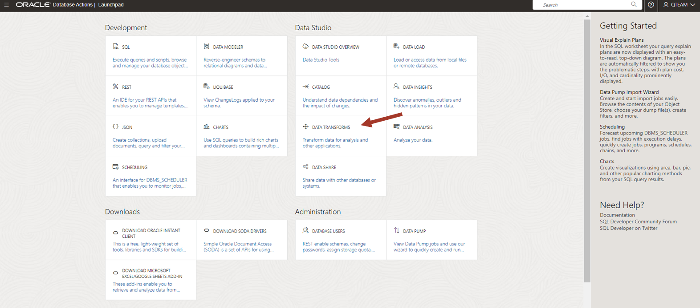

2.  Enter QTEAM for user name and the password "AAbbcc123456" for the password.

    

3.  You will see a provisioning screen like below.

    

4.  It will take up to 3-5 minutes for the service to be started for the first time. Once
    provisioned you will see the following home screen.

    >**Note:** The Data Transforms tool is provisioned based on demand. After 10 minutes of 
    inactivity, it will go into sleep mode and needs to
    be started again. Maximum timeout can be configured in the tools configuration menu from the Autonomous AI Database OCI console. Subsequent start time will be much smaller than the first time.  Clicking on any part of the UI will start the service again if it has gone into sleep mode. If you get any error, then
    refresh your browser.

    

## Task 2: Update the connection to your Autonomous AI Database

1.  Click on **Connections** on the left side to look at the available connections.
    
    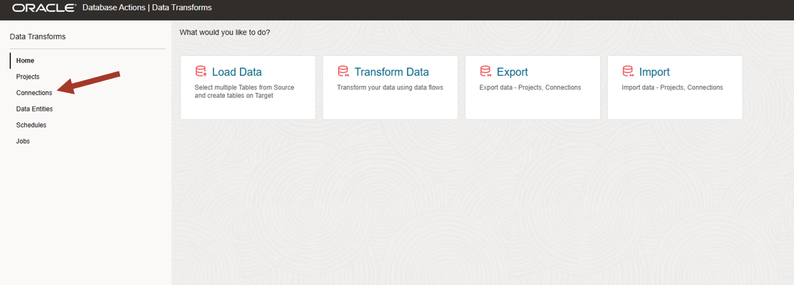 

2.  You will notice that there is one connection already defined. Click on the connection to complete its configuration. 

    

3.  Under the **JDBC URL**, paste in the name of your Autonomous AI Database into the string between the @ symbol and the "\_low". The name of your database will be 'adwNNNNN', that is 'adw' followed by five numbers. You will be able to see the database name in the URL being accessed by your browser. For example, in the screenshot below, the string needs to be updated to "adw45989":

    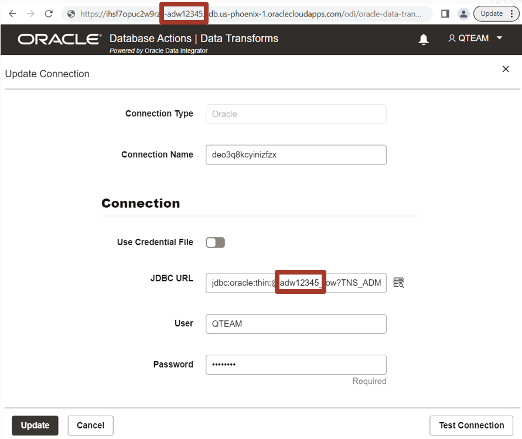

4.  Enter QTEAM for user name and the password "AAbbcc123456" and click on Test Connection. After
    a successful connection a notification message will appear on the top
    right.

    

4.  If the notification message disappears then you can get it back by
    clicking on the bell icon on the top right. Throughout this tool, you
    will have notification messages available by clicking on the bell
    icon.

    After successful test, click on the **Update** to save the connection configuration. 

    

>**Note:** In this workshop, we are working with only the data available in
our Autonomous AI Database, but you can create connections to other
databases, object stores and applications as well as load and transform
data from those sources to your Autonomous AI Database. Data Transforms is
a complete tool for complex data integration projects.

Now we are ready to prepare the data.

## Task 3: Import table definitions

1.  Before you work on any project you need to have table definitions for the tables you will be working on. You can import the definitions from your connections. You can also manually create the definitions if you are creating new tables. In our lab we are simply working on the tables already present in our Autonomous AI Database. Some entities are already present in our pre-provisioned environment but not all. Click on **Data Entities** on the left side to look at available tables. Then click on **Import Data Entities** and select connection and schema QTEAM. Click **Start**.
    
     

2.  Clock on the **OK** for the import job. This job will run into the background and after few minutes you can refresh the list. You should be able to **CUSTOMER\_SALES\_ANALYSIS** table in the list.
    
     

     

## Task 4: Create a data flow to load a new table to analyze customer sales

>**Note:** In this environment, a Data Transforms project and an empty data flow and a partially created data flow has been pre-created. You will update the existing data flow to perform the data transformations required.

1.  Click on the **Projects** button on the left side

    

2.  Click the **SalesData** project. You will find the following data flow:
   
   **load\_customer\_sales\_analysis** : This is an empty data flow. Use this to go through all the transforms creation steps in this workshop.

    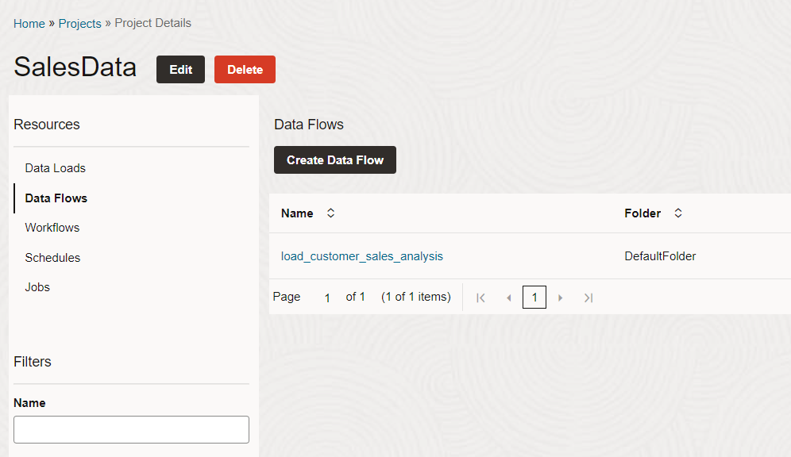

    >**Note:** In this environment, You also have a second project called **SalesData-Lazy**. This project has a partially created project. If you are running out of time then you can use it to study the data flow and complete it for saving time. You only need to connect the target table in this pre created data flow and configure it for execution. You can directly jump to step 19 to complete the flow.

3.  A window will pop up to **Add a Schema**. Make sure the Schema is set to **QTEAM** and click OK. The schema will then appear under **Data Entities**. Expand the schema to show the tables.

    

    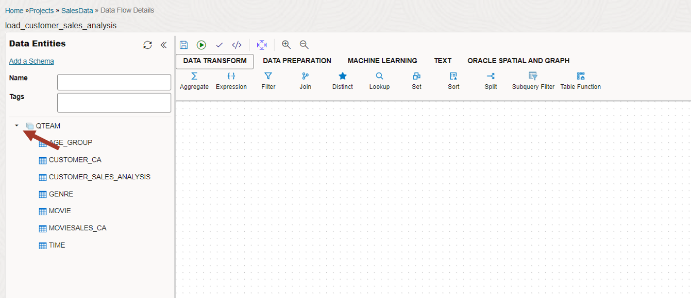

4.  Now we are ready to build the data flow. 
    
    We want to aggregate the
    sales per customer to create 5 quintile buckets to determine
    customer value.

    First, we will drag **MOVIESALES\_CA** into the canvas and drag
    the **Aggregate** transform from above under the **Data Transform** group.
    Next, drag the **Quantile Binning** transform into the canvas. This
    transform is in the **Data Preparation** group above.
    
    There are many transforms available under different groups to build
    the desired data flow. For this workshop, we will use a few of them.
    
    This should look like the below screenshot.

    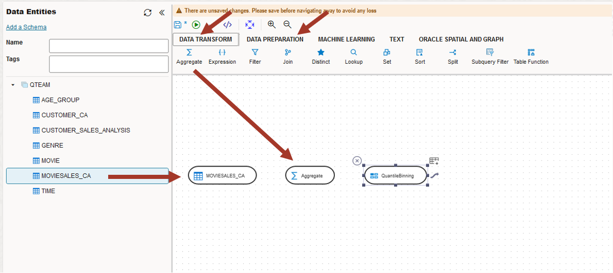

5.  Click on **MOVIESALES\_CA,** and Link it to the **Aggregate**
    transform by dragging the little arrow on top of the **Aggregate**
    transforms. Follow this process to link transform steps in the rest
    of the workshop.

    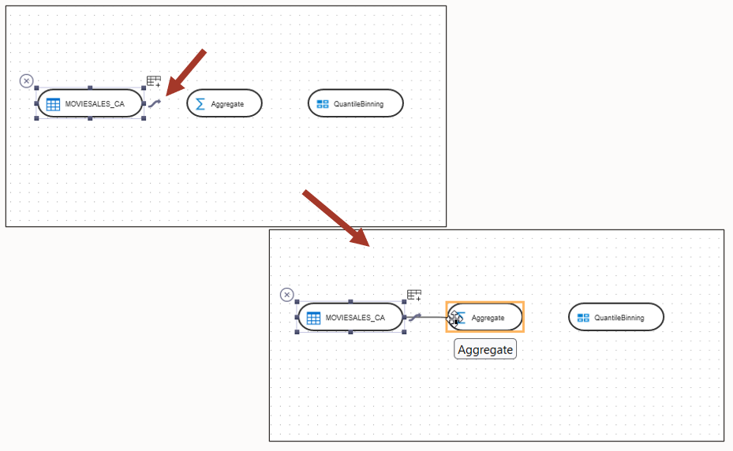

6.  Now let's edit the properties of the Aggregate transform. Click on
    the Aggregate transform and then click on the attribute icon on the
    right-side properties panel. You should also expand the properties
    panel by clicking on the top right corner icon.

    

7.  Click on Attributes on the left side. You can edit this attribute
    list. By default all the columns from previous step have been brought in. 
    Since we need to aggregate total sales values by customer id, we will remove everything 
    except **CUST\_ID** and **TOTAL\_SALES**. 
    
    Click on the checkboxes against the attributes to be removed (as shown in the screenshot below)
    and click the delete icon on the right side to remove them.

    

8. Now change the name of **TOTAL\_SALES** to **CUST\_SALES** to make it
    more meaningful. This will be aggregated sales for the customer. It
    should look like the below screenshot.

    

9. Now click on Column Mapping on the left side to define the aggregate
    expression. You can populate these expressions by **Auto Map** and
    edit them as needed. Click on **Auto Map** to populate it by name.

    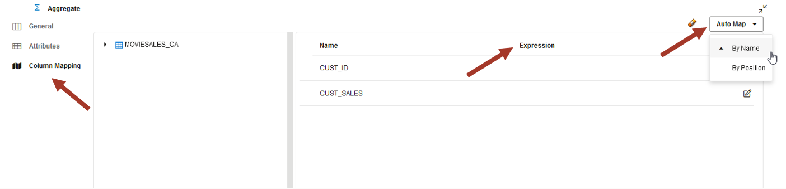

10. Auto Map populated only the **CUST\_ID** and could not find a match for
    **CUST\_SALES** since we had changed the attribute name. We can either
    type in the aggregate expression directly in the blank space or use
    the expression editor on the right side. Click on the expression
    editor icon.

    

11. This will open the expression editor. You can drag source attributes
    from the left side in the editor and write a suitable expression.

    Enter the following expression: **SUM ( MOVIESALES\_CA.TOTAL\_SALES )**

    Click **OK**

    

12. Review the screenshot below. The **CUST\_SALES** attribute is mapped to
    the sum of **TOTAL\_SALES** grouped by **CUST\_ID**.

    Now collapse the properties panel by clicking on the icon in the right
    corner.

    You will follow a similar process for editing the properties in the rest
    of the workshop.

    

13. Now link the Aggregate transform to the Quantile Binning transform,
    click on the Quantile Binning transform and open the properties
    panel.

    

14. In the attributes section, click on **OUTPUT1**.

    Change the name **Return** to **CUST\_VALUE**. Quantile Binning output
    will go into the **CUST\_VALUE** attribute.
    
    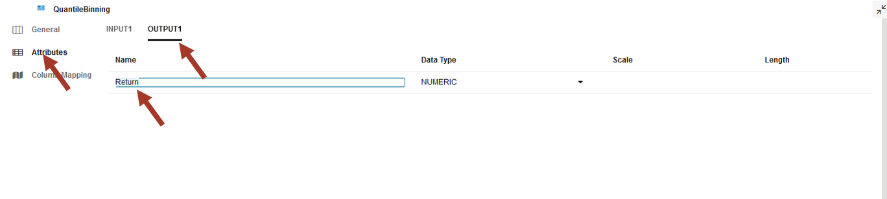

15. Click on the Column Mapping and enter 5 for the **number of
    buckets** expression. Drag **CUST\_SALES** from the aggregate into the
    **order** expression.

    It means that aggregate customer sales will be used to divide
    customers into 5 buckets. This will be used to indicate the value of customers.

    

16. Close the property panel by clicking on the right corner and come to
    the main canvas.

    Now you have the basic skills to add data sources and transforms, and edit their properties.
    
    Next, bring the **Join** transform from "DATA TRANSFORMS" grouping into the canvas,
    drag the **CUSTOMER\_CA** table and join it with the previous flow as below.
    
    Click on the Attribute property of the Join and notice that it has
    populated the join automatically. You can also edit it manually if it
    is not what you expect.
    
    Make sure the join is: **Aggregate.CUST\_ID=CUSTOMER\_CA.CUST\_ID**

    

    >**Note:** It is good practice to keep saving. Click on the **Save** icon
    on the top left (floppy disk icon).

17. Now bring in the **AGE\_GROUP** table and use the Lookup transform. Link it as
    described below.

    First link the end of the data flow to Lookup and then link **AGE\_GROUP** to lookup.

    >**Note:** The order of linking matters for lookup transform. **AGE\_GROUP**
    Should be the lookup source. Check the property panel on the right. If it is not correct
    then remove the links by hovering and hitting the red X and link it again.

    The default lookup condition is blank. Copy the following expression into the lookup condition window.: 
    **CUSTOMER\_CA.AGE between AGE\_GROUP.MIN\_AGE and AGE\_GROUP.MAX_AGE**
    
    Note that you can also optionally use the expression editor.
    
    >**Note:** Take a moment to notice that we are building the data flow step by
    step and this way it is easy to understand. This is an advantage of
    using UI to define a complete data preparation task which could be
    quite complex.

    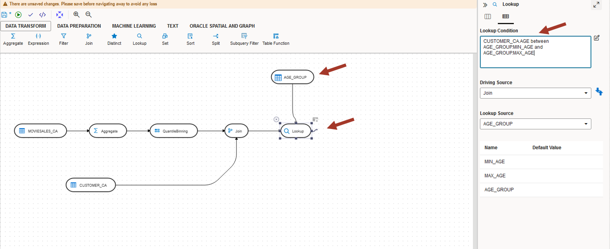

18. Now we need to bring in the transaction data again which will be
    used for analysis later. Drag **MOVIESALES\_CA** from the left side entity browser into the canvas again.

    >**NOTE:** Notice that the display name for this is MOVIESALES\_CA1
    (suffixed by 1). This is because this table is used twice in the data
    flow. First for calculating the quintile and the second time to bring
    individual sales transaction data.

    Join this table with the output of lookup using the join transform. The join expression should be populated 
    automatically but may need to be changed depending on how the join tool was created. Click on the join transform.

    Make sure the join is: **Aggregate.CUST\_ID=MOVIESALES\_CA1.CUST\_ID**
        
    >**NOTE:** Join conditions are automatically populated if a matching column name is found. 
    If there are multiple tables with the same column name then it guesses which table need 
    to be in the join. If you notice that your join condition is different 
    than above then replace it by copy and paste form here.
    
    Next, bring in the movie GENRE table and join it. The join expression should be populated automatically.
    Look at the screenshot.
    
    Click on the join and make sure the join is: **MOVIESALES\_CA1.GENRE_ID=GENRE.GENRE\_ID**
    
    It should look like the below screenshot.
    
    It is good practice to keep saving it by clicking on the **Save** icon
    on the top left.

    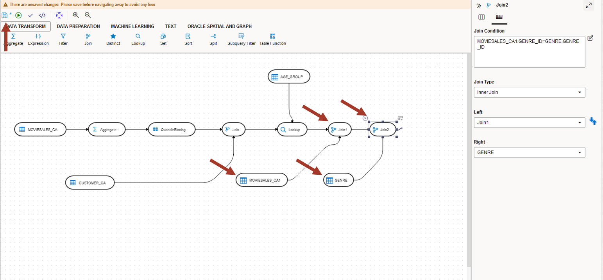

19. We have completed the data flow. It may look complex, but one can
    visualize the step-by-step transformations. Now we need to write it
    to the target **CUSTOMER\_SALES\_ANALYSIS** table. This target table will be used for further analysis in subsequent labs.

    Drag the this table from the entity browser on the left side into the canvas.

    >**Note:** It is possible to create a brand new target table in the data flow as well, however for simplicity we are using a pre-created table definition in this workshop.
    
    

20. Now we need to make sure the target load properties are correct. Click on
    the target table in the canvas and expand the property panel by
    clicking on the top right corner.

    

21. Click on Column Mapping and verify the expressions. Notice that
    all have been populated properly. You can also edit them manually if
    you want to make changes. Make sure all the columns are mapped. You
    can also use auto-mapping functionality if you create new
    attributes or if some expressions are blank.

    These mapping expressions are the key to populating the target columns 
    from the right source and with the right expression.

    

22. Now to the final step. Click on **Options**.

    Make sure the property **Drop and create target table** is **true**.
    
    This makes sure that you always have the correct definition.
    
    You can also choose to load data into an existing table with or without
    truncating. Data can also be loaded incrementally. These are advanced
    modes. For now, we will simply drop and create the table in every
    execution.

    

23. Collapse the property panel and go back to the main canvas. Save it
    and validate it by clicking on the validate icon (looks like a small
    check mark).

    It should show no errors. If you do get an error then go back to your data 
    flow steps and fix it. Most probably errors are due to unmapped attributes 
    or incorrect expressions.

    

24. Now execute it by clicking on the small green triangle in the circle.
    Confirm **Start**. 

    

    You will get a job info dialog. Click **OK**.

25. Our data flow execution status is on the bottom right-side panel. Click
    anywhere on the empty canvas to make it visible. Now we need to look
    at the data.

    

26. Click on the target table and see a data preview by clicking on
    the small eye icon. Expand the panel to see more.

    

27. Check that all columns are populated. If some columns are blank,
    then it means some mapping expression in the data flow was blank or
    incorrect. Go back and fix it and re-execute it.

    

28. Next, check the **Statistics** tab for a quick data profile.

    

For now, it is just a cursory data glance. We will need to use the **Data Analysis** 
tool to analyze this data and find many interesting patterns.

## Task 5: How to debug

>**Note:** This is for advanced users. Skip if you don't have any errors and you want 
to straight go to the next lab.

1.  Go back to the data flow canvas and click on the empty space in the
    canvas. On the top, there is a Code Simulation icon. Click on it. This
    will show you the code to be generated.

    

2.  Look at the generated SQL. Imagine writing this SQL without the
    graphical interface. It is complex. Isn't it? 
    Advanced users will find this useful for debugging purposes.

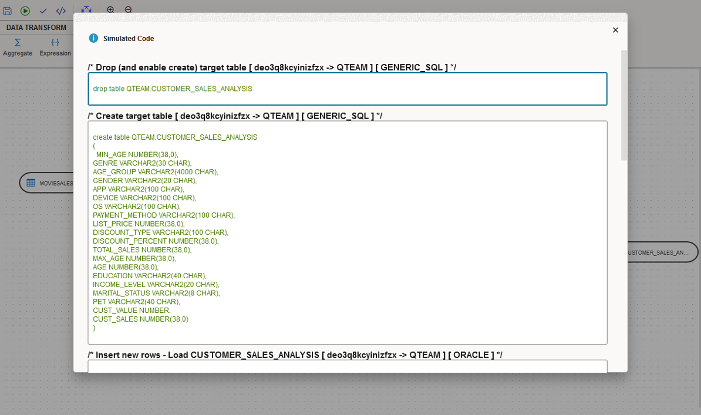

3.  Next, look at the **Data Flow Status** on the right side. If there are
    any errors, then you can click on the **Execution Job** in the
    **Data Flow Status** panel to debug. It will take you to the jobs
    screen where you can look at the executed steps, processed row
    counts and corresponding SQL.

    

4.  Notice different steps in the execution. You can also get the
    executed SQL (same as the simulated SQL seen earlier) by clicking
    on the step.
    
    To go back to your data flow, click on the **Design Object** link.
    
    From anywhere in the UI, you can go back to the Home screen by clicking on
    the top left link.

    

## RECAP

In this lab, we used the Data Transforms tool to calculate customer value from sales data, and combine it
with the customer, age group and movie genre information to load into a target table to be 
used for data analysis. 

Note that we scratched only the surface. Other features are:

-   **Variety of data sources**: Databases, Object Store, REST API and Fusion
    Application

-   **Load Data:** Load multiple tables in a schema from another data
    source. It can also integrate with Oracle Golden Gate Cloud Service for advanced
    replication. This complements the Data Load tool explored in the earlier
    lab.

-   **Workflow:** Combine several data flows to run sequentially or in parallel.

-   **Schedule:** In-built scheduler for periodic execution.

You may now **proceed to the next lab**.

## Acknowledgements

- Created By/Date - Jayant Mahto, Product Manager, Autonomous AI Database, January 2023
- Contributors - Mike Matthews, Bud Endress, Ashish Jain, Marty Gubar, Rick Green
- Last Updated By - Jayant Mahto, August 2023

Copyright (C)  Oracle Corporation.
