# Transform your data for analysis


## Introduction

This lab introduces the Data Transforms tool built into the Oracle Autonomous AI Database and shows the various ways you can prepare data for analysis.

Estimated Time: 25 minutes

<!--
Watch the video below for a quick walk-through of the lab.
[Create a database user](videohub:1_t22mdnao)
-->

### Objectives

In this workshop, you will learn:
-	How to transform and prepare your data for analysis

### Prerequisites

To complete this lab, you need to have completed the previous labs, so that you have:

- Created an Autonomous AI Database instance
- Created a new QTEAM user with appropriate roles
- Loaded the demo data 
- Loaded Age group data into AGE\_GROUP 

### Demo data for this lab
>**NOTE:** Skip this section if you have demo data loaded and completed previous labs.

If you have not completed the previous labs you can run the following script in SQL Worksheet to load all necessary objects.

*For copy/pasting, be sure to click the convenient __Copy__ button in the upper right corner of the following code snippet.*: 

```
<copy>
DROP TABLE CUSTOMER_CA;
 
CREATE TABLE CUSTOMER_CA 
    ( 
     CUST_ID        NUMBER , 
     AGE            NUMBER , 
     EDUCATION      VARCHAR2 (40) , 
     GENDER         VARCHAR2 (20) , 
     INCOME_LEVEL   VARCHAR2 (20) , 
     MARITAL_STATUS VARCHAR2 (8) , 
     PET            VARCHAR2 (40) 
    ) 
;

DROP TABLE MOVIESALES_CA;
 
CREATE TABLE MOVIESALES_CA 
    ( 
     DAY_ID           DATE , 
     GENRE_ID         NUMBER , 
     MOVIE_ID         NUMBER , 
     CUST_ID          NUMBER , 
     APP              VARCHAR2 (100) , 
     DEVICE           VARCHAR2 (100) , 
     OS               VARCHAR2 (100) , 
     PAYMENT_METHOD   VARCHAR2 (100) , 
     LIST_PRICE       NUMBER , 
     DISCOUNT_TYPE    VARCHAR2 (100) , 
     DISCOUNT_PERCENT NUMBER , 
     TOTAL_SALES      NUMBER 
    ) 
;

DROP TABLE GENRE;

CREATE TABLE GENRE 
    ( 
     GENRE_ID NUMBER , 
     GENRE    VARCHAR2 (30) 
    ) 
;


CREATE UNIQUE INDEX PK_GENRE_ID ON GENRE 
    ( 
     GENRE_ID ASC 
    ) 
;

ALTER TABLE GENRE 
    ADD CONSTRAINT PK_GENRE_ID PRIMARY KEY ( GENRE_ID ) 
    USING INDEX PK_GENRE_ID 
;

DROP TABLE MOVIE;

CREATE TABLE MOVIE 
    ( 
     MOVIE_ID     NUMBER , 
     TITLE        VARCHAR2 (200) , 
     BUDGET       NUMBER , 
     GROSS        NUMBER , 
     LIST_PRICE   NUMBER , 
     GENRES       VARCHAR2 (4000) , 
     SKU          VARCHAR2 (30) , 
     YEAR         NUMBER , 
     OPENING_DATE DATE , 
     VIEWS        NUMBER , 
     CAST         VARCHAR2 (4000) , 
     CREW         VARCHAR2 (4000) , 
     STUDIO       VARCHAR2 (4000) , 
     MAIN_SUBJECT VARCHAR2 (4000) , 
     AWARDS       VARCHAR2 (4000) , 
     NOMINATIONS  VARCHAR2 (4000) , 
     RUNTIME      NUMBER , 
     SUMMARY      VARCHAR2 (16000) 
    ) 
;

DROP TABLE TIME;

CREATE TABLE TIME 
    ( 
     DAY_ID           DATE , 
     DAY_NAME         VARCHAR2 (36) , 
     DAY_OF_WEEK      NUMBER , 
     DAY_OF_MONTH     NUMBER , 
     DAY_OF_YEAR      NUMBER , 
     WEEK_OF_MONTH    NUMBER , 
     WEEK_OF_YEAR     NUMBER , 
     MONTH_OF_YEAR    NUMBER , 
     MONTH_NAME       VARCHAR2 (36) , 
     MONTH_SHORT_NAME VARCHAR2 (12) , 
     QUARTER_NAME     VARCHAR2 (7) , 
     QUARTER_OF_YEAR  NUMBER , 
     YEAR_NAME        NUMBER 
    ) 
;

DROP TABLE AGE_GROUP;

CREATE TABLE AGE_GROUP 
    ( 
     MIN_AGE   NUMBER , 
     MAX_AGE   NUMBER , 
     AGE_GROUP VARCHAR2 (4000) 
    ) 
;

DROP TABLE CUSTOMER_SALES_ANALYSIS;

CREATE TABLE CUSTOMER_SALES_ANALYSIS
(
  MIN_AGE NUMBER(38),
GENRE VARCHAR2(30 CHAR),
AGE_GROUP VARCHAR2(4000 CHAR),
GENDER VARCHAR2(20 CHAR),
APP VARCHAR2(100 CHAR),
DEVICE VARCHAR2(100 CHAR),
OS VARCHAR2(100 CHAR),
PAYMENT_METHOD VARCHAR2(100 CHAR),
LIST_PRICE NUMBER(38),
DISCOUNT_TYPE VARCHAR2(100 CHAR),
DISCOUNT_PERCENT NUMBER(38),
TOTAL_SALES NUMBER(38),
MAX_AGE NUMBER(38),
AGE NUMBER(38),
EDUCATION VARCHAR2(40 CHAR),
INCOME_LEVEL VARCHAR2(20 CHAR),
MARITAL_STATUS VARCHAR2(8 CHAR),
PET VARCHAR2(40 CHAR),
CUST_VALUE NUMBER,
CUST_SALES NUMBER(38)
);

set define on
define file_uri_base = 'https://objectstorage.us-ashburn-1.oraclecloud.com/p/zL6bsboZrSxJP-0ilfUpROTwwyhzvkUrZu9OEwcU5_B_NAGzHKBG_WqW2OnNYxKk/n/c4u04/b/datastudio/o/prepareandanalyze'

begin
 dbms_cloud.copy_data(
    table_name =>'CUSTOMER_CA',
    file_uri_list =>'&file_uri_base/CUSTOMER_CA.csv',
    format =>'{"type" : "csv", "skipheaders" : 1}'
 );
 dbms_cloud.copy_data(
    table_name =>'MOVIESALES_CA',
    file_uri_list =>'&file_uri_base/MOVIESALES_CA.csv',
    format =>'{"type" : "csv", "skipheaders" : 1}'
 );
 dbms_cloud.copy_data(
    table_name =>'GENRE',
    file_uri_list =>'&file_uri_base/GENRE.csv',
    format =>'{"type" : "csv", "skipheaders" : 1}'
 );
 dbms_cloud.copy_data(
    table_name =>'MOVIE',
    file_uri_list =>'&file_uri_base/MOVIE.csv',
    format =>'{"type" : "csv", "skipheaders" : 1}'
 );
 dbms_cloud.copy_data(
    table_name =>'TIME',
    file_uri_list =>'&file_uri_base/TIME.csv',
    format =>'{"type" : "csv", "skipheaders" : 1}'
 );
 dbms_cloud.copy_data(
    table_name =>'AGE_GROUP',
    file_uri_list =>'&file_uri_base/AGE_GROUP.csv',
    format =>'{"type" : "csv", "skipheaders" : 1}'
 );
 FOR TNAME IN (SELECT table_name FROM user_tables  where table_name like 'COPY$%') LOOP
 EXECUTE IMMEDIATE ('DROP TABLE ' || TNAME.table_name || ' CASCADE CONSTRAINTS PURGE');
 END LOOP;
end;
/
</copy>
```

Paste the SQL statements in the worksheet. Click on the **Run Script** icon.

While the script is running, you will see the message "Executing code" at the bottom of the window. 
The message will change to "SQL executed by QTEAM" when in finishes. There should not be any errors.

>**Note:** Expect to receive "ORA-00942 table or view does not exist" errors during the DROP TABLE command for the first execution of the script, but you should not see any other errors.


Now you are ready to go through the rest of the labs in this workshop.

## Task 1: Launch Data Transforms

For this lab, we will try to find high-value customers. We can use sales data to assign
customer value. We can rank the customers into five quintiles based on
how much they have paid for movies and load them into a new
**CUSTOMER\_SALES\_ANALYSIS** table.

We will also denormalize this table with interesting customer
attributes for analysis from the **CUSTOMER\_CA, AGE\_GROUP** and **GENRE** tables.

This is an example of preparing data for an intended purpose. Our
purpose is to find high-value customers and find any patterns in the
sales data by data analysis.

The **Data Transforms** tool makes such data preparation tasks easy.

1.  Click on the **Data Transforms** card to launch the tool.

    >**NOTE:** If you don't see the **Data Transforms** card then it means you are
    missing the **DATA\_TRANSFORM\_USER** role for your user. Login as ADMIN and
    grant the role (make sure this role is marked "Default" as well).

    

2.  Provide QTEAM for username and the password for the database user QTEAM.

    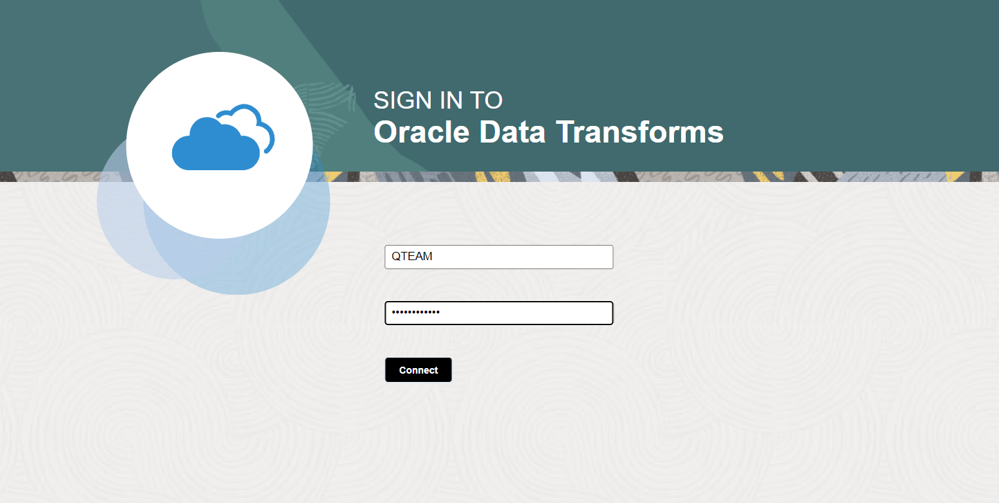

3.  You will see a provisioning screen like below.

    

4.  It will take up to 3-5 minutes for the service to be started for the first time. Once
    provisioned you will see the following home screen.

    >**Note:** The Data Transforms tool is provisioned on demand. After 10 minutes of 
    inactivity, it will go into sleep mode and needs to
    be started again. The maximum timeout can be configured in the tools configuration menu from the Autonomous AI Database OCI console. Subsequent start time will be much smaller than the first time.  Clicking on any part of the UI will start the service again if it has gone into sleep mode. If you get any error, then
    refresh your browser.

    

## Task 2: Set up a connection

1.  Click on **Connections** on the left side to look at available
    connections.

    

2.  You will notice that there is one connection already defined. This connection 
    is to your Autonomous AI Database. Click on the connection to complete its configuration. 
    This is a one-time activity.

    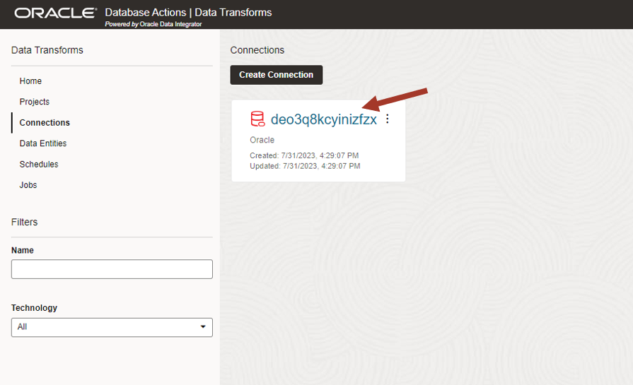

3.  Enter QTEAM for user name and the password and click on Test Connection. After
    a successful connection a notification message will appear on the top
    right.

    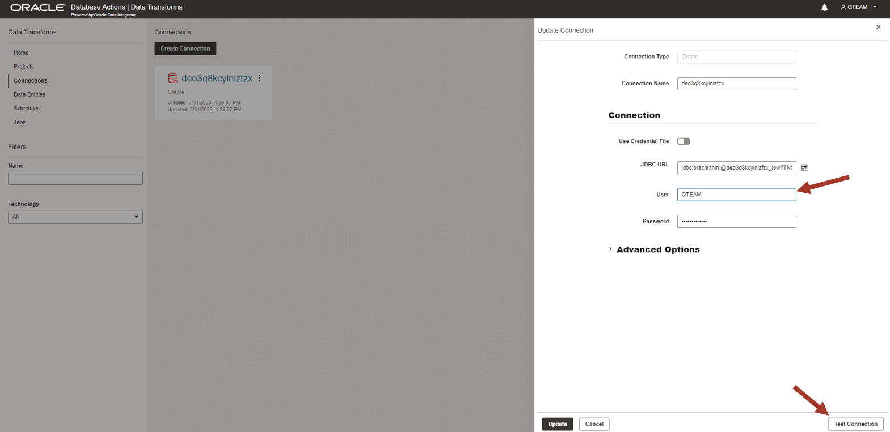

4.  If the notification message disappears then you can get it back by
    clicking on the bell icon on the top right. Throughout this tool, you
    will have notification messages available by clicking on the bell
    icon.

    After successful test, click on the **Update** to save the connection configuration. 

    

>**Note:** In this workshop, we are working with only the data available in
our Autonomous AI Database, but you can create connections to other
databases, object stores and applications, and then load and transform
data from these sources to your Autonomous AI Database. Data Transforms is
a complete tool for complex data integration projects.

Now we are ready to prepare the data.

## Task 3: Create a data flow to load a new table to analyze customer sales

1.  Click on the **Home** button on the left side to go back to the home
    screen. You have wizards to load data from other sources (as defined
    in connections) and transform data. Since our data is already
    loaded in our Autonomous AI Database in the previous lab, we will click
    on the **Transform Data** wizard.

    

2.  Enter the name and description of the data flow.

    Name: **load_customer\_sales\_analysis**
    
    Description: **Load customer sales table with quintiles and other
    attributes**
    
    A good description helps you understand the objective of the data
    flow.
    
    Since we are working on this tool for the first time, we don't have a
    project. Click on + to create a project. Type in **SalesData** for
    the project name.
    
    Click **Next**.

    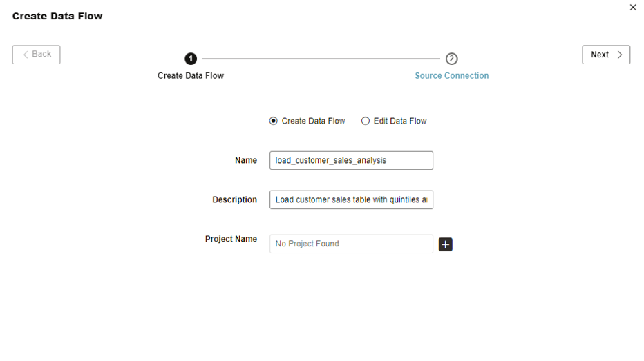

3.  Select the only connection from the dropdown list and pick **QTEAM**
    from the schema drop-down list.
    
    Click on **Save**.

    

4.  This will bring up the data flow editing screen. On the left side, you
    will see the message "Importing Data Entities" next to the **QTEAM**
    user. It will take approximately 4-5 minutes to import all data
    entity definitions and then the message will disappear.

    >**Note:** Import of data entities takes place automatically as part of data flow creation only for 
    the first time you are using the connection. Other times you need to 
    explicitly import the data entity definitions from your connection before 
    creating the data flow. You can also import the QTEAM entities manually by right click and import 
    entities menu. 

    While the import is taking place, you can go to the next step to learn 
    navigation on the data flow editor page.

    When the import is finished, you can expand QTEAM to see all the tables in the schema. You can also refresh the data entities at any time with the refresh icon.

    

5.  Now let us learn how to navigate in the data flow editing screen.
    Refer to the numbered zones in the screenshot below.

    1: Main editing canvas to create data flows by combining various
    transforms
    
    2: Data Entity browser. Data Entities can be used as a source or
    target for the data flow. You can add more connections by clicking on
    the + icon (we don't need to) and filter entities by name or tag if
    the list is big. Entities are dragged into the main canvas to build a
    data flow.
    
    3: Transformations are grouped under various categories. Click on
    different groups to see what kinds of transforms are available. Basic
    transforms are under the **Data Transform** and **Data Preparation**
    groups. These transforms are dragged into the main canvas to build a
    data flow.
    
    4: Properties: By clicking on any source/target entity or on a
    transform step, you can view and edit various properties.
    
    5: Save, execute, and validate.
    
    6: When you click on the empty part of the main canvas then it gives
    you the execution status of the data flow.

    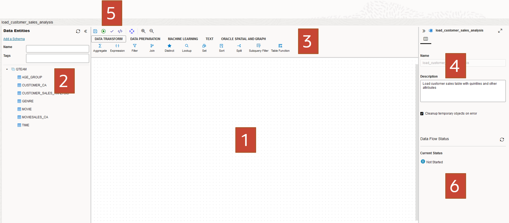

6.  Wait for the entity import to complete. After that, you will see all the tables in your 
    schema listed on the left side. Refresh it anytime to see the latest entity list.
    Now we are ready to build the data flow. 
    
    We want to aggregate the
    sales per customer to create 5 quintile buckets to determine
    customer value.

    First, we will drag **MOVIESALES\_CA** into the canvas and drag
    the **Aggregate** transform from above under the **Data Transform** group.
    Next, drag the **Quantile Binning** transform into the canvas. This
    transform is in the **Data Preparation** group above.
    
    There are many transforms available under different groups to build
    the desired data flow. For this workshop, we will use a few of them.
    
    This should look like the below screenshot.

    

7.  Click on **MOVIESALES\_CA,** and Link it to the **Aggregate**
    transform by dragging the little arrow on top of the **Aggregate**
    transforms. Follow this process to link transform steps in the rest
    of the workshop.

    

8.  Now let's edit the properties of the Aggregate transform. Click on
    the Aggregate transform and then click on the attribute icon on the
    right-side properties panel. You should also expand the properties
    panel by clicking on the top right corner icon.

    

9.  Click on Attributes on the left side. You can edit this attribute
    list. By default all the columns from previous step have been brought in. 
    Since we need to aggregate total sales values by customer id, we will remove everything 
    except **CUST\_ID** and **TOTAL\_SALES**. 
    
    Click on the checkboxes against the attributes to be removed (as shown in the screenshot below)
    and click the delete icon on the right side to remove them.

    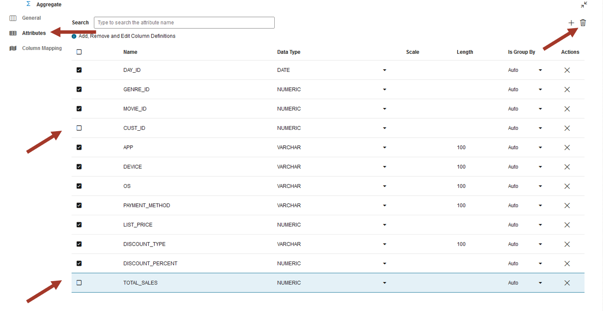

10. Now change the name of **TOTAL\_SALES** to **CUST\_SALES** to make it
    more meaningful. This will be aggregated sales for the customer. It
    should look like the below screenshot.

    

11. Now click on Column Mapping on the left side to define the aggregate
    expression. You can populate these expressions by **Auto Map** and
    edit them as needed. Click on **Auto Map** to populate it by name.

    

12. Auto Map populated only the **CUST\_ID** and could not find a match for
    **CUST\_SALES** since we had changed the attribute name. We can either
    type in the aggregate expression directly in the blank space or use
    the expression editor on the right side. Click on the expression
    editor icon.

    

13. This will open the expression editor. You can drag source attributes
    from the left side in the editor and write a suitable expression.

    Enter the following expression: **SUM ( MOVIESALES\_CA.TOTAL\_SALES )**

    Click **OK**

    

14. Review the screenshot below. The **CUST\_SALES** attribute is mapped to
    the sum of **TOTAL\_SALES** grouped by **CUST\_ID**.

    Now collapse the properties panel by clicking on the icon in the right
    corner.

    You will follow a similar process for editing the properties in the rest
    of the workshop.

    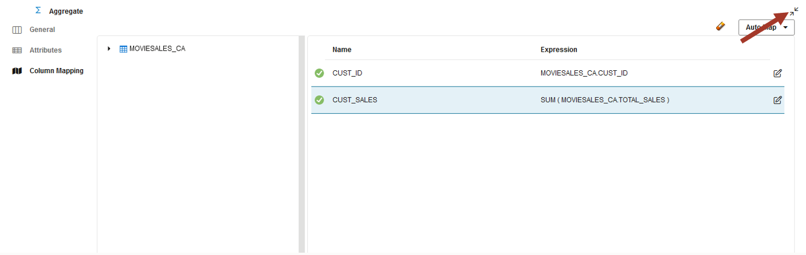

15. Now link the Aggregate transform to the Quantile Binning transform,
    click on the Quantile Binning transform and open the properties
    panel.

    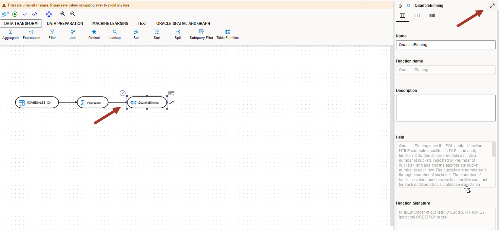

16. In the attributes section, click on **OUTPUT1**.

    Change the name **Return** to **CUST\_VALUE**. Quantile Binning output
    will go into the **CUST\_VALUE** attribute.
    
    

17. Click on the Column Mapping and enter 5 for the **number of
    buckets** expression. Drag **CUST\_SALES** from the aggregate into the
    **order** expression.

    It means that aggregate customer sales will be used to divide
    customers into 5 buckets. This will be used to indicate the value of customers.

    

18. Close the property panel by clicking on the right corner and come to
    the main canvas.

    Now you have the basic skills to add data sources and transforms, and edit their properties.
    
    Next, bring the **Join** transform from "DATA TRANSFORMS" grouping into the canvas,
    drag the **CUSTOMER\_CA** table and join it with the previous flow as below.
    
    Click on the Attribute property of the Join and notice that it has
    populated the join automatically. You can also edit it manually if it
    is not what you expect.
    
    Make sure the join is: **Aggregate.CUST\_ID=CUSTOMER\_CA.CUST\_ID**

    

    >**Note:** It is good practice to keep saving. Click on the **Save** icon
    on the top left (floppy disk icon).

19. Now bring in the **AGE\_GROUP** table and use the Lookup transform. Link it as
    described below.

    First link the end of the data flow to Lookup and then link **AGE\_GROUP** to lookup.

    >**Note:** The order of linking matters for lookup transform. **AGE\_GROUP**
    Should be the lookup source. Check the property panel on the right. If it is not correct
    then remove the links by hovering and hitting the red X and link it again.

    The default lookup condition is blank. Copy the following expression into the lookup condition window.: 
    **CUSTOMER\_CA.AGE between AGE\_GROUP.MIN\_AGE and AGE\_GROUP.MAX_AGE**
    
    Note that you can also optionally use the expression editor.
    
    >**Note:** Take a moment to notice that we are building the data flow step by
    step and this way it is easy to understand. This is an advantage of
    using UI to define a complete data preparation task which could be
    quite complex.

    

20. Now we need to bring in the transaction data again which will be
    used for analysis later. Drag **MOVIESALES\_CA** from the left side entity browser into the canvas again.

    >**NOTE:** Notice that the display name for this is MOVIESALES\_CA1
    (suffixed by 1). This is because this table is used twice in the data
    flow. First for calculating the quintile and the second time to bring
    individual sales transaction data.

    Join this table with the output of lookup using the join transform. The join expression should be populated 
    automatically Look at the screenshot for how they need to be linked. Click on the join transform.

    Make sure the join is: **Aggregate.CUST\_ID=MOVIESALES\_CA1.CUST\_ID**
        
    >**NOTE:** Join conditions are automatically populated if a matching column name is found. 
    If there are multiple tables with the same column name then it guesses which table need 
    to be in the join. If you notice that your join condition is different 
    than above then replace it by copy and paste form here.
    
    Next, bring in the movie GENRE table and join it. The join expression should be populated automatically.
    Look at the screenshot.
    
    Click on the join and make sure the join is: **MOVIESALES\_CA1.GENRE_ID=GENRE.GENRE\_ID**
    
    It should look like the below screenshot.
    
    It is good practice to keep saving it by clicking on the **Save** icon
    on the top left.

    

21. We have completed the data flow. It may look complex, but one can
    visualize the step-by-step transformations. Now we need to write the data
    to the target **CUSTOMER\_SALES\_ANALYSIS** table. This target table will be used for further analysis in subsequent labs.

    Drag this table from the entity browser on the left side into the canvas.

    >**Note:** It is possible to create a brand new target table in the data flow as well. However for simplicity we are using a pre-created table definition in this workshop.
    
    

22. Now we need to make sure the target load properties are correct. Click on
    the target table in the canvas and expand the property panel by
    clicking on the top right corner.

    

23. Click on Column Mapping and verify the expressions. Notice that
    all have been populated properly. You can also edit them manually if
    you want to make changes. Make sure all the columns are mapped. You
    can also use auto-mapping functionality if you create new
    attributes or if some expressions are blank.

    These mapping expressions are the key to populating the target columns 
    from the right source and with the right expression.

    

24. Now to the final step. Click on **Options**.

    Make sure the property **Drop and create target table** is **true**.
    
    This makes sure that you always have the correct definition.
    
    You can also choose to load data into an existing table with or without
    truncating. Data can also be loaded incrementally. These are advanced
    modes. For now, we will simply drop and create the table in every
    execution.

    

25. Collapse the property panel and go back to the main canvas. Save it
    and validate it by clicking on the validate icon (looks like a small
    check mark).

    It should show no errors. If you do get an error then go back to your data 
    flow steps and fix it. Most probably errors are due to unmapped attributes 
    or incorrect expressions.

    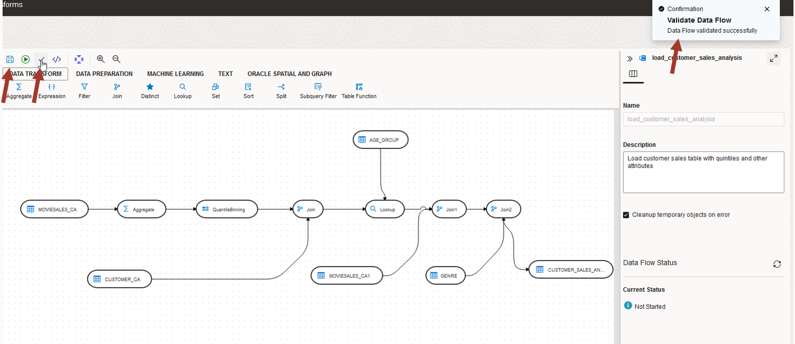

26. Now execute it by clicking on the small green triangle in the circle.
    Confirm **Start**. 

    

    You will get a job info dialog. Click **OK**.

27. Our data flow execution status is on the bottom right-side panel. Click
    anywhere on the empty canvas to make it visible. Now we need to look
    at the data.

    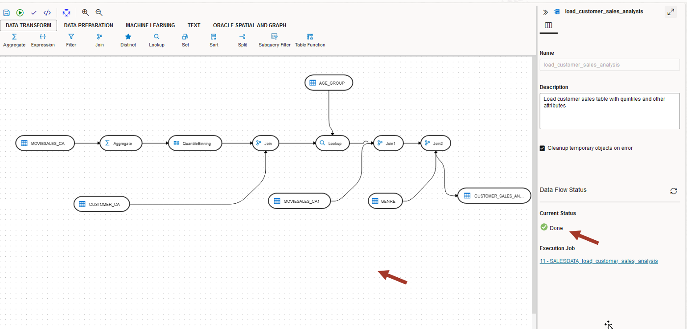

28. Click on the target table and see a data preview by clicking on
    the small eye icon. Expand the panel to see more.

    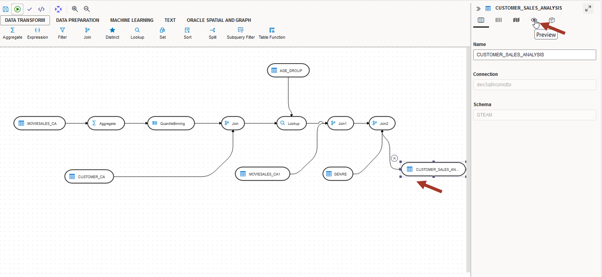

29. Check that all columns are populated. If some columns are blank,
    then it means some mapping expression in the data flow was blank or
    incorrect. Go back and fix it and re-execute it.

    

30. Next, check the **Statistics** tab for a quick data profile.

    

For now, it is just a cursory data glance. We will need to use the **Data Analysis** 
tool to analyze this data and find many interesting patterns.

## Task 4: How to debug

>**Note:** This is for advanced users. Skip if you don't have any errors and you want 
to straight go to the next lab.

1.  Go back to the data flow canvas and click on the empty space in the
    canvas. On the top, there is a Code Simulation icon. Click on it. This
    will show you the code to be generated.

    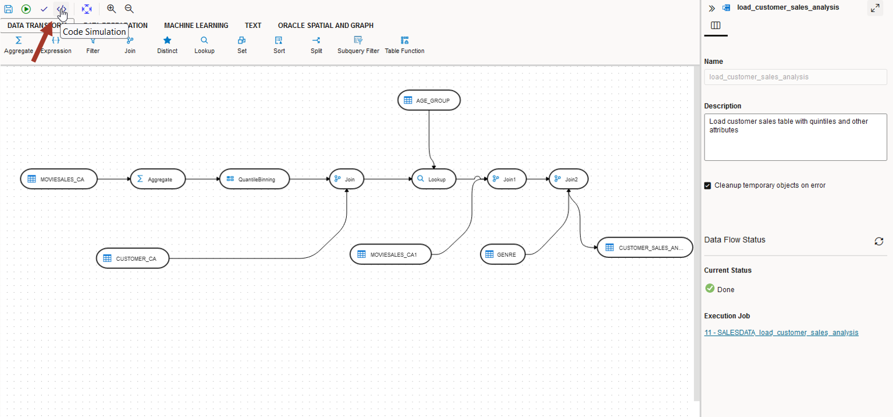

2.  Look at the generated SQL. Imagine writing this SQL without the
    graphical interface. It would not be so easy!
    Advanced users will find this useful for debugging purposes.


3.  Next, look at the **Data Flow Status** on the right side. If there are
    any errors, then you can click on the **Execution Job** in the
    **Data Flow Status** panel to debug. It will take you to the jobs
    screen where you can look at the executed steps, processed row
    counts and corresponding SQL.

    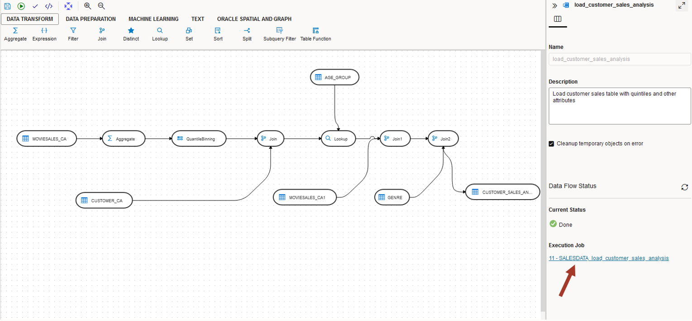

4.  Notice different steps in the execution. You can also get the
    executed SQL (same as the simulated SQL seen earlier) by clicking
    on the step.
    
    To go back to your data flow, click on the **Design Object** link.
    
    From anywhere in the UI, you can go back to the Home screen by clicking on
    the top left link.

    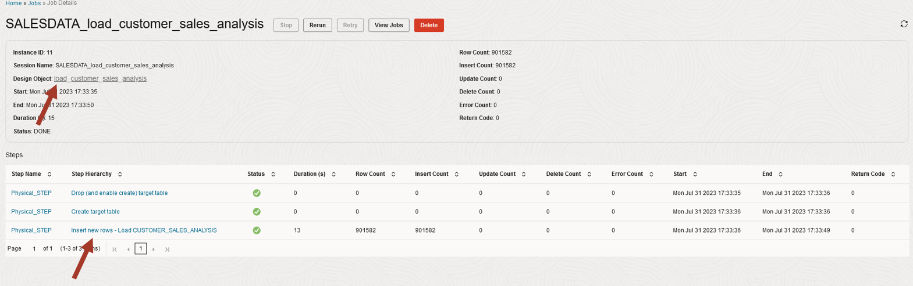

## RECAP

In this lab, we used the Data Transforms tool to calculate customer value from sales data, and combine it
with the customer, age group and movie genre information to load into a target table to be 
used for data analysis. 

Note that we only covered a brief overview of Data Transforms capabilities. Other features include:

-   **Variety of data sources**: Databases, Object Store, REST API and Fusion
    Application

-   **Load Data:** Load multiple tables in a schema from another data
    source. Data Transforms can also integrate with Oracle Golden Gate Cloud Service for advanced
    replication. This complements the Data Load tool explored in the earlier
    lab.

-   **Workflow:** Combine several data flows to run sequentially or in parallel.

-   **Schedule:** In-built scheduler for periodic execution.

You may now **proceed to the next lab**.

## Acknowledgements

- Created By/Date - Jayant Mahto, Product Manager, Autonomous AI Database, January 2023
- Contributors - Mike Matthews, Bud Endress, Ashish Jain, Marty Gubar, Rick Green
- Last Updated By - Jayant Mahto, September 2025


Copyright (C)  Oracle Corporation.
