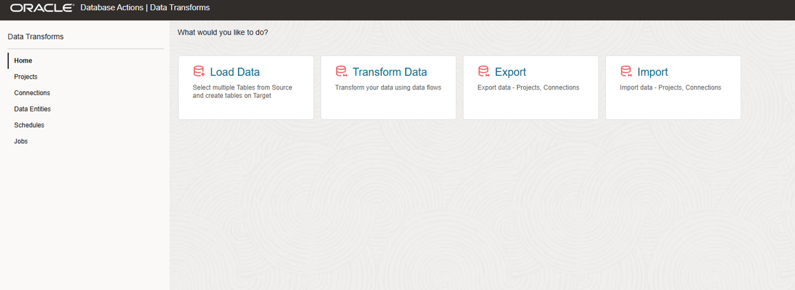
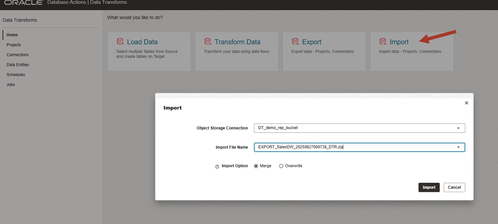
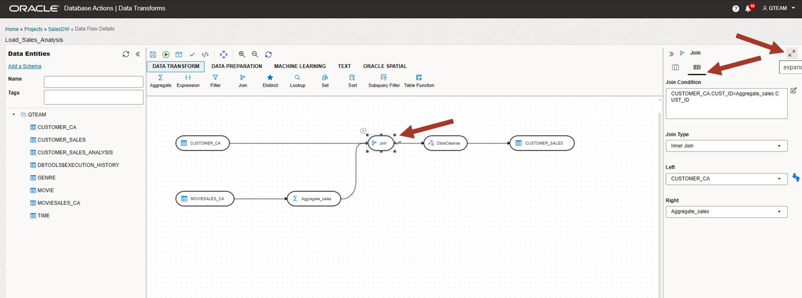
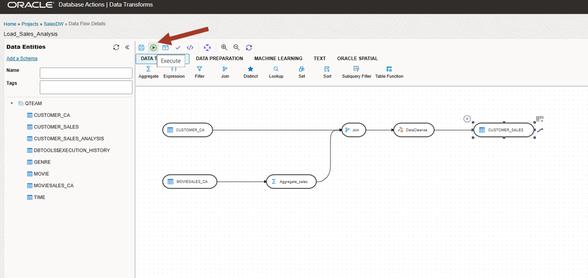

# Transform your data for analysis


## Introduction

This lab introduces the Data Transforms application built into the Oracle Autonomous Database and shows the various ways you can prepare data for analysis.

Estimated Time: 15 minutes

<!--
Watch the video below for a quick walk-through of the lab.
[Create a database user](videohub:1_t22mdnao)
-->

### Objectives

In this workshop, you will learn:
-	How to transform and prepare your data for analysis

### Prerequisites

To complete this lab, you need to have completed the previous labs, so that you have:

- Created an Autonomous Data Warehouse instance
- Created a new QTEAM user with appropriate roles
- Loaded the demo data 
- Loaded Age group data into AGE\_GROUP 
- Optional: Download wallet from your Autonomous database. This is an optional step for the last section.

### Demo data for this lab
>**NOTE:** Skip this section if you have demo data loaded and completed previous labs.

If you have not completed the previous labs then run the following script in SQL Worksheet to load all necessary objects.

*For copy/pasting, be sure to click the convenient __Copy__ button in the upper right corner of the following code snippet.*: 

```
<copy>
DROP TABLE CUSTOMER_CA;
 
CREATE TABLE CUSTOMER_CA 
    ( 
     CUST_ID        NUMBER , 
     AGE            NUMBER , 
     EDUCATION      VARCHAR2 (40) , 
     GENDER         VARCHAR2 (20) , 
     INCOME_LEVEL   VARCHAR2 (20) , 
     MARITAL_STATUS VARCHAR2 (8) , 
     PET            VARCHAR2 (40) 
    ) 
;

DROP TABLE MOVIESALES_CA;
 
CREATE TABLE MOVIESALES_CA 
    ( 
     DAY_ID           DATE , 
     GENRE_ID         NUMBER , 
     MOVIE_ID         NUMBER , 
     CUST_ID          NUMBER , 
     APP              VARCHAR2 (100) , 
     DEVICE           VARCHAR2 (100) , 
     OS               VARCHAR2 (100) , 
     PAYMENT_METHOD   VARCHAR2 (100) , 
     LIST_PRICE       NUMBER , 
     DISCOUNT_TYPE    VARCHAR2 (100) , 
     DISCOUNT_PERCENT NUMBER , 
     TOTAL_SALES      NUMBER 
    ) 
;

DROP TABLE GENRE;

CREATE TABLE GENRE 
    ( 
     GENRE_ID NUMBER , 
     GENRE    VARCHAR2 (30) 
    ) 
;


CREATE UNIQUE INDEX PK_GENRE_ID ON GENRE 
    ( 
     GENRE_ID ASC 
    ) 
;

ALTER TABLE GENRE 
    ADD CONSTRAINT PK_GENRE_ID PRIMARY KEY ( GENRE_ID ) 
    USING INDEX PK_GENRE_ID 
;

DROP TABLE MOVIE;

CREATE TABLE MOVIE 
    ( 
     MOVIE_ID     NUMBER , 
     TITLE        VARCHAR2 (200) , 
     BUDGET       NUMBER , 
     GROSS        NUMBER , 
     LIST_PRICE   NUMBER , 
     GENRES       VARCHAR2 (4000) , 
     SKU          VARCHAR2 (30) , 
     YEAR         NUMBER , 
     OPENING_DATE DATE , 
     VIEWS        NUMBER , 
     CAST         VARCHAR2 (4000) , 
     CREW         VARCHAR2 (4000) , 
     STUDIO       VARCHAR2 (4000) , 
     MAIN_SUBJECT VARCHAR2 (4000) , 
     AWARDS       VARCHAR2 (4000) , 
     NOMINATIONS  VARCHAR2 (4000) , 
     RUNTIME      NUMBER , 
     SUMMARY      VARCHAR2 (16000) 
    ) 
;

DROP TABLE TIME;

CREATE TABLE TIME 
    ( 
     DAY_ID           DATE , 
     DAY_NAME         VARCHAR2 (36) , 
     DAY_OF_WEEK      NUMBER , 
     DAY_OF_MONTH     NUMBER , 
     DAY_OF_YEAR      NUMBER , 
     WEEK_OF_MONTH    NUMBER , 
     WEEK_OF_YEAR     NUMBER , 
     MONTH_OF_YEAR    NUMBER , 
     MONTH_NAME       VARCHAR2 (36) , 
     MONTH_SHORT_NAME VARCHAR2 (12) , 
     QUARTER_NAME     VARCHAR2 (7) , 
     QUARTER_OF_YEAR  NUMBER , 
     YEAR_NAME        NUMBER 
    ) 
;

DROP TABLE AGE_GROUP;

CREATE TABLE AGE_GROUP 
    ( 
     MIN_AGE   NUMBER , 
     MAX_AGE   NUMBER , 
     AGE_GROUP VARCHAR2 (4000) 
    ) 
;

DROP TABLE CUSTOMER_SALES_ANALYSIS;

CREATE TABLE CUSTOMER_SALES_ANALYSIS
(
  MIN_AGE NUMBER(38),
GENRE VARCHAR2(30 CHAR),
AGE_GROUP VARCHAR2(4000 CHAR),
GENDER VARCHAR2(20 CHAR),
APP VARCHAR2(100 CHAR),
DEVICE VARCHAR2(100 CHAR),
OS VARCHAR2(100 CHAR),
PAYMENT_METHOD VARCHAR2(100 CHAR),
LIST_PRICE NUMBER(38),
DISCOUNT_TYPE VARCHAR2(100 CHAR),
DISCOUNT_PERCENT NUMBER(38),
TOTAL_SALES NUMBER(38),
MAX_AGE NUMBER(38),
AGE NUMBER(38),
EDUCATION VARCHAR2(40 CHAR),
INCOME_LEVEL VARCHAR2(20 CHAR),
MARITAL_STATUS VARCHAR2(8 CHAR),
PET VARCHAR2(40 CHAR),
CUST_VALUE NUMBER,
CUST_SALES NUMBER(38)
);

set define on
define file_uri_base = 'https://objectstorage.us-ashburn-1.oraclecloud.com/p/zL6bsboZrSxJP-0ilfUpROTwwyhzvkUrZu9OEwcU5_B_NAGzHKBG_WqW2OnNYxKk/n/c4u04/b/datastudio/o/prepareandanalyze'

begin
 dbms_cloud.copy_data(
    table_name =>'CUSTOMER_CA',
    file_uri_list =>'&file_uri_base/CUSTOMER_CA.csv',
    format =>'{"type" : "csv", "skipheaders" : 1}'
 );
 dbms_cloud.copy_data(
    table_name =>'MOVIESALES_CA',
    file_uri_list =>'&file_uri_base/MOVIESALES_CA.csv',
    format =>'{"type" : "csv", "skipheaders" : 1}'
 );
 dbms_cloud.copy_data(
    table_name =>'GENRE',
    file_uri_list =>'&file_uri_base/GENRE.csv',
    format =>'{"type" : "csv", "skipheaders" : 1}'
 );
 dbms_cloud.copy_data(
    table_name =>'MOVIE',
    file_uri_list =>'&file_uri_base/MOVIE.csv',
    format =>'{"type" : "csv", "skipheaders" : 1}'
 );
 dbms_cloud.copy_data(
    table_name =>'TIME',
    file_uri_list =>'&file_uri_base/TIME.csv',
    format =>'{"type" : "csv", "skipheaders" : 1}'
 );
 dbms_cloud.copy_data(
    table_name =>'AGE_GROUP',
    file_uri_list =>'&file_uri_base/AGE_GROUP.csv',
    format =>'{"type" : "csv", "skipheaders" : 1}'
 );
 FOR TNAME IN (SELECT table_name FROM user_tables  where table_name like 'COPY$%') LOOP
 EXECUTE IMMEDIATE ('DROP TABLE ' || TNAME.table_name || ' CASCADE CONSTRAINTS PURGE');
 END LOOP;
end;
/
</copy>
```

Paste the SQL statements in the worksheet. Click on the **Run Script** icon.

While the script is running, you will see the message "Executing code" at the bottom of the window. 
The message will change to "SQL executed by QTEAM" when in finishes. There should not be any errors.

>**Note:** Expect to receive "ORA-00942 table or view does not exist" errors during the DROP TABLE command for the first execution of the script, but you should not see any other errors.


Now you are ready to go through the rest of the labs in this workshop.

## Task 1: Launch Data Transforms

1.  Click on the **Data Transforms** card in the overview page.

    >**NOTE:** If you don't see the **Data Transforms** card then it means you are
    missing the **DATA\_TRANSFORM\_USER** role for your user. Login as ADMIN and
    grant the role (make sure this role is marked "Default" as well).

    

2.  You can also start it from DB Actions page under Data Studio.

    

3. If you are using Data Transforms for the first time or the Transforms service has logged you out then you will get the following login screen. Enter your DB user and password.

    

4.  You will see a provisioning screen like below.

    

5.  It will take up to 2-3 minutes for the service to be started for the first time. Once
    provisioned you will see the following Home page.

    >**Note:** The Data Transforms tool is provisioned based on demand. After 10 minutes of 
    inactivity, it will go into sleep mode and needs to
    be started again. Maximum timeout can be configured in the tools configuration menu from the Autonomous Database OCI console. Subsequent start time will be much smaller than the first time.  Clicking on any part of the UI will start the service again if it has gone into sleep mode. If you get any error, then refresh your browser.

    Look at the Home page. You can load data from various databases and applications using **Load Data** and transforms data to any desired shape using **Transform Data**. You can also move your data integration project from one environment to other using **Export** and **Import**. In our next section we will show you available data sources and use the **Import** wizard to get pre-populated data flow.

    

## Task 2: Import Data Transforms data flow

For this lab, we will try to create a table suitable for analysis by joining movie sales transaction table with the customer master and aggregate the sales amount for each customer. This is achieved by creating a data flow with various transformations, such as, join, aggregate, data cleanse etc. 

Since this is an overview workshop, instead of creating a new data flow, we will import a pre created data flow and review the steps. 

1.  We will create a connection to an Object Store from where we will import the pre created data flow. Click on **Connections** on the left side.

    

2.  There maybe other connections already defined. We will create a new one. Click on **Create Connection**.

    

3.  You will see various data sources supported by Data Transforms. Browse under Database and Applications tab to review the list of data sources. All these connectors are provided out of the box in Data Studio and very simple to use. All we need to do is to provide login credentials to the data source and create a connection.

    In this workshop we are going to connect to Object Store to import the pre-populated data flow. Go back to the Database section and click on **Oracle Object Storage** icon. Then click **Next**.

    

4. Configure connection details as follows:

    Connection Name: DT\_demo\_rep\_bucket

    Object Storage URL: https://adwc4pm.objectstorage.us-phoenix-1.oci.customer-oci.com/n/adwc4pm/b/DataTransforms_demo_rep/o

    User Name: OracleidentityCloudService/jayant.mahto@oracle.com

    Token: id7NY)#D{k[V#TdbvL5j

    Click on **Create**

    

5. From Home page click on **Import**.

    

6. Configure import task as follows:

    Object Store Location: DT\_demo\_rep\_bucket

    Import File Name: Export\_Load\_Sales\_Analysis\_20250819203943\_DTR.zip

    Click on **Import**

    

    Click **OK** on the next dialog.

    

7. An import job is submitted. Click **OK** to acknowledge. It will take 1-2 minute for the import to finish. 

    Get a coffee or stretch. We are now ready to learn how Data Transforms helps in transforming the data to any desired shape.

    

## Task 3: Review data flow

As mentioned earlier, we are taking a shortcut by reviewing the pre created data flow to learn how it works. Lets get started.

1. Click on Projects on the left side and select **SalesDW** project. This project has been imported in the previous section.

    

2. A project consists of various objects like:

    **Data Load**: Load data from various databases and applications
    
    **Data flow**: Transforming data
    
    **Workflows**: Orchestration of data pipelines with integration steps
    
    **Variables**: Parameterize data flow and control workflow steps
    
    **Scheduler**: Schedule data integration jobs

    **Jobs**: Monitoring jobs for success/failure and debugging

    We have a detailed Data Transforms workshop in Oracle Livelabs if you want in-depth knowledge of these features. For now, lets look at the imported data flow.

    Click on the data flow **Load\_Sales\_Analysis** under **Data Flow**.

    

3. This is data flow UI. Various sections are as follows:

    1. Main panel for defining the data flow

    2. Available data entities from databases or applications 

    3. Transforms tools. These are categorized under various sections. Click on these to learn about what transformations are possible.

    4. Property page. This page can be expanded or collapsed by clicking on the top right marker. 

    5. Action bar for saving, validating, execution etc.

    6. Execution status (success/fail) and link to jobs menu for debugging.

    

4. Now lets review the data flow. 

    MOVIESALES\_CA is the transaction table which is aggregated (Aggregate\_sales step) and then joined with CUSTOMER\_CA table, which is the customer master. Then the flow moves through the data cleaning step (DataCleanse step) which trims white spaces for few columns and converts them into title case. Finally the data is loaded into the final target table CUSTOMER\_SALES.

    Click on any object in the data flow to review the properties. For example click on the join step to review the join condition. You may need to expand or collapse the property window by clicking on the top right marker to view it fully.

    Imagine creating your own data flow step by step in this drag and drop UI. It is easy to visualize any complex transformation by breaking down into individual steps in the flow.

    

5. Now lets look at the target table properties. Click on the CUSTOMER\_SALES target and click on the **Options** icon (looks like a cube in the property window). Expand the property window to see full details.

    

6. Look at the loading **Mode** which is **Append**. If needed you can load data incrementally as well, but then you will need to define the key columns for updates. We will not change the mode.

    Make sure the options look like as below. **Drop and create target table** should be **Yes**, since we want this data flow to create a fresh table every time for our execution. For periodic execution this may be set to **No**. Collapse the property window by clicking on the top right marker.

    

7. We are done reviewing how data flow is defined. In a real project, there will be many data flows defined for each target tables and these will be used as a step in the workflow. Since it is just an overview workshop we will not go into workflow. This data flow can be executed on an ad-hoc basis or can be scheduled for periodic execution.

    Before we execute this data flow, we need to make sure the connection to the database is configured correctly. Next section describes how to do it. It is an optional section and can be skipped since you already learned how data can be transformed.

## Task 4: (Optional) Execute the data flow

1. Go to the Home page and click on the **Sales\_Datawarehouse** connection in the **Connections** menu. You need to upload the wallet from your database and provide user and password as shown below. Click on **Update** after the connection test succeeds.

    

2. Go back to the data flow under **SalesDW** project and click on execute by clicking on the green triangle in the actions section on the top.

    **NOTE**: If you had moved the layout or changed any properties, then you will need to save the data flow before you can execute it.

    

3. Job gets submitted in the background. Acknowledge the dialog.

    

    Click anywhere in the main panel and look at the status of the job. It should take 1-2 minute to finish.

    

4. Data Transforms allows you to browse the data for source and target tables. Click on the target table in the flow and the eye icon in the property window for data preview. Expand the property window for larger view.

    

5. You can see the aggregated sales amount for each customer ID. We also have customer attributes like income level, marital status etc. from the customer master. Now this target table has all the data we need for analysis.

    


## RECAP

In this lab, we used the Data Transforms tool to aggregate sales data, combine it
with the customer attributes and cleaned few columns to load into a target table to be 
used for data analysis. 

Note that we scratched only the surface. Other features are:

-   **Variety of data sources**: Databases, Object Store, REST API and Fusion
    Application

-   **Load Data:** Load multiple tables in a schema from another data
    source. It can also integrate with Oracle Golden Gate Cloud Service for advanced
    replication. This complements the Data Load tool explored in the earlier
    lab.

-   **Workflow:** Combine several data flows to run sequentially or in parallel.

-   **Variables:** Parameterize data flow and control workflow steps.

-   **Schedule:** In-built scheduler for periodic execution.

Data Transforms is a full fledged data integration tool for enterprise usage. We have an another dedicated Data Transforms workshop in Oracle Livelabs to over all the features.

You may now **proceed to the next lab**.

## Acknowledgements

- Created By/Date - Jayant Mahto, Product Manager, Autonomous Database, January 2023
- Contributors - Mike Matthews, Bud Endress, Ashish Jain,
- Last Updated By - Jayant Mahto, August 2025


Copyright (C)  Oracle Corporation.
