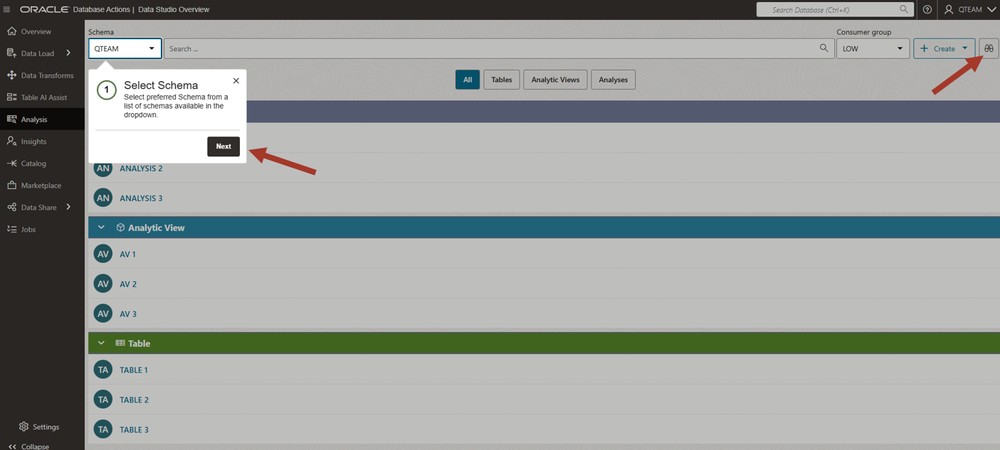
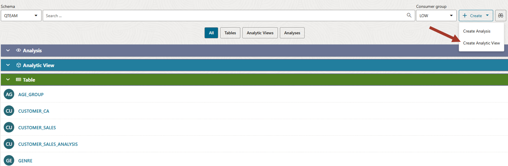
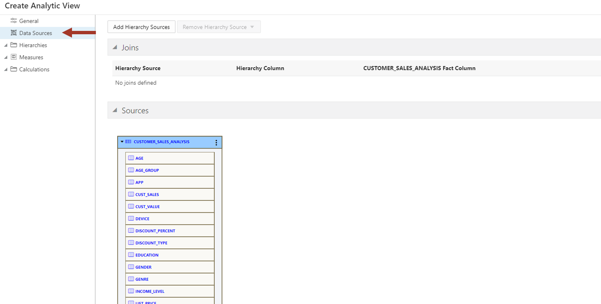
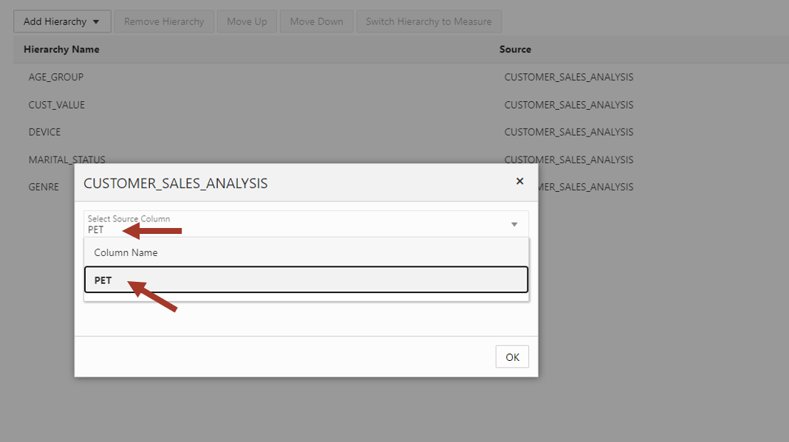
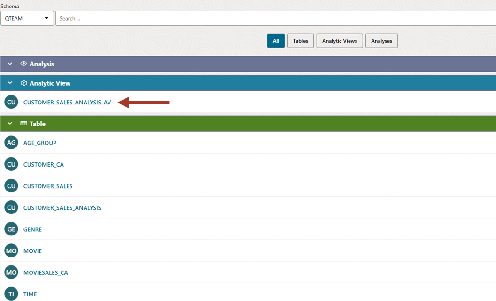
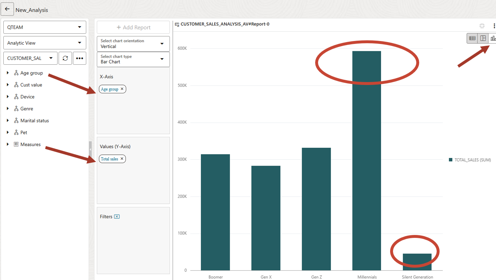
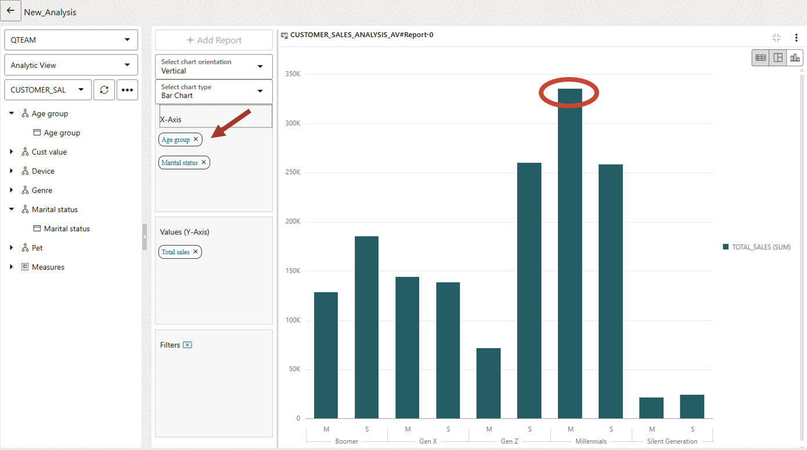
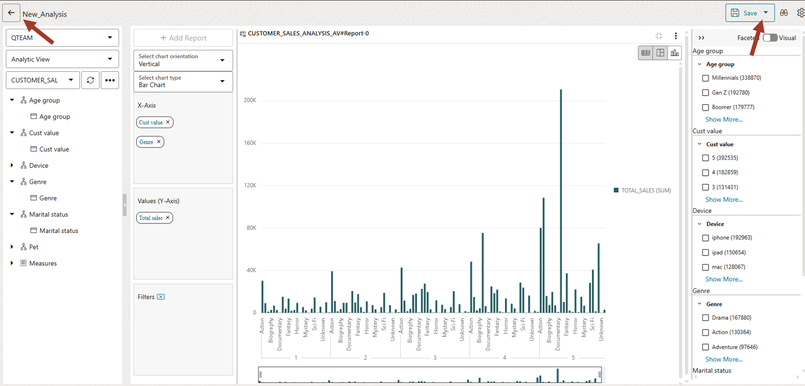
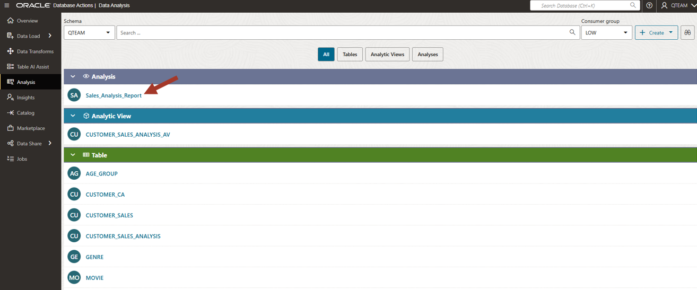

# Analyze your data


## Introduction

This lab introduces the Analysis tool built into the Oracle Autonomous AI Database and shows the various ways you can analyze your data.

Estimated Time: 20 minutes

<!--
Watch the video below for a quick walk-through of the lab.
[Create a database user](videohub:1_2hv2b15z)
-->

### Objectives

In this workshop, you will learn:
-	How to create a dimensional model and analyze the data

### Prerequisites

To complete this lab, you need to have completed the previous labs, so that you have:

- Created an Autonomous AI Lakehouse instance
- Created a new QTEAM user with appropriate roles

### Demo data for this lab

Run the following script in SQL Worksheet to load all necessary objects.

*For copy/pasting, be sure to click the convenient __Copy__ button in the upper right corner of the following code snippet.*: 

```
<copy>
drop table CUSTOMER_SALES_ANALYSIS_FULL;
drop table CUSTOMER_SALES_ANALYSIS;

create table CUSTOMER_SALES_ANALYSIS
(
MIN_AGE NUMBER(38),
GENRE VARCHAR2(30 CHAR),
AGE_GROUP VARCHAR2(4000 CHAR),
GENDER VARCHAR2(20 CHAR),
APP VARCHAR2(100 CHAR),
DEVICE VARCHAR2(100 CHAR),
OS VARCHAR2(100 CHAR),
PAYMENT_METHOD VARCHAR2(100 CHAR),
LIST_PRICE NUMBER(38),
DISCOUNT_TYPE VARCHAR2(100 CHAR),
DISCOUNT_PERCENT NUMBER(38),
TOTAL_SALES NUMBER(38),
MAX_AGE NUMBER(38),
AGE NUMBER(38),
EDUCATION VARCHAR2(40 CHAR),
INCOME_LEVEL VARCHAR2(20 CHAR),
MARITAL_STATUS VARCHAR2(8 CHAR),
PET VARCHAR2(40 CHAR),
CUST_VALUE NUMBER,
CUST_SALES NUMBER(38)
);

set define on
define file_uri_base = 'https://objectstorage.us-ashburn-1.oraclecloud.com/p/zL6bsboZrSxJP-0ilfUpROTwwyhzvkUrZu9OEwcU5_B_NAGzHKBG_WqW2OnNYxKk/n/c4u04/b/datastudio/o/prepareandanalyze'


begin
 dbms_cloud.copy_data(
    table_name =>'CUSTOMER_SALES_ANALYSIS',
    file_uri_list =>'&file_uri_base/CUSTOMER_SALES_ANALYSIS.csv',
    format =>'{"type" : "csv", "skipheaders" : 1}'
 );
 FOR TNAME IN (SELECT table_name FROM user_tables  where table_name like 'COPY$%') LOOP
 EXECUTE IMMEDIATE ('DROP TABLE ' || TNAME.table_name || ' CASCADE CONSTRAINTS PURGE');
 END LOOP;
end;
/
CREATE TABLE CUSTOMER_SALES_ANALYSIS_FULL
as SELECT 
GENRE,
GENDER,
AGE_GROUP,
CUST_VALUE,
PET,
MARITAL_STATUS,
EDUCATION,
INCOME_LEVEL,
TOTAL_SALES
FROM CUSTOMER_SALES_ANALYSIS;
</copy>
```

Paste the SQL statements in the worksheet. Click on the **Run Script** icon.

While the script is running, you will see the message "Executing code" at the bottom of the window. 
The message will change to "SQL executed by QTEAM" when in finishes. There should not be any errors.

>**Note:** Expect to receive "ORA-00942 table or view does not exist" errors during the DROP TABLE command for the first execution of the script, but you should not see any other errors.


Now you are ready to go through the rest of the labs in this workshop.

## Task 1: Create a dimensional model for data analysis

We have movie sales, movie genre and age group data. We also have customer value 
information. We will analyze this data set. 

We will go through a few examples such as movie genre 
preference based on age groups and marital status and whether these
preferences are different across high-value and low-value customers.

1.  From the Data Studio Overview page launch the **Analysis** tool.

    

2.  When you access the Analysis tool for the first time, you are presented with a set of 
    tool tips that explain how to use various features of the tool. You may wish to step through 
    this brief tutorial, or press X in the top right of any highlighted box to exit at any time. 

    You can relaunch the tutorial by pressing the binoculars icon in the upper-right corner.

    

3.  In this lab, we are going to create an Analytic View of the movie sales data so we can start to analyze it 
    and understand our customers’ purchasing patterns. Analytic
    Views organize data using a dimensional model, allowing you to
    easily add aggregations and calculations to data sets and present
    data in views that can be queried with relatively simple SQL.
    
    Click on **Create Analytic View** on the top right.

    

4.  Fact Table: Pick **CUSTOMER\_SALES\_ANALYSIS** from the list
    
    The default AV name is derived from the fact table. 

    Name: **CUSTOMER\_SALES\_ANALYSIS\_AV**
    
    Caption: **Customer sales analysis av**
    
    Description: **Customer sales analysis av**
    
    Schema: **QTEAM**
    
    
    You can find related tables and hierarchies by clicking on **Generate
    Hierarchy and Measures** button. This will scan your schema and find
    all the tables related to **CUSTOMER\_SALES\_ANALYSIS** and give you a
    starting point.
    
    However, in our case, we have prepared the data in such a way that all
    analysis attributes are in one table. We don't need to run this
    automated process.

    

5.  Now click on Data Sources on the left side to verify that
    CUSTOMER\_SALES\_ANALYSIS is the data source.

    

6.  Now click on the Hierarchies on the left side and add the attributes
    we want in our analysis. We want to add **AGE\_GROUP, CUST\_VALUE,
    DEVICE, MARITAL_STATUS, GENRE,** and **PET**. It will be interesting
    to do a movie preference analysis with pets.
    
    >**NOTE:** These are all single-level hierarchies. Adding multiple-level
    hierarchies is an advanced topic and will not be covered. However, we will
    see that even with single-level hierarchies, we can do many interesting
    analyses.

    

7.  If you don't see your column, then click on **More columns** at the end of the list
    and search for your columns. Then add it by clicking on it.

    

8.  After you add all the hierarchy columns, it should look like the below screenshot.

    

9.  Now click on Measures and add a measure using the **TOTAL\_SALES** column

    

10. We have completed the definition of our Analytic View (AV). Click on **Create** it and confirm **OK**.

    

11. Our AV is ready now and we can start analyzing data. Click on the AV CUSTOMER\_SALES\_ANALYSIS\_AV.

    

## Task 2: Analyze data

Now the fun part starts. All this time we were preparing the data and
creating a dimensional model in the form of an Analytic View (AV). We will start creating reports, and charts
and start finding hidden patterns in the data.

Next, let's learn how to navigate the analysis tool.

1.  If you get a quick tour wizard like below then close it. Optionally you can cycle through all the sections to learn about this page.

    

    The Analysis UI is divided into multiple zones. These zones are:
    
    1: Hierarchies and measures
    
    2: Columns, Rows, Values and Filters where you can drag components
    from zone 1 to slice and dice the data.
    
    3: Area for displaying reports and charts in the analysis dashboard.
    
    4: Table/Pivot/Chart report. You can have many reports in an analysis dashboard. For our workshop we will create only one. 

    5: Filtering by dimension hierarchy member values
    
    

2.  Now we can start doing our first analysis. Expand the report in the dashboard by dragging its bottom right corner and click on the bar chart. A bar chart makes it easier to visualize the data.

    Analysis: show me the sales amount by age group
    
    Select chart mode by clicking on the top-right chart icon. By default, X-Axis is populated with 
    the first hierarchy. If it is not **Age group** then 
    clear all hierarchies from X-Axis and drag **Age group** to X-Axis and **Total Sales** to Y-Axis.

    >**Note:** You need to expand the hierarchy tree to reveal the level. 
    Only the level can be dragged to the analysis area. In our workshop, there 
    is only one level to all hierarchies and hence, they are named 
    the same. In a more complex model, you may have multiple levels inside a 
    hierarchy.
    
    This chart is showing total sales across age groups. We can
    conclude that the silent generation is not watching many movies whereas millennials are watching most.

    

3.  Next, let us analyze sales by marital status.

    Clear X-Axis and drag **Marital status**.
    
    You will have to expand the left side tree node to drag the level.
    A Level is under the hierarchy node (with the same name for convenience).
    
    We can see that singles are watching more movies than married people.

    

4.  Now we can mix two hierarchies. Drag **Age group** above **Marital
    status** in the X-Axis. 

    Make sure the **Age group** is on top of **Marital status**.

    We notice that although singles watch overall more movies, married
    people watch more than singles in millennial age group.
    
    This was not obvious before.

    

5.  Now we are curious to know which genre sells most.

    Clear X-Axis and drag **Genre**.
    
    Drama Sells! Followed by Action.

    

6.  We had earlier ranked our customers in high and low-value quintiles.
    It will be interesting to find out whether there is a movie genre
    preference for high-value customers.

    Drag **Cust value** to the X-Axis. Make sure the **Cust value** is 
    on the top of **Genre**.
    
    The chart is very wide, and you can't see to the right. To
    fit the entire width you can drag the right edge of the lower window
    towards the right till all customer values are visible on one page. If 
    you don't see the lower window then zoom out on the browser with CTRL -.

    >**Note:** Since the chart is big, you can expand the chart area by collapsing the 
    left side Data Studio menu and the hierarchy browser window. 

    

7.  Let's look at this chart. We can see that Drama is very popular with
    high-value (**Cust value**=5) customers, whereas Action is more popular
    with low-value customers (**Cust value**=1).

    Of course, most of the bars are taller for high-value customers
    because overall they spend more. We are talking about relative genre 
    preference within the same customer value group.

    Go ahead and see if you can find any other interesting patterns. 

    What movie genres are popular in different age groups?

    We can spend lots of time in the analysis tool visualizing the data with
    different combinations of attributes.

    >**Note:** So far, we are looking at only the charts, but this data can be displayed in tabular format and a pivot table as well. Switch the display mode to see how it works. Advanced users can access the data in this AV from Excel or Google Sheets. 

    

8. After you have completed the report, you can save it by clicking on the **Save Analysis As** button on the top right corner. It is under the drop down menu of **Save** button. Call it Sales\_Analysis\_Report.

    Click on the left arrow button on the top left corner to go back to Analysis main page.

    

    You can see your saved report on the main page.

    


## RECAP

In this lab, we used the Analysis tool to create a dimensional model (Analytic View) on
the sales analysis table and then analyzed movie sales across various dimensions such as age group, 
marital status and movie genre. We found many interesting patterns in customer purchasing behavior. 

Analytic Views make analysis easy, not only in Data Studio's Analysis tool, but also in tools such as Oracle Analytics, Tableau and PowerBI; even Excel and Google Sheets! As the business model is defined in the database, analysis of this data is always consistent across these tools, as well as being simple and performant. 

You may now **proceed to the next lab**.

## Acknowledgements

- Created By/Date - Jayant Mahto, Product Manager, Autonomous AI Database, January 2023
- Contributors - Mike Matthews, Bud Endress, Ashish Jain, Marty Gubar, Rick Green
- Last Updated By - Jayant Mahto, August 2025


Copyright (C)  Oracle Corporation.