# Analyze your data


## Introduction

This lab introduces the Analysis tool built into Oracle Autonomous AI Database Data Studio, and shows some of the ways you can analyze your data.

Estimated Time: 20 minutes

<!--
Watch the video below for a quick walk-through of the lab.
[Create a database user](videohub:1_2hv2b15z)
-->

### Objectives

In this workshop, you will learn how to analyze the data using the Data Studio Analysis tool.

### Prerequisites

To complete this lab, you need to have completed the previous labs, so that you have:

- Created an Autonomous AI Database instance
- Created a new QTEAM user with appropriate roles

### Demo data for this lab

Run the following script in SQL Worksheet to load all necessary objects.

*For copy/pasting, be sure to click the convenient __Copy__ button in the upper right corner of the following code snippet.*: 

```
<copy>
drop table CUSTOMER_SALES_ANALYSIS_FULL;
drop table CUSTOMER_SALES_ANALYSIS;

create table CUSTOMER_SALES_ANALYSIS
(
MIN_AGE NUMBER(38),
GENRE VARCHAR2(30 CHAR),
AGE_GROUP VARCHAR2(4000 CHAR),
GENDER VARCHAR2(20 CHAR),
APP VARCHAR2(100 CHAR),
DEVICE VARCHAR2(100 CHAR),
OS VARCHAR2(100 CHAR),
PAYMENT_METHOD VARCHAR2(100 CHAR),
LIST_PRICE NUMBER(38),
DISCOUNT_TYPE VARCHAR2(100 CHAR),
DISCOUNT_PERCENT NUMBER(38),
TOTAL_SALES NUMBER(38),
MAX_AGE NUMBER(38),
AGE NUMBER(38),
EDUCATION VARCHAR2(40 CHAR),
INCOME_LEVEL VARCHAR2(20 CHAR),
MARITAL_STATUS VARCHAR2(8 CHAR),
PET VARCHAR2(40 CHAR),
CUST_VALUE NUMBER,
CUST_SALES NUMBER(38)
);

set define on
define file_uri_base = 'https://objectstorage.us-ashburn-1.oraclecloud.com/p/zL6bsboZrSxJP-0ilfUpROTwwyhzvkUrZu9OEwcU5_B_NAGzHKBG_WqW2OnNYxKk/n/c4u04/b/datastudio/o/prepareandanalyze'


begin
 dbms_cloud.copy_data(
    table_name =>'CUSTOMER_SALES_ANALYSIS',
    file_uri_list =>'&file_uri_base/CUSTOMER_SALES_ANALYSIS.csv',
    format =>'{"type" : "csv", "skipheaders" : 1}'
 );
 FOR TNAME IN (SELECT table_name FROM user_tables  where table_name like 'COPY$%') LOOP
 EXECUTE IMMEDIATE ('DROP TABLE ' || TNAME.table_name || ' CASCADE CONSTRAINTS PURGE');
 END LOOP;
end;
/
CREATE TABLE CUSTOMER_SALES_ANALYSIS_FULL
as SELECT 
GENRE,
GENDER,
AGE_GROUP,
CUST_VALUE,
PET,
MARITAL_STATUS,
EDUCATION,
INCOME_LEVEL,
TOTAL_SALES
FROM CUSTOMER_SALES_ANALYSIS;
</copy>
```

Paste the SQL statements in the worksheet. Click on the **Run Script** icon.

While the script is running, you will see the message "Executing code" at the bottom of the window. 
The message will change to "SQL executed by QTEAM" when in finishes. There should not be any errors.

>**Note:** Expect to receive "ORA-00942 table or view does not exist" errors during the DROP TABLE command for the first execution of the script, but you should not see any other errors.


Now you are ready to go through the rest of the labs in this workshop.


## Task 1: Analyze data
We have movie sales, movie genre and age group data. We also have customer value information. We will analyze this data set. 

We will go through a few examples such as movie genre preference based on age groups and marital status and whether these preferences are different across high-value and low-value customers.

1.  From the Data Studio Overview page launch the **Analysis** tool.

    

2.  When you access the Analysis tool for the first time, you are presented with a set of 
    tool tips that explain how to use various features of the tool. You may wish to step through 
    this brief tutorial, or press X in the top right of any highlighted box to exit at any time. 

    You can relaunch the tutorial by pressing the binoculars icon in the upper-right corner.

    

3. In previous labs we had loaded CUSTOMER\_SALES\_ANALYSIS\_FULL table by joining sales transaction data with the customer master data and added customer value information using quantile transformation by Data Transforms tool. We picked this table Since it has all the attributes we need for analysis. 

    Note that It is important to prepare the data appropriately for analysis purposes. Click on the CUSTOMER\_SALES\_ANALYSIS\_FULL table. 

    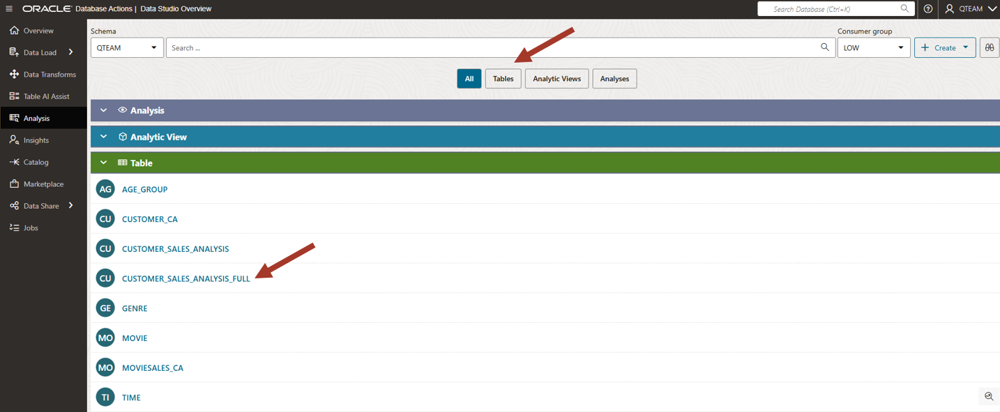

4.  Next, let's learn how to navigate the analysis tool.

    The Analysis UI is divided into multiple zones. These zones are:
    
    1: Main select query
    
    2: Results from the query
    
    3: Table/Pivot/Chart report format
    
    4: Filtering by columns

    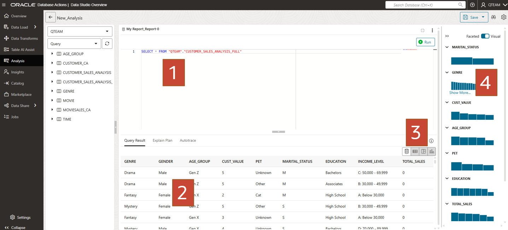

5. You can use any report format but we will use bar chart for this lab. Click on the chart icon.

    >**TIP**: Although you can analyze any table, it is best to prepare the data in such a way that there are few measure columns with relevant attribute columns only. Not having any superfluous column helps to keep analysis focused and easy. You can use Data Transforms tool or SQL script to prepare the data as needed.

    Look at the data in the grid view. You can see the columns we would like to ask question on. There is only one measure column called TOTAL\_SALE.

    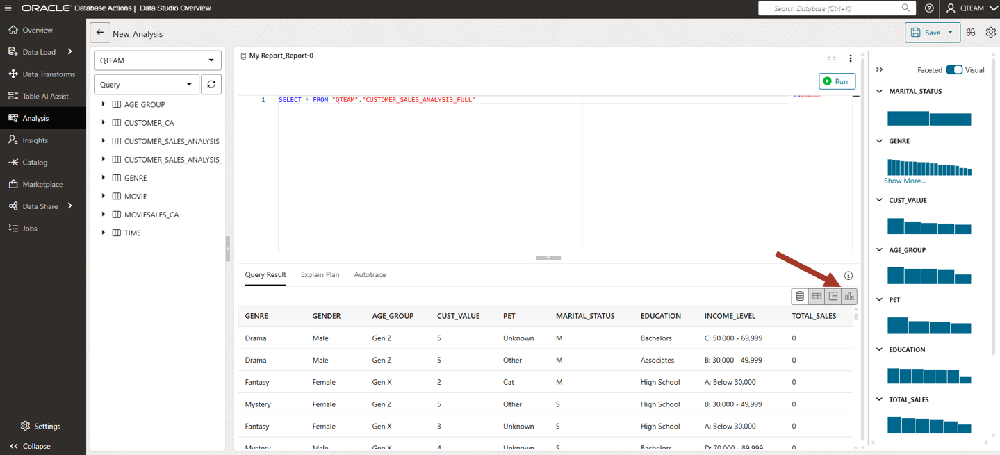

6.  Now we can start doing our first analysis. Expand the bar chart area by dragging the middle bar above to reduce the query area.

    Analysis: show me the sales amount by age group
    
    Drag AGE\_GROUP into X-Axis and TOTAL\_SALES into Y_Axis area.

    This chart is showing total sales across age groups. We can
    conclude that the silent generation is not watching many movies whereas millennials are watching most.

    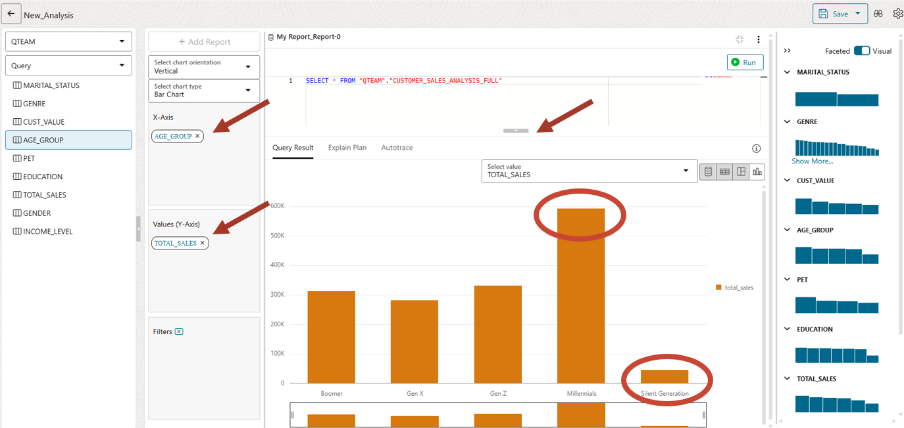

7.  Next, let us analyze sales by marital status.

    Clear X-Axis and drag MARITAL\_STATUS.
    
    We can see that singles are watching more movies than married people.

    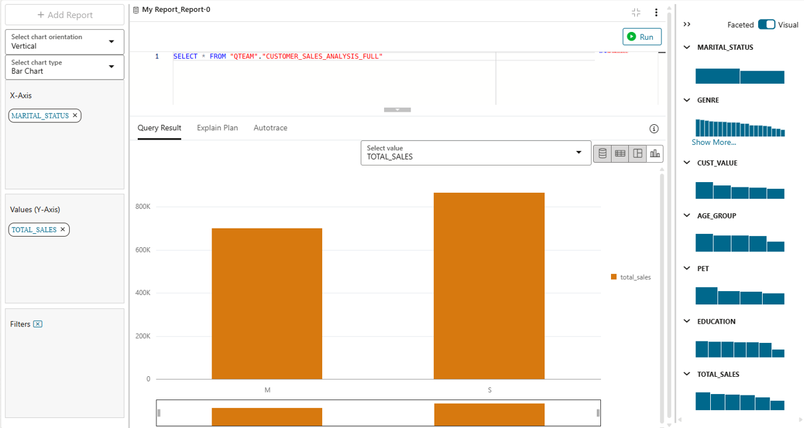

8.  Now we can mix two hierarchies. Drag AGE\_GROUP above MARITAL\_STATUS in the X-Axis. 

    Make sure the AGE\_GROUP is on top of MARITAL\_STATUS.

    We notice that although singles watch overall more movies, married
    people watch more than singles in millennial age group.
    
    This was not obvious before.

    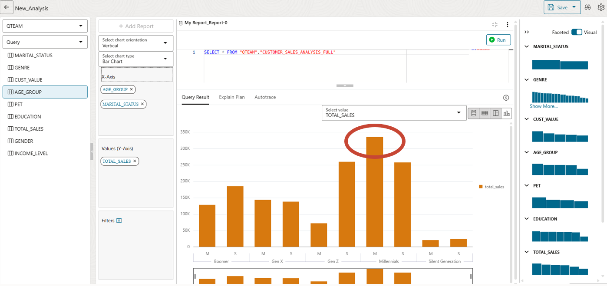

9.  Now we are curious to know which genre sells most.

    Clear X-Axis and drag GENRE.
    
    Drama Sells! Followed by Action.

    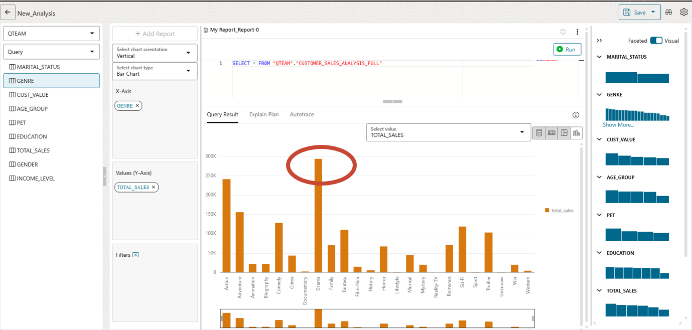

10. We had earlier ranked our customers in high and low-value quintiles. It will be interesting to find out whether there is a movie genre preference for high-value customers.

    Drag CUST\_VALUE to the X-Axis. Make sure the CUST\_VALUE is on the top of GENRE.

    Filter for CUST\_VALUE=1 in the right side filter area. You can see that Action is a very popular genre with low value customers.
    
    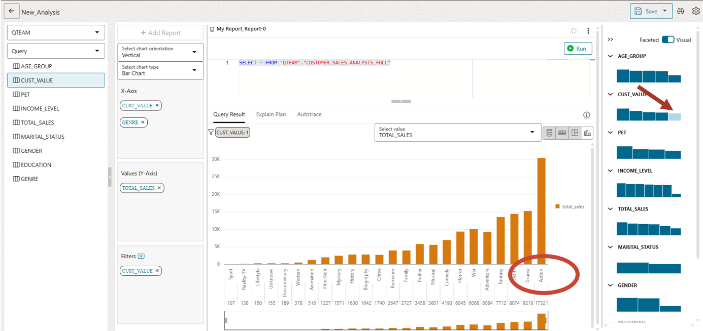

11. Now lets filter for high value customers. You will need to remove the previous filter and use a new one for CUST\_VALUE=5.

    Note that Drama is popular with high value customers.

    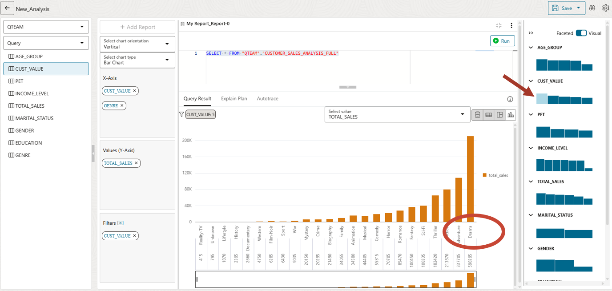

    Go ahead and see if you can find any other interesting patterns. 

    What movie genres are popular in different age groups?

    We can spend lots of time in the analysis tool visualizing the data with
    different combinations of attributes.

    >**Note:** So far, we are looking at only the charts, but this data can be displayed in tabular format or as a pivot table as well. 

12. After you have completed the report, you can rename the report by clicking on the three dots on top right side. Rename it as "Sales by genre for high value customers".

    Note that you can have multiple reports in the analysis and arrange them as dashboard. In our lab we will create only one report.

    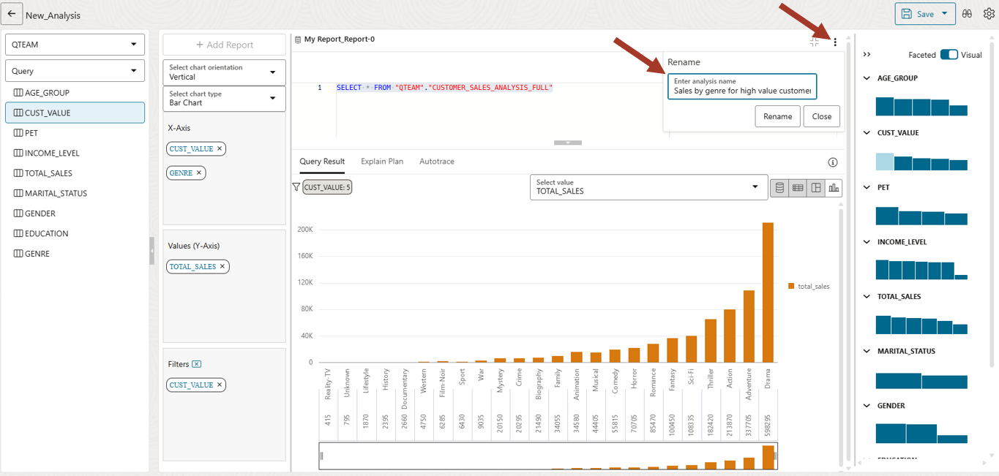

13. It is also possible to use Microsoft Excel or Google Sheets to access and analyze the data in Autonomous AI Database, with the provided plug-ins. This is not covered in this workshop. 

    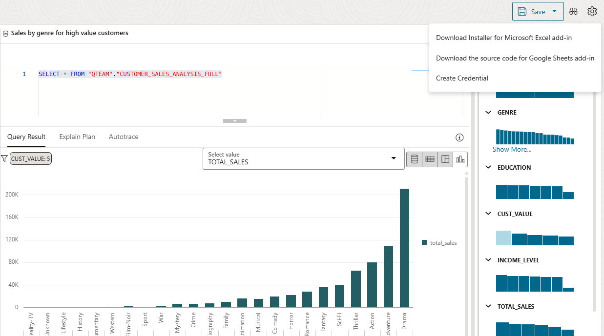

14. You can now save the analysis by clicking on the **Save** button on the top right corner. Save it as Sales\_Analysis\_Report.

    Click on the left arrow button on the top left corner to go back to Analysis main page.

    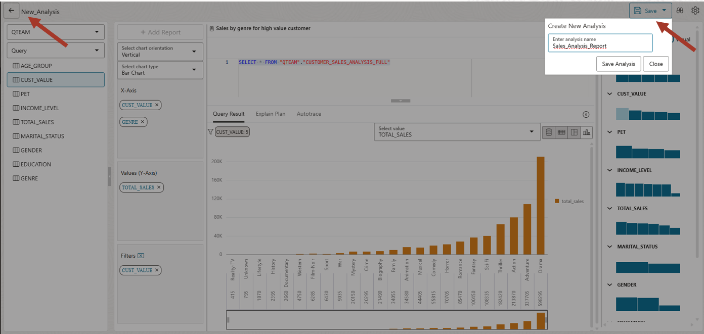

    You can see your saved report on the main page.

    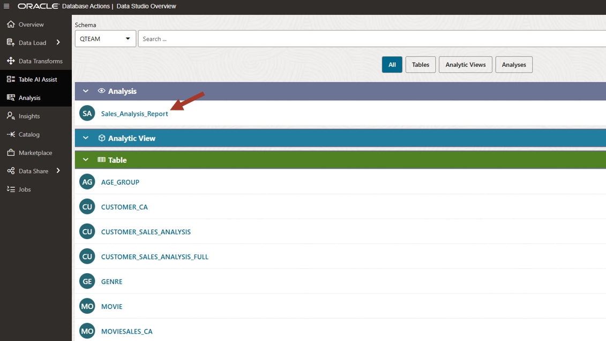

## Task 2: What's more?

This lab provides a brief overview of how to analyze data using Data Studio. Other features include:

-   **Plug-ins for Microsoft Excel and Google Sheets**: Query data using your favorite desktop tool
-   **Analytic Views**: Create dimensional models from tables. Analytic Views provide a business model using dimensional hierarchies and complex measures. External query tools can query the Analytic View leveraging the business model in the Autonomous AI Database and optimizing queries.

## RECAP

In this lab, we used the Analysis tool to analyze movie sales data across various dimensions such as age group, 
marital status and movie genre. We found many interesting patterns in customer purchasing behavior. 

You may now **proceed to the next lab**.

## Acknowledgements

- Created By/Date - Jayant Mahto, Product Manager, Autonomous AI Database, January 2023
- Contributors - Mike Matthews, Bud Endress, Ashish Jain, Marty Gubar, Rick Green
- Last Updated By - Jayant Mahto, September 2025


Copyright (C)  Oracle Corporation.