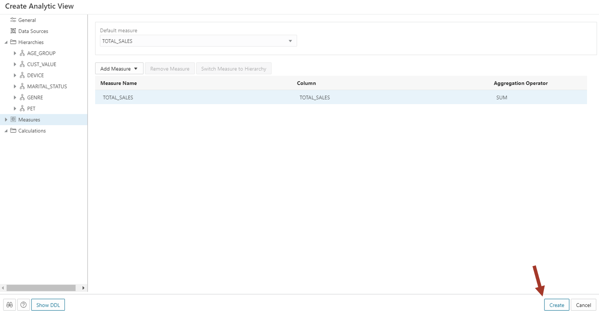
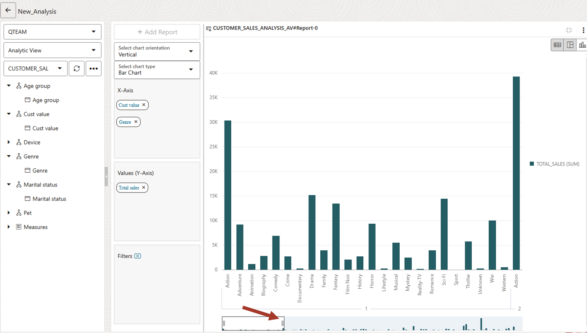

# Using Data Analysis to analyze your data


## Introduction

This lab introduces the Data Analysis application built into the Oracle Autonomous Database and shows the various ways you can analyze your data.

Estimated Time: 20 minutes

Watch the video below for a quick walkthrough of the lab.
[](youtube:youtubeid)

### Objectives

In this workshop, you will learn:
-	How to create a dimensional model and analyze the data

### Prerequisites

To complete this lab, you need to have completed the previous labs, so that you have:

- Created an Autonomous Data Warehouse instance
- Created a new QTEAM user with appropriate roles
- demo data loaded
- Age group data loaded into AGE_GROUP
- Prepared data and loaded it into CUSTOMER_SALES_ANALYSIS

### Demo data for this lab
>**NOTE:** Skip this section if you have demo data loaded and completed previous labs.

If you have not completed the **Transform and prepare data lab** then run the following script in SQL Worksheet to load all necessary objects.

*For copy/pasting, be sure to click the convenient __Copy__ button in the upper right corner of the following code snippet.*: 

```
<copy>
drop table CUSTOMER_SALES_ANALYSIS;

create table CUSTOMER_SALES_ANALYSIS
(
  MIN_AGE NUMBER(38),
GENRE VARCHAR2(30 CHAR),
AGE_GROUP VARCHAR2(4000 CHAR),
GENDER VARCHAR2(20 CHAR),
APP VARCHAR2(100 CHAR),
DEVICE VARCHAR2(100 CHAR),
OS VARCHAR2(100 CHAR),
PAYMENT_METHOD VARCHAR2(100 CHAR),
LIST_PRICE NUMBER(38),
DISCOUNT_TYPE VARCHAR2(100 CHAR),
DISCOUNT_PERCENT NUMBER(38),
TOTAL_SALES NUMBER(38),
MAX_AGE NUMBER(38),
AGE NUMBER(38),
EDUCATION VARCHAR2(40 CHAR),
INCOME_LEVEL VARCHAR2(20 CHAR),
MARITAL_STATUS VARCHAR2(8 CHAR),
PET VARCHAR2(40 CHAR),
CUST_VALUE NUMBER,
CUST_SALES NUMBER(38)
);

set define on
define file_uri_base = 'https://objectstorage.us-ashburn-1.oraclecloud.com/p/H5wUeWmMyZrKxj7889AaM4q7RsdQYTOc9AYw3TYThkgVKLOLojID5yu56Yif6871/n/c4u04/b/datastudio/o/prepareandanalyze'

begin
 dbms_cloud.copy_data(
    table_name =>'CUSTOMER_SALES_ANALYSIS',
    file_uri_list =>'&file_uri_base/CUSTOMER_SALES_ANALYSIS.csv',
    format =>'{"type" : "csv", "skipheaders" : 1}'
 );
end;
/
</copy>
```

Paste the SQL statements in the worksheet. Click on the **Run Script** icon.

>**Note:** Expect to receive "ORA-00942 table or view does not exist" errors during the DROP TABLE command for the first execution of the script, but you should not see any other errors.


Now you are ready to go through the rest of the labs in this workshop.

## Task 1: Create a dimensional model for data analysis

We have movie sales, movie genre and age group data. We also have customer value 
information. We will analyze this data set. 

We will go through a few examples such as movie genre 
preference based on age groups and marital status and whether these
preferences are different across high-value and low-value customers.

1.  Navigate to the Database Actions page and launch the **DATA ANALYSIS** tool.

    

2.  The first time when you access the data analysis tool, you will see a
    guiding wizard that will describe various parts of the UI. Since you
    are doing this lab anyways, click on X to cancel it and start using
    the tool right away.

    

3.  To Analyze your data, create an Analytic View (AV) first. Analytic
    Views organize data using a dimensional model, allowing you to
    easily add aggregations and calculations to data sets and present
    data in views that can be queried with relatively simple SQL.

    We don't have any AV yet, therefore we are going to create one.
    
    Select your schema QTEAM and click on **Create** button.

    

4.  The default AV name is derived from the fact table. Enter various fields
    as follows:

    Name: **CUSTOMER_SALES_ANALYSIS_AV**
    
    Caption: **Customer sales analysis av**
    
    Description: **Customer sales analysis av**
    
    Schema: **QTEAM**
    
    Fact Table: Pick **CUSTOMER_SALES_ANALYSIS** from the list
    
    You can find related tables and hierarchies by clicking on **Generate
    Hierarchy and Measures** button. This will scan your schema and find
    all the tables related to **CUSTOMER_SALES_ANALYSIS** and give you a
    starting point.
    
    However, in our case, we have prepared the data in such a way that all
    analysis attributes are in one table. We don't need to run this
    automated process.

    

5.  Now click on Data Sources on the left side to verify that
    CUSTOMER_SALES_ANALYSIS is the data source.

    

6.  Now click on the Hierarchies on the left side and add the attributes
    we want in our analysis. We want to add **AGE_GROUP, CUST_VALUE,
    DEVICE, MARITAL_STATUS, GENRE,** and **PET**. It will be interesting
    to do a movie preference analysis with pets.
    
    >**NOTE:** These are all single-level hierarchies. Adding multiple-level
    hierarchies is an advanced topic and will not be covered. However, we will
    see that even with single-level hierarchies, we can do many interesting
    analyses.

    

7.  If you don't see your column, then click on **More columns** at the end of the list
    and search for your columns. Then add it by clicking on it.

    

8.  After you add all, it should look like the below screenshot.

    

9.  Now click on Measures and add a measure using the **TOTAL_SALES** column

    

10. We have completed our AV. Click on **Create** it and confirm **OK**.

    

11. Our AV is ready now and we can start analyzing data. You can see
    that there are no errors. By clicking on the **Data Quality** tab.

    You can also go back and edit the AV by clicking on three vertical
    dots.

    

## Task 2: Analyze data

Now the fun part starts. All this time we were preparing the data and
creating a dimensional model in AV. We will start creating reports, and charts
and start finding hidden patterns in the data.

Next, let's learn how to navigate the analysis tool.

1.  Select your AV and click on **Analyze**.

    These zones are:
    
    1: Hierarchies and measures
    
    2: Columns, Rows, Values and Filters where you can drag components
    from zone 1 to slice and dice the data.
    
    3: Area for displaying reports and charts.
    
    4: Table/Pivot/Chart view. For the remainder of the lab, we will use chart
    view. It is much easier to visualize the information through charts.
    
    5: Insights. Automated algorithm to search for hidden patterns. This
    is the topic of our last lab. For now, we will click on the right-side
    divider bar to collapse it.

    

2.  Now we can start doing our first analysis.

    Analysis: show me SALES_AMOUNT by AGE_GROUP
    
    Select chart mode. Clear all hierarchies from X-Axis and drag **Age
    group** to X-Axis and **Total Sales** to Y-Axis.

    >**Note:** You need to expand the hierarchy tree to reveal the level. 
    Only the level can be dragged to the analysis area. In our workshop, there 
    is only one level to all hierarchies and hence, they are named 
    the same. In a more complex model, you may have multiple levels inside a 
    hierarchy.
    
    This chart is showing total sales across age groups. We can
    conclude that seniors (71-80) are not watching many movies whereas age
    groups 21-30 and 31-40 are watching most.

    

3.  Next, let us analyze sales by marital status.

    Clear X-Axis and drag **Marital status**.
    
    You will have to expand the left side tree node to drag the level.
    A Level is under the hierarchy node (with the same name for convenience).
    
    We can see that singles are watching more movies than married people.

    

4.  Now we can mix two hierarchies. Drag **Age group** above **Marital
    status** in X-Axis. 

    Make sure the **Age group** is on top of **Marital status**.

    We notice that although singles watch overall more movies, married
    people watch more than singles in the young age group (21-30, 31-40).
    
    This was not obvious before.

    

5.  Now we are curious to know which genre sells most.

    Clear X-Axis and drag **Genre**.
    
    Drama Sells! Followed by Action.

    

6.  We had earlier ranked our customers in high and low-value buckets.
    It will be interesting to find out whether there is a movie genre
    preference for high-value customers.

    Clear X-Axis and drag **Genre** and **Cust value**. Make sure the **Cust value** is 
    on the top.
    
    The chart is very wide, and you can't see to the right. To
    fit the entire width you can drag the right edge of the lower window
    towards the right till all customer values are visible on one page. If 
    you don't see the lower window then zoom out on the browser with CTRL -.

    

7.  Let's look at this chart. We can see that Drama is very popular with
    high-value (**Cust value**=5) customers, whereas Action is more popular
    with low-value customers (**Cust value**=1).

    Of course, most of the bars are taller for high-value customers
    because overall they spend more. We are talking about relative genre 
    preference within the same customer value group.

    

Go ahead and see if you can find any other interesting patterns. 

What movie genres are popular in different age groups?

We can spend lots of time in the analysis tool visualizing the data with
different combinations of attributes.

>**Note:** So far, we are looking at only the charts, but this data can be
displayed in tabular format and a pivot table as well. Switch the
display mode to see how it works. Advanced users can access the data in
this AV from Excel or Google Sheets. 

## RECAP

In this lab, we used the Data Analysis tool to first create a dimensional model (Analytic View) on
the sales analysis table and then analyze movie sales across various dimensions such as age groups, 
marital status, movie genre etc. 

We found many interesting patterns in customer purchasing behavior. 

Note that there are many more features in the analysis tool, which are not covered here. 
These details will be covered in another in-depth workshop.

You may now **proceed to the next lab**.

## Acknowledgments

- Created By/Date - Jayant Mahto, Product Manager, Autonomous Database, January 2023
- Contributors - Mike Matthews, Bud Endress, Ashish Jain, Marty Gubar, Rick Green
- Last Updated By - Jayant Mahto, January 2023


Copyright (C)  Oracle Corporation.