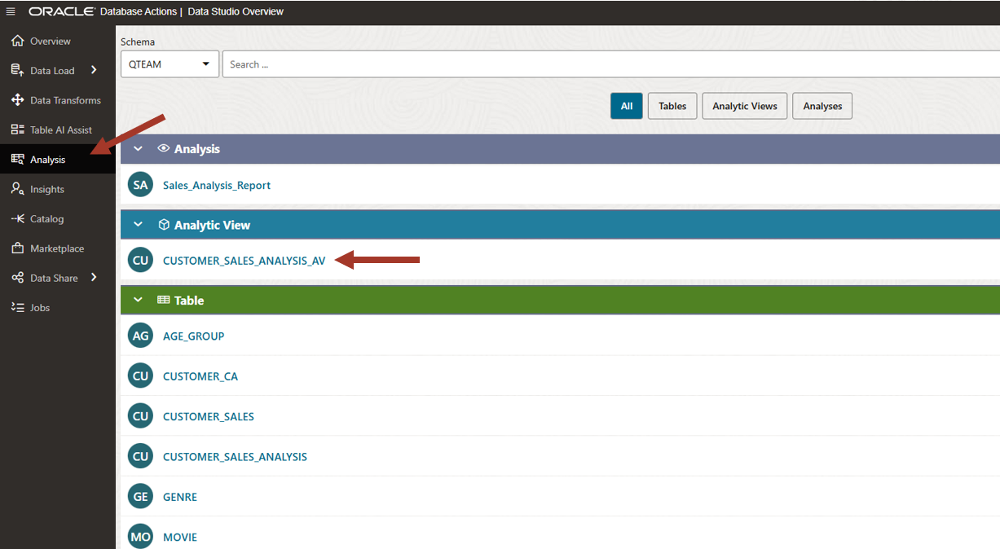

# Explore hidden patterns in your data

## Introduction

This lab introduces Data Studio’s Insights tool built into the Oracle Autonomous AI Database and shows how to search for and interpret data insights.

Estimated Time: 15 minutes

<!--
Watch the video below for a quick walk-through of the lab.
[Create a database user](videohub:1_0o150ib2)
-->

### Objectives

In this workshop, you will learn:
-	How to find hidden insights in your data

### Prerequisites

To complete this lab, you need to have completed the previous labs, so that you have:

- Created an Autonomous AI Lakehouse instance
- Created a new QTEAM user with appropriate roles

## Task 1: Use Insights tool

Data Studio's insights process runs in the background, finding interesting patterns 
in the data. This is a hands-off approach to
finding insights that are lurking out of sight in the data.

In this lab, we will investigate a few sample insights produced by the tool.
We will learn how to interpret it and will cross-check it with manual
analysis.

>**Note:** The insight process can run for some time depending on the
complexity of the data set and available compute resources. Our data set
is small enough that it will complete in a reasonable time. But you might
see the insight list being refreshed while it is executing.

1.  From the Data Studio Overview page launch the **Insights** tool.

    

2.  On the **Insights** page click on the top right icon to get a tour of the
    tool.

    

3.  Click Next to go through each area and learn about it.

    

4.  You can pick any table or Analytic View run insights on. 
    if you want to run insights against a single table then you can pick any column
    which you think is a measure.

    >**TIP**: Although you can run Insights on any table, it is best to prepare the data in such a way that there is one measure column and rest are related attribute columns. Not having any superfluous columns helps Insights tool run faster since it has to compare less permutations and combinations of attribute columns. You can use Data Transforms tool or SQL script to prepare the data as needed.

    Pick **CUSTOMER\_SALES\_ANALYSIS\_AV** for the table, and **TOTAL\_SALES**
    for the column. 
    
    Click **Search**.
    
    >**NOTE:** The search process will take couple of minutes to complete. These insights are stored in the database and can be accessed at any
    time for review. You can also regenerate the analysis if the data in
    the underlying AV/table has changed. The order of
    insights may vary if the data is different or the insight is still
    running, therefore refer to the labels on each tile to identify it.

    A list of various insights will appear on the page. The Insights tool has gone through the data and discovered
    many interesting behavioral patterns based on the movie sales data.
    
    
    For our workshop we will focus on three insights labeled in the screenshot:

      1: Purchasing pattern of singles across Genre

      2: Interest in adventure genre across age group 

      3: Purchasing behavior of dog owners across age groups
        
    

5.  Click on the tile marked **S** on the top and **Genre** at the
    bottom. It shows

    1: TOTAL_SALES (our measure driving the insight) in **blue** bars for
    **Marital Status=S** across **Genre**. This is the actual value.
    
    2: Each bar has a **green** horizontal line depicting the average,
    without the **Marital Status=S** filter. It is called the **expected** value.
    It can differ from the blue level if the data is skewed for the filter
    on the top (**Marital Status=S**).
    
    3: A few bars are surrounded by a black border (pointed by arrows). These
    are highlighted exceptions.
    
    Another way to read this is:
    
    **Singles** are purchasing **Adventure** and **Comedy** more than
    average and are not very interested in **Drama**.
    
    That is an interesting insight.  
    
    

    Click on the **Back** button to go back to the list.

6.  Click on the tile marked **Adventure** on the top and the **Age group** at
    the bottom.

    It shows that gen-Z is above average interested in adventure genre. This might be an obvious insight but the data is confirming it.

    

    Click on the **Back** button to go back to the list.

7.  Now, just for fun let's look at the pet ownership and movie purchase
    relationship.

    Click on the tile marked **Dog** on the top and **Cust Value**.
    
    It shows that the highest value (5) dog owners are purchasing far more movies than average compared to non-dog owners. It may be just a correlation but perhaps you could use this data to offer dog grooming products to high-value customers!
    
    Interesting. Isn't it? The Insights tool has discovered all these hidden
    patterns just by crawling through the data.

    

    Wow! That's quite an insight!! 

    Click on the **Back** button to go back to the list.

There are many other insights in the list. Go back to the list and look at a few others. See if you find any other interesting insight. The Insights tool has discovered all these hidden patterns just by crawling through the data.

## Task 2: Peeling the layers of Insights

This section is an attempt to explain the insights by manually running
queries and correlating them with what we can see in insights.

1.  Let's go back and look at the first insight again.

    Click on the tile marked **S** on the top and **Genre** at the bottom. This 
    was the movie genre preference of singles. It showed singles are purchasing 
    adventure and comedy more than the average and purchasing less drama genre than 
    the average.

    

2.  We can go back to the **Analysis** tool to confirm this insight. Go back to the analysis tool and click on the previously created AV to create a new analysis.

    

3.  In this new report we will analyze **sales** by **Genre** for married and singles alternately.

    Drag **Genre** on X-Axis (you will have to expand the tree on the left). 
    Pick **M** in the filter box on the right for marital status. You may need to scroll down on the right to find the marital status filter.

    

4.  Married people are watching **Drama** a lot and not much
    **Adventure** and **Comedy**.

    

5.  Now let's compare it for singles. Deselect **M** and select **S** in the right hand side filter for marital status.

    This is what you get. Notice high purchases in the **Adventure** and
    **Comedy** genre by singles and not much **Drama** (compared to
    married people).

    

**Isn’t that what Insights tool told us?! It discovered that without any input from us!**

While doing manual analysis in the **Analysis** tool, 
we must actively look at and compare the data for
certain hierarchies. There are many combinations, but people use their
experience to guide their analysis steps. In comparison, **Data
Insights** is a hands-off approach and it finds patterns without
understanding what hierarchies mean.

We think that both are complementary to each other and provide valuable
tools to use in "a day in the life of a data analyst".

## RECAP

In this lab, we examined various insights discovered by the Insights tool. 
They were interesting insights and not very obvious without digging into the data.

We also compared the results with the Analysis tool by doing manual analysis, illustrating 
the value of automated insights.

Now all the assigned tasks have been completed successfully.

You may now **proceed to the next lab**.

## Acknowledgements

- Created By/Date - Jayant Mahto, Product Manager, Autonomous AI Database, January 2023
- Contributors - Mike Matthews, Bud Endress, Ashish Jain, Marty Gubar, Rick Green
- Last Updated By - Jayant Mahto, August 2025

Copyright (C)  Oracle Corporation.