# Lab 1: Create an Oracle Autonomous Database 

# Lab 2: Create user

Make sure this user has DATA_TRANSFORM_USER role with default also
checked.

# Lab 3: Browse data

## Introduction

Data Studio has a collection of tools for various needs. We will start
with Data Catalog to look for the data we need.

## Task 1: Launch Database Action

1.  Login to the Autonomous Database created earlier with your user and
    password. You can see various tools under Data Studio.

    Note: Bookmark the Database Actions page so that it is easier to come
    back to this later in the workshop.
    
    Click on **DATA STUDIO OVERVIEW** card.

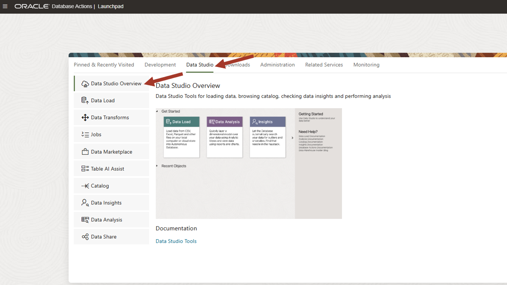

2.  It shows the list of recent objects in the middle. On the left, it
    has links to individual tools and on the right, link to
    documentation.

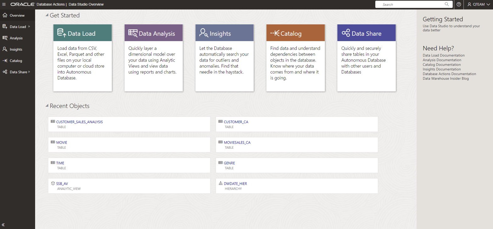

Since it is a workshop, there are limited objects in the list. There
will be many objects and only the recent objects are shown here. We will
use the Catalog tool to browse the objects and find what we need.

## Task 2: Explore Catalog

1.  Click on the Catalog link on the left panel.

    In a typical database there will be many objects and you need various
    ways to search and display objects. Various ways to navigate a catalog
    is shown by marked numbers in the above screenshot. These are:
    
    1: Saved searches. You can filter objects easily with one click and
    then refine the search further as per need.
    
    2: Filters to narrow down your search.
    
    3: Various display modes. Card/Grid/List view.
    
    4: Search bar where you can type in advanced search query

2.  Note that catalog shows all types of objects. We are interested in
    only the tables for now. Click on "Tables, views and analytic views
    owned by..." on the right zone 1.

    You can see the MOVIESALES_CA in this list. We are interested in this
    table since we were told that this table contains movie sales
    transaction data. (Referring to the meeting notes in introductory
    section of this workshop).
    
    You could explicitly search for MOVIESALES_CA by typing the name of
    the table in the search bar but in our case, it is clearly visible in
    the grid view in the middle.

3.  Click on the MOVIESALES_CA table.

    You can see the data preview. You can scroll right to see more columns
    and scroll down to see more rows. You can also sort the columns by
    right clicking on the columns. Using the data view, you can be sure
    that this is the data you want.
    
    Note that you also have other information such as
    lineage/impact/statistics/data definitions etc. This workshop is not
    going into the details. In-depth catalog will be explored in other
    workshops.
    
    Now close this view by clicking on the bottom right **Close** button.

4.  Look for the other tables of our interest in the main catalog page.
    If you remember the meeting notes in introductory section of this
    workshop, we are also interested in CUSTOMER_CA and GENRE tables.
    Find and click on these tables to do a data preview.

5.  We also need to find out whether age group information is present.

    Clear search bar and enter the following search string:
    
    **(type: COLUMN) AGE**
    
    This will search for all the columns with "AGE" in the column name.
    
    We can explicitly search for GROUP as well but we don't see any.
    
    Looks like we need to load a new table for age group.

# Lab 4: Load data

## Introduction

If you remember our assignment (in the introduction section), we need to
analyze the movie sales data by age group as well. In our previous lab
we noticed that there is no age group information, and we need to load a
new table for age group.

For this we will go back to our database actions page by clicking on the
top left button and use Load Data tool.

## Task 1: Create local data file for AGE_GROUP

1.  We need to create a local data file for AGE_GROUP. Launch Excel on
    your desktop to create this dataset. Note that you can also use a
    text editor to create this data set since it is small.

Save this as AGE_GROUP Excel workbook.

    If you don't have Excel then create a csv file with the data as below
    and save it as AGE_GROUP.csv.
    
 
\"MIN_AGE\",\"MAX_AGE\",\"AGE_GROUP\",

0,20,\"00-20\",

21,30,\"21-30\",

31,40,\"31-40\",

41,50,\"41-50\",

51,60,\"51-60\",

61,70,\"61-70\",

71,80,\"71-80\",

81,200,\"Older than 81\",

 
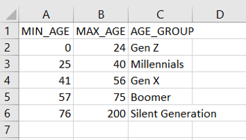

## Task 2: Load data file for AGE_GROUP

1.  Launch Data Load from Database Actions page by clicking on **DATA
    LOAD** card.

    Note that you have various modes for loading data. You can either
    directly load data or leave it in place simply linking it. You can
    also create ongoing feed to load data to Autonomous Database.
    
    You can also load data from either your local file, database or from a
    cloud storage.
    
    In this lab we are loading data from the local file created in earlier
    task. Selected **LOCAL FILE** and press **Next**.

2.  Drag your local file AGE_GROUP.xlsx to the load window.

3.  Press on the green triangle button to start the load.

    After the load is complete, click on the Database Actions link on top
    of the page to go back to the main menu.
    
    Now we all the data sets that we need to complete our assignment.

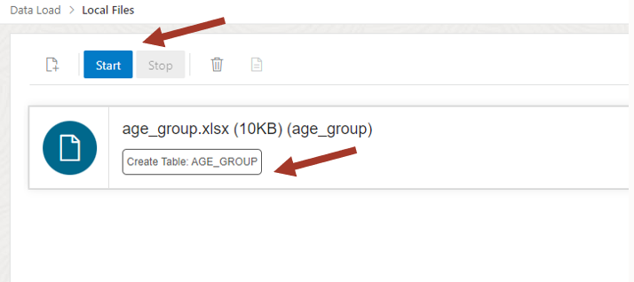

# Lab 5: Transform data

## Introduction

Now let us refer to our assignment again. We are supposed to find high
value customers. It was decided that we can use sales data to assign
customer value. We can rank the customers into five quintiles based on
how much they have paid for movies and load into a new
**CUSTOMER_SALES_ANALYSIS** table.

We will also denormalized this table with interesting customer
attributes for analysis from **CUSTOMER_CA, AGE_GROUP** and **GENRE**
table.

This is an example of preparing data for an intended purpose. Our
purpose is to find high value customers and find any patterns in the
sales data by analyzing it.

Transform Data tool makes such data preparation tasks easy.

## Task 1: Launch Data Transforms

1.  Click on DATA TRANSFORMS card to launch the tool.

    NOTE: If you don't see the DATA TRANSFORMS card then it means you are
    missing DATA_TRANSFORM_USER role for your user. Login as ADMIN and
    grant the role (make sure this role is marked "Default" as well).

2.  Provide username and password for the database user QTEAM.

3.  You will see a provisioning screen like below.

4.  It will take up to 3 minutes for the service to be provisioned. Once
    provisioned you will see the following home screen.

    Note: Data Transforms tool is provisioned based on demand. If there is
    inactivity for 15 minutes, then it goes into sleep mode and needs to
    be provisioned again. Clicking on any part of the UI will provision it
    again if it has gone into sleep mode. If you get any error, then
    refresh your browser.

## Task 1: Setup Connection

1.  Click on **Connections** on the left side to look at available
    connections.

2.  You will notice that there is one connection already defined. Click
    on the connection to establish the connection. This is one time
    activity.

3.  Enter username and password and click on Test Connection. After
    successful connection (notification message will appear on top
    right).

4.  If the notification message disappears then you can get it back by
    clicking on the bell icon on the top right. Throughout this tool you
    will have notification messages available by clicking on the bell
    icon.

Note: In this workshop we are working with only the data available in
our Autonomous Database, but you can create connections to other
databases, object stores and applications as well and load and transform
data from those sources to your Autonomous Database. Data Transforms is
a complete tool for complex data integration projects.

Note: Any database user who has DATA_TRANSFORM_USER role, can access the
connection setup in this step (and any other connections or data flows
created later). All the objects created in the Transforms are also
shared with other users with this role. Because of this you need to be
very selective on giving out this role.

Now we are ready to prepare the data.

## Task 1: Create data flow to load customer sales analysis table

1.  Click on the **Home** button on the left side to go back to the home
    screen. You have wizards to load data from other sources (as defined
    in connections) and to transform data. Since our data is already
    loaded in our Autonomous Database in the previous lab, we will click
    on the **Transform Data** wizard.

2.  Enter name and description of data flow.

    Name: **load_customer_sales_analysis**
    
    Description: **Load customer sales table with quintiles and other
    attributes**
    
    A good description helps you understand the objective of the data
    flow.
    
    Since we are working on this tool for the first time, we don't have a
    project. Click on + to create a project. Accept the default name for
    project name.
    
    Click **Next**.

3.  Select the only connection from the dropdown list and pick **QTEAM**
    from the schema drop down list.\
    \
    Click on **Save**.

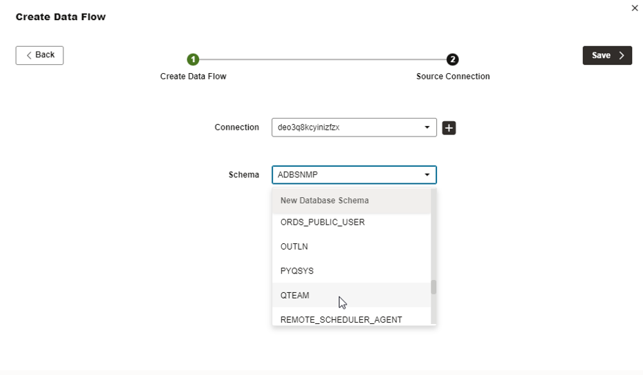

4.  This will bring up data flow editing screen. On the left side you
    will see message as "Importing Data Entities" next to **QTEAM**
    user. It will take approximately 2-3 minute to import all data
    entity definitions and then message will disappear.

You can also refresh the data entities any time with the refresh icon.

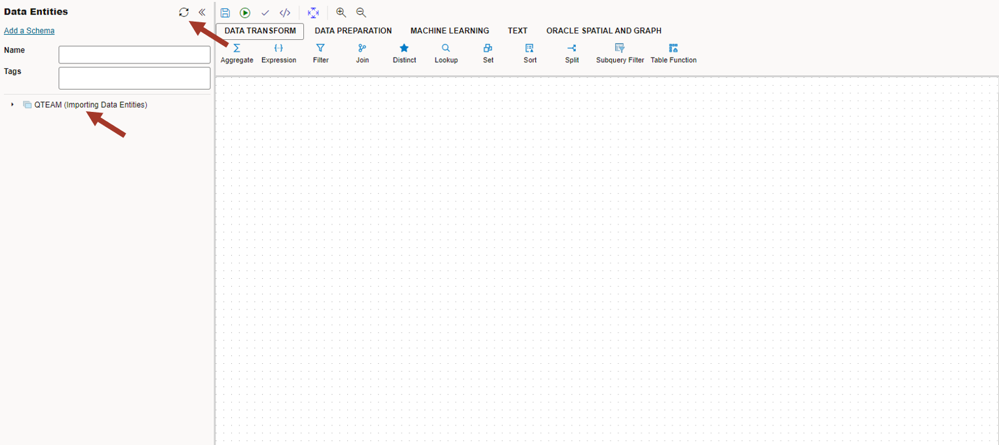

5.  Now let us learn how to navigate in the data flow editing screen.
    Refer to the numbered zones in the screenshot.

    1: Main editing canvas to create data flow by combining various
    transforms
    
    2: Data Entity browser. Data Entities can be used as a source or
    target for the data flow. You can add more connections by clicking on
    the + icon (we don't need to) and filter entities by name or tag if
    the list is big. Entities are dragged into the main canvas to build a
    data flow.
    
    3: List of transformations grouped under various buckets. Click on
    different buckets to see what kind of transforms are available. Basic
    transforms are under **DATA TRANSFORM** and **DATA PREPARATION**
    bucket. These transforms are dragged into the main canvas to build a
    data flow.
    
    4: Properties: By clicking on any source/target entity or on a
    transform step, you can view and edit various properties.
    
    5: Save, validate, and execute. We can also schedule the execution
    from in built scheduler.
    
    6: When you click on the empty part of the main canvas then it gives
    you execution status of the data flow.

6.  Now we are ready to build the data flow. We want to aggregate the
    sales per customer to create 5 quintile buckets to determine
    customer value.

    First, we will drag **MOVIESALES_CA** into the canvas and drag
    **Aggregate** transform from above under **DATA TRANSFORM** bucket.
    Also drag **QuintileBinning** transform into the canvas. This
    transform is in **DATA PREPARATION** bucket above.
    
    There are many transforms available under different buckets to build
    the desired data flow. For this workshop, we will use few of them.
    
    This should like below.

7.  Click on **MOVIESALES_CA,** and Link it to the **Aggregate**
    transform by dragging the little arrow on top of the **Aggregate**
    transforms. Follow this process to link transform steps in the rest
    of the workshop.

8.  Now let's edit the properties of the aggregate transform. Click on
    the aggregate transform and then click on the attribute icon on the
    right-side properties panel. You should also expand the properties
    panel by clicking on the extreme right corner icon.

Use this process to edit properties for the transforms for the remaining
of the workshop.

9.  Click on Attributes on the left side. You can edit this attribute
    list. We will remove everything except **CUST_ID** and
    **TOTAL_SALES**. Click on the checkbox and click delete icon on the
    right side.

10. Now change the name of **TOTAL_SALES** to **CUST_SALES** to make it
    more meaningful. This will be aggregated sales for the customer. It
    should look like below.

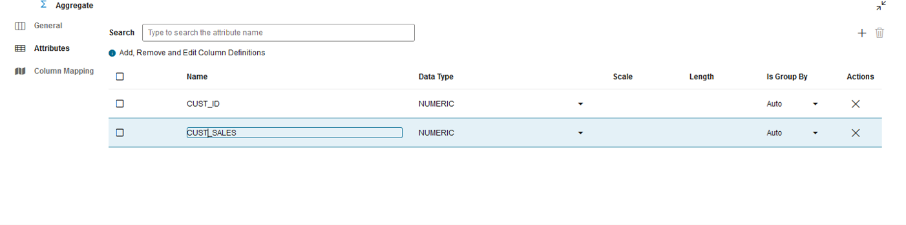

11. Now click on Column mapping on the left side to define aggregate
    expression. You can populate these expressions by **Auto Map** and
    edit it as needed. Click on **Auto Map** to populate it by name.

12. Auto Map populated only the CUST_ID and could not find a match for
    CUST_SALES since we had changed the attribute name. We can either
    type in the aggregate expression directly in the blank space or use
    the expression editor on the right side. Click on the expression
    edition icon.

13. This will open the expression editor. You can drag source attributes
    from the left side in the editor and write a suitable expression.

Enter the following expression: **SUM ( MOVIESALES_CA.TOTAL_SALES )**

Click **OK**

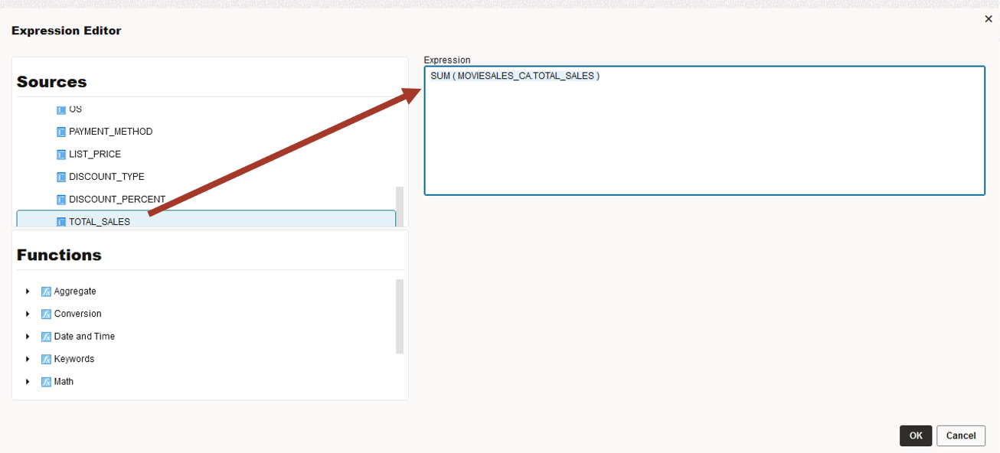

14. Review the screenshot below. **CUST_SALES** attribute is mapped to
    the sum of **TOTAL_SALES** grouped by **CUST_ID**.

Now collapse the properties panel by clicking on icon on the right
corner.

You will follow similar process for editing the properties in the rest
of the workshop.

15. Now link the aggregate transform to the QuintileBinning transform,
    click on the QuintileBinning transform and open the properties
    panel.

16. In the Attribute section, click on the **OUTPUT1**.

Change the name **Return** to **CUST_VALUE**. QuintileBinning output
will go into **CUST_VALUE** attribute.

Confirm that you have changed the name.

17. Click on the Column Mapping and enter 5 for the **number of
    buckets** expression. Drag **CUST_SALES** from aggregate into the
    **order** expression.

    **It means that aggregate customer sales will be used to divide
    customers into 5 buckets. This will be used as customer value.**

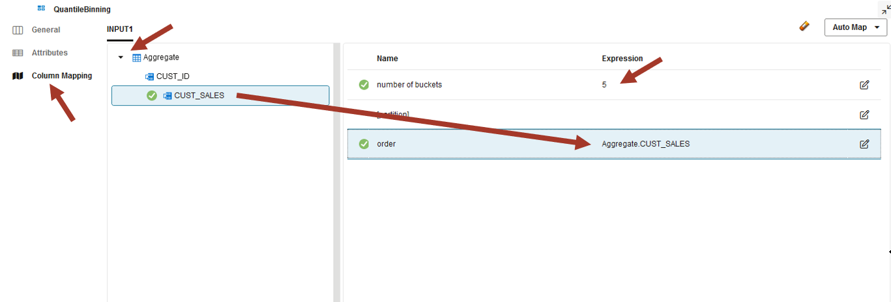

18. Close the property panel by clicking on the right corner and come to
    the main canvas.

    Now you have the basic skills to add data sources, add transforms, and
    edit its properties. Now bring **Join** transform into the canvas,
    drag **CUSTOMER_CA** table and join it with previous flow as below.
    
    Click on the Attribute property of the Join and notice that it has
    populated the join automatically. You can also edit it manually if it
    is not what you expect.
    
    Make sure the join is: **Aggregate.CUST_ID=CUSTOMER_CA.CUST_ID**

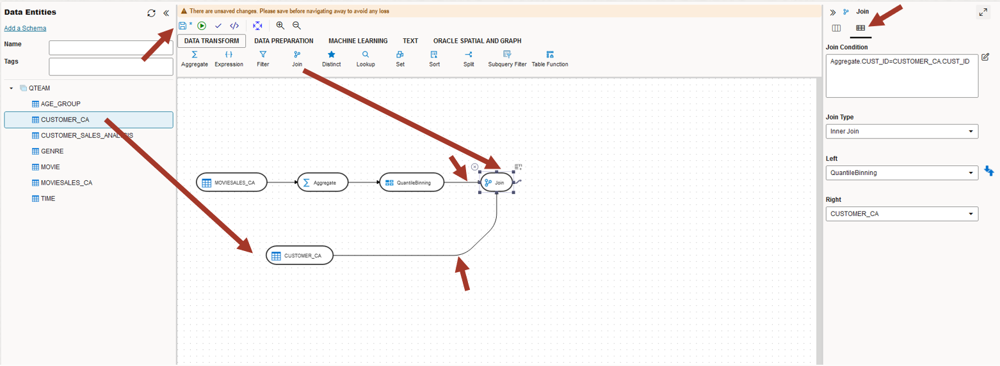

19. Now bring in **AGE_GROUP** table and use Lookup transform. Link it as
    below.

    First link the end of the data flow to Lookup and then link **AGE_GROUP** to lookup.

    Make sure lookup expression is: **CUSTOMER_CA.AGE between
    AGE_GROUP.MIN_AGE and AGE_GROUP.MAX_AGE**
    
    Note that you can also optionally use the expression editor.
    
    **Take a moment to notice that we are building the data flow step by
    step and this way it is easy to understand. This is an advantage of
    using UI to define a complete data preparation task which could be
    quite complex.**

20. Now we need to bring in the transaction data again which will be
    used for analysis later. Drag **MOVIESALES_CA** into the canvas and
    join it.

    Make sure the join is: **Aggregate.CUST_ID=MOVIESALES_CA1.CUST_ID**
    
    **NOTE: Notice that the display name for this is MOVIESALES_CA1
    (suffixed by 1). This is because this table is used twice in the data
    flow. First for calculating the quintile and the second time to bring
    individual sales transaction data.**
    
    Also bring in movie GENRE table and join it.
    
    Make sure the join is: **MOVIESALES_CA1.GENRE_ID=GENRE.GENRE_ID**
    
    The above join expression should be populated automatically.
    
    It should look like below.
    
    It is good practice to keep saving it by clicking on the **Save** icon
    on the top left.

21. We have completed the data flow. It may look complex, but one can
    visualize it step by step transformations. Now we need to write it
    to a new **CUSTOMER_SALES_ANALYSIS** table.

    Click on the tiny grid at the corner to the end of the data flow (last
    Join transform) to open the target table property dialog. Note that if
    we already had a target table then we could simply drag that table in
    to complete the flow. But in our case, the target table doesn't exist
    yet.

22. Enter the name and connection properties.

    Name: **CUSTOMER_SALES_ANALYSIS**
    
    Alias: **CUSTOMER_SALES_ANALYSIS**
    
    Connection:your connection name    
    
    Schema:**QTEAM**
    
    Click **Next** for **Add Data Entity** dialog

23. Now you can edit the target column names. The initial list is
    populated by the columns in all the tables in the data flow.

    Remove the columns ending with \_ID. They don't help in any meaningful
    analysis. The attributes are always denormalized by the joins. Click
    on the checkbox and then click on the delete icon on top right.
    
    Click **Next**

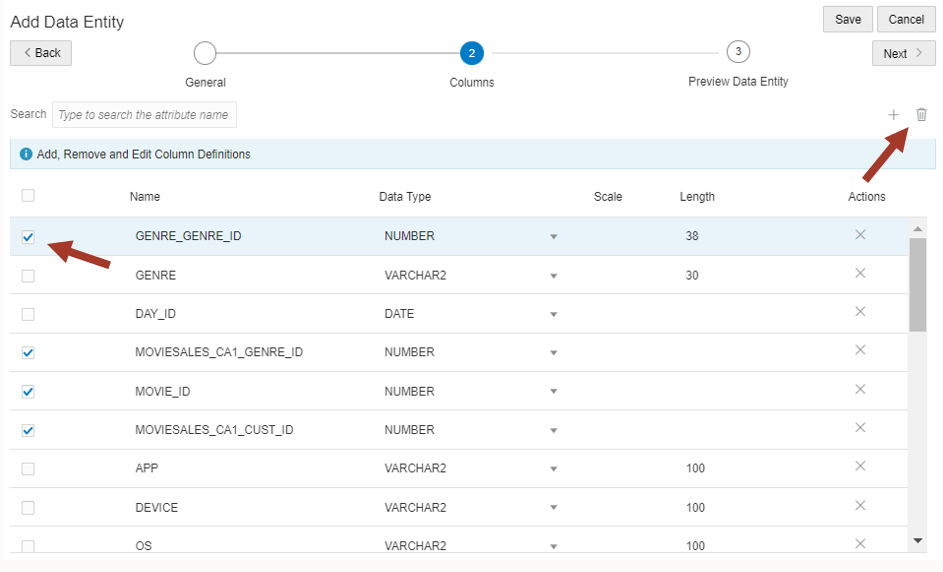

24. Review the columns. You can go back to make any changes. If you
    accidently removed a column and want it back then you can add it
    manually if you know the name and data type, or you can cancel it
    and redo the process again.

Click **Save**

25. You can see that the target table is added to the end of the data
    flow.

    Also note that the target table definition has been stored in
    transforms and if you want to recreate/edit the data flow then it will
    be available on the left side for drag and drop, instead of going
    through **Add Data Entity** dialog.
    
    Now we need to make sure target load properties are correct. Click on
    the target table in the canvas and expand the property panel by
    clicking on the top right corner.

26. Click on Attributes mapping and verify the expressions. Notice that
    all have been populated properly. You can also edit them manually if
    you want to make changes. Make sure all the columns are mapped. You
    can also use auto mapping functionality if you have create new
    attributes.

27. Now to the final step. Click of **Options**.

    Make sure you have the **Drop and create target table** is **true**.
    
    This makes sure that you always have the correct definition.
    
    You can also choose to load data into existing table with or without
    truncating. Data can also be loaded incrementally. These are advanced
    modes. For now we will simply drop and create the table in every
    execution.

28. Collapse the property panel and go back to the main canvas. Save it
    and validate it by clicking on the validate icon (looks like small
    check mark).

29. Now execute it by clicking on the small triangle in the circle.
    Confirm **Start**.

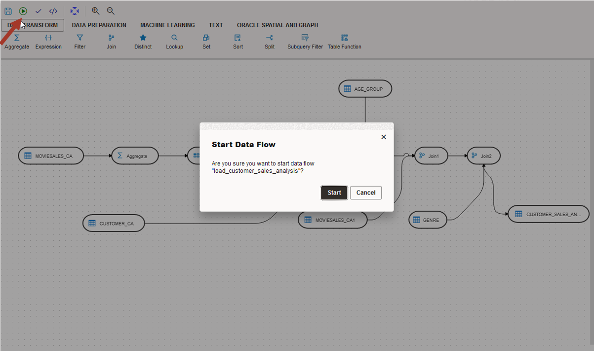

30. Data flow execution status is on the bottom right-side panel. Click
    anywhere on the empty canvas to make it visible. Now we need to look
    at the data.

31. Click on the target table and do the data preview by clicking on
    small eye icon. Expand the panel to see more.

32. Check that all columns are populated. If some columns are blank,
    then it means some mapping expression in the data flow was blank or
    incorrect. Go back and fix it and re-execute it.

33. Also check the **Statistics** tab for quick data profile.

For now, it is just a cursory data glance. Next, we will use **DATA
ANYSIS** tool to analyze this data and find many interesting patterns.

**Important note on this lab:**

We have scratched only the surface of possibilities in Data Transforms.
Other features are:

-   Verity of data sources: Databases, Object Store, REST API and Fusion
    Application

-   Load Data: Loading multiple tables in a schema from another data
    source. It integrates with Golden Gate data service for advanced
    replication. This completes the Data Load tool explored in earlier
    lab.

-   Work flow: Combining various data flows in sequential or parallel
    execution flow.

-   Schedule: In built scheduler for periodic execution.

## Task 4: For Advanced users: How to debug

**Note: skip if you don't have any errors and you want to straight go to
the next task.**

1.  Go back to data flow canvas and click on the empty space in the
    canvas. On the top there is Code Simulation icon. Click on it. This
    will show you the code to be generated.

2.  Look at the generated SQL. Imagine writing this SQL without the
    graphical interface. Still some advanced users might find this
    useful for debugging purposes.

3.  Now look at the **Data flow Status** on the right side. If there are
    any errors, then you can click on the **Execution Job** in the
    **Data Flow Status** panel to debug. It will take you to the jobs
    screen where you can look at the executed steps, processed row
    counts and corresponding SQL.

4.  Notice different steps in the execution. You can also get the
    executed SQL (as opposed to simulated SQL seen earlier) by clicking
    on the step.
    
    To go back to your data flow, click on the **Design Object** link.
    
    From anywhere in the UI, you can go back to Home screen by clicking on
    the top left link.

There are many more features to explore for the advanced users. In this
workshop we are limiting to creating a data flow and executing it on
demand.

# Lab 6: Data analysis

## Introduction

Now let us refer to our assignment again. We are supposed to find high
value customers. In our previous lab we created a table with list of
customer ids against 1 to 5 values based on movie consumption. This
table can be used for sending promotional offers to customers with value
5.

Now on to the 2^nd^ part of our task. We were asked to find movie genre
preference based on age groups and marital status and whether these
preferences are different across high value and low value customers.

We need to analyze our customer sales data along with age group, genre,
and customer value dataset. We will use **DATA ANALYSIS** tool for this
task.

## Task 1: Create AV for data analysis

1.  Navigate to Database Actions page and launch DATA ANALYSIS tool.

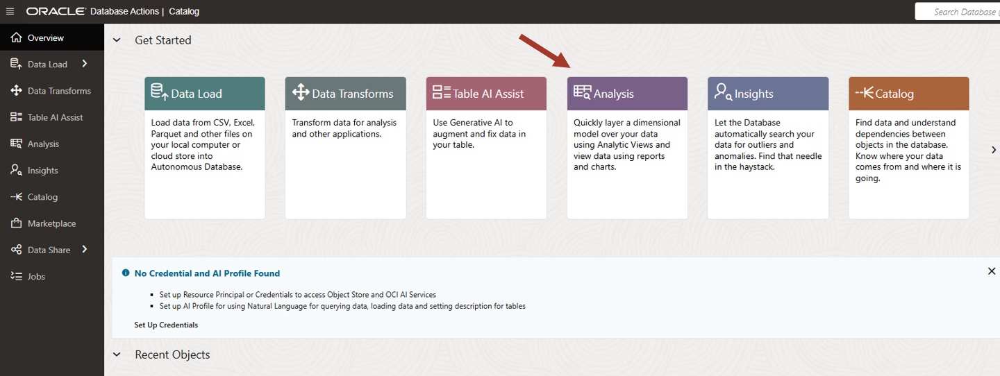

2.  First time when you access data analysis tool, you will see a
    guiding wizard that will describe various parts of the UI. Since you
    are doing this lab anyways, click on X to cancel it and start using
    the tool right away.

3.  To Analyze your data, create an Analytic View (AV) first. Analytic
    Views organize data using a dimensional model, allowing you to
    easily add aggregations and calculations to data sets and present
    data in views that can be queried with relatively simple SQL.

    We don't have any AV yet, therefore we are going to create one.
    
    Select your schema QTEAM and click on **Create** button.

4.  Default AV name is derived by the fact table. Enter various fields
    as follows:

    Name: **CUSTOMER_SALES_ANALYSIS_AV**
    
    Caption: **Customer sales analysis av**
    
    Description: **Customer sales analysis av**
    
    Schema: **QTEAM**
    
    Fact Table: Pick **CUSTOMER_SALES_ANALYSIS** from the list
    
    You can find related tables and hierarchies by clicking on **Generate
    Hierarchy and Measures** button. This will scan your schema and find
    all the tables related to CUSTOMER_SALES_ANALYSIS and give you a
    starting point.
    
    However, in our case, we have prepared the data in such a way that all
    analysis attributes are in one table. We don't need to run this
    automated process.

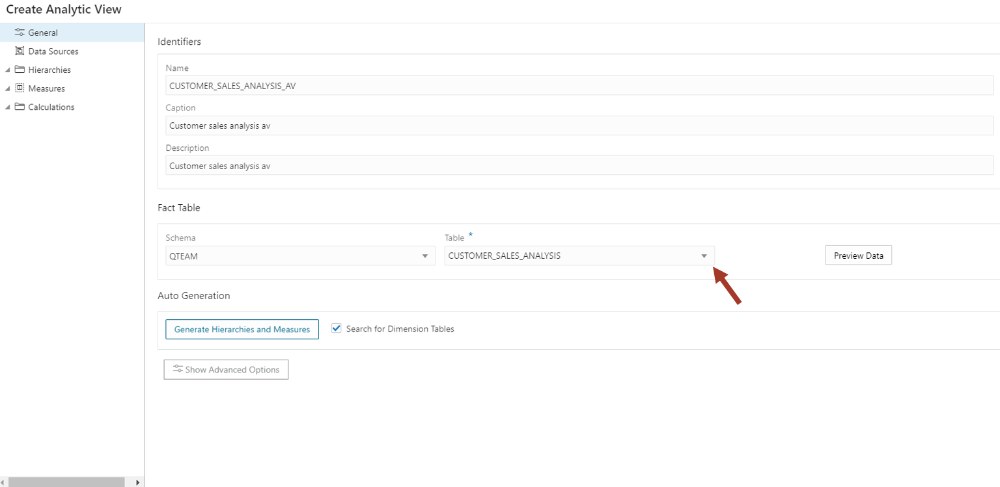

5.  Now click on Data Sources on left side to verify that
    CUSTOMER_SALES_ANALYSIS is the data source.

6.  Now click on the Hierarchies on the left side and add the attributes
    we want in our analysis. We want to add **AGE_GROUP, CUST_VALUE,
    DEVICE, MARITAL_STATUS, GENRE,** and **PET**. It will be interesting
    to do movie preference analysis with pets.
    
    NOTE: These are all single level hierarchies. Adding multiple level
    hierarchies is advanced topic and will not be covered. However, we will
    see that even with single level hierarchies, we can do interesting
    analysis.

7.  If you don't see your column, then click on More columns at the end
    at search for your columns. Then add it by clicking on it.

8.  After you add all, it should look like below.

9.  Now click on Measures and add a measure with TOTAL_SALES column

10. We have completed our AV. Click on **Create** it and confirm OK.

11. Our AV is ready now and we can start analyzing data. You can see
    that there are no errors. By clicking on the Data Quality tab.

    You can also go back and edit the AV by clicking on three vertical
    dots.

## Task 1: Analyze data

Now the fun part starts. All this time we were preparing the data and
creating dimensional model in AV. We will start creating reports, charts
and start finding hidden patterns in the data.

First let's learn how to navigate in the analysis tool.

1.  Select your AV and click on **Analyze**.

    These zones are:
    
    1: Hierarchies and measures
    
    2: Columns, Rows, Values and Filters where you can drag components
    from the zone 1 to slice and dice the data.
    
    3: Main area for displaying reports and charts.
    
    4: Table/Pivot/Chart view. For remainder of the lab we will use chart
    view.
    
    5: Insights. Automated algorithm to search for hidden patterns. This
    is the topic of our last lab. For now, we will click on the right side
    bar to collapse it.

2.  Now we can start doing our first analysis.

    **Analysis: show me \"SALES_AMOUNT\" by \"AGE_GROUP\"**
    
    Select chart mode. Clear all hierarchies from X-Axis and drag **Age
    group** to X-Axis and **Total Sales** to Y-Axis.
    
    This chart is showing you total sales across age group. We can
    conclude that seniors (71-80) are not watching many movies whereas age
    group 21-30 and 31-40 are watching most.

3.  Next let us analyze sales by marital status.

    Clear X-Axis and drag **Marital status**.
    
    You will have to expand the left side tree node to drag the level.
    Level is under hierarchy node (with the same name for convenience).
    
    We can see that singles are watching more movies than married people.

4.  Now we can mix two hierarchies. Drag **Age group** above **Marital
    status** in X-Axis. 

    Make sure **Age group** is on top of **Marital status**.

    We notice that although singles watch overall more movies, married
    people watch more than singles in young age group (21-30, 31-40).
    
    This was not obvious before.

5.  Now we are curious to know which genre sells most.

    Clear X-Axis and drag **Genre**.
    
    Drama Sells! Followed by Action.

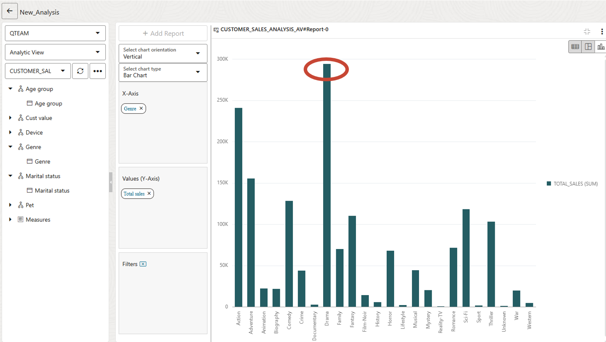

6.  We had earlier ranked our customers in high and low value buckets.
    It will be interesting to find out whether there is a movie genre
    preference of high value customers.

    Clear X-Axis and drag **Genre** and **Cust value**. Make sure **Cust value** is 
    on the top.
    
    The chart is very wide, and you can't see all the way to the right. To
    fit the entire width you can drag the right edge of lower window
    towards right till all customer values are visible in one page. If 
    you don't see the lower window then zoom out on the browser with CTRL -.

7.  Let's look at this chart. We can see that Drama is very popular with
    high value (Cust value=5) customers, whereas Action is more popular
    with low value customers (Cust value=1).

    Of course, most of the bars are taller for high value customers
    because overall they spend more.

Go ahead and see if you can find any other interesting pattern. What
movie genre are popular in different age groups?

We can spend lots of time in the analysis tool visualizing the data with
different combinations of attributes.

So far, we are looking at only the charts, but this data can be
displayed in tabular format and in a pivot table as well. Switch the
display mode to see how it works. Advanced uses can access the data in
this AV from Excel or from Googlesheet. This is out of scope for this
lab.

# Lab 7: Data Insights

## Introduction

While we are doing data analysis, Data Studio is busy in the background
finding interesting patterns in the data. This is hands off approach to
finding insights that are lurking out of sight in the data.

In this lab we will investigate various insights produced by the tool.
We will learn how to interpret it and will cross-check with manual
analysis.

Note that insight process can run for some time depending on the
complexity of the data set and available compute resources. Our data set
is small enough that it will complete in reasonable time. But you might
see the insight list being refreshed while it is executing.

## Task 1: Use Data Insights

1.  Launch Data Insights by clicking on the Database Actions link on the
    top and then click on the **DATA INSIGHTS** card.

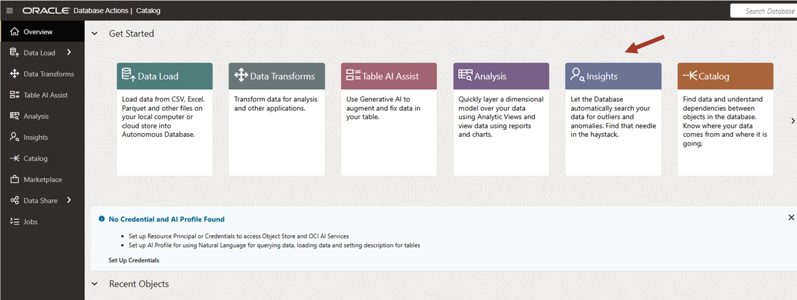

2.  On the insight page click on the top right icon to get a tour of the
    tool.

3.  Click Next to go through each area and learn about it.

4.  you can pick AV or any table to run insights on. In case of AV, you
    can pick any measure to run insight against whereas if you want to
    run insights against a single table then you can pick any column
    which you think is a measure.

    In our case, AV built in the previous lab had only one measure
    (TOTAL_SALES). Insight tool has gone through the data and discovered
    many interesting behavioral patterns (of movie buying).
    
    NOTE: These insights are stored in the database and can be queried any
    time for a review. You can also regenerate the analysis if the data in
    underlying AV/table has changed.
    
    Let's look at few of such patterns. For this lab, we will look at 3
    examples:
    
    1: Purchasing pattern of singles across Genre
    
    2: Representation of seniors (61-70) across customer value
    
    3: Purchasing behavior of dog owners across age groups
    
    You can find them in the screenshot below. **Note that the order of
    insights may vary if data is different or the insight is still
    running, therefore refer to the labels on each tile to identify it.**

5.  Click on the tile marked **S** on the top and **Genre** at the
    bottom. It shows

    1: TOTAL_SALES (our measure driving the insight) in **blue** bars for
    **Marital Status=S** across **Genre**
    
    2: Each bar has a **green** horizontal line depicting average
    **without Marital Status=S filter**. It is called **expected** value.
    It can differ form the blue level if the data is skewed for the filter
    on the top (**Marital Status=S**).
    
    3: Few bars are surrounded by black border (pointed by arrows). These
    are highlighted exceptions.
    
    Another way to read this is as:
    
    **Singles** are purchasing **Adventure** and **Comedy** more than
    average and not much interested in **Drama**.
    
    WOW! That is quite an insight.

6.  Now to the next insight.

    Click on the tile marked **61-70** on the top and **Cust value** at
    the bottom. It shows
    
    It shows that seniors 61-70 overrepresented in 4th customer value
    bucket. Probably they have lots of disposable income!

7.  Now, just for fun lets look at pet ownership and movie purchase
    relationship.

    Click on the tile marked **Dog** on the top and **Cust Value**.
    
    It shows that highest value (5) dog owners are purchasing more movies
    than average compared to non-dog owners.
    
    It is just a correlation but you could use this data to offer dog
    grooming products to high value customers!!
    
    Interesting. Isn't it! Insight tool has discovered all these hidden
    patterns just by crawling through the data.

**Concluding thought**: If we are doing manual analysis in **DATA
ANALYSIS** tool, then we must actively look at and compare the data for
certain hierarchies. There are many combinations, but people use their
experience to guide their analysis steps. In comparison, **DATA
INSIGHTS** is hands off approach and it finds patterns without
understanding what hierarchies mean.

We think that both are complimentary to each other and provide valuable
tools to use in "a day in the life of a data analyst". That is how we
started this workshop!

Now all the assigned tasks from our Monday meeting have been completed
successfully. Ready for the next meeting.

## Task 2: Advanced users: Peeling the layers for Data Insights

This section is an attempt to explain the insights by manually running
queries and correlating them with what we can see in insights.

1.  Let's go back and look at the first insight again.

Click on the tile marked **S** on the top and **Genre** at the bottom

2.  We can go back to DATA ANALYSIS tool in another tab to confirm this
    insight. Go back to the data analysis and analyze by Genre and
    filter for Marital status=M and S alternately.

    Drag Genre on X-Axis (you will have to expand the tree on the left)
    and Marital Status on Filters. Pick M in the filter box.

3.  Married people are watching **Drama** a lot and not much
    **Adventure** and **Comedy**.

4.  Now let's compare it by changing the filter to S (singles).

    This is what you get. Notice high purchases in **Adventure** and
    **Comedy** genre by singles and not much **Drama** (compared to
    married people).

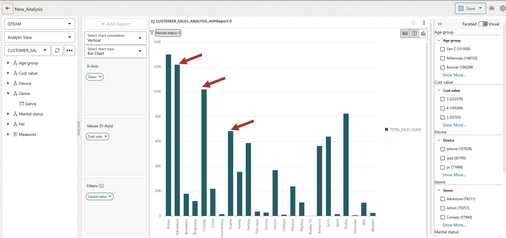

**Isn't that what our insight told us!!**
