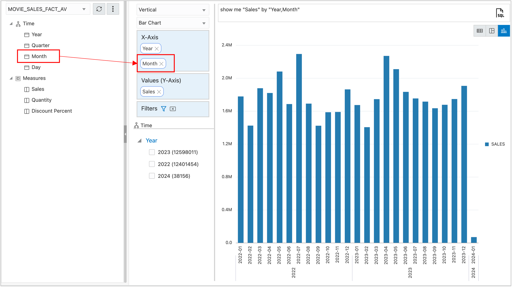

# Introduction

The Analysis Application includes a Analytic View data viewer.  You can use this viewer to review the Analytic View and check the data.

## Task 1 - Review Data in the Analytic View

To view the data in the Analytic View, choose the Analyze tab and define a query in a report or graph.

1. Choose the **Analyze** tab.

The application chooses a level (Year in this case) and a measure (sales), and displays a report.

2. Switch to a chart by pressing the **bar chart** button in the upper, right corner of the application.

A bar chart with Years is displayed. Add **Months** to the Chart.

3.	Expand the **Time** hierarchy, select **Month**, and drag it under **Year** in the **X-Axis** position.

The chart now displays Month within Year.

## Acknowledgements

- Created By/Date - William (Bud) Endress, Product Manager, Autonomous Database, January 2023
- Last Updated By - William (Bud) Endress, January 2023

Data about movies in this workshop were sourced from **Wikipedia**.

Copyright (C)  Oracle Corporation.

Permission is granted to copy, distribute and/or modify this document
under the terms of the GNU Free Documentation License, Version 1.3
or any later version published by the Free Software Foundation;
with no Invariant Sections, no Front-Cover Texts, and no Back-Cover Texts.
A copy of the license is included in the section entitled [GNU Free Documentation License](files/gnu-free-documentation-license.txt)
