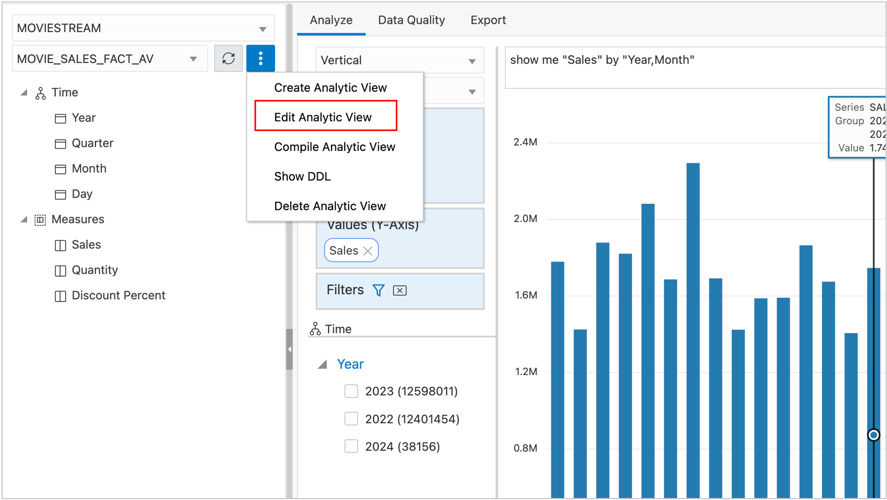
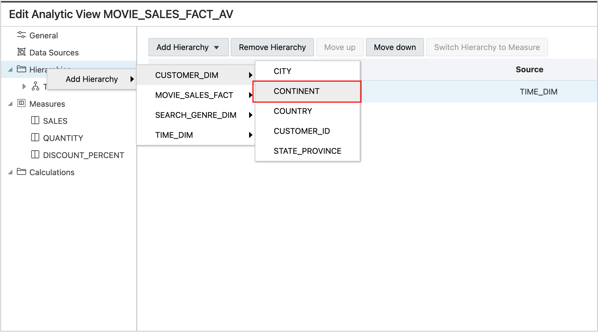

# Introduction

The Analytic View is functional, but not very interesting with just a single hierarchy and a few measures. The data supports additional hierarchies for geography, viewing device and the movie genre that was used to search for movies to view.  It’s time to add more hierarchies.

## Adding Hierarchies

You can add hierarchies using the same methods that you added the Time hierarchy. First, you need to switch back the Analytic View editor.

1. Choose Edit Analytic View

You are returned to the editor.

Add new Data Sources for the hierarchies. Repeat the following steps for the CUSTOMER_DIM, DEVICE_DIM, and SEARCH_GENRE_DIM views.

1.	Select **Data Sources**.
2.	Select both **CUSTOMER_DIM** and **SEARCH_GENRE_DIM**.
3.	Leave **Generate and Add Hierarchy from Source** off (disabled).
4.	Press the **OK** button

When you are done your screen should look like this.

Now you can add hierarchies.  For each table, create hierarchies using the columns as described in the table below. Be sure to sort the levels according to the Level Order column in the table.

|Table                  |Column                 |Level Order |
|-----------------------|-----------------------|-----------:|
|CUSTOMER_DIM           |CONTINENT              | 1          |
|CUSTOMER_DIM           |COUNTRY                | 2          |
|CUSTOMER_DIM           |STATE_PROVINCE         | 3          |
|CUSTOMER_DIM           |CITY                   | 4          |
|CUSTOMER_DIM           |CUSTOMER_ID            | 5          |
|SEARCH_GENRE_DIM       |GENRE_ID               | 1          |
|                       |                       |            |

For example, to add a hierarchy:

1.  Right click Hierarchies
2.  Add Hierarchy
3.  Choose CUSTOMER_DIM
4.  Choose CONTINENT

After creating the hierarchy, your screen will look like this:

Next, add levels. For example:

1. Select the **CONTINENT** hierarchy.
2. Choose **Add Level**.
3. Select the **COUNTRY** column.
4. Repeat for STATE_PROVINCE, and CITY.

**NEED TO REPLACE SCREENSHOT**

When you are done with this hierarchy your screen should look like this.

Use the same steps to create the Search Genre hierarchy.

1. Repeat steps used with the **SEARCH_GENRE_DIM** table using the GENRE_NAME column.

2. Rename the hierarchy and level to "Genre".

The Search Genre hierarchy includes only a single level. A hierarchy is
valid with a single level. The hierarchy will actually include two
levels, Search Genre and ALL. Every hierarchy automatically includes an
ALL level.

## Set Joins for New Hierarchies

Joins for each of the new hierarchies can now be added.

1. Choose Data Sources
2. Set Joins as shown below.

## Acknowledgements

- Created By/Date - William (Bud) Endress, Product Manager, Autonomous Database, January 2023
- Last Updated By - William (Bud) Endress, January 2023

Data about movies in this workshop were sourced from **Wikipedia**.

Copyright (C)  Oracle Corporation.

Permission is granted to copy, distribute and/or modify this document
under the terms of the GNU Free Documentation License, Version 1.3
or any later version published by the Free Software Foundation;
with no Invariant Sections, no Front-Cover Texts, and no Back-Cover Texts.
A copy of the license is included in the section entitled [GNU Free Documentation License](files/gnu-free-documentation-license.txt)
