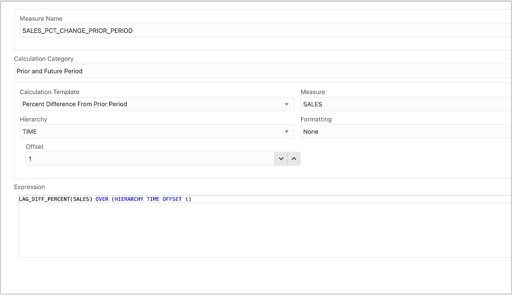

## Introduction

In the Analytic View, there are two types of measures:

-   **Fact measures** are from the fact table. Fact measures access data
    from the fact table include aggregation operators.

-   **Calculated measures** are created using expression. Calculated
    measure reference fact measures or other calculated measures.

The analytic view includes an expression language used for calculated
measures. You can also use any SQL single row function in the definition
of a calculated measure.

## Create a Calculated Measure

Create a calculated measure that returns the Percent Change in Sales
from the current time period as compared to the prior time period.

1. Right click Calculations
2. Choose Create Calculated Measure

3. Enter the measure name **SALES_PCT_CHANGE_PRIOR_PERIOD**.
4. Choose the Calculation Category **Prior and Future Period**.
5. Choose the Calculation Template **Percent Difference From Prior Period**.
6. Choose the measure **SALES**.
7. Choose the **TIME** hierarchy.
8. Select the **Percent Difference From Prior Period calculation template**.

The measure settings should look like this.

You can now update the Analytic View to deploy these additional to the
database objects.

1.  Press the **Update** button on the lower right.

## Acknowledgements

- Created By/Date - William (Bud) Endress, Product Manager, Autonomous Database, January 2023
- Last Updated By - William (Bud) Endress, January 2023

Data about movies in this workshop were sourced from **Wikipedia**.

Copyright (C)  Oracle Corporation.

Permission is granted to copy, distribute and/or modify this document
under the terms of the GNU Free Documentation License, Version 1.3
or any later version published by the Free Software Foundation;
with no Invariant Sections, no Front-Cover Texts, and no Back-Cover Texts.
A copy of the license is included in the section entitled [GNU Free Documentation License](files/gnu-free-documentation-license.txt)
