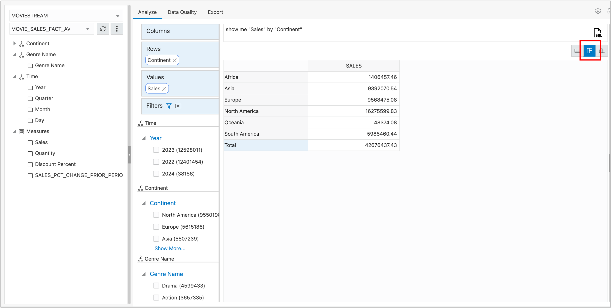
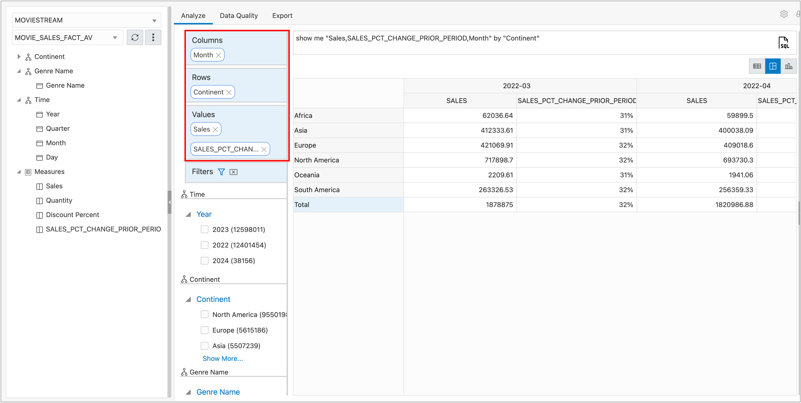
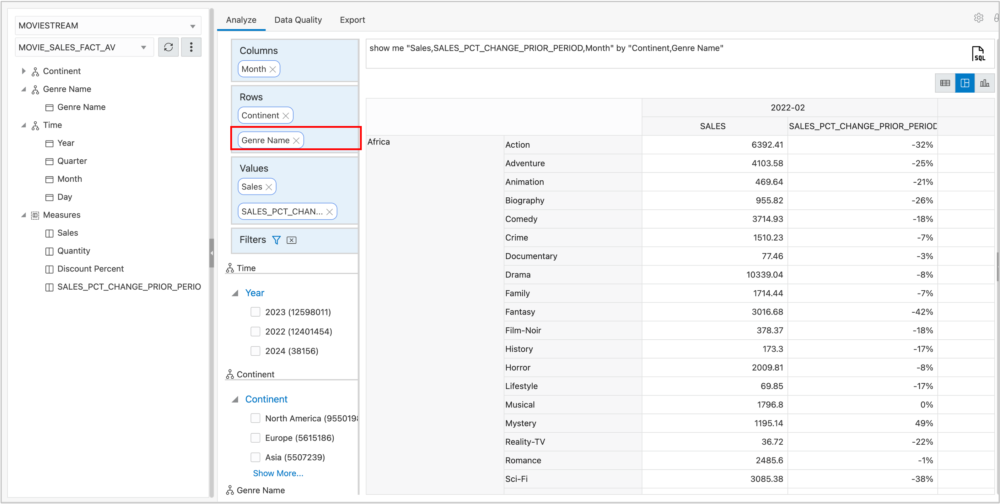

# Explore Data

## Introduction

The Analytic View now has several hierarchies and a time series
calculation. It will be more interesting to analyze with this additional content.

Estimated Time:  5 Minutes.

## Task 1 - Create a New Report

The application will return to the Data Quality tab after the analytic
view has been updated. As before, there are no errors.

1. Choose the **Analyze** tab.
2. Choose the **Report** icon (be sure to choose the middle icon).

3. Expand the Time hierarchy and move **MONTH** to the **Columns**
    position.
4. Expand Measures and add **SALES\_PCT\_CHG\_PRIOR\_PERIOD** to the
    **Values** position.
5. When prompted, choose Format Type **Percentage** and **Save**.

The first month has Sales data, but because it is the first month the
prior period values are null.

7. Scroll the report to the right to see prior period values.

8. Break the data out by Search Genre by dragging Genre under Continent in
the Row position.

## Task 2 - Explore On Your Own

Feel free to add new calculations and explore the data on your own.
After all, that's what this is all about.

## Acknowledgements

- Created By/Date - William (Bud) Endress, Product Manager, Autonomous Database, January 2023
- Last Updated By - William (Bud) Endress, January 2023

Data about movies in this workshop were sourced from **Wikipedia**.

Copyright (C)  Oracle Corporation.

Permission is granted to copy, distribute and/or modify this document
under the terms of the GNU Free Documentation License, Version 1.3
or any later version published by the Free Software Foundation;
with no Invariant Sections, no Front-Cover Texts, and no Back-Cover Texts.
A copy of the license is included in the section entitled [GNU Free Documentation License](files/gnu-free-documentation-license.txt)
