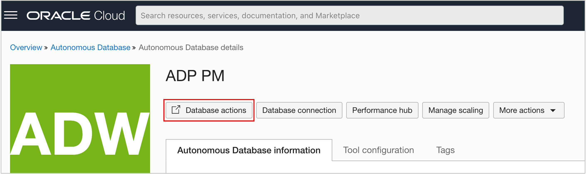
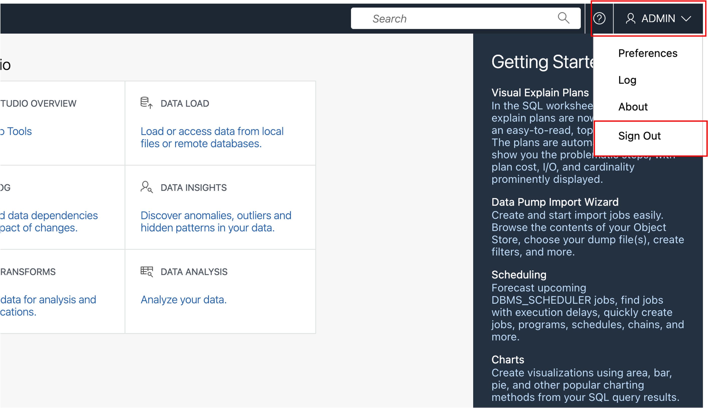
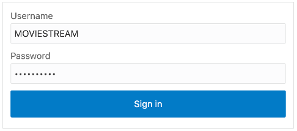

# Introduction

This lab uses the Database Actions Data Studio Analysis tool to design the Analytic view.

##  Task 1 - Access Database Actions

The Database Actions tools can be accessed directly using a URL or through the Autonomous Database console.

If you are running this lab in your own tenancy and do now have access to the Autonomous Database console,  ask  the administrator of the database to provide you with the URL.

1. If you have access to the Autonomous Database console, choose Database Actions.

2. If you have launched Database Actions from the Autonomous Database console, you are probably logged in as the ADMIN user. Sign out of Database Actions.

3. Sign in as your database user (for example, MOVIESTREAM).

4. Open the Data Analysis application.

The first time you open the Analysis Application, introductory cards might be displayed.  You can choose to review the cards or simply close them.

## Acknowledgements

- Created By/Date - William (Bud) Endress, Product Manager, Autonomous Database, January 2023
- Last Updated By - William (Bud) Endress, January 2023

Data about movies in this workshop were sourced from **Wikipedia**.

Copyright (C)  Oracle Corporation.

Permission is granted to copy, distribute and/or modify this document
under the terms of the GNU Free Documentation License, Version 1.3
or any later version published by the Free Software Foundation;
with no Invariant Sections, no Front-Cover Texts, and no Back-Cover Texts.
A copy of the license is included in the section entitled [GNU Free Documentation License](files/gnu-free-documentation-license.txt)