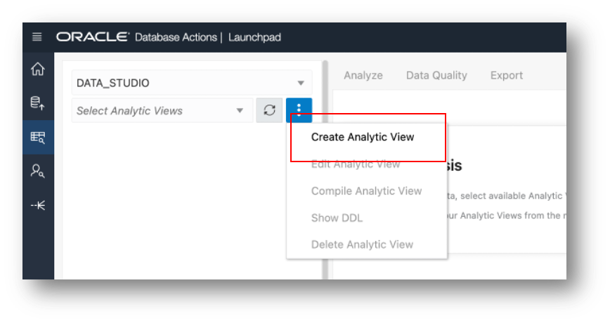
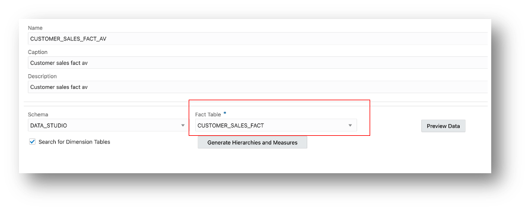

# Create a New Analytic View

## Introduction

Estimated Time:  5 minutes

Analytic Views are a collection of database objects that are used together to present a business model to applications.  Analytic Views may be queried with SQL.   These objects are:

- One or more *Attribute Dimensions* define metadata with attributes and levels, which are the building blocks for hierarchies.
- One or more *Hierarchies*, a type of view with levels and attributes organized to support the selection of data, aggregations, and navigation (e.g., drill down).
- An *Analytic View* that references fact tables, measures, and hierarchies to pull all the data together in a single view.

These objects are created in the Database using SQL DDL statements. The Data Studio Data Analysis tool creates all these objects for you as a complete system.  You do not need to write SQL DDL statements. The tool will show you the DDL statements if you would like to learn the SQL DDL or understand what the tool is doing ‘under the covers’.

To create an Analytic View in this tool, you will:

- Identify the tables that the Analytic View objects will reference. In this lab, there are two tables, a customer lookup table and a fact table.
- Create hierarchies. When you create hierarchies, the tool will create both an Attribute Dimension object and a Hierarchy View object.
- Create fact measures (measures from the fact table) and calculated measures. The tool will create the Analytic View object for you using this information.

Estimated Time:  5 minutes.

## Task 1 - Create a New Analytic View

Start the design process by creating a new Analytic View. Depending on how you enter the Data Analysis Application, you might or not see the Create button as shown below.

1. Press the Create button or choose to Create Analytic View from the menu.

2. Choose the fact table. The fact table contains measures such as Sales or Units Sold. In this example, choose MOVIE\_SALES_FACT.

3. You can view data in the MOVIE\_SALES_FACT table by pressing the Preview Data button.

4. Press the Close button after you have reviewed the data in the MOVIE\_SALES_FACT table.

5. Enter a user-friendly name in the Caption field. For example, Movie Sales Data.  Also enter a Description such as “Daily sales data by customer, and search genre”.

**Do not press the Create button yet.**  The Analytic View database objects will be created later after you have created hierarchies and measures.

**Do not press the Generate Hierarchies and Measures button.**   The tool has a feature that can attempt to automatically create hierarchies and measures. In some cases, this might offer a useful head start. In this lab, you will learn how to create hierarchies and measures yourself.  Because you know your data best, and you know your business requirements, you will usually create hierarchies and measures as shown in this lab.

You will want to provide user-friendly names to objects in the Analytic View.  User-friendly names may be used by an application to represent the Analytic View to end users. User-friendly names are entered into Captions. You may also provide a description of the object in the Description field.

You are now off to a good start!

## Acknowledgments

- Created By/Date - William (Bud) Endress, Product Manager, Autonomous Database, January 2023
- Last Updated By - William (Bud) Endress, January 2023

Data about movies in this workshop were sourced from **Wikipedia**.

Copyright (C)  Oracle Corporation.

Permission is granted to copy, distribute and/or modify this document
under the terms of the GNU Free Documentation License, Version 1.3
or any later version published by the Free Software Foundation;
with no Invariant Sections, no Front-Cover Texts, and no Back-Cover Texts.
A copy of the license is included in the section entitled [GNU Free Documentation License](files/gnu-free-documentation-license.txt)