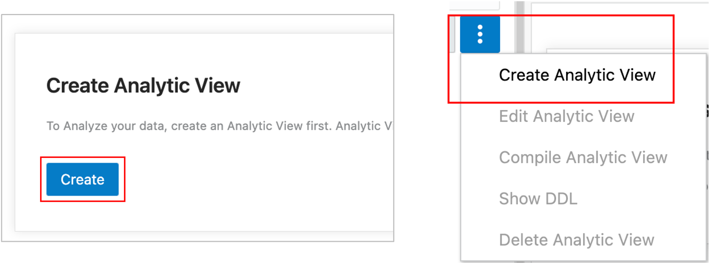
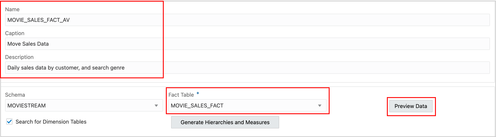
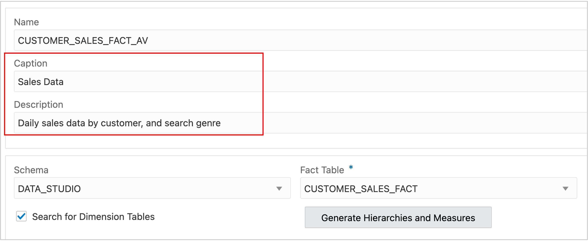

# Introduction

Analytic Views are a collection of database objects that are used together. These objects are:

- One of more *Attribute Dimensions* which define metadata that creates attributes and levels, the building blocks for hierarchies.
- One or more *Hierarchies*, a type of view that represents collections of levels and attributes organized to support the selection of data, aggregations, and navigation (e.g., drill down).
- An *Analytic View* which references fact tables, measures, and hierarchies to pull all the data together in a single view.

These objects are created in the Database using SQL DDL statements. The Data Studio Data Analysis tool creates all these objects for you as a complete system.  You do not need to write SQL DDL statements. The tool will show you the DDL statements if you would like to learn the DDL or understand what the tool is doing ‘under the covers’.

To create an Analytic View in this tool, you will:

- Identify the tables that the Analytic View objects will reference. In this lab, the tables are in the form of a star schema (one fact table with multiple dimension lookup tables).
- Create hierarchies. When you create hierarchies, the tool will create both an Attribute Dimension object and a Hierarchy view object.
- Create fact measures (measures from the fact table) and calculated measures. The tool will create the Analytic View object for you using this information.

# Create a New Analytic View

Start the design process by creating a new Analytic View. Depending on how you enter the Data Analysis Application, you might or not see the Create button as shown below.

1.Press the Create button.

Or Choose Create Analytic View from the menu.

2.Choose the fact table. The fact table the table that contains measures such as Sales or Units Sold. In this example, choose CUSTOMER_SALES_FACT.

3.You can view data in the SALES_FACT table by pressing the Preview Data button.

The preview shows data in the CUSTOMER_SALES_FACT table.

4.Press the Close button after you have reviewed the data in the SALES_FACT table.

**Do not press the Create button yet.**  At this point, you have created a new Analytic View in the tool, but not in the database. The Analytic View database objects will be created later after you have created hierarchies and measures.

**Do not press the Generate Hierarchies and Measures button.**   The tool has a feature that can attempt to automatically create hierarchies and measures. In some cases, this might offer a useful head start. In this Lab, you will learn how create the hierarchies and measures yourself.  Because you know your data best, and you know your business requirements, you will usually create hierarchies and measures as shown in this lab.

You will want to provide user friendly names to objects in the Analytic View.  User friendly names may be used by application to represent the Analytic View to end users. User friendly names are entered into Captions. You may also provide a description of the object in the Description field.

5. Enter a user friendly name in the Caption field. For example, Sales Data.  Also enter a Description such as “Daily sales data by customer, and search genre”.

You are now off to a good start!

## Acknowledgements

- Created By/Date - William (Bud) Endress, Product Manager, Autonomous Database, January 2023
- Last Updated By - William (Bud) Endress, January 2023

Data about movies in this workshop were sourced from **Wikipedia**.

Copyright (C)  Oracle Corporation.

Permission is granted to copy, distribute and/or modify this document
under the terms of the GNU Free Documentation License, Version 1.3
or any later version published by the Free Software Foundation;
with no Invariant Sections, no Front-Cover Texts, and no Back-Cover Texts.
A copy of the license is included in the section entitled [GNU Free Documentation License](files/gnu-free-documentation-license.txt)