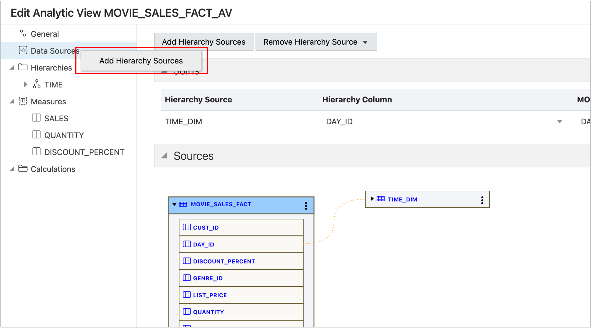
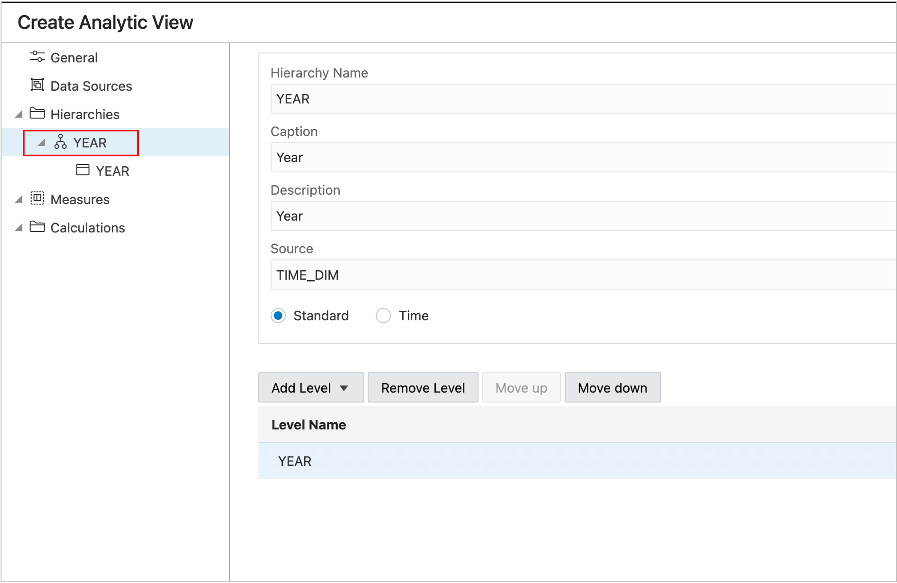
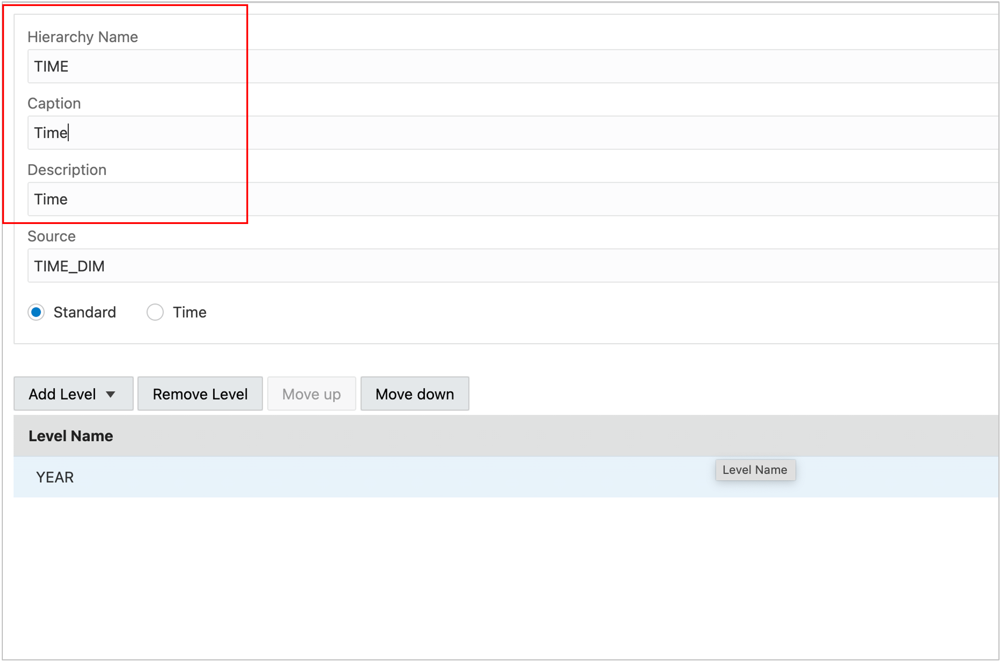
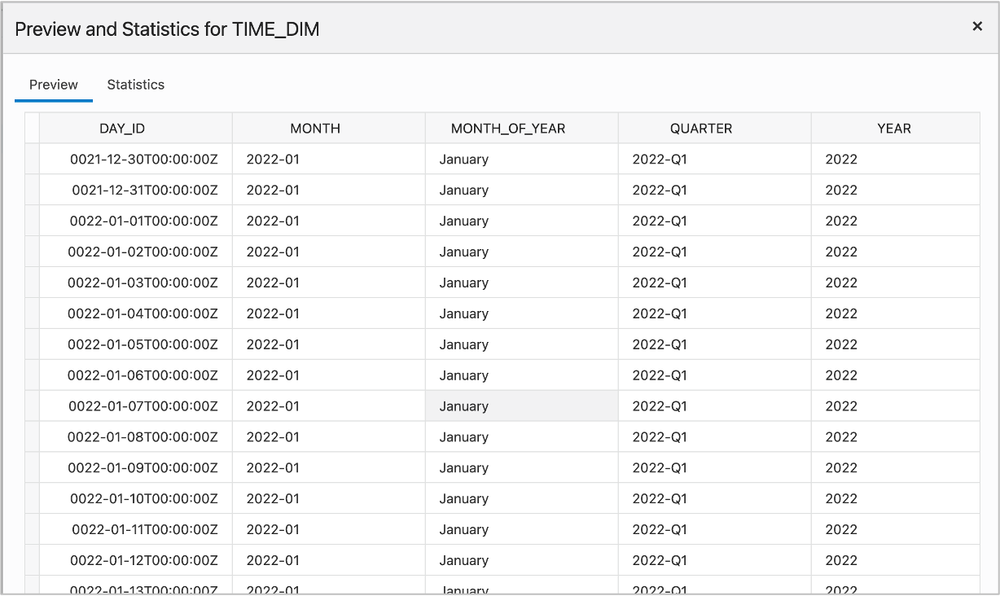
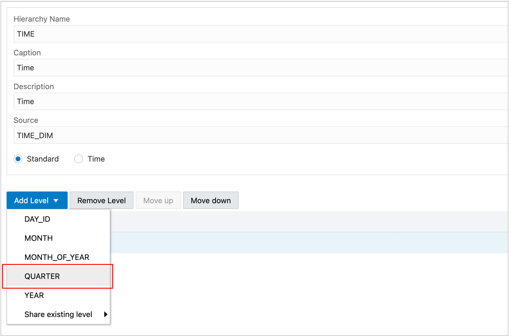
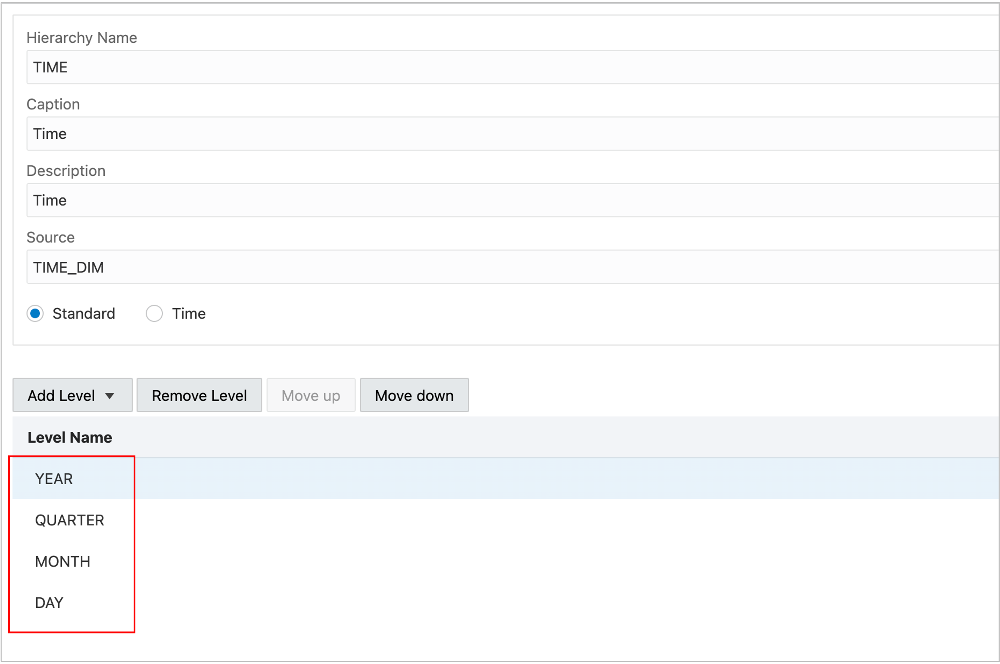
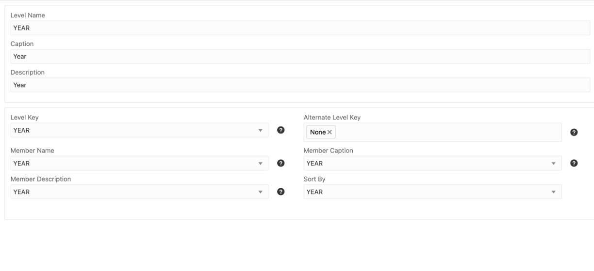

# Introduction

Every Analytic View must reference at least one hierarchy.  A hierarchy can have one or more levels, where a level is a collection of hierarchy members at the same level of aggregation. For example, Months, Years, Cities, and Countries might be levels or Time and Geography hierarchies

A hierarchy organizes levels into aggregation paths. For example, Days aggregate to Months, Months aggregate to Quarters, and Quarters aggregation to Years.

In the terminology of the Hierarchy view, the Day level is the child of the Month level, the Month level is the child of the Quarter level, and so on.

Hierarchies can use data from lookup tables or directly from the fact table.  In this lab, all hierarchies will be created from lookup tables.

To create a hierarchy, you will:

- Add a new table to the Analytic View.
- Create levels.
- Specify the joins between the hierarchy table and the fact table.

## Task 1 - Add a New Table

Right-click on Data Sources and Choose Add Hierarchy Sources.

2. **Turn off Generate and Add Hierarchy from Source** (you will do that yourself) and choose the TIME_DIM table.

The table will be added to the sources.  You will specify the join between this table and the fact table after you create levels in the hierarchy.

## Task 2 - Create a Time Hierarchy

A hierarchy is created by choosing a column of a hierarchy table. A level in the hierarchy is automatically created. Additional levels can be added later.

1. Right-click Hierarchies.

2. Choose TIME_DIM.

3. Choose YEAR.

**Pro-tip:** Add levels from the highest level to the lowest level and you will not need to sort the levels later.

A hierarchy named YEAR with a single level, YEAR, will be created.

Whether you like the name YEAR for this hierarchy is a matter of personal opinion (or more importantly, the end user's opinions).  Because this hierarchy will have additional levels, rename the hierarchy to Time.

4. Enter **TIME** in the Hierarchy Name field.

5. Enter **Time** in the Caption field.  You can also enter **Time** in the Description.

You might notice the choice of Standard and Time. This is metadata that gets added to the dimension which can be used by applications. There is no difference in functionality of the Analytic View based on this setting. It is not required that a hierarchy be of type Time to use time series calculations such as lags and leads.

## Task 3 - Add Quarter, Month, and Day Levels

Next, you will the Quarter, Month and Day levels to the Time hierarchy.

Viewing data in the TIME_DIM table may help you understand what additional levels can be added to the hierarchy.

1. Press the **Preview Data** button.

Hierarchies include one or more levels where each member of a child (lower) level has a single parent value in the parent (upper) level. For example, each day belongs to a single month, each month belongs to a single quarter, and each quarter belongs to a single year. Some people call this a *natural hierarchy*.

A hierarchy of DAY_ID > MONTH > QUARTER > YEAR fits the description of a natural hierarchy.

A hierarchy such as DAY\_ID \> MONTH\_OF\_YEAR > QUARTER > YEAR does not fit the description of a natural hierarchy because there is more than one QUARTER value for each MONTH\_OF\_YEAR.

2. Press the **Close** button to close the preview.

3.	Click on **Add Level** and choose the **QUARTER** column.
 

4  Repeat for the **MONTH** and **DAY** levels.

## Task 4 - Examine Level Properties

1.	Select the YEAR level.

Notes about level properties:

- By default, the level and all properties use the column selected when creating the level.  Because YEAR is a good name for the level, the level name does not need to be changed.
- Values in the top section (Level Name, Caption and Description) are identifiers. These are names and descriptors in the model.
- Values in the bottom section (Level Key, Member Name, etc.) map the column to data elements of the hierarchy.
    - **Level Key** is the unique identifier of the hierarchy members.
    - **Member Name**, **Member Caption**, and **Member Description** are all ‘slots’ in the hierarchy where properties of the hierarchy member can be included. Member Caption is almost always used as a friendly name for the Level Key. This is important when the Level Key value is not a user-readable value.
    - If any of the columns used as Member Name, Member Caption, and Member description have a 1:1 relationship with the Level Key, that column can be used as an **Alternate Key**.  Alternate Keys useful in some cases, but that is more advanced topic.
    - Hierarchies have a default sort order. This is determined by the values in the column mapped to **Sort By**.  The default order is important because it is used in some lead and lag calculations.  Applications can also use that column to order hierarchy values in a query.

In this data, a single column can be used for all properties of a level. As a result, you do not need to make any changes.

**Pro tip**:  Easy analytic view design starts with good column names in tables.

Feel free to examine the properties of each level.

## Acknowledgements

- Created By/Date - William (Bud) Endress, Product Manager, Autonomous Database, January 2023
- Last Updated By - William (Bud) Endress, January 2023

Data about movies in this workshop were sourced from **Wikipedia**.

Copyright (C)  Oracle Corporation.

Permission is granted to copy, distribute and/or modify this document
under the terms of the GNU Free Documentation License, Version 1.3
or any later version published by the Free Software Foundation;
with no Invariant Sections, no Front-Cover Texts, and no Back-Cover Texts.
A copy of the license is included in the section entitled [GNU Free Documentation License](files/gnu-free-documentation-license.txt)