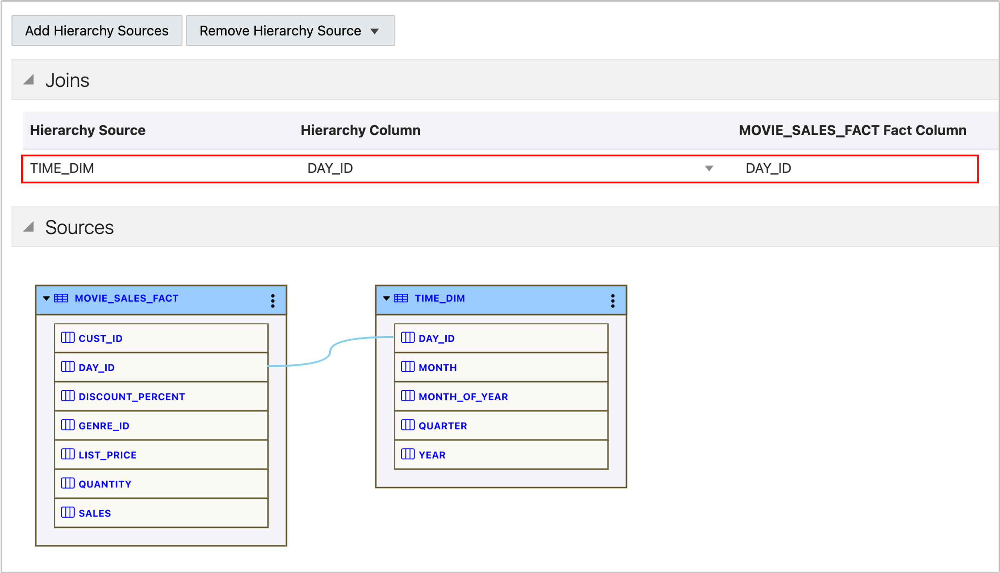

# Define Joins

## Introduction

Congratulations, you are more than halfway to your first Analytic View. You have a fact table and a hierarchy, now you just need to specify the join between the hierarchy table the fact table and add at least one measure.

Estimated Time:  Less than 5 minutes.

### Objectives

In this lab you will:

- Join the hierarchy to the fact table.

### Prerequisites:

- Complete the previous lab.

## Task 1 - View the DDL

If you press the **Show DDL** button the tool will let you know that these elements are missing.

## Task 2 - Specify the Join

When hierarchies are mapped to dimension (hierarchy) tables rather than directly to the fact table, the hierarchy must be joined (matched) to the fact table.  This is just as dimension and fact tables must be *joined* in a SQL query.

Analytic views and hierarchies are separate objects in the Database. Joining the hierarchy to the analytic view allows the analytic view to reference (use) the hierarchy.  Because the joins are specified in the analytic views, joined are not needed in queries that SELECT from the analytic view.  This is one of the features of the analytic view that make it easy to query.

With an Analytic View, the join is part of the metadata. As a result, joins are not required in queries that SELECT from an Analytic View.

1. Choose **Data Sources** and select **DAY\_ID** for both the **Hierarchy Column** and the **MOVIE\_SALES\_FACT** Fact Column.

You may now **proceed to the next lab**

## Acknowledgements

- Created By/Date - William (Bud) Endress, Product Manager, Autonomous Database, January 2023
- Last Updated By - William (Bud) Endress, January 2023

Data about movies in this workshop were sourced from **Wikipedia**.

Copyright (C)  Oracle Corporation.

Permission is granted to copy, distribute and/or modify this document
under the terms of the GNU Free Documentation License, Version 1.3
or any later version published by the Free Software Foundation;
with no Invariant Sections, no Front-Cover Texts, and no Back-Cover Texts.
A copy of the license is included in the section entitled [GNU Free Documentation License](files/gnu-free-documentation-license.txt)