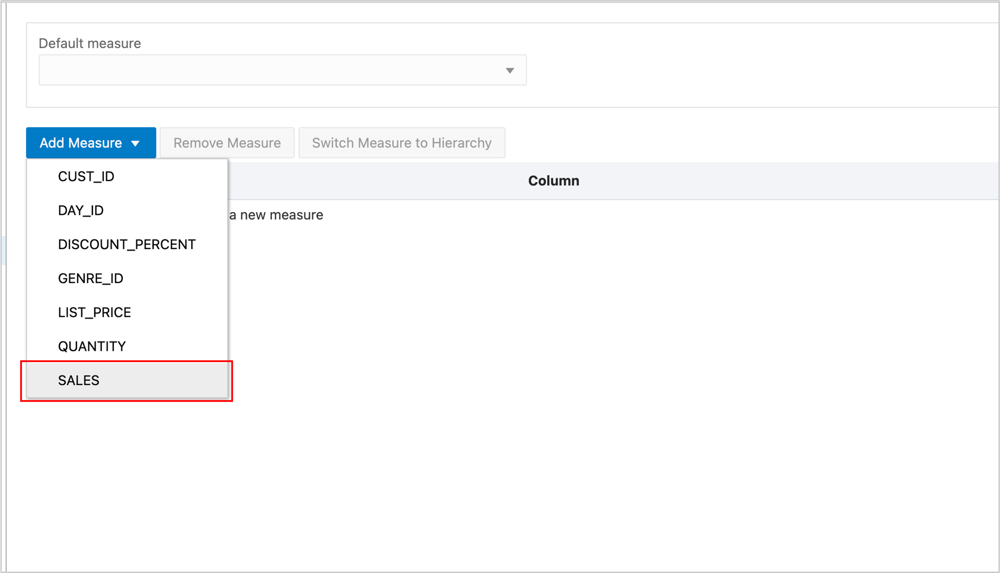
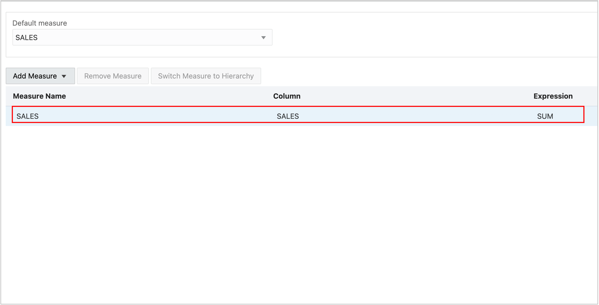
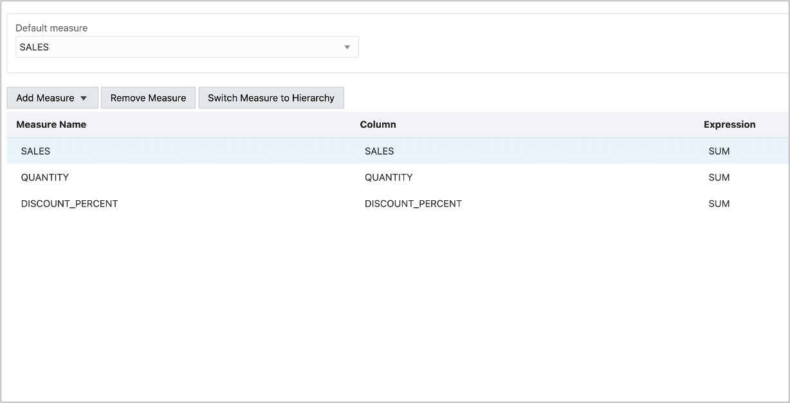
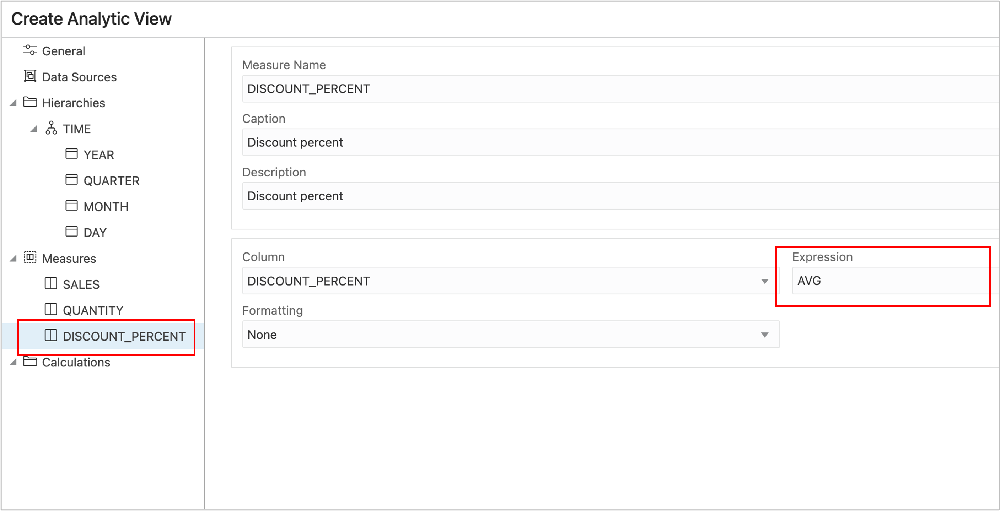

# Introduction

You are almost ready to create the analytic view in the Database!  A least one measure is required.

## Create a Measure

Measures come from the fact table.

1. Choose Measures.
2. Choose Add Measures.
3. Select SALES.

The analytic view now has a measure.

4. Press the Show DDL button.

The tool is able to generate all the SQL DDL needed to create the Attribute Dimension Hierarchy and Analytic View. Aren’t you happy that you don’t have to type that yourself?

Before creating the analytic view, add some additional measures.  Repeating the same steps as you did with SALES, close the Show DDL dialog and:

5. Add measure QUANTITY.
6. Add measure DISCOUNT_PERCENT.

By default, the aggregation expression is SUM. For measures such as SALES and QUANTITY it makes sense that data would be aggregated by SUM up the hierarchies.

Does it make sense to aggregate DISCOUNT_PERCENT by SUM? Probably not. In fact, it rarely makes sense to aggregate percentages by SUM.   In this case, we can aggregate DISCOUNT_PERCENT using AVERAGE.

7. Change the Expression for DISCOUNT_PERCENT to AVG.

(It is important to be thoughtful when averaging percentages. In this case, because each row represents a sale of a single movie it is ok to average. If the quantity was anything other than 1, a weighted average would be needed.  See [Live SQL tutorial Aggregating Data using Weighted Averages in Analytic Views](https://livesql.oracle.com/apex/livesql/file/tutorial_G4EG6JY9E0U6TFT2RCCLT3F1V.html))

## Acknowledgements

- Created By/Date - William (Bud) Endress, Product Manager, Autonomous Database, January 2023
- Last Updated By - William (Bud) Endress, January 2023

Data about movies in this workshop were sourced from **Wikipedia**.

Copyright (C)  Oracle Corporation.

Permission is granted to copy, distribute and/or modify this document
under the terms of the GNU Free Documentation License, Version 1.3
or any later version published by the Free Software Foundation;
with no Invariant Sections, no Front-Cover Texts, and no Back-Cover Texts.
A copy of the license is included in the section entitled [GNU Free Documentation License](files/gnu-free-documentation-license.txt)
