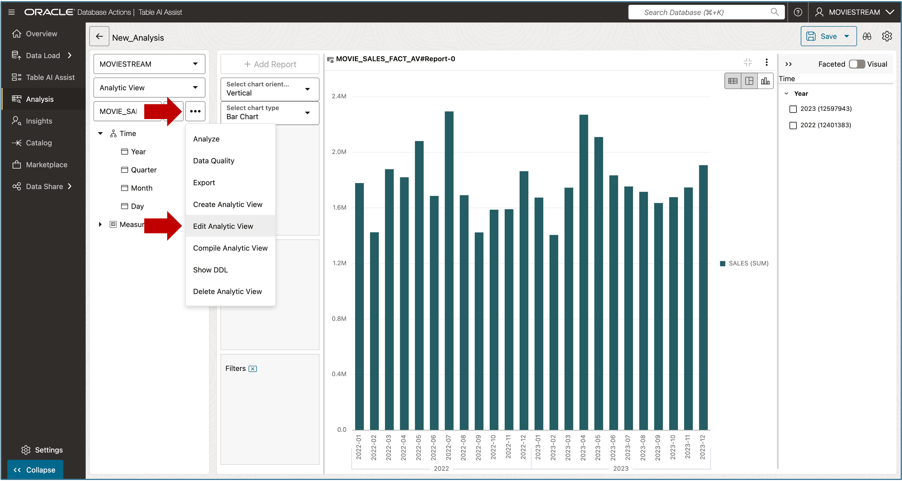
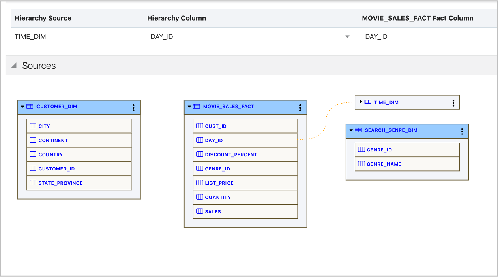

# Add Hierarchies

## Introduction

The Analytic View is functional, but not very interesting, with just a single hierarchy and a few measures. The data supports additional hierarchies for geography and the movie genre that was used to search for movies to view.  It’s time to add more hierarchies.  In the real world, analytic views often use many hierarchies.

Estimated Time:  10 Minutes

### Objectives

In this lab you will:

- Add additional hierarchies to the Analytic View

### Prerequisites:

- Complete the previous labs.

## Task 1 - Return to Analytic View Editor

You can add hierarchies using the same methods that you added the Time hierarchy. First, you need to switch back to the Analytic View editor.

1. Hover over the MOVIE\_SALES\_FACT\_AV and select the **Edit Analytic View** option:

You are returned to the editor.

## Task 2 - Add More Data Sources (Tables)

Add new Data Sources for the hierarchies. Repeat the following steps for the CUSTOMER\_DIM and SEARCH\_GENRE\_DIM views.

1. Select **Data Sources**, then **Add Hierarchy Sources**.

2. Select both **CUSTOMER\_DIM** and **SEARCH\_GENRE\_DIM**.
3. Switch **Generate and Add Hierarchy from Source** off (disabled).
4. Press the **OK** button.

If you leave **Generate and Add Hierarchy from Source** on, which is easy to do, just close the dialog and carry on with the lab.

When you are done your screen should look like this.

## Task 3 - Add Customer and Search Genre Hierarchies

Now you can add hierarchies.  For each table, create hierarchies using the columns as described in the table below. Be sure to sort the levels according to the Level Order column in the table.

|Table                  |Column                 |Level Order |
|-----------------------|-----------------------|-----------:|
|CUSTOMER_DIM           |CONTINENT              | 1          |
|CUSTOMER_DIM           |COUNTRY                | 2          |
|CUSTOMER_DIM           |STATE_PROVINCE         | 3          |
|CUSTOMER_DIM           |CITY                   | 4          |
|CUSTOMER_DIM           |CUSTOMER_ID            | 5          |
|SEARCH\_GENRE_DIM      |GENRE_NAME             | 1          |

For example, to add a hierarchy:

1. Right click **Hierarchies**
2. Choose **Add Hierarchy**
3. Choose **CUSTOMER_DIM**
4. Choose **CONTINENT**

After creating the hierarchy, your screen will look like this:

Next, add levels. For example:

1. Right-click the **CONTINENT** hierarchy.
2. Choose **Add Level**.
3. Select the **COUNTRY** column.
4. Repeat for **STATE\_PROVINCE**, and **CITY**.

When you have finished this hierarchy, your screen should look like this:

Use the same steps to create the Search Genre hierarchy.

1. Repeat the steps used with the **SEARCH\_GENRE\_DIM** table using the GENRE\_NAME column.

2. Rename both the hierarchy and its level to "Genre".

The Search Genre hierarchy includes only a single level. A hierarchy is valid with a single level.

All hierarchies include the levels you define plus an ALL level. The ALL level includes a single, top-of-hierarchy member (value).

## Task 4 - Set Joins for New Hierarchies

Joins for each of the new hierarchies can now be added.

1. Choose **Data Sources**
2. Set Joins as listed in the table below.

|Hierarchy Source       |Hierarchy Column       |Fact Column  |
|-----------------------|-----------------------|-------------|
|TIME_DIM               |DAY_ID                 | DAY_ID      |
|CUSTOMER_DIM           |CUSTOMER_ID            | CUST_ID     |
|SEARCH\_GENRE_DIM      |GENRE_ID               | GENRE_ID    |

The completed joins will look like this.

## Task 5 - Update the Analytic View

Now would be a good time to save your work and update the analytic view.

1. Press the **Update** button.

You may now **proceed to the next lab**

## Acknowledgements

- Created By/Date - William (Bud) Endress, Product Manager, Autonomous AI Database, February 2023
- Last Updated By - Mike Matthews, November 2025

Data about movies in this workshop were sourced from **Wikipedia**.

Copyright (C)  Oracle Corporation.

Permission is granted to copy, distribute and/or modify this document
under the terms of the GNU Free Documentation License, Version 1.3
or any later version published by the Free Software Foundation;
with no Invariant Sections, no Front-Cover Texts, and no Back-Cover Texts.
A copy of the license is included in the section entitled [GNU Free Documentation License](files/gnu-free-documentation-license.txt)
