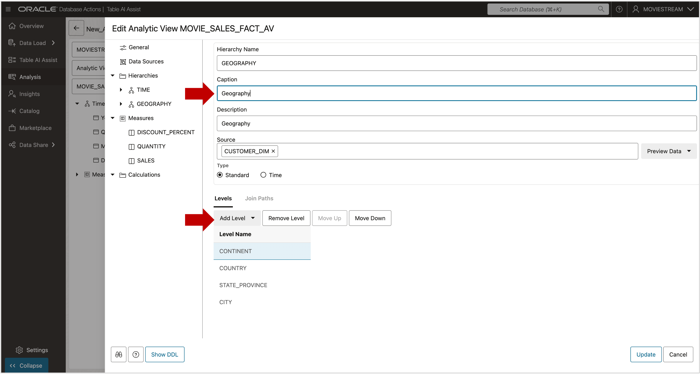
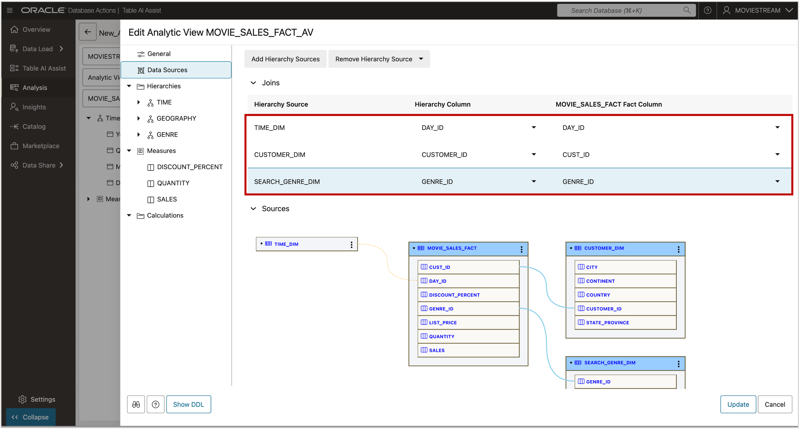

# Add Hierarchies

## Introduction

Your Analytic View works, but it only includes one hierarchy.  
Now it's time to add more—like geography and movie genre.  
Real-world models often include several hierarchies.

**Estimated Time: 10 minutes**

### Objectives

You will:

- Add additional hierarchies to the Analytic View.

### Prerequisites

- Complete the previous lab.

## Task 1 - Return to Analytic View Editor

1. Click **Edit Analytic View** to reopen the editor.

   

## Task 2 - Add More Data Sources (Tables)

Add tables for the new hierarchies.

1. Go to **Add Hierarchy Sources**.

   

2. Select **CUSTOMER\_DIM** and **SEARCH\_GENRE_DIM**.
3. Turn off **Generate and Add Hierarchy from Source**.
4. Click **OK**.

 

All tables have been added.

You will define joins **after** creating new hierarchies.

     

## Task 3 - Add Customer and Search Genre Hierarchies

Use the table below to create levels for each hierarchy:

| Table             | Column           | Level Order |
|------------------|------------------|-------------|
| CUSTOMER_DIM      | CONTINENT        | 1           |
| CUSTOMER_DIM      | COUNTRY          | 2           |
| CUSTOMER_DIM      | STATE_PROVINCE   | 3           |
| CUSTOMER_DIM      | CITY             | 4           |
| CUSTOMER_DIM      | CUSTOMER_ID      | 5           |
| SEARCH\_GENRE\_DIM  | GENRE_NAME       | 1           |

### Create Customer Hierarchy

1. Right-click **Hierarchies**

2. Choose **CUSTOMER_DIM** > **CONTINENT**

   

The new Continent hierarchy.

     

3. Rename the CONINENT hierachy to **Geography** , then click **Add Level**
4. Add **COUNTRY**, **STATE_PROVINCE**, and **CITY**

     

### Create Search Genre Hierarchy

1. Repeat the same steps with **SEARCH\_GENRE\_DIM** using **GENRE_NAME**
2. Rename the hierarchy and level to **Genre**

Even with just one level, the hierarchy is valid. All hierarchies include an **ALL** level by default.

## Task 4 - Set Joins for New Hierarchies

Define joins to link the new hierarchy tables to the fact table:

| Hierarchy Source   | Hierarchy Column | Fact Column |
|--------------------|------------------|-------------|
| TIME_DIM           | DAY_ID           | DAY_ID      |
| CUSTOMER_DIM       | CUSTOMER_ID      | CUST_ID     |
| SEARCH\_GENRE\_DIM   | GENRE_ID         | GENRE_ID    |

1. Go to **Data Sources** and configure the joins.

   

## Task 5 - Update the Analytic View

1. Click the **Update** button to apply your changes.

   

You may now **proceed to the next lab**

When you **update** the analytic view, you are returned to the Analysis reporting application.

   

## Acknowledgements

- **Created By** - William (Bud) Endress, Product Manager, Autonomous Database, February 2023  
- **Last Updated By** - William (Bud) Endress, June 2025

Data about movies in this workshop were sourced from **Wikipedia**.

Copyright (C) Oracle Corporation.

Permission is granted to copy, distribute and/or modify this document under the terms of the GNU Free Documentation License, Version 1.3 or any later version published by the Free Software Foundation;  with no Invariant Sections, no Front-Cover Texts, and no Back-Cover Texts.  A copy of the license is included in the section entitled [GNU Free Documentation License](files/gnu-free-documentation-license.txt)
