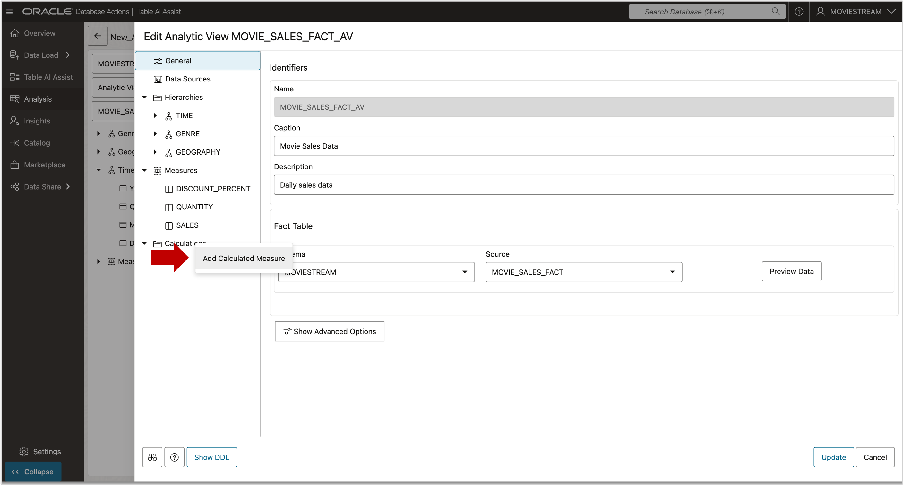
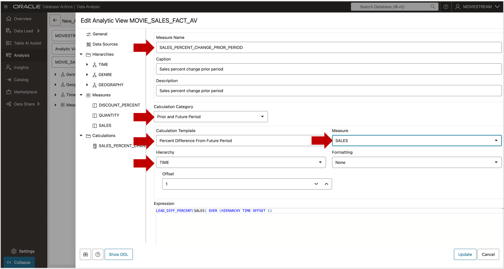

# Create a Calculated Measure

## Introduction

In the Analytic View, there are two types of measures:

-   **Fact measures** are from the fact table. Fact measures are mapped to the fact table and include aggregation operators.

-   **Calculated measures** are created using expressions. Calculated measures reference fact measures or other calculated measures, and do not include aggregation operators.

The analytic view includes an expression language used for calculated
measures. You can also use any SQL single-row function in the definition
of a calculated measure.

Estimated Time:  5 minutes.

### Objectives

In this lab you will:

- Create a calculated measure.

### Prerequisites:

- Complete the previous labs.

## Task 1 - Create a Calculated Measure

Create a calculated measure that returns the Percent Change in Sales
from the current period as compared to the prior period.

From the Edit screen of your Analytic View:

1. Right click **Calculations**
2. Select **Add Calculated Measure**

3. Enter the measure name **SALES\_PCT\_CHANGE\_PRIOR\_PERIOD**.
4. Choose the Calculation Category **Prior and Future Period**.
5. Choose the Calculation Template **Percent Difference From Prior Period**.
6. Choose the measure **SALES**.
7. Choose the **TIME** hierarchy.

The measure settings should look like this.

You can now update the Analytic View objects in the database.

1.  Press the **Update** button on the lower right.

You may now **proceed to the next lab**

## Acknowledgements

- Created By/Date - William (Bud) Endress, Product Manager, Autonomous AI Database, February 2023
- Last Updated By - Mike Matthews, November 2025

Data about movies in this workshop were sourced from **Wikipedia**.

Copyright (C)  Oracle Corporation.

Permission is granted to copy, distribute and/or modify this document
under the terms of the GNU Free Documentation License, Version 1.3
or any later version published by the Free Software Foundation;
with no Invariant Sections, no Front-Cover Texts, and no Back-Cover Texts.
A copy of the license is included in the section entitled [GNU Free Documentation License](files/gnu-free-documentation-license.txt)
