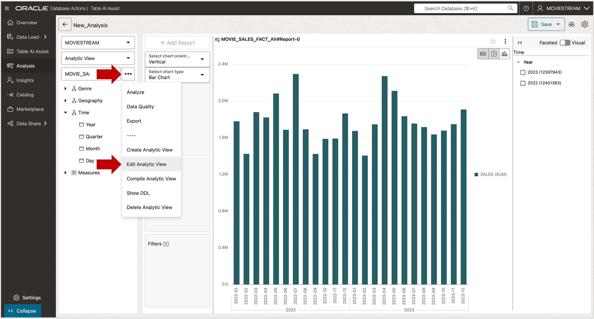

# Create a Calculated Measure

## Introduction

Analytic Views support two types of measures:

- **Fact measures**: Based on columns in the fact table. Use aggregation functions like `SUM`.
- **Calculated measures**: Defined with expressions. These reference fact or other calculated measures and do **not** use aggregation operators.

Calculated measures use the Analytic View expression language and can include any SQL single-row function.

**Estimated Time: 5 minutes**

### Objectives

You will:

- Create a calculated measure.

### Prerequisites

- Complete the previous lab.

## Task 1 - Create a Calculated Measure

Create a calculated measure to show percent change in sales from the previous period.

1. Return to the Analytic View Designe.
   
1. Right-click **Calculations**  
1. Choose **Add Calculated Measure**
   
1. Enter the name and press Enter:  
   `SALES_PCT_CHANGE_PRIOR_PERIOD`
   When you press Enter, the Caption and Description automatically default to the the measure name.
1. Set the **Calculation Category** to:  
   `Prior and Future Period`
1. Set the **Calculation Template** to:  
   `Percent Difference From Prior Period`
1. Choose the base measure:  
   `SALES`
1. Choose the hierarchy:  
   `TIME`
The configuration should look like this:
   
1. Click the **Update** button in the lower-right corner to save.

You may now **proceed to the next lab**

## Acknowledgements

- **Created By** - William (Bud) Endress, Product Manager, Autonomous Database, February 2023  
- **Last Updated By** - William (Bud) Endress, June 2025

Data about movies in this workshop were sourced from **Wikipedia**.

Copyright (C) Oracle Corporation.

Permission is granted to copy, distribute and/or modify this document under the terms of the GNU Free Documentation License, Version 1.3 or any later version published by the Free Software Foundation;  with no Invariant Sections, no Front-Cover Texts, and no Back-Cover Texts.  A copy of the license is included in the section entitled [GNU Free Documentation License](files/gnu-free-documentation-license.txt)
