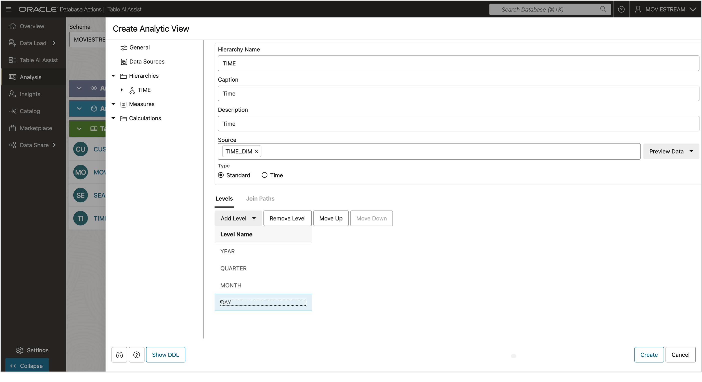

# Create a Hierarchy

## Introduction

Every Analytic View must include at least one hierarchy.

A hierarchy organizes data into levels such as Year, Quarter, Month, and Day. Each level groups data at a specific level of aggregation. For example, Days roll up to Months, which roll up to Quarters, which roll up to Years.

Hierarchies can be built from lookup tables or directly from fact tables. In this lab, all hierarchies will use lookup tables.

To create a hierarchy, you will:

- Add a new table.
- Create levels.
- Define joins between the lookup and fact tables.

### Objectives

You will:

- Create a hierarchy.

### Prerequisites

- Complete the previous lab.

**Estimated Time: 10 minutes**

## Task 1 - Add a New Table

1. Right-click **Data Sources** and select **Add Hierarchy Sources**.

   

2. Turn off **Generate and Add Hierarchy from Source**, then choose the `TIME_DIM` table.

   

The table will appear under Data Sources. You’ll define the join after creating the hierarchy levels.

You can expand TIME_DIM using the menu at the top right of the table.

   

## Task 2 - Create a Time Hierarchy

1. Right-click **Hierarchies**.

2. Choose **TIME_DIM**, then select **YEAR**.

   

This creates a hierarchy named `YEAR` with one level: `YEAR`.

3. Press **Preview Data** to examine the `TIME_DIM` table.

   

   

3. Rename the hierarchy:

   - Select the `YEAR` hierarchy.
   - Enter `TIME` in the **Hierarchy Name** field.
   - Enter `Time` in both the **Caption** and **Description** fields.

   

You may optionally set the hierarchy type to **Time**, though this is not required for LEAD/LAG. Time calculations rely on the **Sort By** setting in each level.

## Task 3 - Add Quarter, Month, and Day Levels

Use levels that form a *natural hierarchy*, where each child has a single parent:

- `DAY_ID` → `MONTH` → `QUARTER` → `YEAR` is valid  
- `DAY_ID` → `MONTH_OF_YEAR` → `QUARTER` → `YEAR` is not, because `MONTH_OF_YEAR` has multiple parent quarters.

2. Close the preview.

3. Click **Add Level**, then select the **QUARTER** column.

   

4. Repeat for **MONTH** and **DAY_ID**.

   

## Task 4 - Examine Level Properties

1. Select the **YEAR** level.

   

Key notes:

- The **Level Name**, **Caption**, and **Description** are model identifiers.
- **Level Key** is the unique ID for each member.
- **Member Caption** is the friendly display value for the level.
- **Sort By** controls default sort order—important for functions like LEAD/LAG.

In this case, all properties can use the same column.

In other datasets, you may need different columns for each property—e.g., a numeric key with a descriptive caption.

**Pro Tip:** Use clear column names in your tables. The design tool auto-generates names using column names (underscores are replaced with spaces for captions).

You can now explore other level properties as needed.

You may now **proceed to the next lab**

## Acknowledgements

- **Created By** - William (Bud) Endress, Product Manager, Autonomous Database, February 2023  
- **Last Updated By** - William (Bud) Endress, June 2025

Data about movies in this workshop were sourced from **Wikipedia**.

Copyright (C) Oracle Corporation.

Permission is granted to copy, distribute and/or modify this document under the terms of the GNU Free Documentation License, Version 1.3 or any later version published by the Free Software Foundation;  with no Invariant Sections, no Front-Cover Texts, and no Back-Cover Texts.  A copy of the license is included in the section entitled [GNU Free Documentation License](files/gnu-free-documentation-license.txt)
